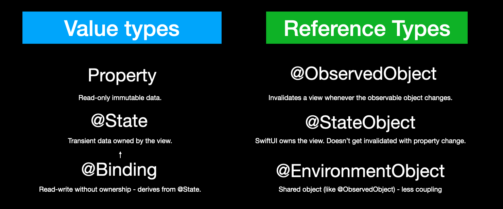
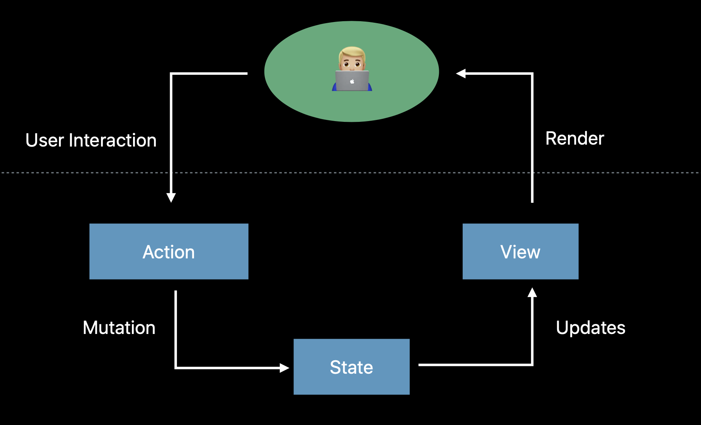
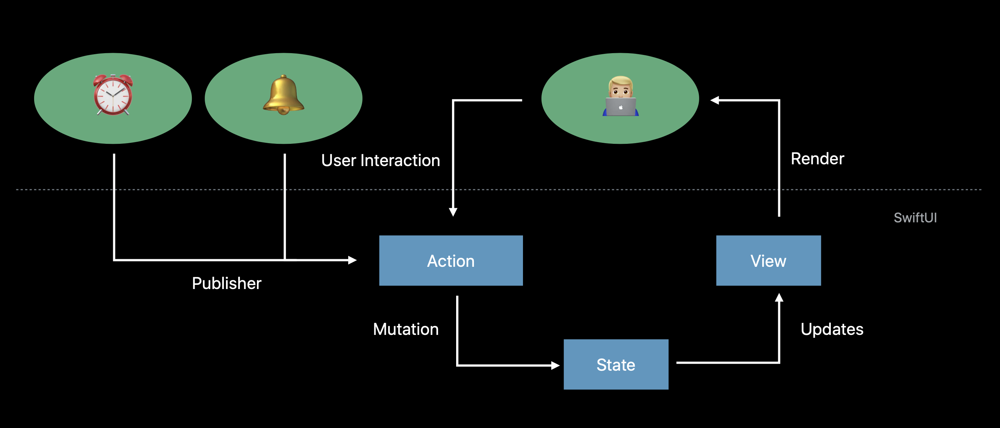
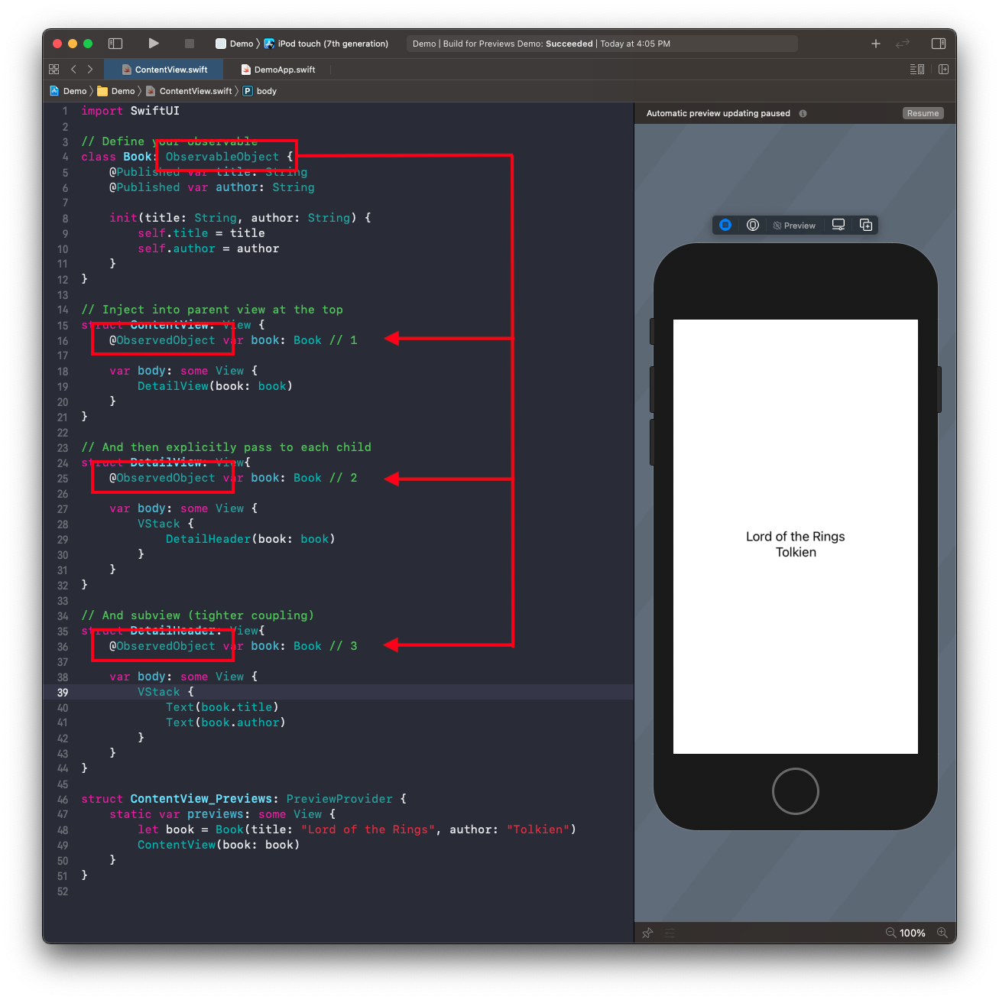
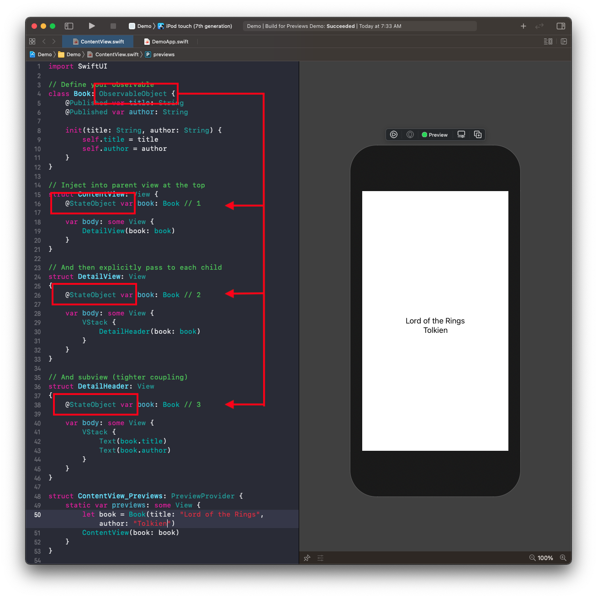
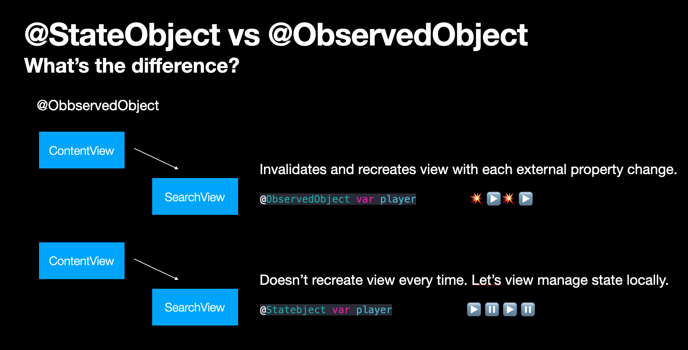
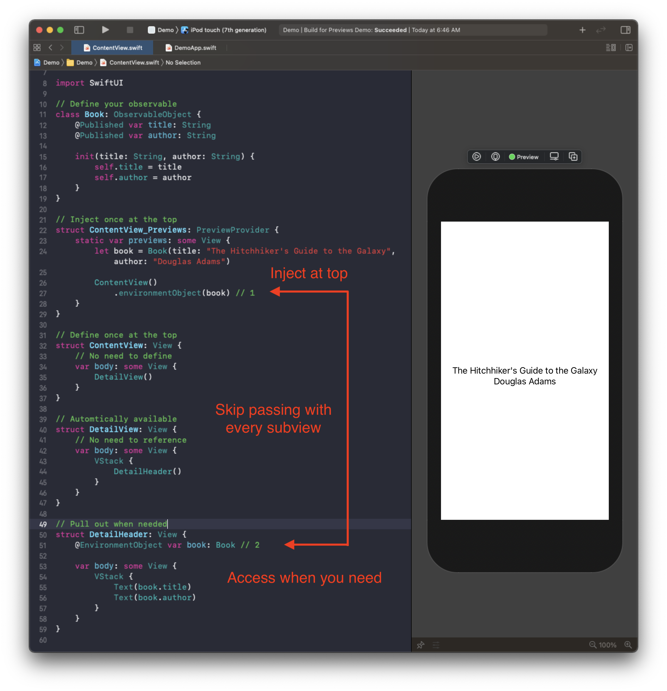
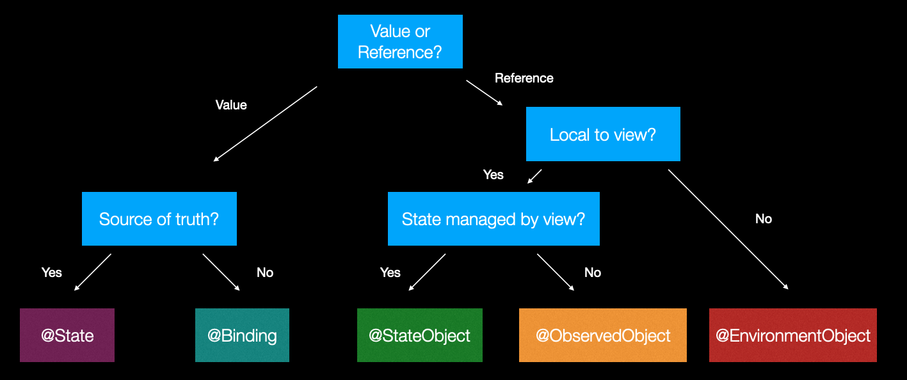

# Data Flow in SwiftUI



## How does it work?

### Views are a function of state



When a user does an action, that causes a mutation of state, SwiftUI views re-render themselves. Data flows in one direction - always into the body of the view - and this is how data flows in SwiftUI.

When working with user interactions like these, we will often track these changes using value types:

- Property - Immutable property that never changes.
- @State - Transient data owned by the view.
- @Binding - For mutating data owned by another view.


## Value types

Value types are instances where each type keeps a unique copy of its data (`struct`, `enum`, tuple). They are good for tracking local, simple state changes in views. And their states can be bound to SwiftUI controls.

### Property

- Simply pass in the read-only value type you want to be reflected locally in your view.

```swift
import SwiftUI

struct ContentView_Previews: PreviewProvider {
    static var previews: some View {
        ContentView()
    }
}

struct PlayerView: View {
    var isPlaying: Bool = true			// 1. Define your property
    
    var body: some View {
        Button(action: {
            
        }) {
            Image(systemName: isPlaying ? "pause.circle" : "play.circle")
                .resizable()
                .scaledToFit()
                .frame(width: 300, height: 300)
        }
    }
}

struct ContentView: View {
    var body: some View {
        PlayerView(isPlaying: false)		// 2. Pass it into your view.
    }
}
```

This works until your property wants to change.

```swift
struct PlayerView: View {
    var isPlaying: Bool = true 
    
    var body: some View {
        Button(action: {
            self.isPlaying.toggle() // 💥 `self` is immutable
        }) {
            Image(systemName: isPlaying ? "pause.circle" : "play.circle")
        }
    }
}
```

To handle this we need something that can synthesize and track state in a `struct`. This is where we use `@State`.

### @State

- A read-write property wrapper for keeping track of transient state owned by the view.

```swift
import SwiftUI

struct ContentView_Previews: PreviewProvider {
    static var previews: some View {
        ContentView()
    }
}

struct PlayerView: View {
    @State private var isPlaying: Bool = false // 1. Define your state 🚀.
    
    var body: some View {
        Button(action: {
            
        }) {
            Image(systemName: isPlaying ? "pause.circle" : "play.circle")
                .resizable()
                .scaledToFit()
                .frame(width: 300, height: 300)
        }
    }
}

struct ContentView: View {
    var body: some View {
        PlayerView() 						// 2. No need to set down here.
    }
}
```

### @Binding

- How we pass `@State` down to subviews, and bi-directionally bind it back.


```swift
import SwiftUI

struct ContentView_Previews: PreviewProvider {
    static var previews: some View {
        ContentView()
    }
}

struct PlayerView: View {
    @State private var isPlaying: Bool = false // 1. Define State
    
    var body: some View {
        VStack {
            PlayButton(isPlaying: $isPlaying)  // 2. Pass with `$`
            
            Toggle(isOn: $isPlaying) {
                Text("Hello World")
            }
        }.padding()
    }
}

struct PlayButton: View {
    @Binding var isPlaying: Bool              // 3. Define Binding
    
    var body: some View {
        Button(action: {
            self.isPlaying.toggle()           // 4. Bi-directional
        }) {
            Image(systemName: isPlaying ? "pause.circle" : "play.circle")
                .resizable()
                .aspectRatio(contentMode: .fit)
                .frame(width: 100, height: 100)
        }
    }
}

struct ContentView: View {
    var body: some View {
        PlayerView()
    }
}
```


SwiftUI controls take `Binding` property wrappers in their initializers to bind to the external properties you define.

```swift
struct Toggle<Label>: View {
    public init(
        isOn: Binding<Bool>,
        label: () -> Label
    )
}
```

`@State` and `@Binding` can also be used with `structs` you create.

```swift
import SwiftUI

// Define your struct
struct Book {
    var title: String
    var author: String
}

// Inject into parent view at the top
struct ContentView: View {
    @State var book: Book // 1
    
    var body: some View {
        DetailView(book: $book)
    }
}

// Then explicitly pass binding to each child
struct DetailView: View
{
    @Binding var book: Book // 2
    
    var body: some View {
        VStack {
            DetailHeader(book: $book)
        }
    }
}

// And subview (tighter coupling)
struct DetailHeader: View
{
    @Binding var book: Book // 3

    var body: some View {
        VStack {
            Text(book.title)
            Text(book.author)
            Button(action: {
                book.author = "Jonathan"
            }) {
                Text("Tap me!")
            }
        }
    }
}

struct ContentView_Previews: PreviewProvider {
    static var previews: some View {
        let book = Book(title: "Lord of the Rings",
                        author: "Tolkien")
        ContentView(book: book)
    }
}
```

This will update the UI when the button is tapped because the views are bound to the `Book` `struct`.


## Reference types

Reference type - instances share a single copy of the data (`class`).

### Working with external data



- Sometimes data changes externally for our views. And we need a way of being notified.
- As good as `structs` are, because they can't share the same instance of data (their values are copied), reference types like `class` are instead used to publish and share external data changes to SwiftUI views.
- To facilitate this sharing of data, SwiftUI created a [`ObservableObject`](https://developer.apple.com/documentation/combine/observableobject) protocol, a `class` implementing that protocol, can be observed from any other view.

**ObservableObject.swift**

```swift
public protocol ObservableObject : AnyObject {
 
    /// The type of publisher that emits before the object has changed.
    associatedtype ObjectWillChangePublisher : Publisher = ObservableObjectPublisher where Self.ObjectWillChangePublisher.Failure == Never
 
    /// A publisher that emits before the object has changed.
    var objectWillChange: Self.ObjectWillChangePublisher { get }
}
```

- A type of object with a publisher that emits before the object has changed.
- Enforces its implementers be classes via `AnyObject` extension.
- Synthesizes an `objectWillChange` publisher that emits the changed value before any of its @Published properties changes.

SwitUI has three property wrappers for receiving updates from observerable objects:

- @ObservedObject
- @StateObject
- @EnvironmentObject

### @ObservedObject

- A property wrapper type that subscribes to an observable object and invalidates a view whenever the observable object changes.

Say we have a `struct` 

```swift
struct Book {
    var title: String
    var author: String
}
```

that we want to turn into an `@ObservableObject`:

```swift
class Book: ObservableObject {
    @Published var title: String
    @Published var author: String

    init(title: String, author: String) {
        self.title = title
        self.author = author
    }
}
```

Once that `struct` becomes a `class` implementing `@ObservableObject` we can observe it like this.



```swift
import SwiftUI

// Define your observable
class Book: ObservableObject {
    @Published var title: String
    @Published var author: String

    init(title: String, author: String) {
        self.title = title
        self.author = author
    }
}

// Inject into parent view at the top
struct ContentView: View {
    @ObservedObject var book: Book // 1
    
    var body: some View {
        DetailView(book: book)
    }
}

// And then explicitly pass to each child
struct DetailView: View{
    @ObservedObject var book: Book // 2
    
    var body: some View {
        VStack {
            DetailHeader(book: book)
        }
    }
}

// And subview (tighter coupling)
struct DetailHeader: View{
    @ObservedObject var book: Book // 3

    var body: some View {
        VStack {
            Text(book.title)
            Text(book.author)
        }
    }
}

struct ContentView_Previews: PreviewProvider {
    static var previews: some View {
        let book = Book(title: "Lord of the Rings", author: "Tolkien")
        ContentView(book: book)
    }
}
```

### @StateObject

- Mechanically the same as `@ObservedObject`.
- The difference with state is the view controls the `@StateObject` life-cycle.
- Meaning if a property on `@StateObject` changes, a new view isn't created. The old one simply updates it's state.




```swift
import SwiftUI

// Define your observable
class Book: ObservableObject {
    @Published var title: String
    @Published var author: String

    init(title: String, author: String) {
        self.title = title
        self.author = author
    }
}

// Inject into parent view at the top
struct ContentView: View {
    @StateObject var book: Book // 1
    
    var body: some View {
        DetailView(book: book)
    }
}

// And then explicitly pass to each child
struct DetailView: View
{
    @StateObject var book: Book // 2
    
    var body: some View {
        VStack {
            DetailHeader(book: book)
        }
    }
}

// And subview (tighter coupling)
struct DetailHeader: View
{
    @StateObject var book: Book // 3

    var body: some View {
        VStack {
            Text(book.title)
            Text(book.author)
        }
    }
}

struct ContentView_Previews: PreviewProvider {
    static var previews: some View {
        let book = Book(title: "The Hitchhiker's Guide to the Galaxy", author: "Douglas Adams")
        ContentView(book: book)
    }
}
```

### What's the difference between @StateObject and @ObservedObject



Everytime a property changes in a view powered by `@ObservedObject` that view recreates itself - it loses its 'local` state.

With `@StateObject` the view refreshes itself with a property change, but it dones't recreate the view or lose it current state - the local view maintains it.

- So if you want your view to refresh but not recreate use `@StateObject`.
- If you want to new view recreated and re-initalized every time use `@ObservedObject`.

### @EnvironmentObject

- Like `@ObservedObject` and `@StatObject` but without the coupling.
- Here you inject `EnvironmentObject` at the top of your view, and it will magically be made available to all subviews without having to explicitly reference.
- Handy for getting to those hard to reach places.

Set it up like this.



```swift
//
//  ContentView.swift
//  Demo
//
//  Created by jrasmusson on 2021-06-16.
//

import SwiftUI

// Define your observable
class Book: ObservableObject {
    @Published var title: String
    @Published var author: String

    init(title: String, author: String) {
        self.title = title
        self.author = author
    }
}

// Inject once at the top
struct ContentView_Previews: PreviewProvider {
    static var previews: some View {
        let book = Book(title: "The Hitchhiker's Guide to the Galaxy", author: "Douglas Adams")

        ContentView()
            .environmentObject(book) // 1
    }
}

// Define once at the top
struct ContentView: View {
    // No need to define
    var body: some View {
        DetailView()
    }
}

// Automtically available
struct DetailView: View {
    // No need to reference
    var body: some View {
        VStack {
            DetailHeader()
        }
    }
}

// Pull out when needed
struct DetailHeader: View {
    @EnvironmentObject var book: Book // 2

    var body: some View {
        VStack {
            Text(book.title)
            Text(book.author)
        }
    }
}
```

### Difference between Environment and Environment Object

SwiftUI gives us both `@Environment` and `@EnvironmentObject` property wrappers, but they are subtly different: whereas `@EnvironmentObject` allows us to inject arbitrary values into the environment, `@Environment` is specifically there to work with SwiftUI’s own pre-defined keys.

For example, `@Environment` is great for setting contextual information about your views that flows down the view hierarchy and changes different aspects of any contained views all at once.

For example we could change the size category of all our views to extra large and see what that looks like in our previews like this.

```swift
ContentView(store: RoomStore(rooms: testData))
   .environment(\.sizeCategory, .extraExtraExtraLarge)
```

So `Environment` for iOS type style things about the look of our controls. `EnvironmentObject` for app data we control and want to share.

### How to choose?



### Links that help
- [WWDC 2019 - Data Flow Through SwiftUI](https://developer.apple.com/videos/play/wwdc2019/226/)
- [Hacking in Swift - How to use @EnvironmentObject to share data between views](https://www.hackingwithswift.com/quick-start/swiftui/how-to-use-environmentobject-to-share-data-between-views)
- [Apple Docs ObservableObject](https://developer.apple.com/documentation/combine/observableobject)
- [Learn App Making - How to pass data between views](https://learnappmaking.com/pass-data-between-views-swiftui-how-to/)