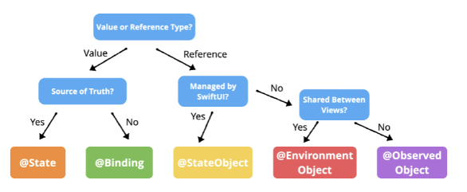

# How Data Flow works

There are over six ways you can pass data around in SwiftUI. The one you choose depends on whether you are working with:

- Value types (structs)
 - @State - Transient data owned by the view.
 - @Binding - For mutating data owned by another view.

- Reference type (classes)
	- @StateObject - Managed by SwiftUI
	- @ObservedObject - Shared data passed between views
	- @EnvironmentObject - Shared data automatically available in subviews



## Value types

SwiftUI's heavy use of structs means we can't just define vars in structs and expect that to mutate with state changes.

```swift
struct PlayerView: View {
    var isPlaying: Bool = true // OK
    
    var body: some View {
        Button(action: {
            self.isPlaying.toggle() // 💥 `self` is immutable
        }) {
            Image(systemName: isPlaying ? "pause.circle" : "play.circle")
        }
    }
}
```

In order to track changes of state in structs, SwiftUI created the @State and @Binding property wrappers.

### @State

- A property wrapper for keeping track of transient data owned by the view.
- Add the @State property wrapper to any value type state you want the view to track.
- SwiftUI will track that state for the life time of the view.


```swift
struct PlayerView: View {
    @State private var isPlaying: Bool = false // 🚀
    
    var body: some View {
        Button(action: {
            self.isPlaying.toggle()
        }) {
            Image(systemName: isPlaying ? "pause.circle" : "play.circle")
        }
    }
}
```

### @Binding

- When you want a subview to bi-directionally bind to the @State in the parent, you use the @Binding property wrapper.
- @Binding binds the state of that variable to whatever the parent passes in.
- The parent passes the state using the `$` prefix.
- And from that point on, any changes in the parent get sent to the child.
- And any changes in the child, get sent back up to the parent.
- That's what we mean when we say bi-directional binding.

```swift
struct PlayerView: View {
    @State private var isPlaying: Bool = false
    
    var body: some View {
        VStack {
            PlayButton(isPlaying: $isPlaying)
            
            Toggle(isOn: $isPlaying) {
                Text("Hello World")
            }
        }
    }
}

struct PlayButton: View {
    @Binding var isPlaying: Bool
    
    var body: some View {
        Button(action: {
            self.isPlaying.toggle()
        }) {
            Image(systemName: isPlaying ? "pause.circle" : "play.circle")
        }
    }
}
```

SwiftUI controls take `Binding` property wrappers in their initializers to bind to the external properties you define.

```swift
struct Toggle<Label>: View {
    public init(
        isOn: Binding<Bool>,
        label: () -> Label
    )
}
```

## Reference types

Because structs can't be passed around and referenced like classes, if we ever want to sure state more globablly, we need to pass data using references - or classes.

To facilitate that SwiftUI created an [`ObservableObject`](https://developer.apple.com/documentation/combine/observableobject) protocol, and anyone implementing that protocol, can be observed from other views within the app.

**ObservableObject.swift**

```swift
public protocol ObservableObject : AnyObject {
 
    /// The type of publisher that emits before the object has changed.
    associatedtype ObjectWillChangePublisher : Publisher = ObservableObjectPublisher where Self.ObjectWillChangePublisher.Failure == Never
 
    /// A publisher that emits before the object has changed.
    var objectWillChange: Self.ObjectWillChangePublisher { get }
}
```

- A type of object with a publisher that emits before the object has changed.
- Enforces its implementers be classes via `AnyObject` extension.
- Synthesizes an `objectWillChange` publisher that emits the changed value before any of its @Published properties changes.

An example.

```swift
class Contact: ObservableObject {
   @Published var name: String
   @Published var age: Int

   init(name: String, age: Int) {
       self.name = name
       self.age = age
   }

   func haveBirthday() -> Int {
       age += 1
       return age
   }
}

let john = Contact(name: "John Appleseed", age: 24)
cancellable = john.objectWillChange
   .sink { _ in
       print("\(john.age) will change")
}
print(john.haveBirthday())
// Prints "24 will change"
// Prints "25"
```

#### @Published
- Automatically works with `ObservableObject`
- Publishes every time the value changes in `willSet`
- `projectedValue` is a publisher

### ObservableObject dependencies

SwifUI has three property wrappers it uses to share via via the `ObservableObject` protocol:

- @ObservedObject
- @StateObject
- @EnvironmentObject


### Links that help
- [WWDC 2019 - Data Flow Through SwiftUI](https://developer.apple.com/videos/play/wwdc2019/226/)
- [How to use @EnvironmentObject to share data between views](https://www.hackingwithswift.com/quick-start/swiftui/how-to-use-environmentobject-to-share-data-between-views)
- [Apple Docs ObservableObject](https://developer.apple.com/documentation/combine/observableobject)