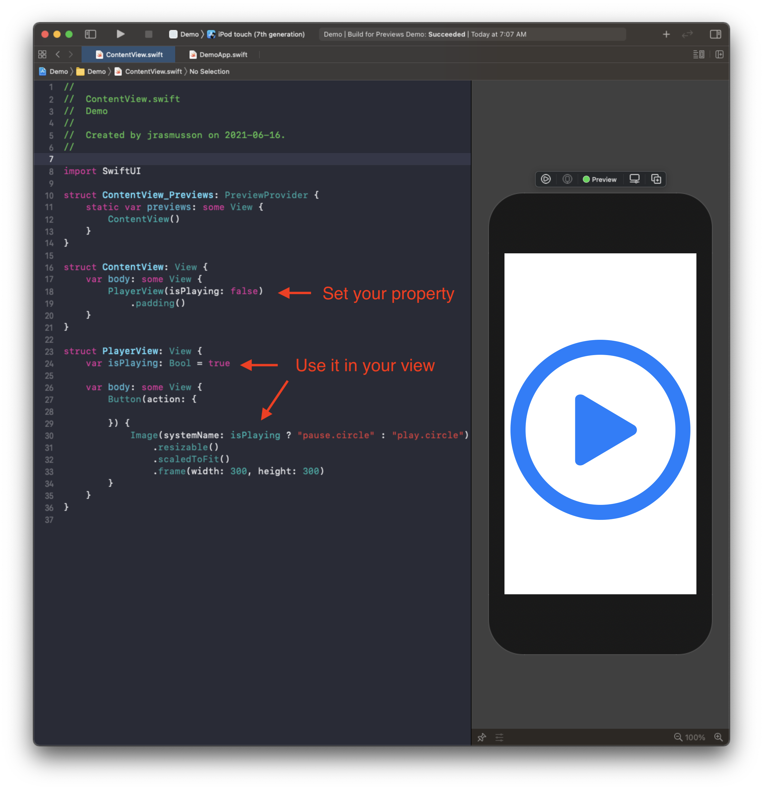
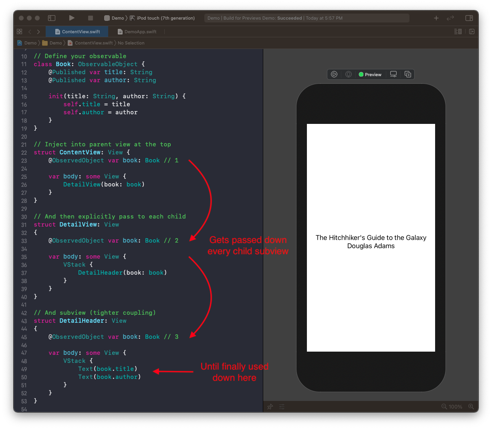
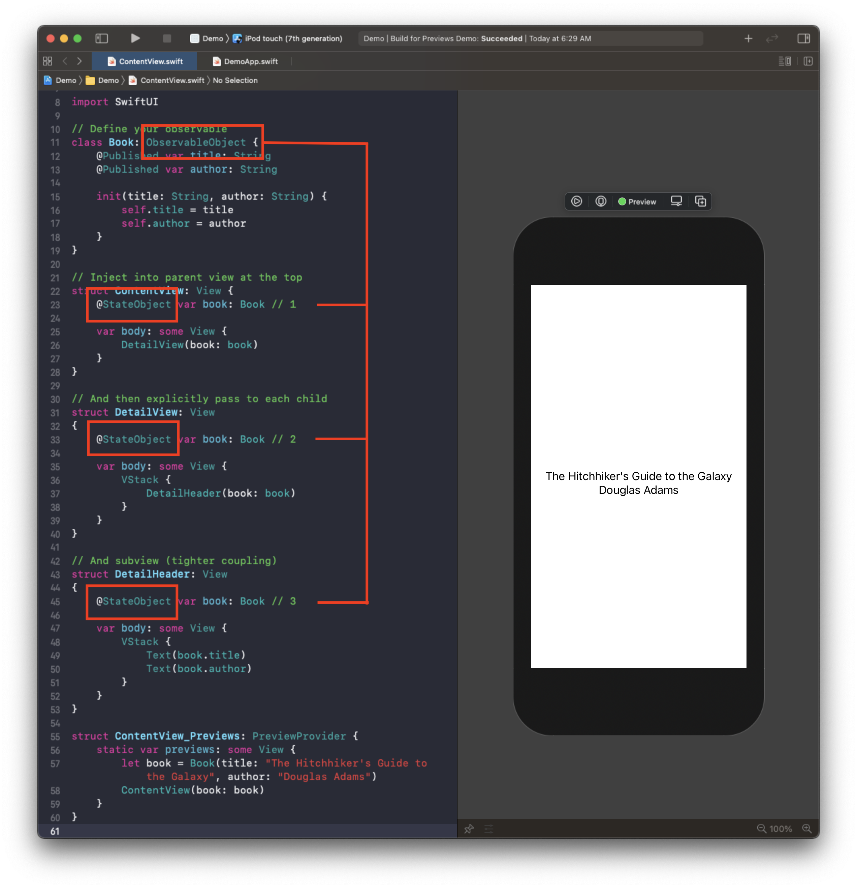

# How Data Flow works in SwiftUI

There are over six ways you can pass data around in SwiftUI. The one you choose depends on whether you are working with a value or reference type:


- Value types (structs)
   - Property - Immutable property that never changes.
   - @State - Transient data owned by the view.
   - @Binding - For mutating data owned by another view.

- Reference type (classes)
	- @StateObject - Managed by SwiftUI
	- @ObservedObject - Shared data passed between views
	- @EnvironmentObject - Shared data automatically available in subviews


## Value types

### Property

The simplest way to flow data into a SwiftUI view is by setting it as a plain old property.



```swift
import SwiftUI

struct ContentView_Previews: PreviewProvider {
    static var previews: some View {
        ContentView()
    }
}

struct ContentView: View {
    var body: some View {
        PlayerView(isPlaying: false)
            .padding()
    }
}

struct PlayerView: View {
    var isPlaying: Bool = true
    
    var body: some View {
        Button(action: {
            
        }) {
            Image(systemName: isPlaying ? "pause.circle" : "play.circle")
                .resizable()
                .scaledToFit()
                .frame(width: 300, height: 300)
        }
    }
}
```

SwiftUI Views are cheap, immutable structures that get re-rendered everytime their data changes. So the simplest thing we can do as far as data flow goes, is to pass a value type in, and let the view render itself.

Of course that works so long as our property never changes. As soon as it does we have a problem.


```swift
struct PlayerView: View {
    var isPlaying: Bool = true 
    
    var body: some View {
        Button(action: {
            self.isPlaying.toggle() // 💥 `self` is immutable
        }) {
            Image(systemName: isPlaying ? "pause.circle" : "play.circle")
        }
    }
}
```

Structs don't support the changing of properties - they are immutable. So in cases like this, where we want to change a property's value in a struct we go to `@State`.


### @State

- A property wrapper for keeping track of transient data owned by the view.
- Add the @State property wrapper to any value type state you want the view to track.
- SwiftUI will track that state for the life time of the view.


```swift
struct PlayerView: View {
    @State private var isPlaying: Bool = false // 🚀
    
    var body: some View {
        Button(action: {
            self.isPlaying.toggle()
        }) {
            Image(systemName: isPlaying ? "pause.circle" : "play.circle")
        }
    }
}
```

### @Binding

- When you want a subview to bi-directionally bind to the @State in the parent, you use the @Binding property wrapper.
- @Binding binds the state of that variable to whatever the parent passes in.
- The parent passes the state using the `$` prefix.
- And from that point on, any changes in the parent get sent to the child.
- And any changes in the child, get sent back up to the parent.
- That's what we mean when we say bi-directional binding.

```swift
struct PlayerView: View {
    @State private var isPlaying: Bool = false
    
    var body: some View {
        VStack {
            PlayButton(isPlaying: $isPlaying)
            
            Toggle(isOn: $isPlaying) {
                Text("Hello World")
            }
        }
    }
}

struct PlayButton: View {
    @Binding var isPlaying: Bool
    
    var body: some View {
        Button(action: {
            self.isPlaying.toggle()
        }) {
            Image(systemName: isPlaying ? "pause.circle" : "play.circle")
        }
    }
}
```

SwiftUI controls take `Binding` property wrappers in their initializers to bind to the external properties you define.

```swift
struct Toggle<Label>: View {
    public init(
        isOn: Binding<Bool>,
        label: () -> Label
    )
}
```

## Reference types

Because structs can't be passed around and referenced like classes, if we ever want to sure state more globablly, we need to pass data using references - or classes.

To facilitate that SwiftUI created an [`ObservableObject`](https://developer.apple.com/documentation/combine/observableobject) protocol, and anyone implementing that protocol, can be observed from other views within the app.

**ObservableObject.swift**

```swift
public protocol ObservableObject : AnyObject {
 
    /// The type of publisher that emits before the object has changed.
    associatedtype ObjectWillChangePublisher : Publisher = ObservableObjectPublisher where Self.ObjectWillChangePublisher.Failure == Never
 
    /// A publisher that emits before the object has changed.
    var objectWillChange: Self.ObjectWillChangePublisher { get }
}
```

- A type of object with a publisher that emits before the object has changed.
- Enforces its implementers be classes via `AnyObject` extension.
- Synthesizes an `objectWillChange` publisher that emits the changed value before any of its @Published properties changes.

An example.

```swift
class Contact: ObservableObject {
   @Published var name: String
   @Published var age: Int

   init(name: String, age: Int) {
       self.name = name
       self.age = age
   }

   func haveBirthday() -> Int {
       age += 1
       return age
   }
}

let john = Contact(name: "John Appleseed", age: 24)
cancellable = john.objectWillChange
   .sink { _ in
       print("\(john.age) will change")
}
print(john.haveBirthday())
// Prints "24 will change"
// Prints "25"
```

#### @Published
- Automatically works with `ObservableObject`
- Publishes every time the value changes in `willSet`
- `projectedValue` is a publisher

### ObservableObject dependencies

SwifUI has three property wrappers it uses to share via via the `ObservableObject` protocol:

- @ObservedObject
- @StateObject
- @EnvironmentObject

### @ObservedObject

To make a SwiftUI class observable, we need to declare what is publishable.

```swift
class User {
    @Published var firstName = "Bilbo"
    @Published var lastName = "Baggins"
}
```

`@Published` is more or less half of `@State`. It tells Swift that whenever either of those two properties change, it should send an announcement out to any SwiftUI views that are watching that they should reload.

How do those views know which classes might send out these modifications? That's another property wrapper, `@ObservedObject`. Which is the other half of `@State`. It tells SwiftUI to watch a class for any change announcements.

```swift
@ObservedObject var user = User()
```

So really to make something observable we go from this:

```swift
struct User {
    var firstName = "Bilbo"
    var lastName = "Baggins"
}

struct ContentView: View {
    @State private var user = User()
```

To this:

```swift
class User: ObservableObject {
    @Published var firstName = "Bilbo"
    @Published var lastName = "Baggins"
}

struct ContentView: View {
    @ObservedObject var user = User()
```

The end result here is that we can have our state stored in an external object, and we can now use that object in multiple views and have them all point to the same shared values.

An example

```swift
import SwiftUI

// Define your observable
class Book: ObservableObject {
    @Published var title: String
    @Published var author: String

    init(title: String, author: String) {
        self.title = title
        self.author = author
    }
}

// Inject into parent view at the top
struct ContentView: View {
    @ObservedObject var book: Book // 1
    
    var body: some View {
        DetailView(book: book)
    }
}

// And then explicitly pass to each child
struct DetailView: View
{
    @ObservedObject var book: Book // 2
    
    var body: some View {
        VStack {
            DetailHeader(book: book)
        }
    }
}

// And subview (tighter coupling)
struct DetailHeader: View
{
    @ObservedObject var book: Book // 3

    var body: some View {
        VStack {
            Text(book.title)
            Text(book.author)
        }
    }
}

struct ContentView_Previews: PreviewProvider {
    static var previews: some View {
        let book = Book(title: "The Hitchhiker's Guide to the Galaxy", author: "Douglas Adams")
        ContentView(book: book)
    }
}
```



The thing to note here is how the `@ObservedObject` is passed along to every subview until is lands where it is needed. Of course it could be used, and updated anywhere along the way.

The one disadvantage of `@ObservedObject` is that this reference object is created everytime a new view is created (which could be often).

A more performant variant of this, which can be used when the view owns the observable object is the reference version of `@State` called `@StateObject`.


### @StateObject

- Just like @ObservedObject, but less expensive.
- Doesn’t get recreated every time view is instantiated.
- Creation and destruction is tied to the view’s life cycle.
- Owned by the view.

Mechanically `@StateObject` works just like `ObservedObject`. Simply replace one with the other and you will get the same functionality, just different lifecycle and ownership.



```swift
import SwiftUI

// Define your observable
class Book: ObservableObject {
    @Published var title: String
    @Published var author: String

    init(title: String, author: String) {
        self.title = title
        self.author = author
    }
}

// Inject into parent view at the top
struct ContentView: View {
    @StateObject var book: Book // 1
    
    var body: some View {
        DetailView(book: book)
    }
}

// And then explicitly pass to each child
struct DetailView: View
{
    @StateObject var book: Book // 2
    
    var body: some View {
        VStack {
            DetailHeader(book: book)
        }
    }
}

// And subview (tighter coupling)
struct DetailHeader: View
{
    @StateObject var book: Book // 3

    var body: some View {
        VStack {
            Text(book.title)
            Text(book.author)
        }
    }
}

struct ContentView_Previews: PreviewProvider {
    static var previews: some View {
        let book = Book(title: "The Hitchhiker's Guide to the Galaxy", author: "Douglas Adams")
        ContentView(book: book)
    }
}
```

### @EnvironmentObject

- Like `@ObservedObject` and `@StatObject` but without the coupling.
- Here you inject `EnvironmentObject` at the top of your view, and it will magically be made available to all subviews without having to explicitly reference.
- Handy for getting to those hard to reach places.

Set it up like this.


```swift
//
//  ContentView.swift
//  Demo
//
//  Created by jrasmusson on 2021-06-16.
//

import SwiftUI

// Define your observable
class Book: ObservableObject {
    @Published var title: String
    @Published var author: String

    init(title: String, author: String) {
        self.title = title
        self.author = author
    }
}

// Inject once at the top
struct ContentView_Previews: PreviewProvider {
    static var previews: some View {
        let book = Book(title: "The Hitchhiker's Guide to the Galaxy", author: "Douglas Adams")

        ContentView()
            .environmentObject(book) // 1
    }
}

// Define once at the top
struct ContentView: View {
    // No need to define
    var body: some View {
        DetailView()
    }
}

// Automtically available
struct DetailView: View {
    // No need to reference
    var body: some View {
        VStack {
            DetailHeader()
        }
    }
}

// Pull out when needed
struct DetailHeader: View {
    @EnvironmentObject var book: Book // 2

    var body: some View {
        VStack {
            Text(book.title)
            Text(book.author)
        }
    }
}
```

### Difference between Environment and Environment Object

SwiftUI gives us both `@Environment` and `@EnvironmentObject` property wrappers, but they are subtly different: whereas `@EnvironmentObject` allows us to inject arbitrary values into the environment, `@Environment` is specifically there to work with SwiftUI’s own pre-defined keys.

For example, `@Environment` is great for reading out things like a Core Data managed object context, whether the device is in dark mode or light mode, what size class your view is being rendered with, and more – fixed properties that come from the system. In code, it looks like this:

```swift
@Environment(\.horizontalSizeClass) var horizontalSizeClass
@Environment(\.managedObjectContext) var managedObjectContext
```

On the other hand, `@EnvironmentObject` is designed for arbitrary objects to be read from the environment, like this:

```swift
@EnvironmentObject var order: Order
```

### Links that help
- [WWDC 2019 - Data Flow Through SwiftUI](https://developer.apple.com/videos/play/wwdc2019/226/)
- [Hacking in Swift - How to use @EnvironmentObject to share data between views](https://www.hackingwithswift.com/quick-start/swiftui/how-to-use-environmentobject-to-share-data-between-views)
- [Apple Docs ObservableObject](https://developer.apple.com/documentation/combine/observableobject)
- [Learn App Making - How to pass data between views](https://learnappmaking.com/pass-data-between-views-swiftui-how-to/)