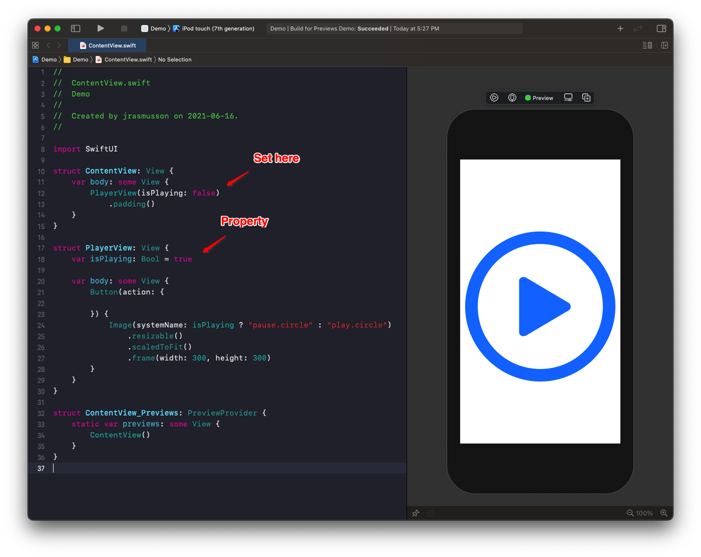

# How Data Flow works in SwiftUI

There are over six ways you can pass data around in SwiftUI. The one you choose depends on whether you are working with a value or reference type:


- Value types (structs)
   - Property - Immutable property that never changes.
   - @State - Transient data owned by the view.
   - @Binding - For mutating data owned by another view.

- Reference type (classes)
	- @StateObject - Managed by SwiftUI
	- @ObservedObject - Shared data passed between views
	- @EnvironmentObject - Shared data automatically available in subviews


## Value types


### Property

The simplest way to flow data into a SwiftUI view is by setting it as a plain old property.

```swift
import SwiftUI

struct ContentView: View {
    var body: some View {
        PlayerView(isPlaying: false)
            .padding()
    }
}

struct PlayerView: View {
    var isPlaying: Bool = true
    
    var body: some View {
        Button(action: {
            
        }) {
            Image(systemName: isPlaying ? "pause.circle" : "play.circle")
                .resizable()
                .scaledToFit()
                .frame(width: 300, height: 300)
        }
    }
}

struct ContentView_Previews: PreviewProvider {
    static var previews: some View {
        ContentView()
    }
}
```




SwiftUI's heavy use of structs means we can't just define vars in structs and expect that to mutate with state changes.

```swift
struct PlayerView: View {
    var isPlaying: Bool = true // OK
    
    var body: some View {
        Button(action: {
            self.isPlaying.toggle() // 💥 `self` is immutable
        }) {
            Image(systemName: isPlaying ? "pause.circle" : "play.circle")
        }
    }
}
```

In order to track changes of state in structs, SwiftUI created the @State and @Binding property wrappers.

### @State

- A property wrapper for keeping track of transient data owned by the view.
- Add the @State property wrapper to any value type state you want the view to track.
- SwiftUI will track that state for the life time of the view.


```swift
struct PlayerView: View {
    @State private var isPlaying: Bool = false // 🚀
    
    var body: some View {
        Button(action: {
            self.isPlaying.toggle()
        }) {
            Image(systemName: isPlaying ? "pause.circle" : "play.circle")
        }
    }
}
```

### @Binding

- When you want a subview to bi-directionally bind to the @State in the parent, you use the @Binding property wrapper.
- @Binding binds the state of that variable to whatever the parent passes in.
- The parent passes the state using the `$` prefix.
- And from that point on, any changes in the parent get sent to the child.
- And any changes in the child, get sent back up to the parent.
- That's what we mean when we say bi-directional binding.

```swift
struct PlayerView: View {
    @State private var isPlaying: Bool = false
    
    var body: some View {
        VStack {
            PlayButton(isPlaying: $isPlaying)
            
            Toggle(isOn: $isPlaying) {
                Text("Hello World")
            }
        }
    }
}

struct PlayButton: View {
    @Binding var isPlaying: Bool
    
    var body: some View {
        Button(action: {
            self.isPlaying.toggle()
        }) {
            Image(systemName: isPlaying ? "pause.circle" : "play.circle")
        }
    }
}
```

SwiftUI controls take `Binding` property wrappers in their initializers to bind to the external properties you define.

```swift
struct Toggle<Label>: View {
    public init(
        isOn: Binding<Bool>,
        label: () -> Label
    )
}
```

## Reference types

Because structs can't be passed around and referenced like classes, if we ever want to sure state more globablly, we need to pass data using references - or classes.

To facilitate that SwiftUI created an [`ObservableObject`](https://developer.apple.com/documentation/combine/observableobject) protocol, and anyone implementing that protocol, can be observed from other views within the app.

**ObservableObject.swift**

```swift
public protocol ObservableObject : AnyObject {
 
    /// The type of publisher that emits before the object has changed.
    associatedtype ObjectWillChangePublisher : Publisher = ObservableObjectPublisher where Self.ObjectWillChangePublisher.Failure == Never
 
    /// A publisher that emits before the object has changed.
    var objectWillChange: Self.ObjectWillChangePublisher { get }
}
```

- A type of object with a publisher that emits before the object has changed.
- Enforces its implementers be classes via `AnyObject` extension.
- Synthesizes an `objectWillChange` publisher that emits the changed value before any of its @Published properties changes.

An example.

```swift
class Contact: ObservableObject {
   @Published var name: String
   @Published var age: Int

   init(name: String, age: Int) {
       self.name = name
       self.age = age
   }

   func haveBirthday() -> Int {
       age += 1
       return age
   }
}

let john = Contact(name: "John Appleseed", age: 24)
cancellable = john.objectWillChange
   .sink { _ in
       print("\(john.age) will change")
}
print(john.haveBirthday())
// Prints "24 will change"
// Prints "25"
```

#### @Published
- Automatically works with `ObservableObject`
- Publishes every time the value changes in `willSet`
- `projectedValue` is a publisher

### ObservableObject dependencies

SwifUI has three property wrappers it uses to share via via the `ObservableObject` protocol:

- @ObservedObject
- @StateObject
- @EnvironmentObject

#### Sharing state with @ObservedObject

To make a SwiftUI class observable, we need to declare what is publishable.

```swift
class User {
    @Published var firstName = "Bilbo"
    @Published var lastName = "Baggins"
}
```

`@Published` is more or less half of `@State`. It tells Swift that whenever either of those two properties change, it should send an announcement out to any SwiftUI views that are watching that they should reload.

How do those views know which classes might send out these modifications? That's another property wrapper, `@ObservedObject`. Which is the other half of `@State`. It tells SwiftUI to watch a class for any change announcements.

```swift
@ObservedObject var user = User()
```

So really to make something observable we go from this:

```swift
struct User {
    var firstName = "Bilbo"
    var lastName = "Baggins"
}

struct ContentView: View {
    @State private var user = User()
```

To this:

```swift
class User: ObservableObject {
    @Published var firstName = "Bilbo"
    @Published var lastName = "Baggins"
}

struct ContentView: View {
    @ObservedObject var user = User()
```

The end result here is that we can have our state stored in an external object, and we can now use that object in multiple views and have them all point to the same shared values.

An example

```swift
import SwiftUI

struct ReadingProgress {
    let progress: Double
}

class CurrentlyReading: ObservableObject {
    @Published var readingProgress: ReadingProgress
    
    init(readingProgress: ReadingProgress) {
        self.readingProgress = readingProgress
    }
}

struct ContentView: View {
    @ObservedObject var currentlyReading: CurrentlyReading
    
    var body: some View {
        Text("Progress: \(currentlyReading.readingProgress.progress)")
            .padding()
    }
}
```

Changing gears a bit, say we want to asynchronously load our book covers just before they are displayed on screen. These images are an expensive resource, so we only want to keep them alive when visible.

More generally, we notice that we want to tie the life cycle of our observable object to our view, like with @State.

But notice @ObservedObject does not own the live cycle of the state it is observing. So to provide a more economic tool SwithUI team created @StateObject.

#### Efficiently keeping state local with @StateObject

- SwiftUI owns the `ObservableObject`
- Creation and destruction is tied to the view’s life cycle
- Instantiated just before the body
- Just like @ObservedObject, but less expensive
- Doesn’t get recreated every time view is instantiated
- Like the reference type version of @State but for persistence in a view

You provide initial value, and SwiftUI will assign just before. Once our image loads, SwiftUi will automatically update the view.

```swift
class CoverImageLoader: ObservedObject {
    @Published public private(set) var image: Image? = nil
    
    func load(_ name: String) {
        
    }
}
 
struct BookCoverView: View {
    @StateObject var loader = CoverImageLoader() // source of truth
    
    var coverName: String
    var size: CGFloat
    
    var body: some View {
        CoverImage(loade.image, size: size)
            .onAppear { loader.load(coverName)}
    }
}
```

`CoverImageLoader` is instantiated just before the body runs, and is keep alive for the views lifecycle. No more on disappear.

To genetically get any piece of data anywhere we have @EnvironmentObject. Which is both a view modifier and a property wrapper.

#### Generically get to any piece of data with @EnvironmentObject

Like @ObservedObject, but you don’t need to pass directly in
Handy to get to those hard to reach places

Set it up like this.

```swift
struct MovieList: View {
  @EnvironmentObject var userStore: UserStore
  @Environment(\.presentationMode) var presentationMode
  @StateObject var movieStore = MovieStore()
  @State private var isPresented = false
 
  var body: some View {
    NavigationView {
      List {
        ForEach(movieStore.movies, id: \.title) {
          MovieRow(movie: $0)
        }
        .onDelete(perform: movieStore.deleteMovie)
      }
      .sheet(isPresented: $isPresented) {
        AddMovie(movieStore: movieStore, showModal: $isPresented)
      }
      .navigationBarTitle(Text("Fave Flicks"))
      .navigationBarItems(
        leading:
          NavigationLink(destination: UserView()) {
            HStack {
              // 1
              userStore.currentUserInfo.map { Text($0.userName) }
              // 2
              Image(systemName: "person.fill")
            }
          },
        trailing:
          Button(action: { isPresented.toggle() }) {
            Image(systemName: "plus")
          }
      )
    }
  }
}
```

Pass the value in like this.

```swift
let contentView = MovieList().environmentObject(UserStore())
```

#### Difference between Environment and Environment Object

`@EnvironmentObject` is like an `@ObservableObject` except you don’t need to pass it down through every child explicitly as a reference.

Instead you can define it once up high, and let children bind to it whenever they want.

`@Environment`, is like `@EnvironmentObject` in one way: both are shared across a view hierarchy. The difference is that you can add anything to `@EnvironmentObject`, while `@Environment` is more like key-value pairs.

While both @EnvironmentObject and @Environment share the environment, they serve very different purposes. You usually use @EnvironmentObject to manage dependencies in your app. SwiftUI uses @Environment as a way to manage settings for views and their children. Each view comes with environment values you can use to change the behavior of views in the hierarchy. One of these values is presentationMode.

@EnvironmentObject
- Pass data you control to other view without the tight coupling

@Environment
- Key/value pairs to manage settings for views and their children


### Links that help
- [WWDC 2019 - Data Flow Through SwiftUI](https://developer.apple.com/videos/play/wwdc2019/226/)
- [Hacking in Swift - How to use @EnvironmentObject to share data between views](https://www.hackingwithswift.com/quick-start/swiftui/how-to-use-environmentobject-to-share-data-between-views)
- [Apple Docs ObservableObject](https://developer.apple.com/documentation/combine/observableobject)
- [Learn App Making - How to pass data between views](https://learnappmaking.com/pass-data-between-views-swiftui-how-to/)