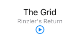

# Data Flow

Something you can't do in SwiftUI is modify a `Views` state.

```swift
struct ContentView: View {
    var tapCount = 0

    var body: some View {
        Button("Tap Count: \(tapCount)") {
            self.tapCount += 1
        }
    }
}
```

This is because structs are immutable in Swift. They aren't meant to be modified.

If you want to modify a `View` state you need to use the `@State` property wrapper.

```swift
struct ContentView: View {
    @State var tapCount = 0

    var body: some View {
        Button("Tap Count: \(tapCount)") {
            self.tapCount += 1
        }
    }
}
```

This allows us to modify a structs internal state, and SwiftUI manages this for us.
## @State

`@State` is for when the view acts as the source of truth.



```swift
struct PlayerView: View {
    @State private var isPlaying: Bool = false
```

And it passes it to its subviews via a `$isPlaying` `@Binding`.

```swift
var body: some View {
        VStack {       
            PlayButton(isPlaying: $isPlaying)
            
struct PlayButton: View {
    @Binding var isPlaying: Bool

```

For example.

```swift
import SwiftUI

struct Episode {
    let title: String
    let showTitle: String
}

struct PlayerView: View {
    let episode: Episode
    @State private var isPlaying: Bool = false
    
    var body: some View {
        VStack {
            Text(episode.title)
            Text(episode.showTitle).font(.caption).foregroundColor(.gray)
            
            PlayButton(isPlaying: $isPlaying)
        }
    }
}

struct PlayerView_Previews: PreviewProvider {
    static var previews: some View {
        let episode = Episode(title: "The Grid", showTitle: "Rinzler's Return")
        PlayerView(episode: episode)
    }
}

struct PlayButton: View {
    @Binding var isPlaying: Bool
    
    var body: some View {
        Button(action: {
            withAnimation { self.isPlaying.toggle() }
        }, label: {
            Image(systemName: isPlaying ? "pause.circle" : "play.circle" )
        })
    }
}
```

## Direct dependency

`ObservedObject` object is for when you own the data externally, and you want to update any listening controls in your app that have bound to it.

First you create a store of type `class` implementing the `ObservableObject` protocol along with the peice of data you would like to publish.

```swift
import Foundation

class PodcastPlayerStore: ObservableObject {
    @Published var episode: Episode
    
    init(episode: Episode = Episode(title: "Unknown", showTitle: "Unknown")) {
        self.episode = episode
    }
}
```

Then you update any views by having them observe the data store.

```swift
struct PlayerView: View {
    @ObservedObject var store = PodcastPlayerStore()
```

As we as update the preview in how they are created.

For example.

```swift
import SwiftUI

struct Episode {
    let title: String
    let showTitle: String
}

struct PlayerView: View {
    @ObservedObject var store = PodcastPlayerStore()
    @State private var isPlaying: Bool = false
    
    var body: some View {
        VStack {
            Text(store.episode.title)
            Text(store.episode.showTitle).font(.caption).foregroundColor(.gray)
            
            PlayButton(isPlaying: $isPlaying)
        }
    }
}

struct PlayerView_Previews: PreviewProvider {
    static var previews: some View {
        let episode = Episode(title: "The Grid", showTitle: "Rinzler's Return")
        PlayerView(store: PodcastPlayerStore(episode: episode))
    }
}

struct PlayButton: View {
    @Binding var isPlaying: Bool
    
    var body: some View {
        Button(action: {
            withAnimation { self.isPlaying.toggle() }
        }, label: {
            Image(systemName: isPlaying ? "pause.circle" : "play.circle" )
        })
    }
}
```

## Indirect dependency

`@Environment` is like a shared global state across your app. You don't need to directly bind to it. But it is always there, and you can pull data from it whenever you need to.


### Links that help
- [WWDC 2019 - Data Flow Through SwiftUI](https://developer.apple.com/videos/play/wwdc2019/226/)
