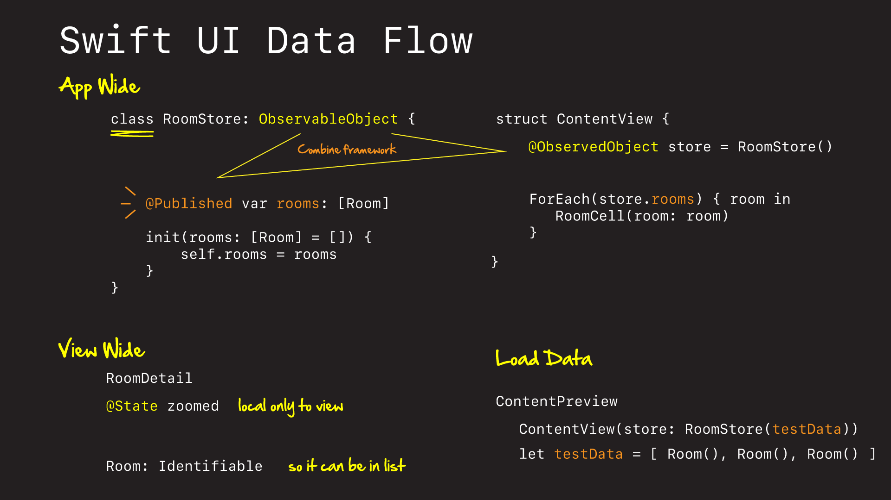
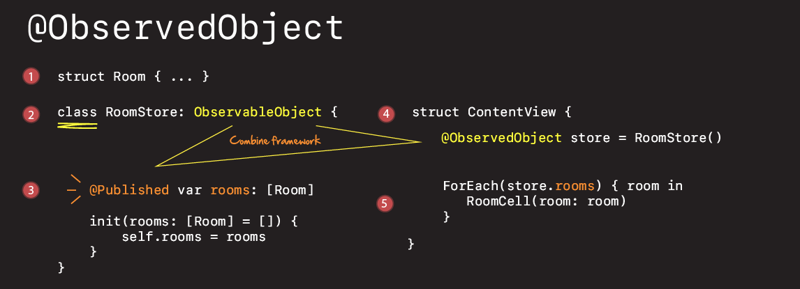
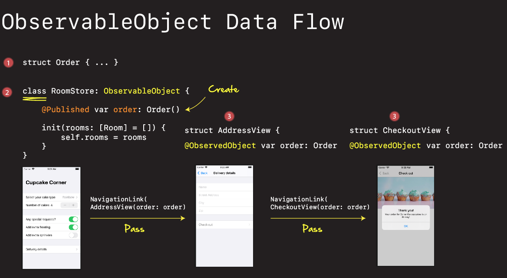

# Data Flow



## @State

For storing state in a single view.

```swift
struct ContentView: View {
    @State var tapCount = 0

    var body: some View {
        Button("Tap Count: \(tapCount)") {
            self.tapCount += 1
        }
    }
}
```

This allows us to modify a structs internal state, and SwiftUI manages this for us. Two-way binding.

## @Binding

Connecting `@State` to a control's underlying data model.

```swift
struct ContentView: View {
    @State private var name = ""

    var body: some View {
        Form {
            TextField("Enter your name", text: $name)
            Text("Your name is \(name)")
        }
    }
}
```


- [Binding](https://www.hackingwithswift.com/books/ios-swiftui/creating-a-custom-component-with-binding)


## @ObservableObject

Let's us pass one object from view to view so we can share it.



1. Define a `struct`.
2. Define a `class` implementing `ObservableObject`.
3. Define data to be `@Published`.
4. Instantiate the data once.
5. Pass to each `View` that wants to be notified.

Key thing to note is that the object we want to published is defined and created once at the top, and then passed down to child views after.




### Example

Define a struct.

```swift
struct ExpenseItem: Identifiable {
    let id = UUID()
    let name: String
    let type: String
    let amount: Int
}
```

Make it observable - note `class`.

```swift
class Expenses: ObservableObject {
    @Published var items = [ExpenseItem]()
}
```

Use it.

```swift
struct ContentView: View {
    @State private var numbers = [Int]()
    @State private var currentNumber = 1
    
    @ObservedObject var expenses = Expenses()

    var body: some View {
        
        NavigationView {
            List {
                ForEach(expenses.items) { item in
                    Text(item.name)
                }.onDelete(perform: removeItems)
            }
            .navigationBarItems(trailing:
                Button(action: {
                    let expense = ExpenseItem(name: "Test", type: "Personal", amount: 5)
                    self.expenses.items.append(expense)
                }) {
                    Image(systemName: "plus")
                }
            )
        }
        
    }
    
    func removeItems(at offsets: IndexSet) {
        expenses.items.remove(atOffsets: offsets)
    }
}
```


### Environment

`@Environment` is like a shared global state across your app. You don't need to directly bind to it. But it is always there, and you can pull data from it whenever you need to.

#### Dismiss sheet

For example, this is how we dismiss sheets.

```swift
@Environment(\.presentationMode) var presentationMode
```

Then when we are ready to dismiss.

```swift
Text("Hello World")
    .onTapGesture {
        self.presentationMode.wrappedValue.dismiss()
    }
```

#### Size classes

How much space you have for a view.

Say you want to adjust your view depending on the `sizeClass`.

```swift
struct ContentView: View {
    @Environment(\.horizontalSizeClass) var sizeClass

    var body: some View {
        if sizeClass == .compact {
            return VStack {
                Text("Active size class:")
                Text("COMPACT")
            }
            .font(.largeTitle)
        } else {
            return HStack {
                Text("Active size class:")
                Text("REGULAR")
            }
            .font(.largeTitle)
        }
    }
}
```

This almost works. Except you get an oninous error: 

 > “Function declares an opaque return type, but the return statements in its body do not have matching underlying types.”
 
That's because we can't return different view types from a body. We handle this with something called `type erasure`.

```swift
return AnyView(HStack {
    // ...
}
.font(.largeTitle))
```

Type erasure masks the underlying view type. It erases or hides it. We don't use it all the time because of performance. But it's there when we need it.


#### CoreData

```swift
@Environment(\.managedObjectContext) var moc
```


## You can't directly modify a views state

Something you can't do in SwiftUI is modify a `Views` state.

```swift
struct ContentView: View {
    var tapCount = 0

    var body: some View {
        Button("Tap Count: \(tapCount)") {
            self.tapCount += 1
        }
    }
}
```

You can define a `var` in a `struct`. You just can't modify it from within the `struct`. 

```swift
struct SecondView: View {
    var name: String

    var body: some View {
        Text("Hello, \(name)!")
    }
}
```


This is because structs are immutable in Swift. They aren't meant to be modified.

## How property wrappers become structs

You’ve seen how SwiftUI lets us store changing data in our structs by using the @State property wrapper, how we can bind that state to the value of a UI control using $, and how changes to that state automatically cause SwiftUI to reinvoke the body property of our struct.

All that combined lets us write code such as this:

```swift
struct ContentView: View {
    @State private var blurAmount: CGFloat = 0

    var body: some View {
        VStack {
            Text("Hello, World!")
                .blur(radius: blurAmount)

            Slider(value: $blurAmount, in: 0...20)
        }
    }
}
```


Now, let’s say we want that binding to do more than just handle the radius of the blur effect. Perhaps we want to save that to UserDefaults, run a method, or just print out the value for debugging purposes. You might try updating the property like this:

```swift
@State private var blurAmount: CGFloat = 0 {
    didSet {
        print("New value is \(blurAmount)")
    }
}
```

If you run that code, you’ll be disappointed: as you drag the slider around you’ll see the blur amount change, but you won’t see our print() statement being triggered – in fact, nothing will be output at all.

When we use `@State` to wrap a string, the actual type of property we end up with is a `State<String>`. 

If you Command+Shift+O and open up the State object you'll see:

```swift
@propertyWrapper public struct State<Value> : DynamicProperty {
```

and

```swift
public var wrappedValue: Value { get nonmutating set }
```

That wrapped value is the actual value we’re trying to store, such as a string. What this generated interface is telling us is that the property can be read (`get`), and written (`set`), but that when we set the value it won’t actually change the struct itself.

So when we see this:

```swift
@State private var blurAmount: CGFloat = 0 {
    didSet {
        print("New value is \(blurAmount)")
    }
}
```

What we are actually observing is the @State wrapper of the blur amount. Not the blur amount itself.

To fix this we need to create a custom binding – we need to use the `Binding` struct directly, which allows us to provide our own code to run when the value is read or written.

```swift
struct ContentView: View {
    @State private var blurAmount: CGFloat = 0

    var body: some View {
        let blur = Binding<CGFloat>(
            get: {
                self.blurAmount
            },
            set: {
                self.blurAmount = $0
                print("New value is \(self.blurAmount)")
            }
        )

        return VStack {
            Text("Hello, World!")
                .blur(radius: blurAmount)

            Slider(value: blur, in: 0...20)
        }
    }
}
```

What all this means is that you can do whatever you want inside these closures: you can call methods, run an algorithm to figure out the correct value to use, or even just use random values – it doesn’t matter, as long as you return a value from get. So, if you want to make sure you update `UserDefaults` every time a value is changed, the `set` closure of a Binding is perfect.

- [How property wrappers become structs](https://www.hackingwithswift.com/books/ios-swiftui/how-property-wrappers-become-structs)
- [Creating custom bindings in SwiftUI](https://www.hackingwithswift.com/books/ios-swiftui/creating-custom-bindings-in-swiftui)


### Links that help
- [WWDC 2019 - Data Flow Through SwiftUI](https://developer.apple.com/videos/play/wwdc2019/226/)
