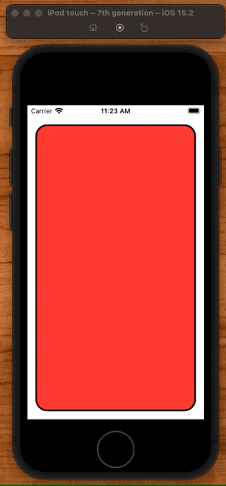

# Flip a Card

There are three ways to animation things in SwiftUI:

- `implicit` the animation of view modifers
- `explicit` the animation of intents
- `transitions` the animations of views coming and going on screen

## Implicit animation

An `implicit` animation is one where we make a change to a view modifier, and then immedidately animate it.

Here for example we add a rotation effect to a `CardView` and then implicitly animate it with a call to `.animation()`.

```swift
CardView(isFaceUp: $isFaceUp)
    .rotation3DEffect(Angle(degrees: isFaceUp ? 0 : 180),
                      axis: (x: 0, y: 1, z: 0))
    // implicit
    .animation(Animation.easeInOut(duration: 2), value: isFaceUp)
```

## Explicit animation

`Explicit` animation can do the same thing, only here we modify an intent. An intent is a change in model. We want the animation to apply to the entier view container.

So implicit are much more local and rare. We would only apply them on small things we want to animate. Explicit are for a change in view model. Something bigger. And those we wrap in `withAnimation`.

```swift
CardView(isFaceUp: $isFaceUp)
    .onTapGesture {
        // explicit
        withAnimation(.easeInOut(duration: 2)) {
            isFaceUp.toggle()
        }
    }

    .rotation3DEffect(Angle(degrees: isFaceUp ? 0 : 180),
                      axis: (x: 0, y: 1, z: 0))
```

Also note that it isn't the application of the animation that makes the animation occur. This just sets it up:

```swift
.rotation3DEffect(Angle(degrees: isFaceUp ? 0 : 180),
                                  axis: (x: 0, y: 1, z: 0))
```

It is when the inputs to a view modifer or the state changes that cause the animation to occur. In the explicit case this line here:

```swift
withAnimation(.easeInOut(duration: 2)) {
    isFaceUp.toggle() // trigger animation
}
```

Source:

```swift
struct ContentView: View {
    @State private var isFaceUp = false

    var body: some View {
        VStack {
            CardView(isFaceUp: $isFaceUp)
                .onTapGesture {
                    // explicit
                    withAnimation(.easeInOut(duration: 2)) {
                        isFaceUp.toggle()
                    }
                }

                .rotation3DEffect(Angle(degrees: isFaceUp ? 0 : 180),
                                  axis: (x: 0, y: 1, z: 0))
                // implicit
                .animation(Animation.easeInOut(duration: 2), value: isFaceUp)
        }
    }
}

struct CardView: View {
    @Binding var isFaceUp: Bool

    var body: some View {
        ZStack {
            let shape = RoundedRectangle(cornerRadius: 20)
            shape
                .foregroundColor(isFaceUp ? Color.clear : .red)
                .padding()
            shape.stroke(lineWidth: 3)
                .padding()

            Text("🕹")
                .font(.system(size: 200))
                .opacity(isFaceUp ? 1 : 0)
        }
    }
}
```


## Making a ViewModifer

When you have an effect that you want to apply to any view, it can be handy to make a view modifier.

Here we just take the contents of the `CardView` we made and extract it into a view modifier passing on the `content`.

```swift
struct ContentView: View {
    @State private var isFaceUp = false

    var body: some View {
        VStack {
            Text("👻")
                .cardify(isFaceUp: isFaceUp)
                .onTapGesture {
                    withAnimation(.easeInOut(duration: 2)) {
                        isFaceUp.toggle()
                    }
                }
        }
    }
}

struct Cardify: ViewModifier {
    var isFaceUp: Bool

    func body(content: Content) -> some View {
        ZStack {
            let shape = RoundedRectangle(cornerRadius: 20)
            shape
                .foregroundColor(isFaceUp ? Color.clear : .red)
                .padding()
            shape.stroke(lineWidth: 3)
                .padding()

            Text("🕹")
                .font(.system(size: 200))
                .opacity(isFaceUp ? 1 : 0)
        }
        .rotation3DEffect(
            Angle.degrees(isFaceUp ? 0: 180),
            axis: (0,1,0),
            perspective: 0.3
        )
    }
}


extension View {
    func cardify(isFaceUp: Bool) -> some View {
        modifier(Cardify(isFaceUp: isFaceUp))
    }
}
```

Exact same code. Exact same effect. Only extracted into a view modifier with an extension and capable of taking any view and making it a flippable card.


## AnimatableModifier

Next step is making the animation how it would really work in real life:

- only show face is rotated > 90°
- only change the opocity if > 90°

To make all this happen we need to track the angle of rotation and detect when it hits 90°.

So what we can do to our view modifier is:

- add a rotation var
- change the logic to use that var to change properties
- add an `init` method for setting `isFaceUp` 

**Cardify**

```swift
struct Cardify: ViewModifier {
    var rotation: Double // in degrees

    init(isFaceUp: Bool) {
        rotation = isFaceUp ? 0 : 180
    }

    func body(content: Content) -> some View {
        ZStack {
            let shape = RoundedRectangle(cornerRadius: 20)
            shape
                .foregroundColor(rotation < 90 ? Color.clear : .red)
                .padding()
            shape.stroke(lineWidth: 3)
                .padding()

            Text("🕹")
                .font(.system(size: 200))
                .opacity(rotation < 90 ? 1 : 0)
        }
        .rotation3DEffect(
            Angle.degrees(rotation),
            axis: (0,1,0),
            perspective: 0.3
        )
    }
}
```

That's good start. But its not enough. We need to track the animation from 0 - 90 and then from 90 - 180 and inimate it with the proper settings through each stage.

To make our view modifier handle that, we need to make our view `Animatable`.

### Animatable

`Animatable` is a protocol with one property:

- `var animatableData`

```swift
struct Cardify: ViewModifier, Animatable {
    var rotation: Double // in degrees

    var animatableData: Double {
        get { rotation }
        set { rotation = newValue }
    }
```

By plugging this protocol in and hooking it up to our `rotation`, we can now track the animation and use rotation values of: 0, 1, 2, 3, 90, ... 180 and it will animate correctly and apply the right value each step of the way.

Everything else stays exactly the same.

```swift
struct ContentView: View {
    @State private var isFaceUp = false

    var body: some View {
        VStack {
            Text("👻")
                .cardify(isFaceUp: isFaceUp)
                .onTapGesture {
                    withAnimation(.easeInOut(duration: 2)) {
                        isFaceUp.toggle()
                    }
                }
        }
    }
}

struct Cardify: ViewModifier, Animatable {
    var rotation: Double // in degrees

    var animatableData: Double {
        get { rotation }
        set { rotation = newValue }
    }

    init(isFaceUp: Bool) {
        rotation = isFaceUp ? 0 : 180
    }

    func body(content: Content) -> some View {
        ZStack {
            let shape = RoundedRectangle(cornerRadius: 20)
            shape
                .foregroundColor(rotation < 90 ? Color.clear : .red)
                .padding()
            shape.stroke(lineWidth: 3)
                .padding()

            Text("🕹")
                .font(.system(size: 200))
                .opacity(rotation < 90 ? 1 : 0)
        }
        .rotation3DEffect(
            Angle.degrees(rotation),
            axis: (0,1,0),
            perspective: 0.3
        )
    }
}
```

Only now we get a beautiful trackable animation that doesn't fade in too early, and shows the card exactly how it should look.


## AnimatableModifier

```swift
struct ContentView: View {
    @State var isFaceUp = false

    var body: some View {
        VStack {
            HStack(spacing:40) {
                VStack {
                    CardView(isFaceUp: isFaceUp, content: "👻")
                        .animation(.linear(duration: 1.0), value: isFaceUp)
                        .frame(width:100, height:100)
                }
            }

            Spacer().frame(height:40)

            Button("flip card") {
                isFaceUp.toggle()
            }

            Spacer()
        }
    }
}

struct CardView: View {
    var isFaceUp: Bool
    var content: String

    var body: some View {
        Text(content)
            .font(.system(size: 50))
                .scaledToFit()
                .clipped()
                .cornerRadius(15.0)
                .padding(10)
                .cardFlip(isFaceUp: isFaceUp)
    }
}

struct CardFlip: AnimatableModifier {
    init(isFaceUp: Bool) {
        rotationAngle = isFaceUp ? 0 : 180
    }

    var animatableData: Double {
        get { rotationAngle }
        set { rotationAngle = newValue }
    }

    private var rotationAngle: Double

    func body(content: Content) -> some View {
        ZStack {
            RoundedRectangle(cornerRadius: 20)
                .fill(Color.orange.opacity(rotationAngle < 90 ? 0.5 : 1.0))
            content
                .opacity(rotationAngle < 90 ? 1.0 : 0.0)
        }
        .rotation3DEffect(
            Angle.degrees(rotationAngle),
            axis: (0, 1, 0),
            perspective: 0.3
        )
    }
}

extension View {
    func cardFlip(isFaceUp: Bool) -> some View {
        modifier(CardFlip(isFaceUp: isFaceUp))
    }
}
```



### Links that help

- [Article](https://swdevnotes.com/swift/2021/flip-card-in-swiftui)


