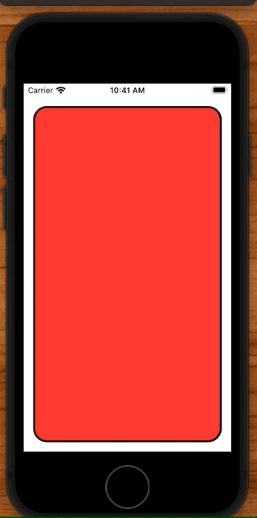
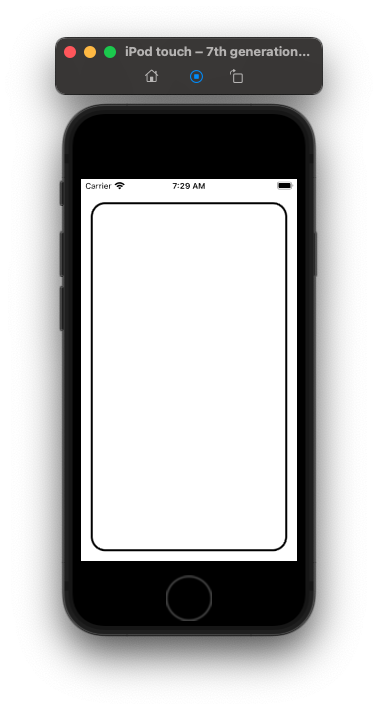
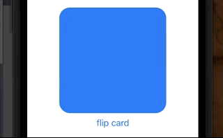

# Flip a Card

There are three ways to animation things in SwiftUI:

- `implicit` the animation of view modifers
- `explicit` the animation of intents
- `transitions` the animations of views coming and going on screen

## Implicit animation

An `implicit` animation is one where we make a change to a view modifier, and then immedidately animate it.

Here for example we add a rotation effect to a `CardView` and then implicitly animate it with a call to `.animation()`.

```swift
CarView(isFaceUp: $isFaceUp)
    .rotation3DEffect(Angle(degrees: isFaceUp ? 0 : 180),
                      axis: (x: 0, y: 1, z: 0))
    // implicit
    .animation(Animation.easeInOut(duration: 2), value: isFaceUp)
```

## Explicit animation

`Explicit` animation can do the same thing, only here we modify an intent. An intent is a change in model. We want the animation to apply to the entier view container.

So implicit are much more local and rare. We would only apply them on small things we want to animate. Explicit are for a change in view model. Something bigger. And those we wrap in `withAnimation`.

```swift
CarView(isFaceUp: $isFaceUp)
    .onTapGesture {
        // explicit
        withAnimation(.easeInOut(duration: 2)) {
            isFaceUp.toggle()
        }
    }

    .rotation3DEffect(Angle(degrees: isFaceUp ? 0 : 180),
                      axis: (x: 0, y: 1, z: 0))
```

Also note that it isn't the application of the animation that makes the animation occur. This just sets it up:

```swift
.rotation3DEffect(Angle(degrees: isFaceUp ? 0 : 180),
                                  axis: (x: 0, y: 1, z: 0))
```

It is when the inputs to a view modifer or the state changes that cause the animation to occur. In the explicit case this line here:

```swift
withAnimation(.easeInOut(duration: 2)) {
    isFaceUp.toggle() // trigger animation
}
```

Source:

```swift
struct ContentView: View {
    @State private var isFaceUp = false

    var body: some View {
        VStack {
            CarView(isFaceUp: $isFaceUp)
                .onTapGesture {
                    // explicit
                    withAnimation(.easeInOut(duration: 2)) {
                        isFaceUp.toggle()
                    }
                }

                .rotation3DEffect(Angle(degrees: isFaceUp ? 0 : 180),
                                  axis: (x: 0, y: 1, z: 0))
                // implicit
                .animation(Animation.easeInOut(duration: 2), value: isFaceUp)
        }
    }
}

struct CarView: View {
    @Binding var isFaceUp: Bool

    var body: some View {
        ZStack {
            let shape = RoundedRectangle(cornerRadius: 20)
            shape
                .foregroundColor(isFaceUp ? Color.clear : .red)
                .padding()
            shape.stroke(lineWidth: 3)
                .padding()

            Text("🕹")
                .font(.system(size: 200))
                .opacity(isFaceUp ? 1 : 0)
        }
    }
}
```




## Drawing a card

```swift
struct ContentView: View {
    var body: some View {
        RoundedRectangle(cornerRadius: 20)
            .stroke(lineWidth: 3)
            .padding()
    }
}
```




## Initial shape

Let's start with something simple. Like changing the color of a card.

```swift
struct ContentView: View {
    @State var isFaceUp = false

    var body: some View {
        VStack {
            RoundedRectangle(cornerRadius: 20)
                .fill(isFaceUp ? Color.blue : .red)
                .frame(width:200, height:200)
                .animation(.linear(duration: 1.0), value: isFaceUp)

            Button("flip card") {
                isFaceUp.toggle()
            }
        }
    }
}
```



## Add an image

Next let's add an image.

```swift
struct ContentView: View {
    @State var isFaceUp = false

    var body: some View {
        VStack {
            ZStack {
                RoundedRectangle(cornerRadius: 20)
                    .fill(isFaceUp ? Color.clear : .orange)
                if isFaceUp {
                    Color.orange.opacity(0.5).cornerRadius(20.0)
                    Text("👻")
                        .font(.system(size: 100))
                        .scaledToFit()
                        .clipped()
                        .cornerRadius(15.0)
                        .padding(10)
                }
            }
            .animation(.linear(duration: 1.0), value: isFaceUp)
            .frame(width:200, height:200)

            Button("flip card") {
                isFaceUp.toggle()
            }
        }
    }
}
```
            
## Rotate in 3D

```swift
struct ContentView: View {
    @State var isFaceUp = false

    var body: some View {
        VStack {
            HStack(spacing:40) {
                VStack {
                    CardView(isFaceUp: isFaceUp, content: "👻", axis: (0,1,0))
                        .animation(.linear(duration: 1.0), value: isFaceUp)
                        .frame(width:100, height:100)
                }
            }

            Spacer().frame(height:40)

            Button("flip card") {
                isFaceUp.toggle()
            }

            Spacer()
        }
    }
}

struct CardView: View {
    var isFaceUp: Bool
    var content: String
    var axis:(CGFloat,CGFloat,CGFloat) = (1.0,0.0,0.0)

    var body: some View {
        ZStack {
            RoundedRectangle(cornerRadius: 20)
                .fill(Color.orange.opacity(isFaceUp ? 0.5 : 1.0))
            if isFaceUp {
                Text(content)
                    .font(.system(size: 50))
                    .scaledToFit()
                    .clipped()
                    .cornerRadius(15.0)
                    .padding(10)
            }
        }
        .rotation3DEffect(
            Angle.degrees(isFaceUp ? 0: 180),
            axis: axis
        )
    }
}
```

## Use a custom ViewModifier

```swift
import SwiftUI

struct ContentView: View {
    @State var isFaceUp = false

    var body: some View {
        VStack {
            HStack(spacing:40) {
                VStack {
                    CardView(isFaceUp: isFaceUp, content: "👻")
                        .animation(.linear(duration: 1.0), value: isFaceUp)
                        .frame(width:100, height:100)
                }
            }

            Spacer().frame(height:40)

            Button("flip card") {
                isFaceUp.toggle()
            }

            Spacer()
        }
    }
}

struct CardView: View {
    var isFaceUp: Bool
    var content: String

    var body: some View {
        Text(content)
            .font(.system(size: 50))
                .scaledToFit()
                .clipped()
                .cornerRadius(15.0)
                .padding(10)
                .cardFlip(isFaceUp: isFaceUp)
    }
}

struct CardFlip: ViewModifier {
    var isFaceUp: Bool

    func body(content: Content) -> some View {
        ZStack {
            RoundedRectangle(cornerRadius: 20)
                .fill(Color.orange.opacity(isFaceUp ? 0.5 : 1.0))
            content.opacity(isFaceUp ? 1.0 : 0.0)
        }
        .rotation3DEffect(
            Angle.degrees(isFaceUp ? 0: 180),
            axis: (0,1,0),
            perspective: 0.3
        )
    }
}


extension View {
    func cardFlip(isFaceUp: Bool) -> some View {
        modifier(CardFlip(isFaceUp: isFaceUp))
    }
}
```

## AnimatableModifier

```swift
struct ContentView: View {
    @State var isFaceUp = false

    var body: some View {
        VStack {
            HStack(spacing:40) {
                VStack {
                    CardView(isFaceUp: isFaceUp, content: "👻")
                        .animation(.linear(duration: 1.0), value: isFaceUp)
                        .frame(width:100, height:100)
                }
            }

            Spacer().frame(height:40)

            Button("flip card") {
                isFaceUp.toggle()
            }

            Spacer()
        }
    }
}

struct CardView: View {
    var isFaceUp: Bool
    var content: String

    var body: some View {
        Text(content)
            .font(.system(size: 50))
                .scaledToFit()
                .clipped()
                .cornerRadius(15.0)
                .padding(10)
                .cardFlip(isFaceUp: isFaceUp)
    }
}

struct CardFlip: AnimatableModifier {
    init(isFaceUp: Bool) {
        rotationAngle = isFaceUp ? 0 : 180
    }

    var animatableData: Double {
        get { rotationAngle }
        set { rotationAngle = newValue }
    }

    private var rotationAngle: Double

    func body(content: Content) -> some View {
        ZStack {
            RoundedRectangle(cornerRadius: 20)
                .fill(Color.orange.opacity(rotationAngle < 90 ? 0.5 : 1.0))
            content
                .opacity(rotationAngle < 90 ? 1.0 : 0.0)
        }
        .rotation3DEffect(
            Angle.degrees(rotationAngle),
            axis: (0, 1, 0),
            perspective: 0.3
        )
    }
}

extension View {
    func cardFlip(isFaceUp: Bool) -> some View {
        modifier(CardFlip(isFaceUp: isFaceUp))
    }
}
```

### Links that help

- [Article](https://swdevnotes.com/swift/2021/flip-card-in-swiftui)


