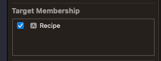

# Load Data

- Create a new playground.
- Add a new data file to `Resources`.




**Resources/foodData.json**

```swift
[
    {
        "id": 1,
        "title": "Flan",
        "description": "What is this thing we call a flan?"
    }
]
```

**ModelData**

```swift
//
//  ModelData.swift
//  PartyFood
//
//  Created by jrasmusson on 2022-06-15.
//

import Foundation

struct FoodItem: Hashable, Codable, Identifiable {
    let id: Int
    let title: String
    let description: String
}

final class ModelData: ObservableObject {
    var foodItems: [FoodItem] = load("foodData.json")
}

func load<T: Decodable>(_ filename: String) -> T {
    let data: Data

    guard let file = Bundle.main.url(forResource: filename, withExtension: nil)
    else {
        fatalError("Couldn't find \(filename) in main bundle.")
    }

    do {
        data = try Data(contentsOf: file)
    } catch {
        fatalError("Couldn't load \(filename) from main bundle:\n\(error)")
    }

    do {
        let decoder = JSONDecoder()
        return try decoder.decode(T.self, from: data)
    } catch {
        fatalError("Couldn't parse \(filename) as \(T.self):\n\(error)")
    }
}
```

**App**

```swift
@main
struct PartyFoodApp: App {
    @StateObject private var modelData = ModelData()

    var body: some Scene {
        WindowGroup {
            ContentView()
                .environmentObject(modelData)
        }
    }
}
```

**ContentView**

```swift
import SwiftUI

struct ContentView: View {
    @EnvironmentObject var modelData: ModelData

    var body: some View {
        NavigationStack {
            List(modelData.foodItems) { item in
                NavigationLink(value: item) {
                    Text(item.title)
                }
            }
            .navigationTitle("Party Food")
            .navigationDestination(for: FoodItem.self) { item in
                FoodDetailView(item: item)
            }
        }
    }
}

struct ContentView_Previews: PreviewProvider {
    static var previews: some View {
        ContentView()
            .environmentObject(ModelData())
    }
}
```

**FoodDetailView**

```swift
import SwiftUI

struct FoodDetailView: View {
    let item: FoodItem

    var body: some View {
        VStack {
            Text(item.title)
                .font(.headline)
            Text(item.description)
                .font(.subheadline)
            Spacer()
        }
    }
}

struct FoodDetailView_Previews: PreviewProvider {
    static var previews: some View {
        let md = ModelData()
        FoodDetailView(item: md.foodItems[0])
    }
}
```