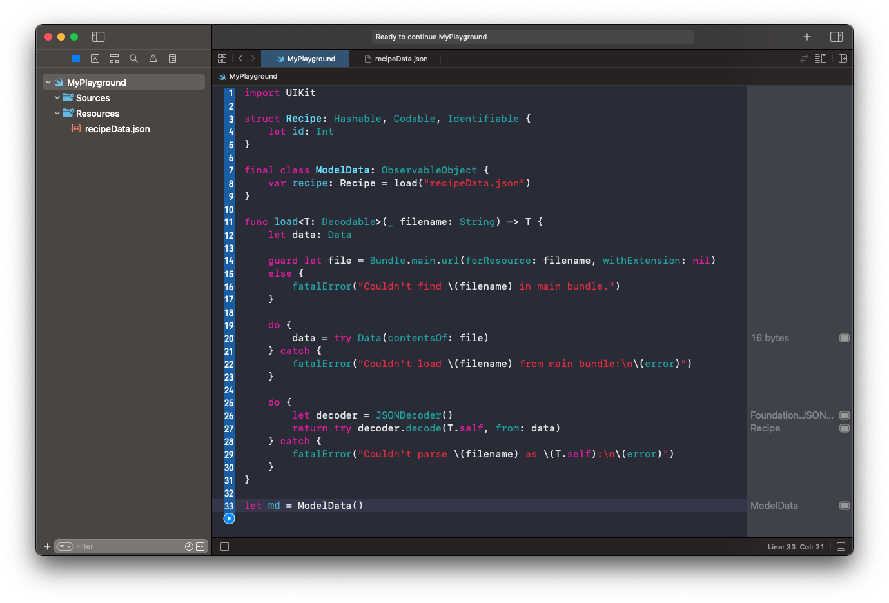

# Load Data

- Create a new playground.
- Add a new data file to `Resources`.



**Resources/recipeData.json**

```swift
{
    "id": 1
}
```

**ModelData**

```swift
import UIKit

struct Recipe: Hashable, Codable, Identifiable {
    let id: Int
}

final class ModelData: ObservableObject {
    var recipe: Recipe = load("recipeData.json")
}

func load<T: Decodable>(_ filename: String) -> T {
    let data: Data

    guard let file = Bundle.main.url(forResource: filename, withExtension: nil)
    else {
        fatalError("Couldn't find \(filename) in main bundle.")
    }

    do {
        data = try Data(contentsOf: file)
    } catch {
        fatalError("Couldn't load \(filename) from main bundle:\n\(error)")
    }

    do {
        let decoder = JSONDecoder()
        return try decoder.decode(T.self, from: data)
    } catch {
        fatalError("Couldn't parse \(filename) as \(T.self):\n\(error)")
    }
}

let md = ModelData()
```

# Examples

## Struct

**recipeData.json**

```swift
struct Recipe: Hashable, Codable, Identifiable {
    let id: Int
    let name: String
    let ingredients: [String]
}
```

**Recipe**

```swift
{
    "id": 1,
    "name": "Apple Pie",
    "ingredients": [
        "3/4 cup white suguar",
        "2 tablespoons all-purpose flour"
    ],
}
```

## Array

**Category**

```swift
struct Category: Codable {
    let name: String
    let recipies: [Recipe]
}
```

**categoryData.json**

```swift
[
    {
        "name": "Desserts",
        "recipies": [
            {
                "id": 1,
                "name": "Apple Pie",
                "ingredients": [
                    "3/4 cup white suguar",
                    "2 tablespoons all-purpose flour"
                ],
                "relatedRecipes": [
                    "Baklava"
                ]
            }
        ]
    }
]
```


