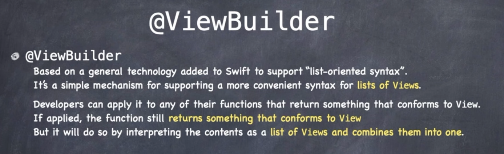
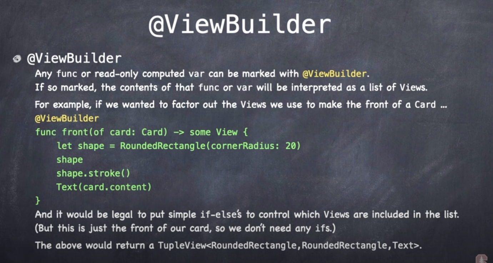
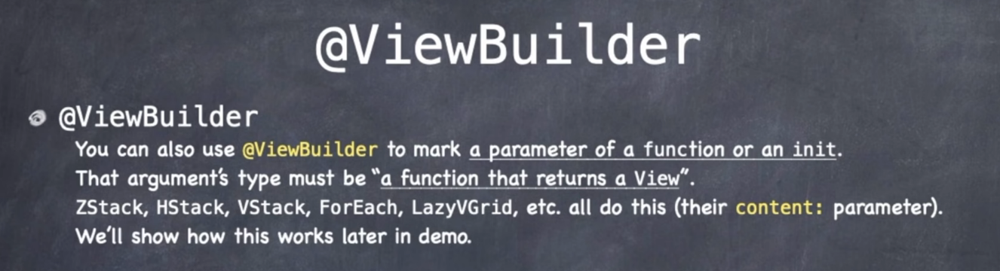

# ViewBuilder

## Stanford

What exactly is that argument being passed to `ZStack, ForEach, LazyVGrid` etc?. It is a list of views.

How do we take a function that returns a View and make it be able to be a list of views instead?

Developers can apply this keyword `@ViewBuilder` to any function that they want to return one of these ViewBuilder list of Views.

It will return a View, but it will do so by interpretting the contents as a list of Views and combine them into one.

All putting `@ViewBuilder` on a function or an argument does is change the way the compiler looks at what's in the curly braces of that function and interpret it as this list of views.

It still combines the list of views and rolls them up into one big view, but it does that combination behind the scenes.

Now that view that it creates is usually going to be called a `tuple` or something... bottom line is we don't know or care what it is going to create. It's a private API. It's just some View.

So any function can be marked with `@ViewBuilder`.

  
### Links that help
- [Stanford](https://youtu.be/ayQl_F_uMS4?t=4899)