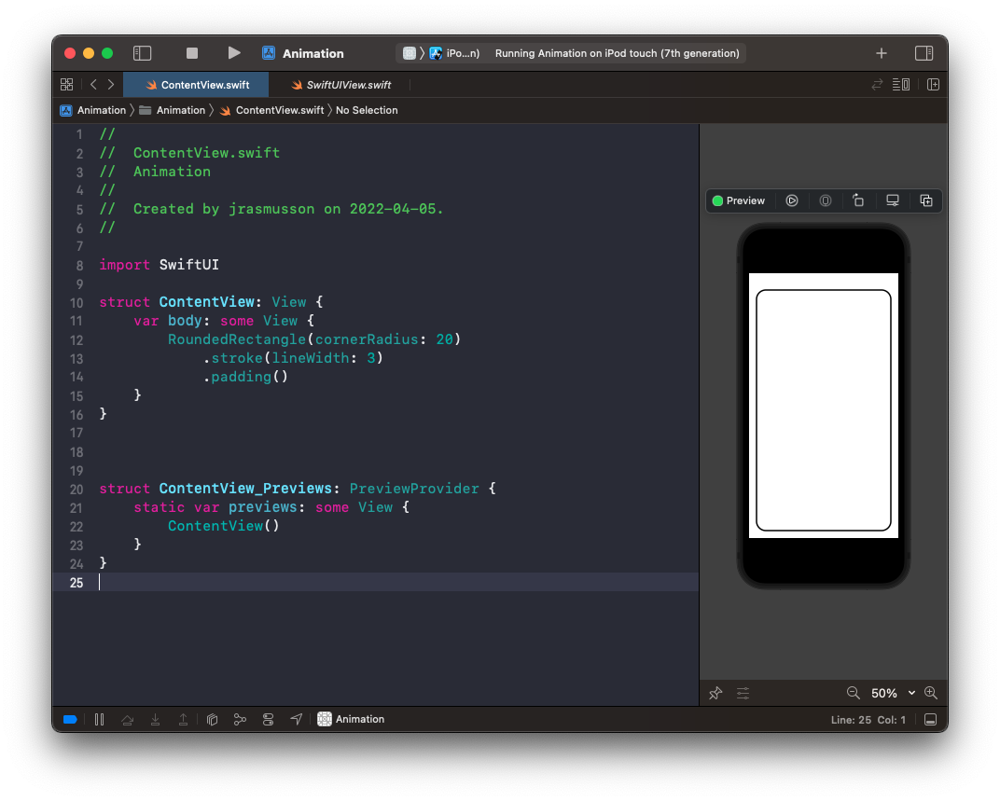
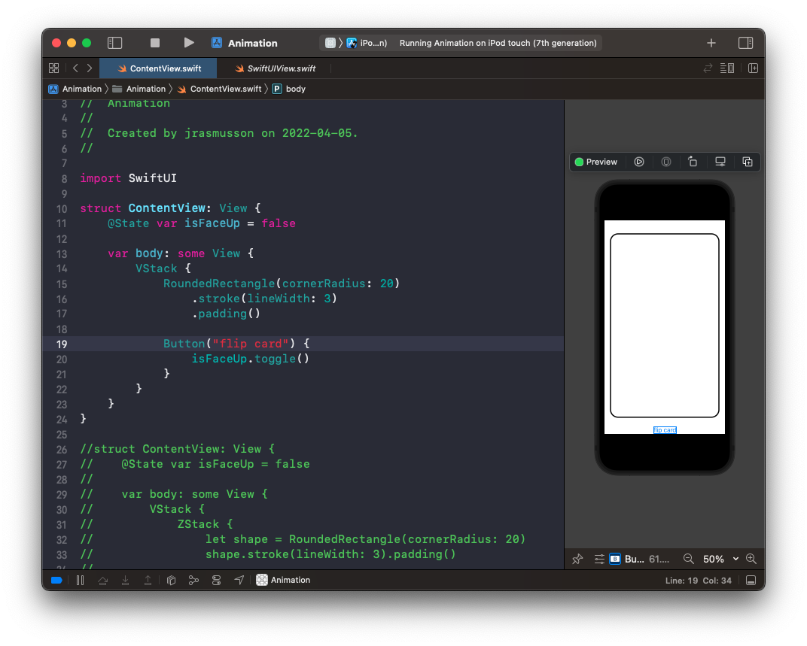
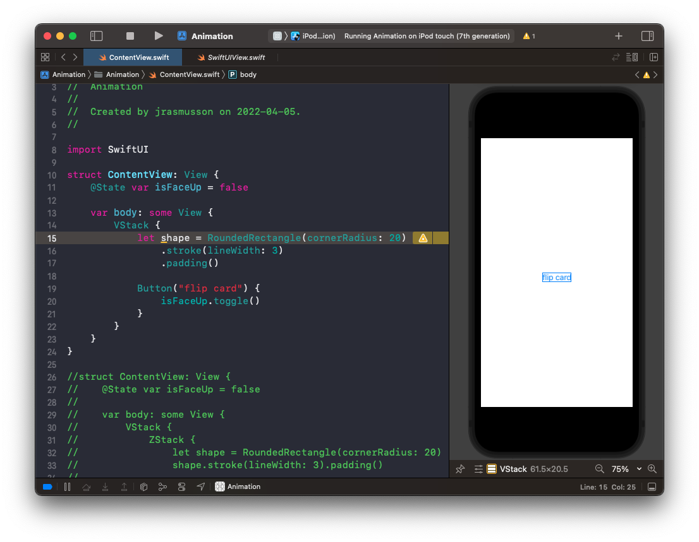
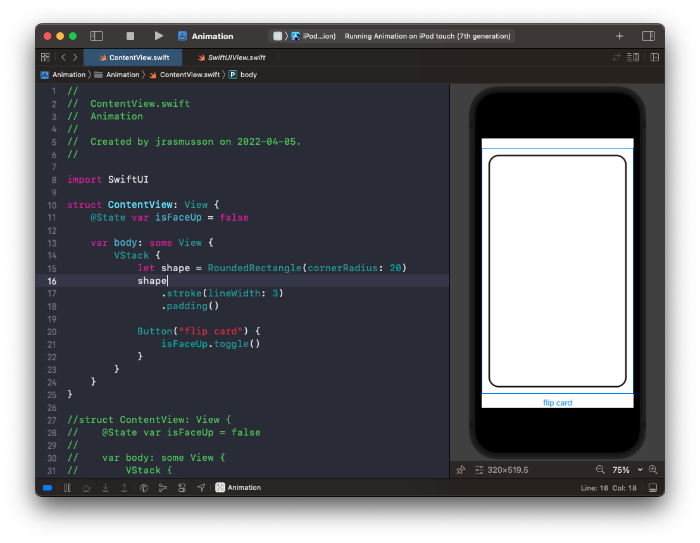
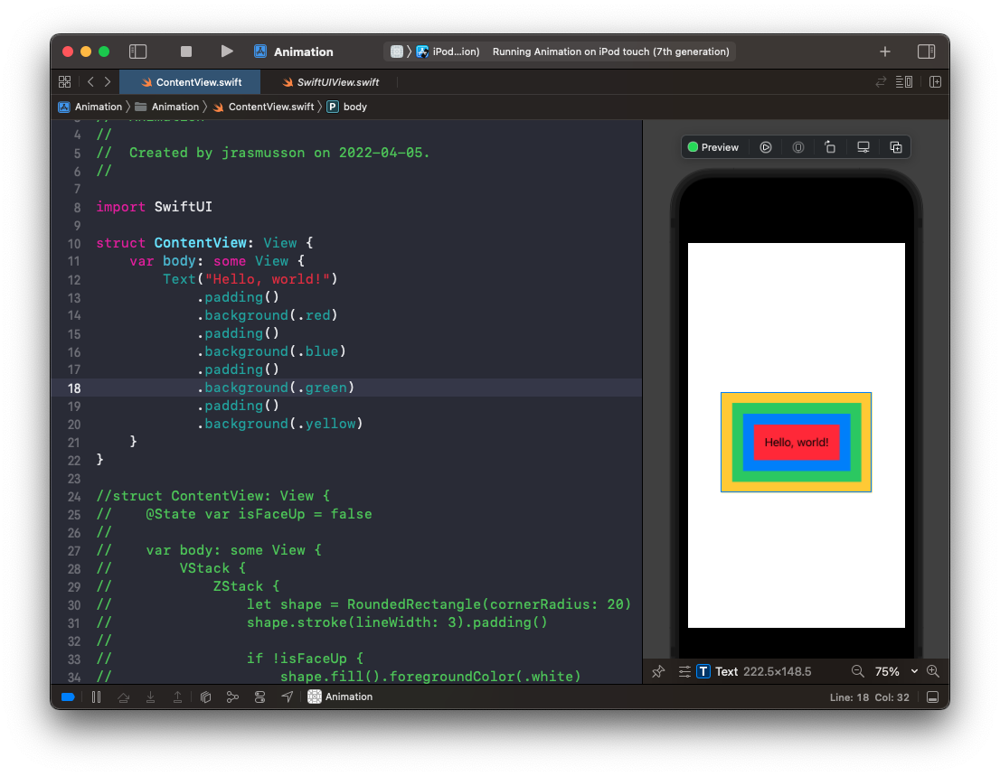
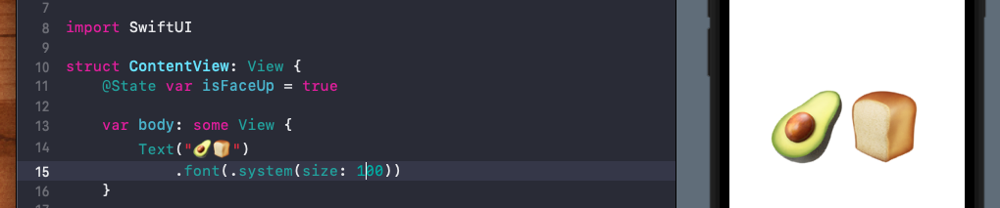
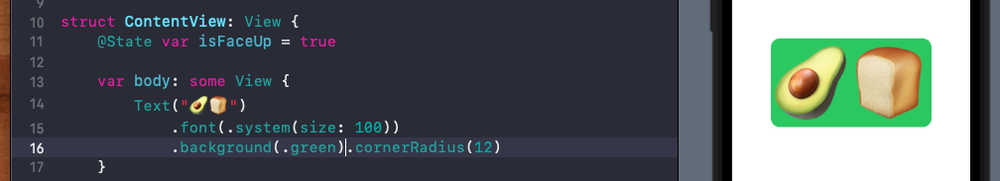
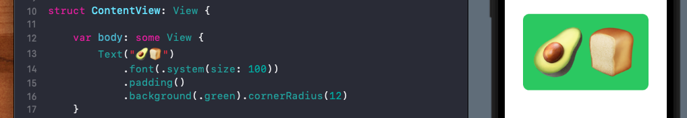
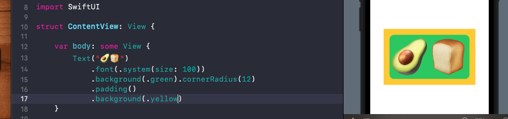

# Defining a var does not return a view

Say you define a rectangle.



And here is a rectangle with a button embedded in a `VStack`.



And then you make it a var. It disappears 🎩!



That's because you are no longer returning a view. You are defining a `var`. To make it return the view add a modifier, thereby returning a new view. Then all will work out.



# Modifier order matters

When learning SwiftUI, a good mental trick to help understand what's going on is that every time you all a view modifier you get a new view.

> This isn't what actually happens as that wouldn't be performant. But it's a useful mental model.

The second thing to appreciate is that the order you add the modifiers matters.



Here you can see the outmost yellow modifier is the one that shades the outmost layer of the view. So if you are ever confused about why you are going `.fill()` and it covers your entire view (and not the smaller view inside) check your view modifier order.

## Padding and background

Where you really notice this is with padding and background.

Here is some plain text.



Let's see what happens when we add some background to it.



No surprise. Adds the background nicely around the text. But watch what happens when we add padding before and after.

Adding the padding before puts padding around the text, and then applies the background to the whole thing.



Putting the padding after adds padding around the text and the background.



So just be aware order matters.

```swift
var body: some View {
    Text("🥑🍞")
        .font(.system(size: 100))
        .background(.green).cornerRadius(12)
        .padding()
        .background(.yellow)
}
```


### Link

- [Why modifer order matters](https://www.hackingwithswift.com/books/ios-swiftui/why-modifier-order-matters)