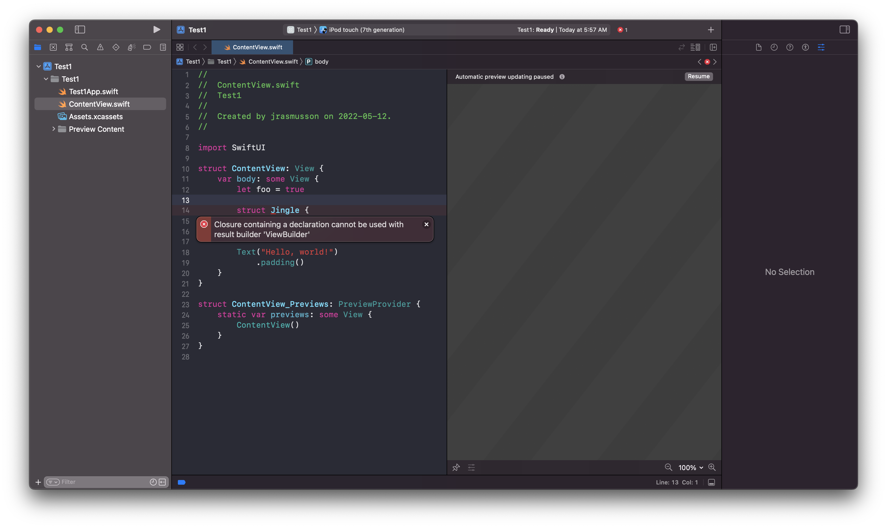

# Function Builders

You can only type certain syntax when creating a view:



This is because SwiftUI uses something called a function builder to define an attribute struct called `@ViewBuilder`.

```swift
public protocol View {
    associatedtype Body : View
    @ViewBuilder var body: Self.Body { get }
}
```

That can convert a collection of views like this.

```swiuft
VStack {
    Text("Hi")
    Text("Hi")
}
```

Into a tuple of views that SwiftUI can use to render. It is really syntactical sugar that works like this:

## An example


To make all this work we need to define a `struct` marked with `@_functionBuilder` (renamed `@resultBuilder`) and include a static method called `buildBlock`.

```swift
@resultBuilder
struct StringCharacterCounterBuilder {
  static func buildBlock(_ strings: String...) -> [Int] {
    return strings.map { $0.count }
  }
}
```

Then to use it we create a class with an initializer that takes an argument marked with our function builder:

```swift
import UIKit

@resultBuilder
struct StringCharacterCounterBuilder {
    static func buildBlock(_ strings: String...) -> [Int] {
        return strings.map { $0.count }
    }
}

class CharacterCounter {
    let counterArray: [Int]

    init(@StringCharacterCounterBuilder _ content: () -> [Int]) {
        counterArray = content()
    }

    func showCounts() {
        counterArray.forEach { print($0) }
    }
}

let characterCounts = CharacterCounter {
    "Andy"
    "Ibanez"
    "Collects Pullip"
}

characterCounts.showCounts()
```


### Links that help

- [Article1](https://www.andyibanez.com/posts/understanding-function-builders/)
- [Article2](https://medium.com/@carson.katri/create-your-first-function-builder-in-5-minutes-b4a717390671)

