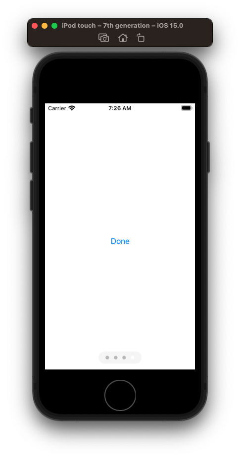
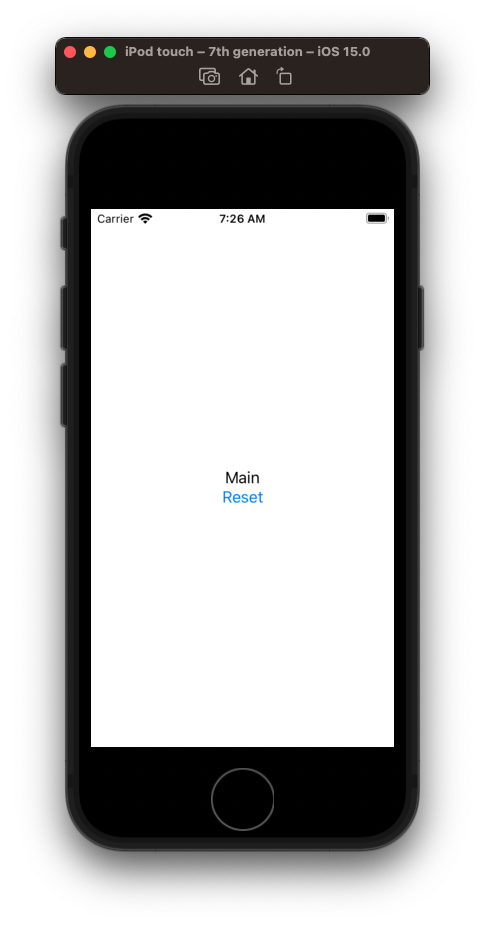

# How to navigate from one view flow into another

Say you want to go through some onboarding flow.



And once complete switch views over to your main app.



Define an `ObservableObject` called `AppState` and pass it down as an `EnvironmentObject` to all your subviews.

```swift
import SwiftUI

// Define your observable
class AppState: ObservableObject {
    @Published var hasOnboarded: Bool

    init(hasOnboarded: Bool) {
        self.hasOnboarded = hasOnboarded
    }
}

// Load it into your app
@main
struct DemoApp: App {
    @ObservedObject var appState = AppState(hasOnboarded: false)
    
    var body: some Scene {
        WindowGroup {
            if appState.hasOnboarded {
                MainFlowView()
                    .environmentObject(appState)
            } else {
                OnboardingFlowView()
                    .environmentObject(appState)
            }
        }
    }
}

struct OnboardingFlowView: View {
    @EnvironmentObject var appState: AppState
    
    var body: some View {
        TabView {
            Text("First")
            Text("Second")
            Text("Third")
            Button("Done") {
                appState.hasOnboarded = true // change
            }
        }
        .tabViewStyle(.page)
        .indexViewStyle(.page(backgroundDisplayMode: .always))
    }
}

struct MainFlowView: View {
    @EnvironmentObject var appState: AppState
    
    var body: some View {
        VStack {
            Text("Main")
            Button("Reset") {
                appState.hasOnboarded = false // change
            }
        }
    }
}
```


