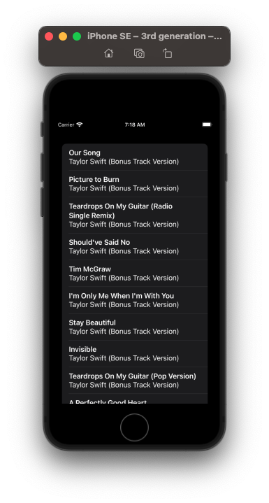

# Async Await

A more SwiftUI oriented way of loading data is to use `async` and `await`:

```swift
import SwiftUI

struct ContentView: View {

    var body: some View {
        List(results, id: \.trackId) { item in
        	...
        }
        .task {
            await loadData()
        }
    }

    func loadData() async {
		...
    }
}
```

## Full source

**ContentView**

```swift
import SwiftUI

struct ContentView: View {
    @State private var results = [Result]()

    var body: some View {
        List(results, id: \.trackId) { item in
            VStack(alignment: .leading) {
                Text(item.trackName)
                    .font(.headline)
                Text(item.collectionName)
            }
        }
        .task {
            await loadData()
        }
    }

    func loadData() async {
        guard let url = URL(string: "https://itunes.apple.com/search?term=taylor+swift&entity=song") else {
            print("Invalid URL")
            return
        }

        do {
            let (data, _) = try await URLSession.shared.data(from: url)

            if let decodedResponse = try? JSONDecoder().decode(Response.self, from: data) {
                results = decodedResponse.results
            }
        } catch {
            print("Invalid data")
        }
    }
}

struct ContentView_Previews: PreviewProvider {
    static var previews: some View {
        ContentView()
    }
}
```

**Response**

```swift
import Foundation

struct Response: Codable {
    var results: [Result]
}

struct Result: Codable {
    var trackId: Int
    var trackName: String
    var collectionName: String
}
```



### Links that help
- [Example](https://www.hackingwithswift.com/books/ios-swiftui/sending-and-receiving-codable-data-with-urlsession-and-swiftui)