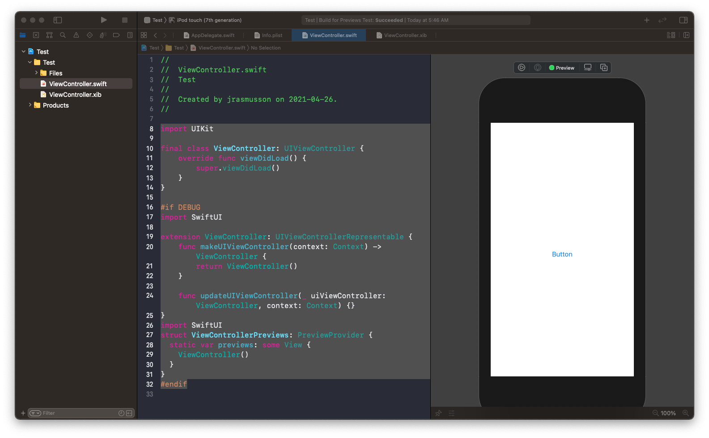

# Previews

## View Controllers

```swift
//
//  ViewController.swift
//  Test
//
//  Created by jrasmusson on 2021-04-26.
//

import UIKit

final class ViewController: UIViewController {

    let button = UIButton()
    
    override func viewDidLoad() {
        super.viewDidLoad()
        
        button.translatesAutoresizingMaskIntoConstraints = false
        button.backgroundColor = .systemBlue
        button.setTitle("Button", for: .normal)
        view.addSubview(button)
        
        NSLayoutConstraint.activate([
            button.centerXAnchor.constraint(equalTo: view.centerXAnchor),
            button.centerYAnchor.constraint(equalTo: view.centerYAnchor),
        ])
    }
}

#if DEBUG
import SwiftUI

extension ViewController: UIViewControllerRepresentable {
    func makeUIViewController(context: Context) -> ViewController {
        return ViewController()
    }
    
    func updateUIViewController(_ uiViewController: ViewController, context: Context) {}
}
import SwiftUI
struct ViewControllerPreviews: PreviewProvider {
  static var previews: some View {
    ViewController()
  }
}
#endif
```


## Nibs

### View Controller

Exact same. Can instantiate view controller programmatically.

```swift
import UIKit

final class ViewController: UIViewController {
    override func viewDidLoad() {
        super.viewDidLoad()        
    }
}

#if DEBUG
import SwiftUI

extension ViewController: UIViewControllerRepresentable {
    func makeUIViewController(context: Context) -> ViewController {
        return ViewController()
    }
    
    func updateUIViewController(_ uiViewController: ViewController, context: Context) {}
}
import SwiftUI
struct ViewControllerPreviews: PreviewProvider {
  static var previews: some View {
    ViewController()
  }
}
#endif
```




