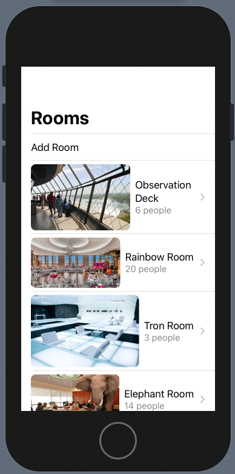
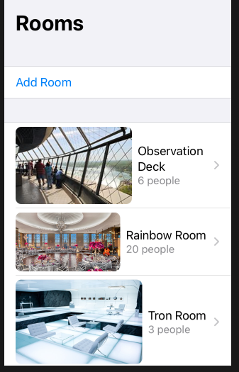

# Rooms

## Views

`View` is a type in Swift that represents your app's user interface and provides modifiers that you use to configure views.


```swift
 struct MyView: View {
     var body: some View {
         Text("Hello, World!")
     }
 }
```

To create a view you implement the `View` protocol which returns a single computed var of type `@ViewBuilder`.

```swift
public protocol View {

    associatedtype Body : View

    @ViewBuilder var body: Self.Body { get }
}
```

What's different about a `View` compared to a `UIView` is that views:

- inherit no stored properties
- are allocated on the stack
- are passed by value
- and require no additional allocation or reference counting

`View` are a more Swifty, cheap, fast way of building user interfaces. You can create as many as you want with little to no overhead.

# Data

## @State - view

In SwiftUI data is either a source of truth or derived.

An example of a derived peice of data would be one passed into a view. Where an example of a source of truth would be one using the `@State` attribute.

```swift
struct RoomDetail: View {
    let room: Room
    @State private var zoomed = false    
```

`@State` is a special attribute that SwiftUI looks for and manages on your behalf. When it sees this, it knows to track its state special, and whenever its state changes, it re-renders the view if the views body depends on it.

```swift
struct RoomDetail: View {
    let room: Room
    @State private var zoomed = false
    
    var body: some View {
        Image(room.imageName)
            .aspectRatio(contentMode: zoomed ? .fill: .fit)
    }
}
```

And this is really the beauty of SwiftUI. Because managing dependencies is hard, SwiftUI simplifies dependency management by insisting we have only one entry point into our views - `body`. This greatly simplifies rendering and minimizes the number of bugs.

## @ObserableObject - app

SwiftUI let's you dynamically update any view in your app based on a change in data through the `@ ObserableObject` attribute.

`ObserableObject` uses a combination of state tracking in Swift UI in conjunction with `combine `publishers and subscribers to let any view be notified when a piece of data changes state.

 > Combine: Declarative framework for processing values over time.

```swift
import SwiftUI
import Combine

class RoomStore: ObservableObject {
    @Published var rooms: [Room]
    
    init(rooms: [Room] = []) {
        self.rooms = rooms
    }
}
```

Change

```swift
struct ContentView: View {
    var rooms: [Room] = []
```

To

```swift
struct ContentView: View {
    @ObservedObject var store = RoomStore()
 
struct ContentView_Previews: PreviewProvider {
    static var previews: some View {
        ContentView(store: RoomStore(rooms: testData))
    }
}
```

So now, if our data every changes, due to a UI event, a Timer, or external data refresh, our view will update automatically.

## Broadcasting data events

To see this in action, let's add the capability to add a room and then update the UI to reflect that change.

Right now we are building our list statically like this. Which is great for lists that are entirely data driven.

```swift
List(store.rooms) { room in
    RoomCell(room: room)
}
```

But if we want our lists to be visually dynamic, we can use a `ForEach`.

```swift
List {
    ForEach(store.rooms) { room in
        RoomCell(room: room)
    }
}
```

`ForEach` isn't like a Swift `for each` that loops through the contents of a collection. This `ForEach` returns a `View`.

So now we can add a static element along this `ForEach`.

```swift
List {
    Button(action: addRoom) {
        Text("Add Room")
    }
    ForEach(store.rooms) { room in
        RoomCell(room: room)
    }
}.navigationBarTitle(Text("Rooms"))

func addRoom() {
    store.rooms.append(Room(name: "Hall 2", capacity: 2000))
}
```

Now when we run the app, a new room will be added.



This is an example of Swift UI and the Combine framework updating our UI based on a change in data. Much easier when building lists - no more off-by-one index errors.

Simple example of what we just did is this.

```swift
struct ContentView: View {

    @ObservedObject var model = PostListViewModel()

    var body: some View {
        List(model.posts) { post in
            Text(post.branchname)
        }
    }
}

final class PostListViewModel: ObservableObject {
    init() {
        fetchPosts()
    }
   
    @Published var posts = [Post]()
   
    private func fetchPosts() {
        Webservice().getAllPosts {
            self.posts = $0
        }
    }
}
```

## Adding sections

```swift
NavigationView {
    List {
        Section {
            Button(action: addRoom) {
                Text("Add Room")
            }
        }
        
        Section {
            ForEach(store.rooms) { room in
                RoomCell(room: room)
            }
        }
    }
    .navigationBarTitle(Text("Rooms"))
    .listStyle(GroupedListStyle())
}
```



## Hooking up deletion

```swift
List {
	...                
    Section {
        ForEach(store.rooms) { room in
            RoomCell(room: room)
        }
        .onDelete(perform: delete)
    }
    
func delete(at offsets: IndexSet) {
   store.rooms.remove(atOffsets: offsets)
}

```


## Edit mode

```swift
    .navigationBarItems(trailing: EditButton())
```


### Renamed properties in video

The WWDC video for this app uses from old language. The following properties have been renamed

- NavigationButton > NavigationLink
- @BindableObject > @ObservableObject
- @ObjectBinding > @ObservedObject

### Links that help
* [Introducint SwiftUI: Building Your First App](https://developer.apple.com/videos/play/wwdc2019/204/)
