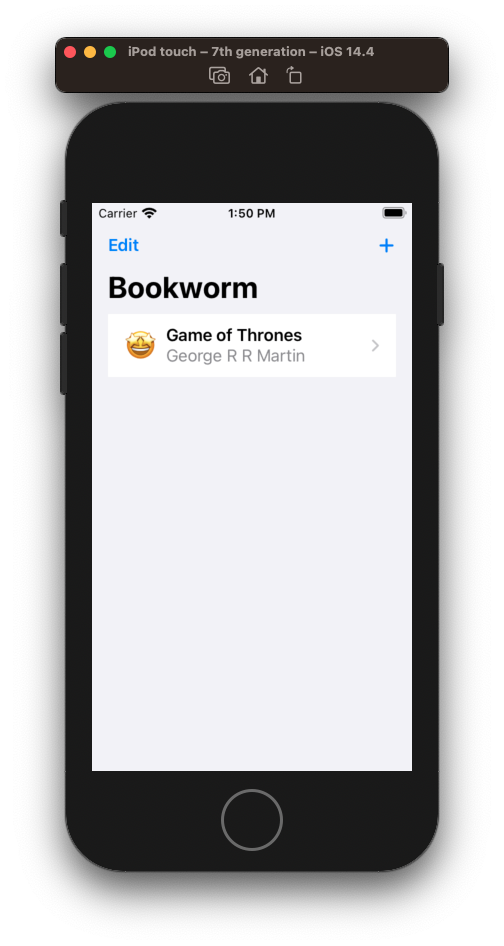
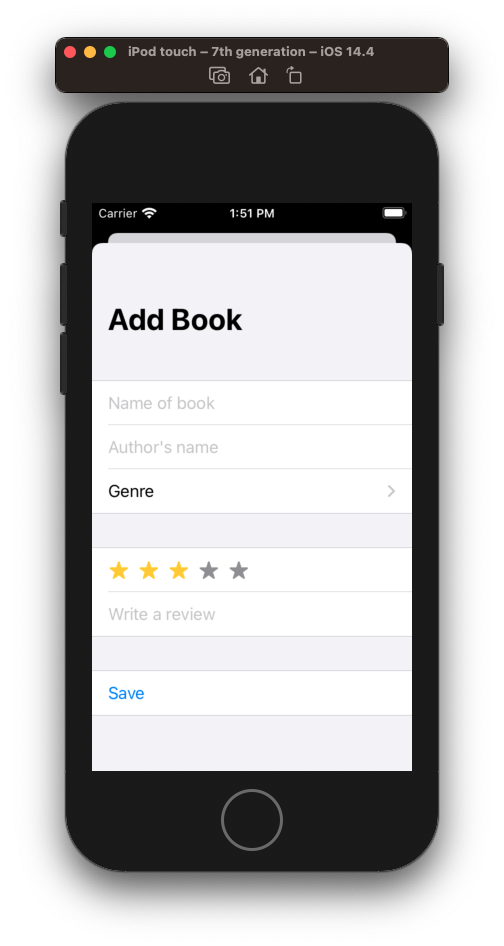
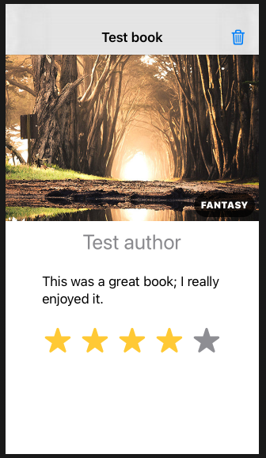

# Bookworm


**ContentView.swift**

```swift
//
//  ContentView.swift
//  Bookworm
//
//  Created by jrasmusson on 2021-05-07.
//

import SwiftUI
import CoreData

struct ContentView: View {
    
    @Environment(\.managedObjectContext) var moc
    @FetchRequest(entity: Book.entity(), sortDescriptors: []) var books: FetchedResults<Book>

    @State private var showingAddScreen = false
    
    var body: some View {
         NavigationView {
            List {
                ForEach(books, id: \.self) { book in
                    NavigationLink(destination: DetailView(book: book)) {
                        EmojiRatingView(rating: book.rating)
                            .font(.largeTitle)

                        VStack(alignment: .leading) {
                            Text(book.title ?? "Unknown Title")
                                .font(.headline)
                            Text(book.author ?? "Unknown Author")
                                .foregroundColor(.secondary)
                        }
                    }
                }
                .onDelete(perform: deleteBooks)
            }
            .navigationBarTitle("Bookworm")
            .navigationBarItems(leading: EditButton(), trailing: Button(action: {
                self.showingAddScreen.toggle()
            }) {
                Image(systemName: "plus")
            })
            .sheet(isPresented: $showingAddScreen) {
                AddBookView().environment(\.managedObjectContext, self.moc)
            }
        }
    }
    
    func deleteBooks(at offsets: IndexSet) {
        for offset in offsets {
            // find this book in our fetch request
            let book = books[offset]

            // delete it from the context
            moc.delete(book)
        }

        // save the context
        try? moc.save()
    }
}

struct ContentView_Previews: PreviewProvider {
    static var previews: some View {
        ContentView().environment(\.managedObjectContext, PersistenceController.preview.container.viewContext)
    }
}
```



**AddBookView.swift**

```swift
//
//  AddBookView.swift
//  Bookworm
//
//  Created by jrasmusson on 2021-05-07.
//

import SwiftUI

struct AddBookView: View {
    @Environment(\.managedObjectContext) var moc
    @Environment(\.presentationMode) var presentationMode
    
    @State private var title = ""
    @State private var author = ""
    @State private var rating = 3
    @State private var genre = ""
    @State private var review = ""
    
    let genres = ["Fantasy", "Horror", "Kids", "Mystery", "Poetry", "Romance", "Thriller"]
    
    var body: some View {
        NavigationView {
            Form {
                Section {
                    TextField("Name of book", text: $title)
                    TextField("Author's name", text: $author)

                    Picker("Genre", selection: $genre) {
                        ForEach(genres, id: \.self) {
                            Text($0)
                        }
                    }
                }

                Section {
                    RatingView(rating: $rating)
                    TextField("Write a review", text: $review)
                }

                Section {
                    Button("Save") {
                        // add the book
                        let newBook = Book(context: self.moc)
                        newBook.title = self.title
                        newBook.author = self.author
                        newBook.rating = Int16(self.rating)
                        newBook.genre = self.genre
                        newBook.review = self.review

                        try? self.moc.save()
                        
                        presentationMode.wrappedValue.dismiss()
                    }
                }
            }
            .navigationBarTitle("Add Book")
        }
    }
}

struct AddBookView_Previews: PreviewProvider {
    static var previews: some View {
        AddBookView()
    }
}
```



```swift
//
//  RatingView.swift
//  Bookworm
//
//  Created by jrasmusson on 2021-05-07.
//

import SwiftUI

struct RatingView: View {
    
    @Binding var rating: Int

    var label = ""

    var maximumRating = 5

    var offImage: Image?
    var onImage = Image(systemName: "star.fill")

    var offColor = Color.gray
    var onColor = Color.yellow
    
    func image(for number: Int) -> Image {
        if number > rating {
            return offImage ?? onImage
        } else {
            return onImage
        }
    }
    
    var body: some View {
        HStack {
            if label.isEmpty == false {
                Text(label)
            }

            ForEach(1..<maximumRating + 1) { number in
                self.image(for: number)
                    .foregroundColor(number > self.rating ? self.offColor : self.onColor)
                    .onTapGesture {
                        self.rating = number
                    }
            }
        }
    }
}

struct RatingView_Previews: PreviewProvider {
    static var previews: some View {
        RatingView(rating: .constant(4))
    }
}
```


**EmojiRatingView.swift**

```swift
//
//  EmojiRatingView.swift
//  Bookworm
//
//  Created by jrasmusson on 2021-05-07.
//

import SwiftUI

struct EmojiRatingView: View {
    let rating: Int16

    var body: some View {
        switch rating {
        case 1:
            return Text("💩")
        case 2:
            return Text("😞")
        case 3:
            return Text("😏")
        case 4:
            return Text("😀")
        default:
            return Text("🤩")
        }
    }
}

struct EmojiRatingView_Previews: PreviewProvider {
    static var previews: some View {
        EmojiRatingView(rating: 3)
    }
}
```


**DetailView.swift**

```swift
//
//  DetailView.swift
//  Bookworm
//
//  Created by jrasmusson on 2021-05-07.
//

import SwiftUI
import CoreData

struct DetailView: View {
    
    let book: Book
    
    @Environment(\.managedObjectContext) var moc
    @Environment(\.presentationMode) var presentationMode
    @State private var showingDeleteAlert = false
    
    var body: some View {
        GeometryReader { geometry in
            VStack {
                ZStack(alignment: .bottomTrailing) {
                    Image(self.book.genre ?? "Fantasy")
                        .frame(maxWidth: geometry.size.width)

                    Text(self.book.genre?.uppercased() ?? "FANTASY")
                        .font(.caption)
                        .fontWeight(.black)
                        .padding(8)
                        .foregroundColor(.white)
                        .background(Color.black.opacity(0.75))
                        .clipShape(Capsule())
                        .offset(x: -5, y: -5)
                }
                
                Text(self.book.author ?? "Unknown author")
                    .font(.title)
                    .foregroundColor(.secondary)

                Text(self.book.review ?? "No review")
                    .padding()

                RatingView(rating: .constant(Int(self.book.rating)))
                    .font(.largeTitle)

                Spacer()
            }
        }
        .navigationBarTitle(Text(book.title ?? "Unknown Book"), displayMode: .inline)
        .alert(isPresented: $showingDeleteAlert) {
            Alert(title: Text("Delete book"), message: Text("Are you sure?"), primaryButton: .destructive(Text("Delete")) {
                    self.deleteBook()
                }, secondaryButton: .cancel()
            )
        }
        .navigationBarItems(trailing: Button(action: {
            self.showingDeleteAlert = true
        }) {
            Image(systemName: "trash")
        })
    }
    
    func deleteBook() {
        moc.delete(book)

        // uncomment this line if you want to make the deletion permanent
        // try? self.moc.save()
        presentationMode.wrappedValue.dismiss()
    }
}

struct DetailView_Previews: PreviewProvider {
    static let moc = NSManagedObjectContext(concurrencyType: .mainQueueConcurrencyType)

    static var previews: some View {
        let book = Book(context: moc)
        book.title = "Test book"
        book.author = "Test author"
        book.genre = "Fantasy"
        book.rating = 4
        book.review = "This was a great book; I really enjoyed it."

        return NavigationView {
            DetailView(book: book)
        }
    }
}
```



### Links that help

- [Bookworm Intro](https://www.hackingwithswift.com/books/ios-swiftui/bookworm-introduction)