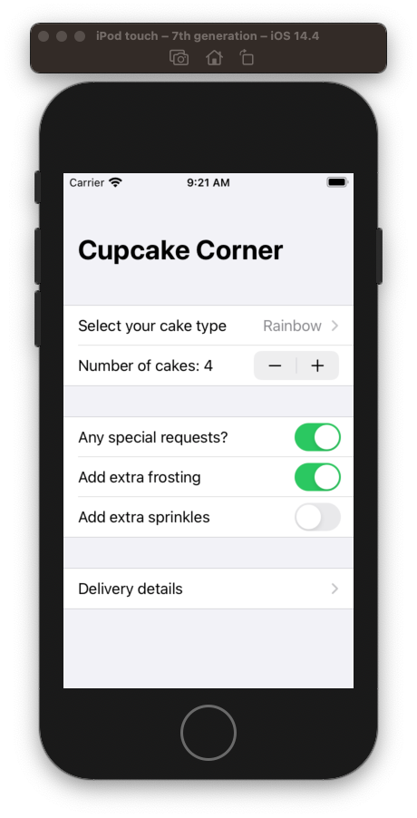
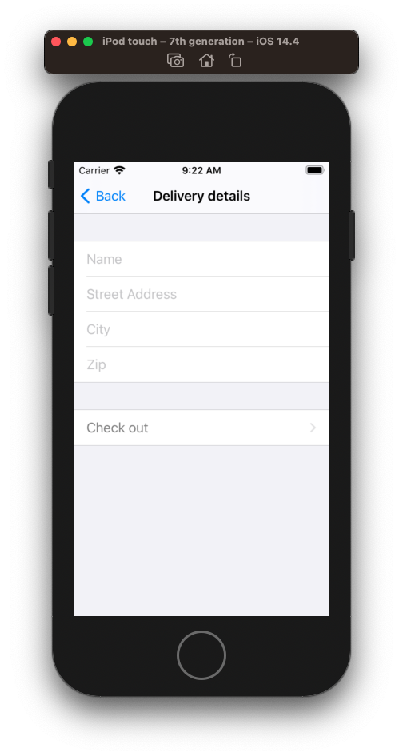
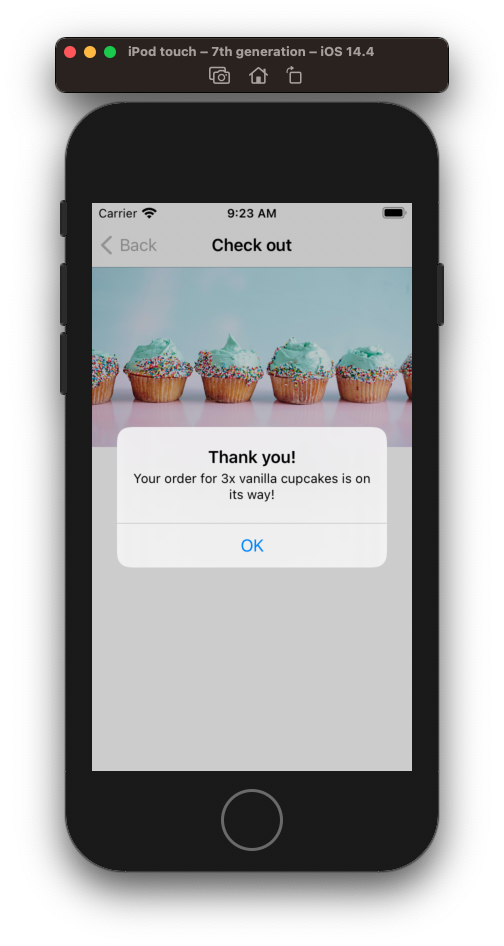

# Cupcake Corner

## Adding Codable conformance for @Published properties

Property wrappers like `@Published` aren't by default `Codeable`. We need to do some extra work.

```swift
class User: ObservableObject, Codable {
    @Published var name = "Paul Hudson"
    
    enum CodingKeys: CodingKey {
        case name
    }
    
    required init(from decoder: Decoder) throws {
        let container = try decoder.container(keyedBy: CodingKeys.self)
        name = try container.decode(String.self, forKey: .name)
    }
    
    func encode(to encoder: Encoder) throws {
        var container = encoder.container(keyedBy: CodingKeys.self)
        try container.encode(name, forKey: .name)
    }
}
```

## Sending and receiving Codable data with URLSession and SwiftUI

```swift
struct Response: Codable {
    var results: [Result]
}

struct Result: Codable {
    var trackId: Int
    var trackName: String
    var collectionName: String
}

struct ContentView: View {
    @State private var results = [Result]()

    var body: some View {
        List(results, id: \.trackId) { item in
            VStack(alignment: .leading) {
                Text(item.trackName)
                    .font(.headline)
                Text(item.collectionName)
            }
        }.onAppear(perform: loadData)
    }
    
    func loadData() {
        guard let url = URL(string: "https://itunes.apple.com/search?term=Tron&entity=song") else {
            print("Invalid URL")
            return
        }
        
        let request = URLRequest(url: url)
        
        URLSession.shared.dataTask(with: request) { data, response, error in
            if let data = data {
                if let decodedResponse = try? JSONDecoder().decode(Response.self, from: data) {
                    // we have good data – go back to the main thread
                    DispatchQueue.main.async {
                        // update our UI
                        self.results = decodedResponse.results
                    }

                    // everything is good, so we can exit
                    return
                }
            }
        }.resume()
        
    }
}
```


## Full source

**Order.swift**

```swift
final class Order: ObservableObject, Codable {
    static let types = ["Vanilla", "Strawberry", "Chocolate", "Rainbow"]

    @Published var type = 0
    @Published var quantity = 3
    
    @Published var specialRequestEnabled = false {
        didSet {
            if specialRequestEnabled == false {
                extraFrosting = false
                addSprinkles = false
            }
        }
    }
    
    @Published var extraFrosting = false
    @Published var addSprinkles = false
    
    @Published var name = ""
    @Published var streetAddress = ""
    @Published var city = ""
    @Published var zip = ""
    
    var hasValidAddress: Bool {
        if name.isEmpty || streetAddress.isEmpty || city.isEmpty || zip.isEmpty {
            return false
        }

        return true
    }
    
    var cost: Double {
        // $2 per cake
        var cost = Double(quantity) * 2

        // complicated cakes cost more
        cost += (Double(type) / 2)

        // $1/cake for extra frosting
        if extraFrosting {
            cost += Double(quantity)
        }

        // $0.50/cake for sprinkles
        if addSprinkles {
            cost += Double(quantity) / 2
        }

        return cost
    }
    
    enum CodingKeys: CodingKey {
        case type, quantity, extraFrosting, addSprinkles, name, streetAddress, city, zip
    }

    func encode(to encoder: Encoder) throws {
        var container = encoder.container(keyedBy: CodingKeys.self)

        try container.encode(type, forKey: .type)
        try container.encode(quantity, forKey: .quantity)

        try container.encode(extraFrosting, forKey: .extraFrosting)
        try container.encode(addSprinkles, forKey: .addSprinkles)

        try container.encode(name, forKey: .name)
        try container.encode(streetAddress, forKey: .streetAddress)
        try container.encode(city, forKey: .city)
        try container.encode(zip, forKey: .zip)
    }
    
    init(from decoder: Decoder) throws {
        let container = try decoder.container(keyedBy: CodingKeys.self)

        type = try container.decode(Int.self, forKey: .type)
        quantity = try container.decode(Int.self, forKey: .quantity)

        extraFrosting = try container.decode(Bool.self, forKey: .extraFrosting)
        addSprinkles = try container.decode(Bool.self, forKey: .addSprinkles)

        name = try container.decode(String.self, forKey: .name)
        streetAddress = try container.decode(String.self, forKey: .streetAddress)
        city = try container.decode(String.self, forKey: .city)
        zip = try container.decode(String.self, forKey: .zip)
    }
    
    init() { }
}
```

**ContentView.swift**

```swift
struct ContentView: View {

    @ObservedObject var order = Order() // initialized

    var body: some View {
        NavigationView {
            Form {
                Section {
                    Picker("Select your cake type", selection: $order.type) {
                        ForEach(0..<Order.types.count) {
                            Text(Order.types[$0])
                        }
                    }

                    Stepper(value: $order.quantity, in: 3...20) {
                        Text("Number of cakes: \(order.quantity)")
                    }
                }
                
                Section {
                    Toggle(isOn: $order.specialRequestEnabled.animation()) {
                        Text("Any special requests?")
                    }

                    if order.specialRequestEnabled {
                        Toggle(isOn: $order.extraFrosting) {
                            Text("Add extra frosting")
                        }

                        Toggle(isOn: $order.addSprinkles) {
                            Text("Add extra sprinkles")
                        }
                    }
                }
                
                Section {
                    NavigationLink(destination: AddressView(order: order)) {
                        Text("Delivery details")
                    }
                }
            }
            .navigationBarTitle("Cupcake Corner")
        }
    }
    
}
```




**AddressView.shift**

```swift
struct AddressView: View {
    @ObservedObject var order: Order // passed

    var body: some View {
        Form {
            Section {
                TextField("Name", text: $order.name)
                TextField("Street Address", text: $order.streetAddress)
                TextField("City", text: $order.city)
                TextField("Zip", text: $order.zip)
            }

            Section {
                NavigationLink(destination: CheckoutView(order: order)) {
                    Text("Check out")
                }
            }.disabled(order.hasValidAddress == false)
        }
        .navigationBarTitle("Delivery details", displayMode: .inline)
    }
}

struct AddressView_Previews: PreviewProvider {
    static var previews: some View {
        AddressView(order: Order())
    }
}
```



**Checkout.swift**

```swift
//
//  CheckoutView.swift
//  CupCake
//
//  Created by jrasmusson on 2021-05-07.
//

import SwiftUI

struct CheckoutView: View {
    @ObservedObject var order: Order // passed

    @State private var confirmationMessage = ""
    @State private var showingConfirmation = false
    
    var body: some View {
        GeometryReader { geo in
            ScrollView {
                VStack {
                    Image("cupcakes")
                        .resizable()
                        .scaledToFit()
                        .frame(width: geo.size.width)

                    Text("Your total is $\(self.order.cost, specifier: "%.2f")")
                        .font(.title)

                    Button("Place Order") {
                        placeOrder()
                    }
                    .padding()
                }
            }
        }
        .navigationBarTitle("Check out", displayMode: .inline)
        .alert(isPresented: $showingConfirmation) {
            Alert(title: Text("Thank you!"), message: Text(confirmationMessage), dismissButton: .default(Text("OK")))
        }
    }
    
    func placeOrder() {
        guard let encoded = try? JSONEncoder().encode(order) else {
            print("Failed to encode order")
            return
        }
        
        let url = URL(string: "https://reqres.in/api/cupcakes")!
        var request = URLRequest(url: url)
        request.setValue("application/json", forHTTPHeaderField: "Content-Type")
        request.httpMethod = "POST"
        request.httpBody = encoded
        
        URLSession.shared.dataTask(with: request) { data, response, error in
            
            guard let data = data else {
                print("No data in response: \(error?.localizedDescription ?? "Unknown error").")
                return
            }

            if let decodedOrder = try? JSONDecoder().decode(Order.self, from: data) {
                self.confirmationMessage = "Your order for \(decodedOrder.quantity)x \(Order.types[decodedOrder.type].lowercased()) cupcakes is on its way!"
                self.showingConfirmation = true
            } else {
                print("Invalid response from server")
            }
            
        }.resume()
    }

}

struct CheckoutView_Previews: PreviewProvider {
    static var previews: some View {
        CheckoutView(order: Order())
    }
}
```



### Links that help

- [Cup Cake Corner](https://www.hackingwithswift.com/books/ios-swiftui/cupcake-corner-introduction)
- [Adding Codable conformance for @Published properties](https://www.hackingwithswift.com/books/ios-swiftui/adding-codable-conformance-for-published-properties)
- [Sending and receiving Codable data with URLSession and SwiftUI](https://www.hackingwithswift.com/books/ios-swiftui/sending-and-receiving-codable-data-with-urlsession-and-swiftui)
