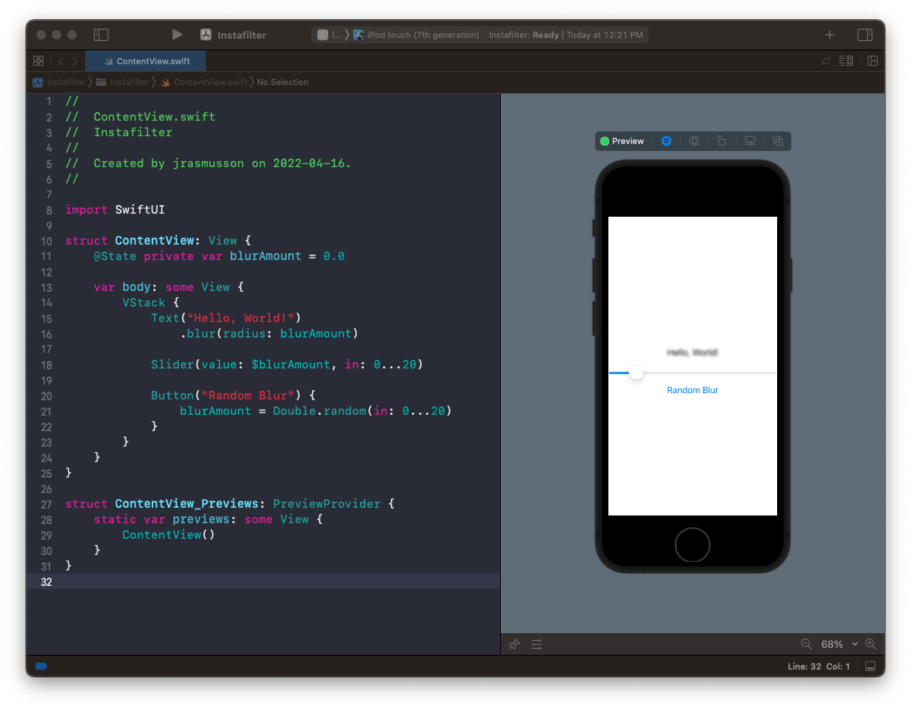
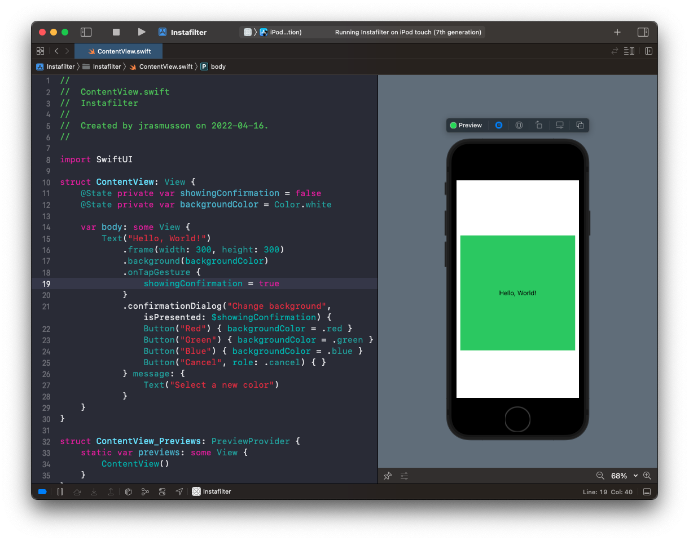
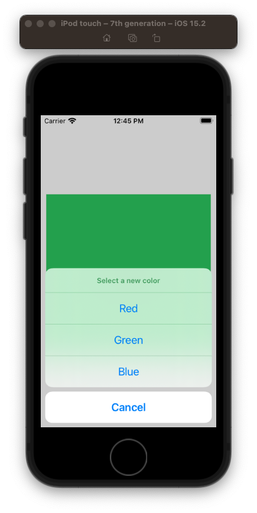

# Instafilter

## Integrating Core Image into SwiftUI

```swift
//
//  ContentView.swift
//  Instafilter
//
//  Created by jrasmusson on 2021-05-07.
//

import SwiftUI
import CoreImage
import CoreImage.CIFilterBuiltins

struct ContentView: View {
    @State private var image: Image?

    var body: some View {
        VStack {
            image?
                .resizable()
                .scaledToFit()
        }
        .onAppear(perform: loadImage)
    }

    func loadImage() {
        guard let inputImage = UIImage(named: "Tron") else { return }
        let beginImage = CIImage(image: inputImage)

        let context = CIContext()
        
        // filter
        let currentFilter = CIFilter.sepiaTone()
        currentFilter.inputImage = beginImage
        currentFilter.intensity = 1
        
        // get a CIImage from our filter or exit if that fails
        guard let outputImage = currentFilter.outputImage else { return }

        // attempt to get a CGImage from our CIImage
        if let cgimg = context.createCGImage(outputImage, from: outputImage.extent) {
            // convert that to a UIImage
            let uiImage = UIImage(cgImage: cgimg)

            // and convert that to a SwiftUI image
            image = Image(uiImage: uiImage)
        }
    }
}

struct ContentView_Previews: PreviewProvider {
    static var previews: some View {
        ContentView()
    }
}
```



```swift
let currentFilter = CIFilter.crystallize()
currentFilter.setValue(beginImage, forKey: kCIInputImageKey)
currentFilter.radius = 10
```



```swift
let currentFilter = CIFilter.pixellate()
currentFilter.inputImage = beginImage
currentFilter.scale = 10
```



### Links that help

- [Instafilter Intro](https://www.hackingwithswift.com/books/ios-swiftui/instafilter-introduction)
- [Integrating Core Image into SwiftUI](https://www.hackingwithswift.com/books/ios-swiftui/integrating-core-image-with-swiftui)
