# Lankmarks

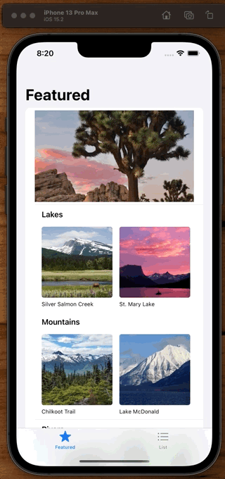

## Handling user input


In order to add a show favorites toggle, the Apple tutorial says:

 

You need to add a `ForEach` to the list in order to combine static and dynamic views. Why is that?

### What happens if we don't add the for each

Here is what happens if we keep the `List` and add the toggle on top:


SwiftUI keeps the `Toogle` and `List` views separate. It treats the static `Toggle` View as a view of its own and embeds the `List` view inside it.

In order to combine dynamic and static views together, we need to do what the tutorial says and transform the landmarks into rows:


which `NavigationView` will then combine into a single view.

## Use an Observable Object for Storage


```swift
final class ModelData: ObservableObject {
    @Published var landmarks: [Landmark] = load("landmarkData.json")
}

struct LandmarkList: View {
    @EnvironmentObject var modelData: ModelData
}

@main
struct LandmarksApp: App {
    @StateObject private var modelData = ModelData()

    var body: some Scene {
        WindowGroup {
            ContentView()
                .environmentObject(modelData)
        }
    }
}
```


## Create a Favorite Button


When you need to set someting `true` or `false` on a binding use `.constant`.

```swift
struct FavoriteButton: View {
    @Binding var isSet: Bool

    var body: some View {
		Text("Hello, World!")    
	}
}

struct FavoriteButton_Previews: PreviewProvider {
    static var previews: some View {
        FavoriteButton(isSet: .constant(true))
    }
}
```

Now this is interesting. Look at how Apple passes in the `modelData` to a subview, while keeping the data powering that view `Landmark` independent as a `var`. Along with the helper `landmarIndex: Int`:


They need the index helper because that is what they use to access the landmark they need as a reference from the `modelData`.

```swift
struct LandmarkDetail: View {
    @EnvironmentObject var modelData: ModelData
    var landmark: Landmark

    var landmarkIndex: Int {
        modelData.landmarks.firstIndex(where: { $0.id == landmark.id })!
    }

	HStack {
        Text(landmark.name).font(.title)
        FavoriteButton(isSet: $modelData.landmarks[landmarkIndex].isFavorite)
    }
```

### Links that help

- [Handling User Input](https://developer.apple.com/tutorials/swiftui/handling-user-input)

## Animating Views and Transitions

### Add Animations to Individual Views


If the view is equatable, SwiftUI can animate the following with `animation(_:)`:

- color
- opacity
- rotation
- size

If the view is no equatable, you can animate on any value change using `animation(_:value:)`.

For example, to rotate and scale the system image on a `Label`, you tie the effect to the stage of the `showDetail` boolean, and then add a `animation(_:value:)` to animate the change of state.

```swift
struct HikeView: View {
    var hike: Hike
    @State private var showDetail = false

    var body: some View {
        Button {
            showDetail.toggle()
        } label: {
            Label("Graph", systemImage: "chevron.right.circle")
                .rotationEffect(.degrees(showDetail ? 90 : 0))
                .scaleEffect(showDetail ? 1.5 : 1)
                .animation(.easeInOut, value: showDetail) //
        }
    }
}
```

The animation modifier applies to all animatable changes withing the views it wraps.


This is an example of an `implicit` animation. One where we apply animations to views via `ViewModifiers` and animate around changes in values.

- [Stanford animation lectecture](https://github.com/jrasmusson/swiftui/blob/main/Stanford/2021/Lecture7/README.md)


### Animate the Effects of State Changes


State change animations are examples of explicit animations. We do those using the function:

- `withAnimation { ... }`

Take the action the causes the state changes and wrap it in this:

```swift
Button {
    withAnimation {
        showDetail.toggle()
    }
}
```

By doing this, all views affected by this change of state will now be included in the animation.


You can slow it down even more by doing this:

```swift
withAnimation(.easeInOut(duration: 4)) {
    showDetail.toggle()
}
```

### Customize View Transtions


```swift
if showDetail {
    HikeDetail(hike: hike)
        .transition(.slide)
}
```


For reuse you can extract this as a `static` extension:

```swift
HikeDetail(hike: hike)
    .transition(.moveAndFade)

extension AnyTransition {
    static var moveAndFade: AnyTransition {
        AnyTransition.slide
    }
}
```

You can also try other things like:

```swift
AnyTransition.move(edge: .trailing)
```


Or more complicated things like:

```swift
extension AnyTransition {
    static var moveAndFade: AnyTransition {
        .asymmetric(
            insertion: .move(edge: .trailing).combined(with: .opacity),
            removal: .scale.combined(with: .opacity)
        )
    }
}
```


## Compose Animations for Complex Effects


Let's add a ripple effect to the `GraphCapsule` in the `HikeGraph` view:

### Default

**HikeGraph**

```swift
extension Animation {
    static func ripple() -> Animation {
        Animation.default
    }
}

GraphCapsule(
    index: index,
    color: color,
    height: proxy.size.height,
    range: observation[keyPath: path],
    overallRange: overallRange
)
.animation(.ripple())
```


### Spring

```swift
extension Animation {
    static func ripple() -> Animation {
        Animation.spring(dampingFraction: 0.5)
    }
}
```


This is an implicit animation that is tied to the appearance of the capsule. When the capsule appears, it animations from the old to the new using this ripple effect.

Note how it also changes and animates the color. All automtically.

### Speed


```swift
extension Animation {
    static func ripple() -> Animation {
        Animation.spring(dampingFraction: 0.5)
            .speed(0.25)
    }
}
```


### Delay


```swift
extension Animation {
    static func ripple(index: Int) -> Animation {
        Animation.spring(dampingFraction: 0.5)
            .speed(2)
            .delay(0.03 * Double(index))
    }
}

.animation(.ripple(index: index))
```


### Links that help

- [Animating Views and Transitions](https://developer.apple.com/tutorials/swiftui/animating-views-and-transitions)

## Composing Complex Interfaces


### NavigationView with Title

Not how we set the navigation title as a simple text label with the `navigationTitle` view modifier.

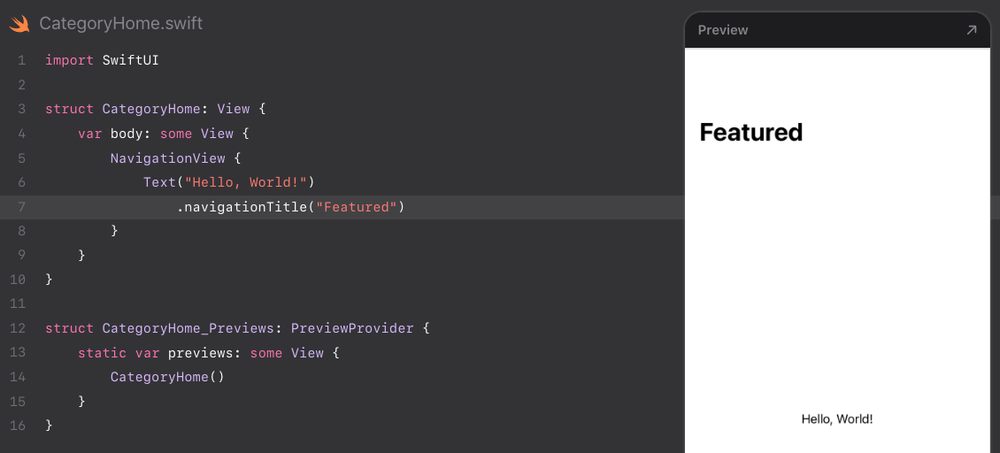

**CategoryHome**

```swift
struct CategoryHome: View {
    var body: some View {
        NavigationView {
            Text("Hello, World!")
                .navigationTitle("Featured")
        }
    }
}
```

### Create a Category List

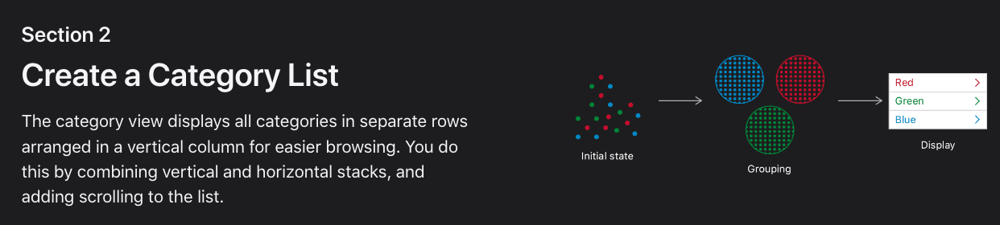

Add a model data environemnt object:

**CategoryHome**

```swift
struct CategoryHome: View {
    @EnvironmentObject var modelData: ModelData

    var body: some View {
        Text("Hello World")
    }
}

struct CategoryHome_Previews: PreviewProvider {
    static var previews: some View {
        CategoryHome()
            .environmentObject(ModelData())
    }
}
```

Create a `List` with a `ForEach` inside to more rows for each category.

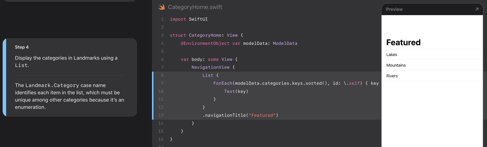

**CategoryHome**

```swift
struct CategoryHome: View {
    @EnvironmentObject var modelData: ModelData

    var body: some View {
        NavigationView {
            List {
                ForEach(modelData.categories.keys.sorted(), id: \.self) { key in
                    Text(key)
                }
            }
            .navigationTitle("Featured")
        }
    }
}
```

## Creating a Category Row

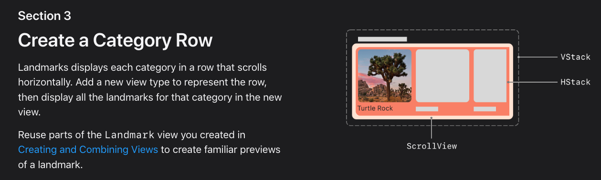

Here is a pattern for making data availabe in a view - use a `static var`:

**CategoryRow**

```swift
struct CategoryRow: View {
    var categoryName: String
    var items: [Landmark]

    var body: some View {
        Text("Hello, World!")
    }
}

struct CategoryRow_Previews: PreviewProvider {
    static var landmarks = ModelData().landmarks
    static var previews: some View {
        CategoryRow(
            categoryName: landmarks[0].category.rawValue,
            items: Array(landmarks.prefix(3))
        )
    }
}
```

So we start by embedded the horizontal elements in an `HStack` and then we embed that and the title in a `VStack`:

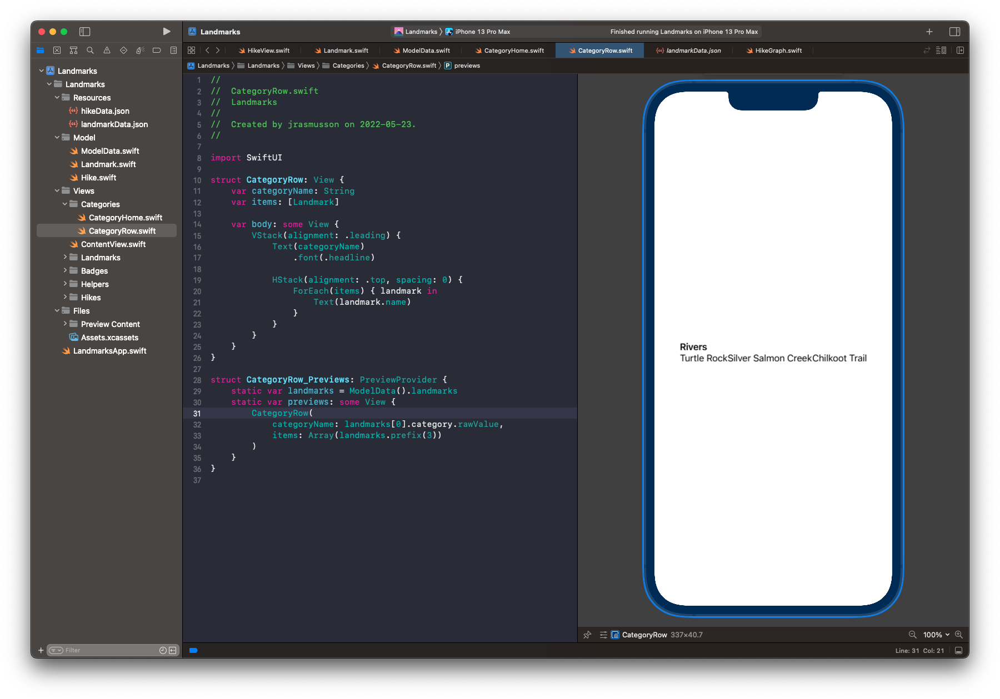

It's interested how these tutorials seem to be OK with hardcoded values for heights like `frame(height: 185)`. 

But note how we can make our `HStack` scrollable by embedding it in a `ScrollView`:

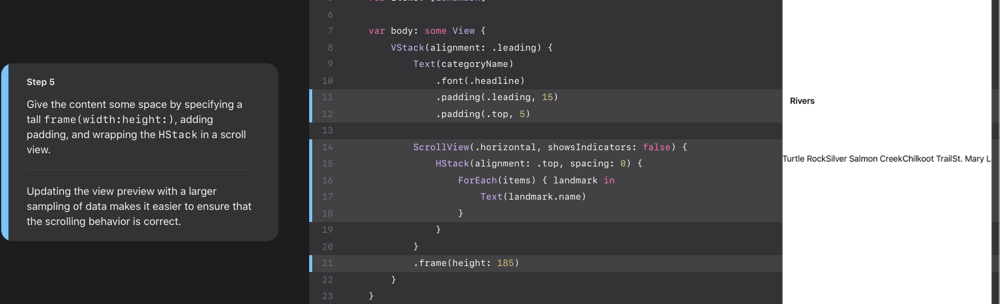

Let's now create an item for our horizontal scroll.

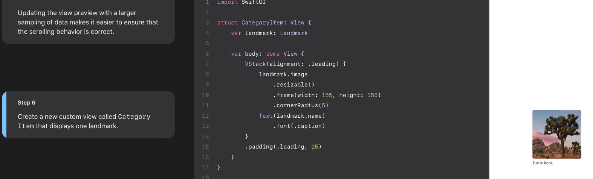

And then use it in our view:

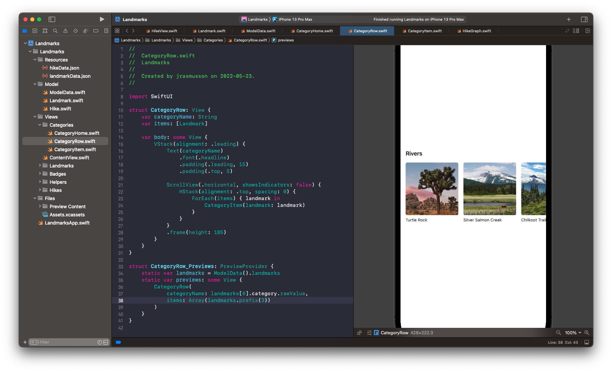

## Complete the Category View

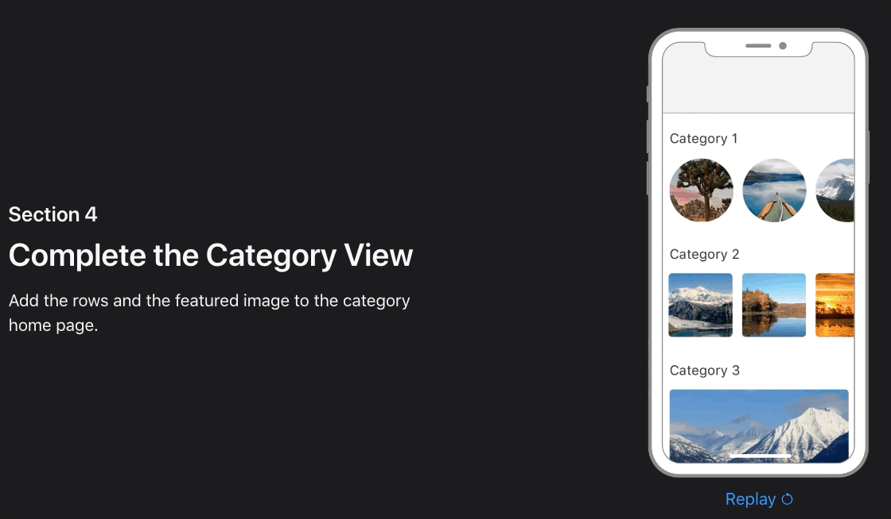

Pass in the data to the row:

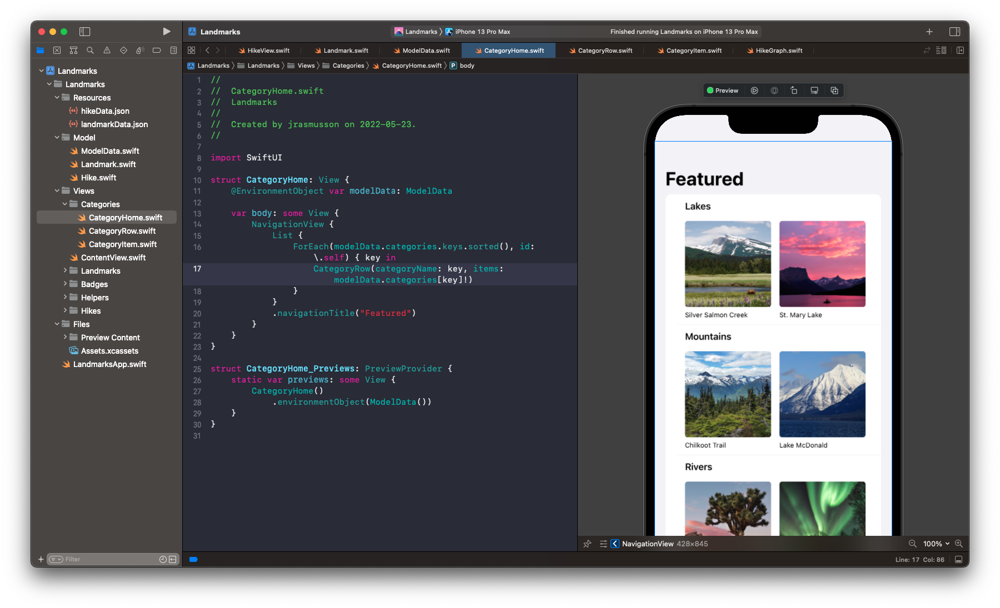

Add `isFeatured` to `ModelData` and display the first `isFeatured` like this:

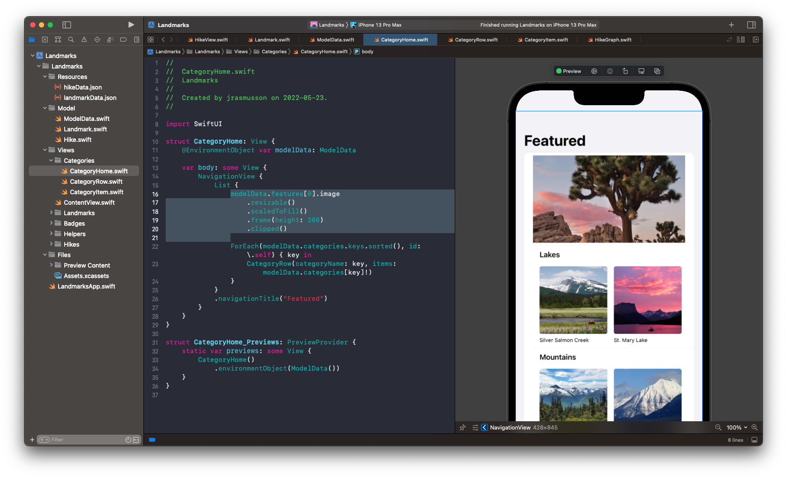

## Add Navigation Between Sections

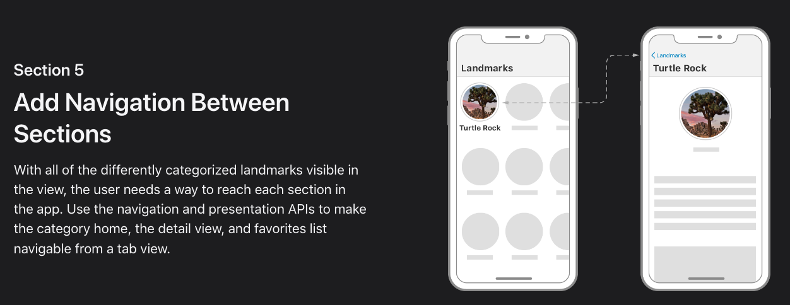

Here we use `NavigationLink` to create a name for the label and then provide a view to display for when the user taps:

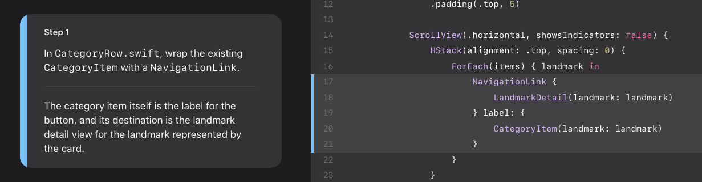

Add some styling...

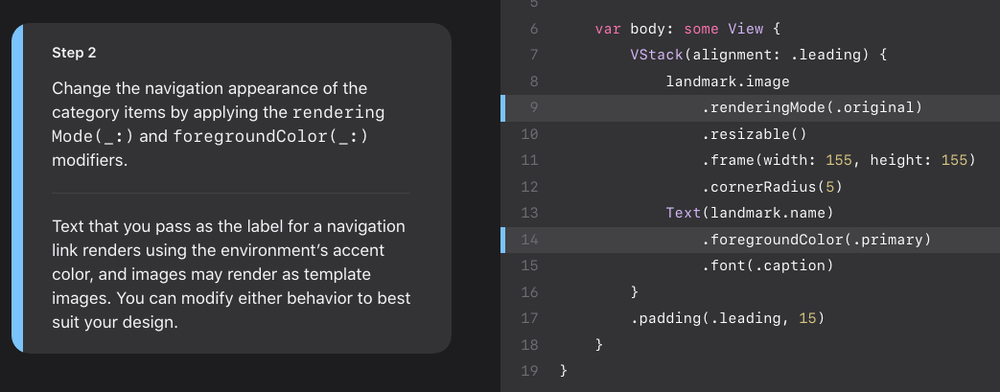

### Tabs

Here we will define some tabs, along with some state to track the selected tab, and then we'll switch views in a `TabView` like this:

**ContentView**

```swift
struct ContentView: View {
    @State private var selection: Tab = .featured

    enum Tab {
        case featured
        case list
    }

    var body: some View {
        TabView(selection: $selection) {
            CategoryHome()
                .tabItem {
                    Label("Featured", systemImage: "star")
                }
                .tag(Tab.featured)

            LandmarkList()
                .tabItem {
                    Label("List", systemImage: "list.bullet")
                }
                .tag(Tab.list)
        }
    }
}
```

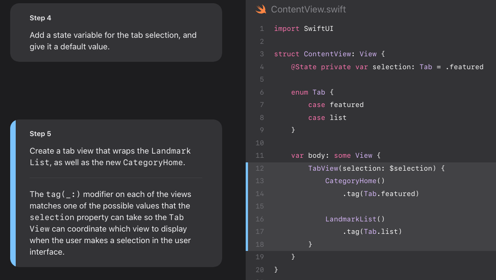


## Full Source

### Model

**ModelData**

```swift
//
//  ModelData.swift
//  Landmarks
//
//  Created by jrasmusson on 2022-05-16.
//

import Foundation

final class ModelData: ObservableObject {
    @Published var landmarks: [Landmark] = load("landmarkData.json")
    var hikes: [Hike] = load("hikeData.json")

    var features: [Landmark] {
        landmarks.filter { $0.isFeatured }
    }

    var categories: [String: [Landmark]] {
        Dictionary(
            grouping: landmarks,
            by: { $0.category.rawValue }
        )
    }
}

func load<T: Decodable>(_ filename: String) -> T {
    let data: Data

    guard let file = Bundle.main.url(forResource: filename, withExtension: nil)
    else {
        fatalError("Couldn't find \(filename) in main bundle.")
    }

    do {
        data = try Data(contentsOf: file)
    } catch {
        fatalError("Couldn't load \(filename) from main bundle:\n\(error)")
    }

    do {
        let decoder = JSONDecoder()
        return try decoder.decode(T.self, from: data)
    } catch {
        fatalError("Couldn't parse \(filename) as \(T.self):\n\(error)")
    }
}
```

**Landmark**

```swift
//
//  Landmark.swift
//  Landmarks
//
//  Created by jrasmusson on 2022-05-16.
//

import Foundation
import SwiftUI
import MapKit

struct Landmark: Hashable, Codable, Identifiable {
    var id: Int
    var name: String
    var park: String
    var state: String
    var description: String
    var isFavorite: Bool
    var isFeatured: Bool

    var category: Category
    enum Category: String, CaseIterable, Codable {
        case lakes = "Lakes"
        case rivers = "Rivers"
        case mountains = "Mountains"
    }
    
    private var imageName: String
    var image: Image {
        Image(imageName)
    }

    private var coordinates: Coordinates
    var locationCoordinate: CLLocationCoordinate2D {
        CLLocationCoordinate2D(
            latitude: coordinates.latitude,
            longitude: coordinates.longitude)
    }

    struct Coordinates: Hashable, Codable {
        var latitude: Double
        var longitude: Double
    }
}
```

**Hike**

```swift
//
//  Hike.swift
//  Landmarks
//
//  Created by jrasmusson on 2022-05-20.
//

import Foundation

struct Hike: Codable, Hashable, Identifiable {
    var id: Int
    var name: String
    var distance: Double
    var difficulty: Int
    var observations: [Observation]

    static var formatter = LengthFormatter()

    var distanceText: String {
        Hike.formatter
            .string(fromValue: distance, unit: .kilometer)
    }

    struct Observation: Codable, Hashable {
        var distanceFromStart: Double

        var elevation: Range<Double>
        var pace: Range<Double>
        var heartRate: Range<Double>
    }
}
```

### Views - Categories

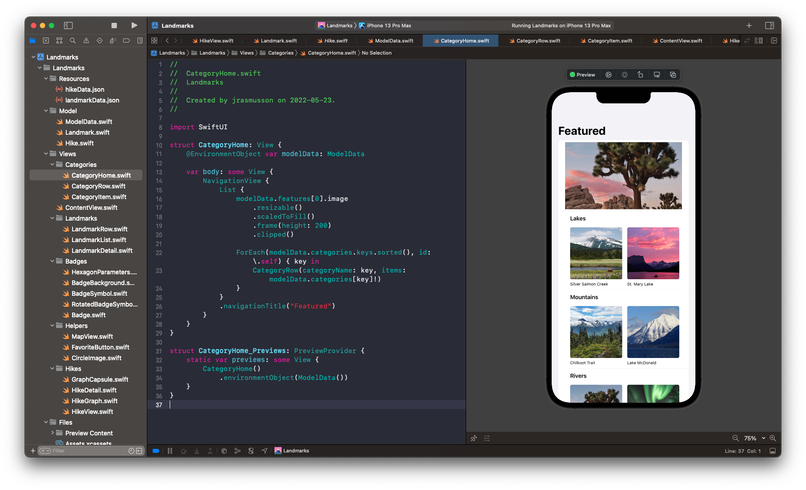

**CategoryHome**

```swift
//
//  CategoryHome.swift
//  Landmarks
//
//  Created by jrasmusson on 2022-05-23.
//

import SwiftUI

struct CategoryHome: View {
    @EnvironmentObject var modelData: ModelData

    var body: some View {
        NavigationView {
            List {
                modelData.features[0].image
                    .resizable()
                    .scaledToFill()
                    .frame(height: 200)
                    .clipped()
                
                ForEach(modelData.categories.keys.sorted(), id: \.self) { key in
                    CategoryRow(categoryName: key, items: modelData.categories[key]!)
                }
            }
            .navigationTitle("Featured")
        }
    }
}

struct CategoryHome_Previews: PreviewProvider {
    static var previews: some View {
        CategoryHome()
            .environmentObject(ModelData())
    }
}
```

**CategoryRow**


```swift
//
//  CategoryRow.swift
//  Landmarks
//
//  Created by jrasmusson on 2022-05-23.
//

import SwiftUI

struct CategoryRow: View {
    var categoryName: String
    var items: [Landmark]

    var body: some View {
        VStack(alignment: .leading) {
            Text(categoryName)
                .font(.headline)
                .padding(.leading, 15)
                .padding(.top, 5)
            
            ScrollView(.horizontal, showsIndicators: false) {
                HStack(alignment: .top, spacing: 0) {
                    ForEach(items) { landmark in
                        NavigationLink {
                            LandmarkDetail(landmark: landmark)
                        } label: {
                            CategoryItem(landmark: landmark)
                        }
                    }
                }
            }
            .frame(height: 185)
        }
    }
}

struct CategoryRow_Previews: PreviewProvider {
    static var landmarks = ModelData().landmarks
    static var previews: some View {
        CategoryRow(
            categoryName: landmarks[0].category.rawValue,
            items: Array(landmarks.prefix(3))
        )
    }
}
```

**CategoryItem**

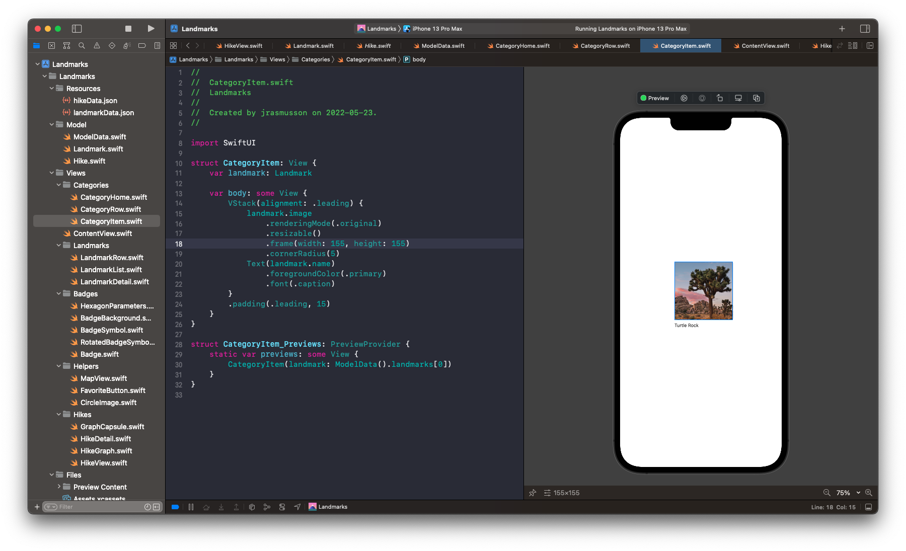

```swift
//
//  CategoryItem.swift
//  Landmarks
//
//  Created by jrasmusson on 2022-05-23.
//

import SwiftUI

struct CategoryItem: View {
    var landmark: Landmark

    var body: some View {
        VStack(alignment: .leading) {
            landmark.image
                .renderingMode(.original)
                .resizable()
                .frame(width: 155, height: 155)
                .cornerRadius(5)
            Text(landmark.name)
                .foregroundColor(.primary)
                .font(.caption)
        }
        .padding(.leading, 15)
    }
}

struct CategoryItem_Previews: PreviewProvider {
    static var previews: some View {
        CategoryItem(landmark: ModelData().landmarks[0])
    }
}
```

### Views - Landmarks

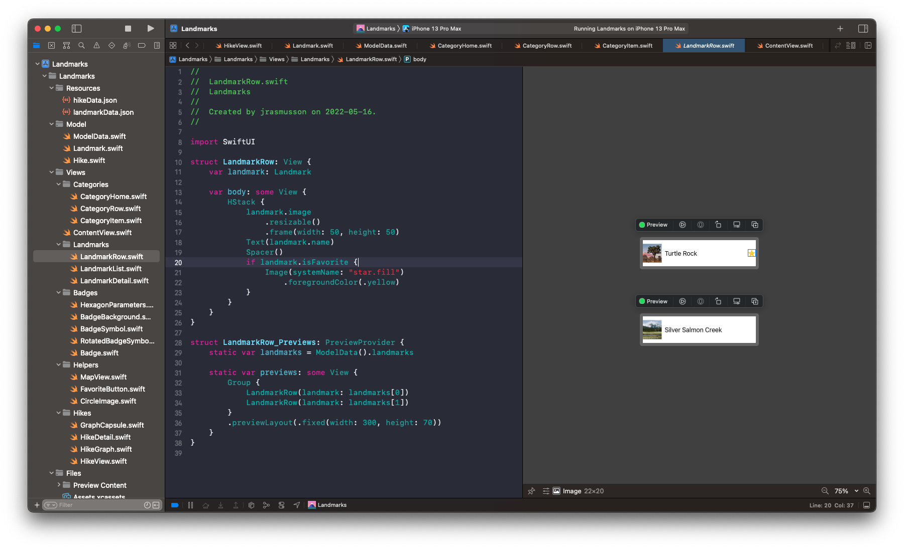

**LandmarkRow**

```swift
//
//  LandmarkRow.swift
//  Landmarks
//
//  Created by jrasmusson on 2022-05-16.
//

import SwiftUI

struct LandmarkRow: View {
    var landmark: Landmark

    var body: some View {
        HStack {
            landmark.image
                .resizable()
                .frame(width: 50, height: 50)
            Text(landmark.name)
            Spacer()
            if landmark.isFavorite {
                Image(systemName: "star.fill")
                    .foregroundColor(.yellow)
            }
        }
    }
}

struct LandmarkRow_Previews: PreviewProvider {
    static var landmarks = ModelData().landmarks
    
    static var previews: some View {
        Group {
            LandmarkRow(landmark: landmarks[0])
            LandmarkRow(landmark: landmarks[1])
        }
        .previewLayout(.fixed(width: 300, height: 70))
    }
}
```

**LandmarkList**

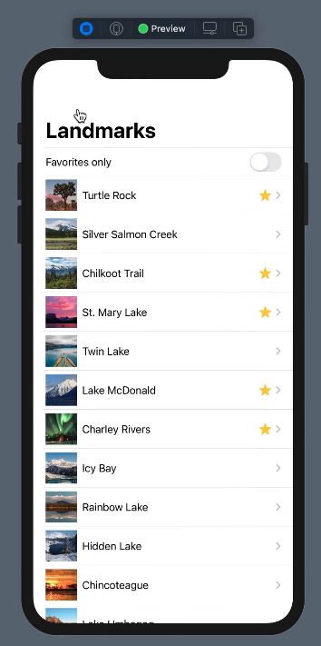

```swift
//
//  LandmarkList.swift
//  Landmarks
//
//  Created by jrasmusson on 2022-05-16.
//

import SwiftUI

struct LandmarkList: View {
    @EnvironmentObject var modelData: ModelData
    @State private var showFavoritesOnly = false

    var filteredLandmarks: [Landmark] {
        modelData.landmarks.filter { landmark in
            (!showFavoritesOnly || landmark.isFavorite)
        }
    }

    var body: some View {
        NavigationView {
            List {
                Toggle(isOn: $showFavoritesOnly) {
                    Text("Favorites only")
                }
                ForEach(filteredLandmarks) { landmark in
                    NavigationLink {
                        LandmarkDetail(landmark: landmark)
                    } label: {
                        LandmarkRow(landmark: landmark)
                    }
                }
            }
            .navigationTitle("Landmarks")
        }
    }
}

struct LandmarkList_Previews: PreviewProvider {
    static var previews: some View {
        ForEach(["iPhone SE (2nd generation)"], id: \.self) { deviceName in
            LandmarkList()
                .previewDevice(PreviewDevice(rawValue: deviceName))
                .previewDisplayName(deviceName)
        }
    }
}
```

**LandmarkDetail**

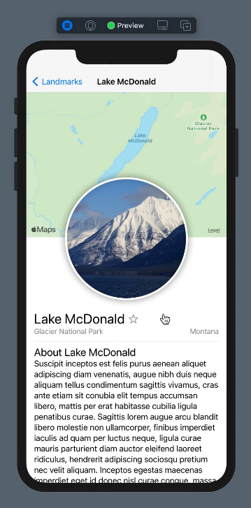

```swift
//
//  LandmarkDetail.swift
//  Landmarks
//
//  Created by jrasmusson on 2022-05-16.
//

import SwiftUI

struct LandmarkDetail: View {
    @EnvironmentObject var modelData: ModelData
    var landmark: Landmark

    var landmarkIndex: Int {
        modelData.landmarks.firstIndex(where: { $0.id == landmark.id })!
    }
    
    var body: some View {
        VStack {
            MapView(coordinate: landmark.locationCoordinate)
                .ignoresSafeArea(edges: .top)
                .frame(height: 300)
            
            CircleImage(image: landmark.image)
                .offset(y: -130)
                .padding(.bottom, -130)
            
            VStack(alignment: .leading) {
                HStack {
                    Text(landmark.name)
                        .font(.title)
                    FavoriteButton(isSet: $modelData.landmarks[landmarkIndex].isFavorite)
                }
                HStack {
                    Text(landmark.park)
                    Spacer()
                    Text(landmark.state)
                }
                .font(.subheadline)
                .foregroundColor(.secondary)
                
                Divider()
                
                Text("About \(landmark.name)")
                    .font(.title2)
                Text(landmark.description)
            }
            .padding()
            
            Spacer()
        }
    }
}

struct LandmarkDetail_Previews: PreviewProvider {
    static var previews: some View {
        LandmarkDetail(landmark: ModelData().landmarks[0])
    }
}
```

### Views - Badges

**HexagonParameters**

```swift
//
//  HexagonParameters.swift
//  Landmarks
//
//  Created by jrasmusson on 2022-05-20.
//

import CoreGraphics

struct HexagonParameters {
    struct Segment {
        let line: CGPoint
        let curve: CGPoint
        let control: CGPoint
    }

    static let adjustment: CGFloat = 0.085

    static let segments = [
        Segment(
            line:    CGPoint(x: 0.60, y: 0.05),
            curve:   CGPoint(x: 0.40, y: 0.05),
            control: CGPoint(x: 0.50, y: 0.00)
        ),
        Segment(
            line:    CGPoint(x: 0.05, y: 0.20 + adjustment),
            curve:   CGPoint(x: 0.00, y: 0.30 + adjustment),
            control: CGPoint(x: 0.00, y: 0.25 + adjustment)
        ),
        Segment(
            line:    CGPoint(x: 0.00, y: 0.70 - adjustment),
            curve:   CGPoint(x: 0.05, y: 0.80 - adjustment),
            control: CGPoint(x: 0.00, y: 0.75 - adjustment)
        ),
        Segment(
            line:    CGPoint(x: 0.40, y: 0.95),
            curve:   CGPoint(x: 0.60, y: 0.95),
            control: CGPoint(x: 0.50, y: 1.00)
        ),
        Segment(
            line:    CGPoint(x: 0.95, y: 0.80 - adjustment),
            curve:   CGPoint(x: 1.00, y: 0.70 - adjustment),
            control: CGPoint(x: 1.00, y: 0.75 - adjustment)
        ),
        Segment(
            line:    CGPoint(x: 1.00, y: 0.30 + adjustment),
            curve:   CGPoint(x: 0.95, y: 0.20 + adjustment),
            control: CGPoint(x: 1.00, y: 0.25 + adjustment)
        )
    ]
}
```

**BadgeBackground**

```swift
//
//  BadgeBackground.swift
//  Landmarks
//
//  Created by jrasmusson on 2022-05-20.
//

import SwiftUI

struct BadgeBackground: View {
    var body: some View {
        GeometryReader { geometry in
            Path { path in
                var width: CGFloat = min(geometry.size.width, geometry.size.height)
                let height = width
                let xScale: CGFloat = 0.832
                let xOffset = (width * (1.0 - xScale)) / 2.0
                width *= xScale
                path.move(
                    to: CGPoint(
                        x: width * 0.95 + xOffset,
                        y: height * (0.20 + HexagonParameters.adjustment)
                    )
                )

                HexagonParameters.segments.forEach { segment in
                    path.addLine(
                        to: CGPoint(
                            x: width * segment.line.x + xOffset,
                            y: height * segment.line.y
                        )
                    )

                    path.addQuadCurve(
                        to: CGPoint(
                            x: width * segment.curve.x + xOffset,
                            y: height * segment.curve.y
                        ),
                        control: CGPoint(
                            x: width * segment.control.x + xOffset,
                            y: height * segment.control.y
                        )
                    )
                }
            }
            .fill(.linearGradient(
                Gradient(colors: [Self.gradientStart, Self.gradientEnd]),
                startPoint: UnitPoint(x: 0.5, y: 0),
                endPoint: UnitPoint(x: 0.5, y: 0.6)
            ))
        }
        .aspectRatio(1, contentMode: .fit)
    }
    static let gradientStart = Color(red: 239.0 / 255, green: 120.0 / 255, blue: 221.0 / 255)
    static let gradientEnd = Color(red: 239.0 / 255, green: 172.0 / 255, blue: 120.0 / 255)
}

struct BadgeBackground_Previews: PreviewProvider {
    static var previews: some View {
        BadgeBackground()
    }
}
```

**BadgeSymbol**

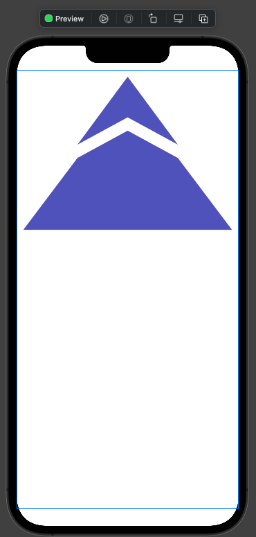

```swift
//
//  BadgeSymbol.swift
//  Landmarks
//
//  Created by jrasmusson on 2022-05-20.
//

import SwiftUI

struct BadgeSymbol: View {
    static let symbolColor = Color(red: 79.0 / 255, green: 79.0 / 255, blue: 191.0 / 255)

    var body: some View {
        GeometryReader { geometry in
            Path { path in
                let width = min(geometry.size.width, geometry.size.height)
                let height = width * 0.75
                let spacing = width * 0.030
                let middle = width * 0.5
                let topWidth = width * 0.226
                let topHeight = height * 0.488

                path.addLines([
                    CGPoint(x: middle, y: spacing),
                    CGPoint(x: middle - topWidth, y: topHeight - spacing),
                    CGPoint(x: middle, y: topHeight / 2 + spacing),
                    CGPoint(x: middle + topWidth, y: topHeight - spacing),
                    CGPoint(x: middle, y: spacing)
                ])

                path.move(to: CGPoint(x: middle, y: topHeight / 2 + spacing * 3))
                path.addLines([
                    CGPoint(x: middle - topWidth, y: topHeight + spacing),
                    CGPoint(x: spacing, y: height - spacing),
                    CGPoint(x: width - spacing, y: height - spacing),
                    CGPoint(x: middle + topWidth, y: topHeight + spacing),
                    CGPoint(x: middle, y: topHeight / 2 + spacing * 3)
                ])
            }
            .fill(Self.symbolColor)
        }
    }
}

struct BadgeSymbol_Previews: PreviewProvider {
    static var previews: some View {
        BadgeSymbol()
    }
}
```

**RotatedBadgeSymbol**

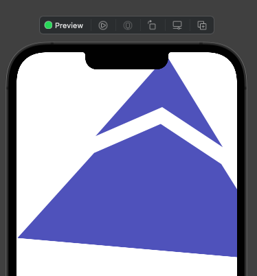

```swift
//
//  RotatedBadgeSymbol.swift
//  Landmarks
//
//  Created by jrasmusson on 2022-05-20.
//

import SwiftUI

struct RotatedBadgeSymbol: View {
    let angle: Angle

    var body: some View {
        BadgeSymbol()
            .padding(-60)
            .rotationEffect(angle, anchor: .bottom)
    }
}

struct RotatedBadgeSymbol_Previews: PreviewProvider {
    static var previews: some View {
        RotatedBadgeSymbol(angle: Angle(degrees: 5))
    }
}
```

**Badge**

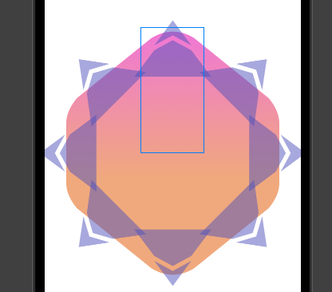

```swift
//
//  Badge.swift
//  Landmarks
//
//  Created by jrasmusson on 2022-05-20.
//

import SwiftUI

struct Badge: View {
    var badgeSymbols: some View {
        ForEach(0..<8) { index in
            RotatedBadgeSymbol(
                angle: .degrees(Double(index) / Double(8)) * 360.0
            )
        }
        .opacity(0.5)
    }

    var body: some View {
        ZStack {
            BadgeBackground()

            GeometryReader { geometry in
                badgeSymbols
                    .scaleEffect(1.0 / 4.0, anchor: .top)
                    .position(x: geometry.size.width / 2.0, y: (3.0 / 4.0) * geometry.size.height)
            }
        }
    }
}

struct Badge_Previews: PreviewProvider {
    static var previews: some View {
        Badge()
    }
}
```

### Views - Helpers

**MapView**

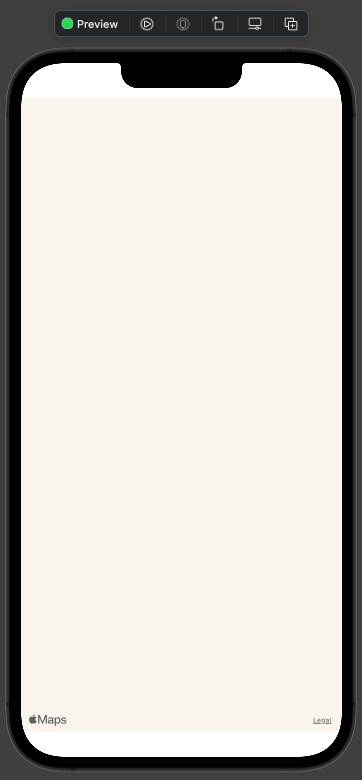

```swift
//
//  MapView.swift
//  Landmarks
//
//  Created by jrasmusson on 2022-05-16.
//

import SwiftUI
import MapKit

struct MapView: View {
    var coordinate: CLLocationCoordinate2D
    @State private var region = MKCoordinateRegion()

    var body: some View {
        Map(coordinateRegion: $region)
            .onAppear {
                setRegion(coordinate)
            }
    }

    private func setRegion(_ coordinate: CLLocationCoordinate2D) {
            region = MKCoordinateRegion(
                center: coordinate,
                span: MKCoordinateSpan(latitudeDelta: 0.2, longitudeDelta: 0.2)
            )
        }
}

struct MapView_Previews: PreviewProvider {
    static var previews: some View {
        MapView(coordinate: CLLocationCoordinate2D(latitude: 34.011_286, longitude: -116.166_868))
    }
}
```

**FavoriteButton**

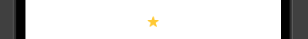

```swift
//
//  FavoriteButton.swift
//  Landmarks
//
//  Created by jrasmusson on 2022-05-17.
//

import SwiftUI

struct FavoriteButton: View {
    @Binding var isSet: Bool

    var body: some View {
        Button {
            isSet.toggle()
        } label: {
            Label("Toggle Favorite", systemImage: isSet ? "star.fill" : "star")
                .labelStyle(.iconOnly)
                .foregroundColor(isSet ? .yellow : .gray)
        }
    }
}

struct FavoriteButton_Previews: PreviewProvider {
    static var previews: some View {
        FavoriteButton(isSet: .constant(true))
    }
}
```

**CircleImage**

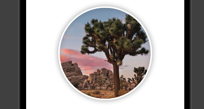

```swift
//
//  CircularImage.swift
//  Landmarks
//
//  Created by jrasmusson on 2022-05-16.
//

import SwiftUI

struct CircleImage: View {
    var image: Image

    var body: some View {
        image
            .clipShape(Circle())
            .overlay {
                Circle().stroke(.white, lineWidth: 4)
            }
            .shadow(radius: 7)
    }
}

struct CircularImage_Previews: PreviewProvider {
    static var previews: some View {
        CircleImage(image: Image("turtlerock"))
    }
}
```

### Views - Hikes

**GraphCapsule**

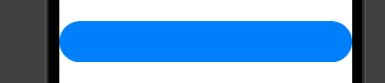

```swift
/*
See LICENSE folder for this sample’s licensing information.

Abstract:
A single line in the graph.
*/

import SwiftUI

struct GraphCapsule: View, Equatable {
    var index: Int
    var color: Color
    var height: CGFloat
    var range: Range<Double>
    var overallRange: Range<Double>

    var heightRatio: CGFloat {
        max(CGFloat(magnitude(of: range) / magnitude(of: overallRange)), 0.15)
    }

    var offsetRatio: CGFloat {
        CGFloat((range.lowerBound - overallRange.lowerBound) / magnitude(of: overallRange))
    }

    var body: some View {
        Capsule()
            .fill(color)
            .frame(height: height * heightRatio)
            .offset(x: 0, y: height * -offsetRatio)
    }
}

struct GraphCapsule_Previews: PreviewProvider {
    static var previews: some View {
        GraphCapsule(
            index: 0,
            color: .blue,
            height: 150,
            range: 10..<50,
            overallRange: 0..<100)
    }
}
```

**HikeDetail**

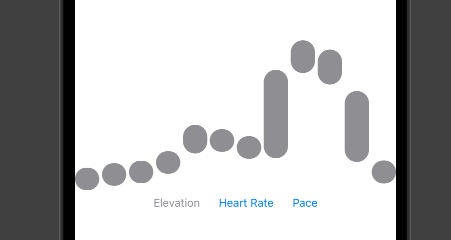

```swift
/*
See LICENSE folder for this sample’s licensing information.

Abstract:
A view showing the details for a hike.
*/

import SwiftUI

struct HikeDetail: View {
    let hike: Hike
    @State var dataToShow = \Hike.Observation.elevation

    var buttons = [
        ("Elevation", \Hike.Observation.elevation),
        ("Heart Rate", \Hike.Observation.heartRate),
        ("Pace", \Hike.Observation.pace)
    ]

    var body: some View {
        VStack {
            HikeGraph(hike: hike, path: dataToShow)
                .frame(height: 200)

            HStack(spacing: 25) {
                ForEach(buttons, id: \.0) { value in
                    Button {
                        dataToShow = value.1
                    } label: {
                        Text(value.0)
                            .font(.system(size: 15))
                            .foregroundColor(value.1 == dataToShow
                                ? .gray
                                : .accentColor)
                            .animation(nil)
                    }
                }
            }
        }
    }
}

struct HikeDetail_Previews: PreviewProvider {
    static var previews: some View {
        HikeDetail(hike: ModelData().hikes[0])
    }
}
```

**HikeGraph**

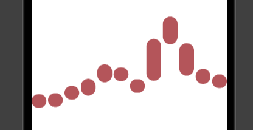

```swift
/*
See LICENSE folder for this sample’s licensing information.

Abstract:
The elevation, heart rate, and pace of a hike plotted on a graph.
*/

import SwiftUI

extension Animation {
    static func ripple(index: Int) -> Animation {
        Animation.spring(dampingFraction: 0.5)
            .speed(2)
            .delay(0.03 * Double(index))
    }
}

struct HikeGraph: View {
    var hike: Hike
    var path: KeyPath<Hike.Observation, Range<Double>>

    var color: Color {
        switch path {
        case \.elevation:
            return .gray
        case \.heartRate:
            return Color(hue: 0, saturation: 0.5, brightness: 0.7)
        case \.pace:
            return Color(hue: 0.7, saturation: 0.4, brightness: 0.7)
        default:
            return .black
        }
    }

    var body: some View {
        let data = hike.observations
        let overallRange = rangeOfRanges(data.lazy.map { $0[keyPath: path] })
        let maxMagnitude = data.map { magnitude(of: $0[keyPath: path]) }.max()!
        let heightRatio = 1 - CGFloat(maxMagnitude / magnitude(of: overallRange))

        return GeometryReader { proxy in
            HStack(alignment: .bottom, spacing: proxy.size.width / 120) {
                ForEach(Array(data.enumerated()), id: \.offset) { index, observation in
                    GraphCapsule(
                        index: index,
                        color: color,
                        height: proxy.size.height,
                        range: observation[keyPath: path],
                        overallRange: overallRange
                    )
                        .animation(.ripple(index: index))
                }
                .offset(x: 0, y: proxy.size.height * heightRatio)
            }
        }
    }
}

func rangeOfRanges<C: Collection>(_ ranges: C) -> Range<Double>
    where C.Element == Range<Double> {
    guard !ranges.isEmpty else { return 0..<0 }
    let low = ranges.lazy.map { $0.lowerBound }.min()!
    let high = ranges.lazy.map { $0.upperBound }.max()!
    return low..<high
}

func magnitude(of range: Range<Double>) -> Double {
    range.upperBound - range.lowerBound
}

struct HikeGraph_Previews: PreviewProvider {
    static var hike = ModelData().hikes[0]

    static var previews: some View {
        Group {
            HikeGraph(hike: hike, path: \.elevation)
                .frame(height: 200)
            HikeGraph(hike: hike, path: \.heartRate)
                .frame(height: 200)
            HikeGraph(hike: hike, path: \.pace)
                .frame(height: 200)
        }
    }
}
```

**HikeView**

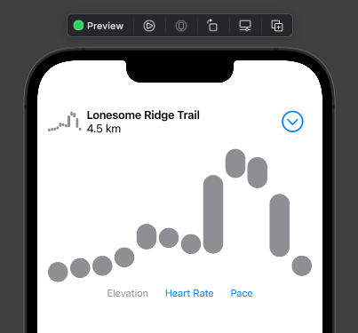

```swift
/*
See LICENSE folder for this sample’s licensing information.

Abstract:
A view displaying information about a hike, including an elevation graph.
*/

import SwiftUI

struct HikeView: View {
    var hike: Hike
    @State private var showDetail = true

    var body: some View {
        VStack {
            HStack {
                HikeGraph(hike: hike, path: \.elevation)
                    .frame(width: 50, height: 30)

                VStack(alignment: .leading) {
                    Text(hike.name)
                        .font(.headline)
                    Text(hike.distanceText)
                }

                Spacer()

                Button {
                    withAnimation {
                        showDetail.toggle()
                    }
                } label: {
                    Label("Graph", systemImage: "chevron.right.circle")
                        .labelStyle(.iconOnly)
                        .imageScale(.large)
                        .rotationEffect(.degrees(showDetail ? 90 : 0))
                        .scaleEffect(showDetail ? 1.5 : 1)
                        .padding()
                }
            }

            if showDetail {
                HikeDetail(hike: hike)
                    .transition(.moveAndFade)
            }
        }
    }
}

extension AnyTransition {
    static var moveAndFade: AnyTransition {
        .asymmetric(
            insertion: .move(edge: .trailing).combined(with: .opacity),
            removal: .scale.combined(with: .opacity)
        )
    }
}

struct HikeView_Previews: PreviewProvider {
    static var previews: some View {
        VStack {
            HikeView(hike: ModelData().hikes[0])
                .padding()
            Spacer()
        }
    }
}
```

### Links that help

- [Composing Complex Interfaces](https://developer.apple.com/tutorials/swiftui/composing-complex-interfaces)


# Working with UI Controls


## Display a user Profile

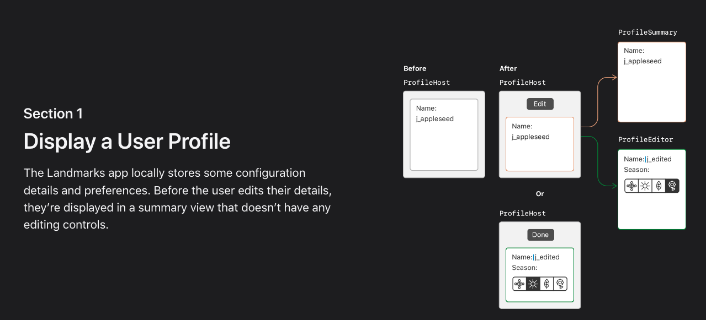

## Add an Edit Mode

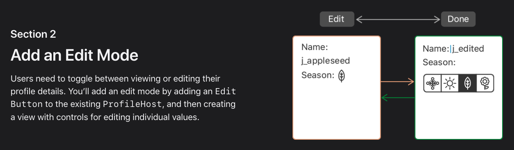

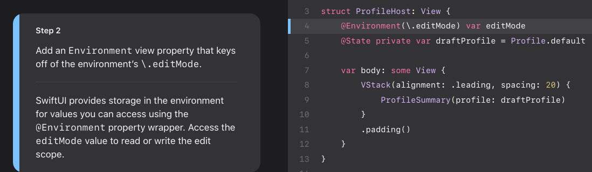

So this is interesting, SwiftUI has a dedicated `editMode` stored as a key value pair in its `@Environment` view property.

**ProfileHost**

```swift
struct ProfileHost: View {
    @Environment(\.editMode) var editMode
```

Add it is automatically hooked up to a dedicated SwiftUI `EditButton` that can be displayed like this:

```swift
var body: some View {
    VStack(alignment: .leading, spacing: 20) {
        HStack {
            Spacer()
            EditButton() //
        }
    }
}
```

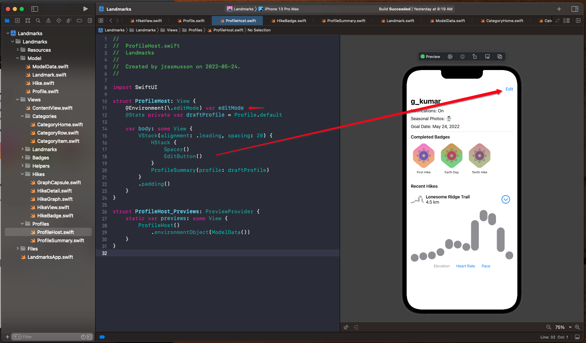

Tapping the `EditButton` toggles the `editMode` value on and off.

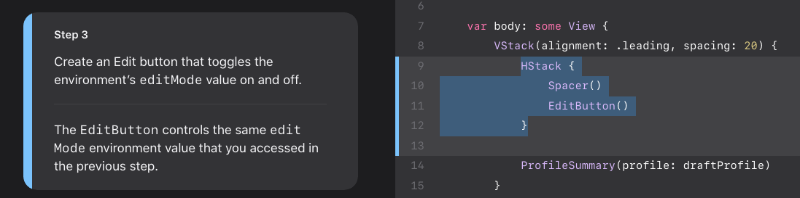

So note that `@Environment` and `@EnvironmentObject` are two different things:

```swift
struct ProfileHost: View {
    @Environment(\.editMode) var editMode // key-pair store
    @State private var draftProfile = Profile.default
    @EnvironmentObject var modelData: ModelData // anything
    
    var body: some View {
        if editMode?.wrappedValue == .inactive {
            ProfileSummary(profile: modelData.profile)
        } else {
            Text("Profile Editor")
        }
    }
}
```

`EditMode` is an enum:

**EditMode**

```swift
public enum EditMode {

    /// The view content cannot be edited.
    case inactive

    /// The view is in a temporary edit mode.
    ///
    /// The definition of temporary might vary by platform or specific control.
    /// As an example, temporary edit mode may be engaged over the duration of a
    /// swipe gesture.
    case transient

    /// The view content can be edited.
    case active
```

## Define the Profile Editor

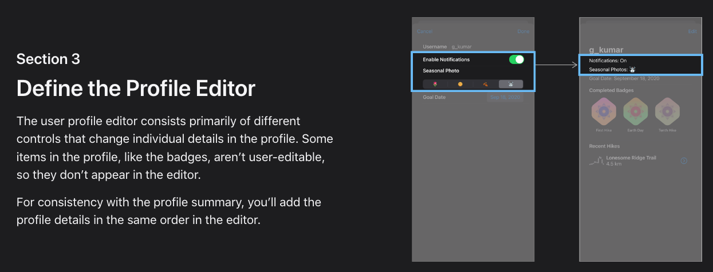

Note that you provide a label and a binding to a string when creating a text field.

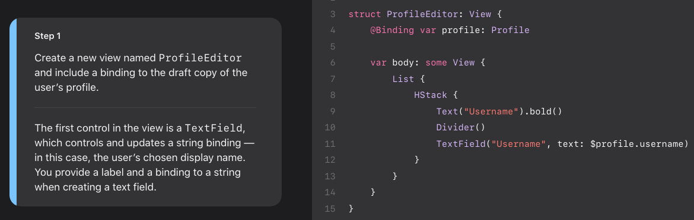

Note also how you can bind to `struct` - not just primitive string, bool, and ints.

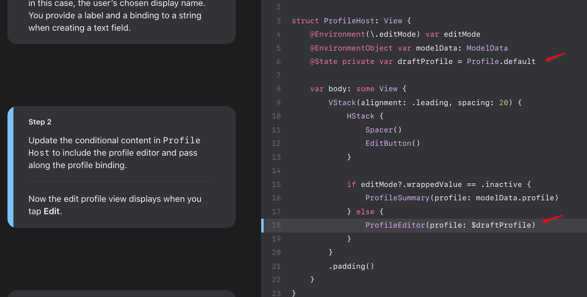

Look at this cool way to create a segmented picker:

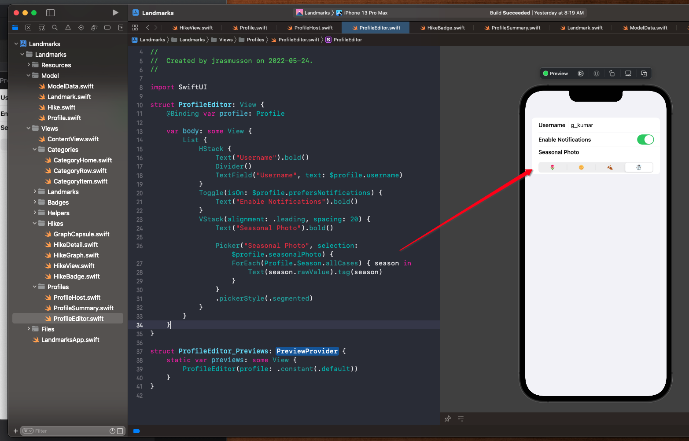

Then look at this cool way of setting up a `DatePicker`:

**ProfileEditor**

```swift
struct ProfileEditor: View {
    @Binding var profile: Profile

    var dateRange: ClosedRange<Date> {
        let min = Calendar.current.date(byAdding: .year, value: -1, to: profile.goalDate)!
        let max = Calendar.current.date(byAdding: .year, value: 1, to: profile.goalDate)!
        return min...max
    }

	DatePicker(selection: $profile.goalDate, in: dateRange, displayedComponents: .date) {
                Text("Goal Date").bold()
            }
```

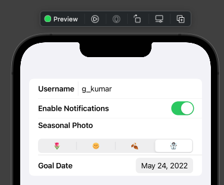

This setups a `min` and `max` date for the picker using a `ClosedRange<Date>`:

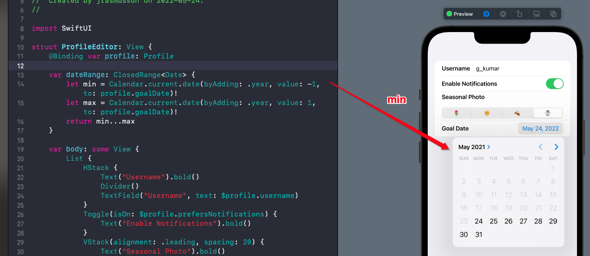

## Delay Edit Propogation

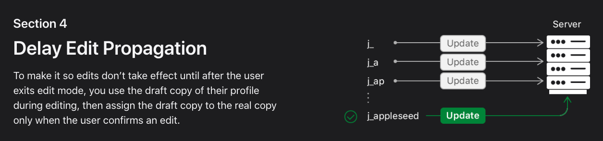

OK this looks really cool...can't wait to see how we are going to do this.

First we add a `cancel` button that doesn't save any changes, it simply resets them to what we had before:

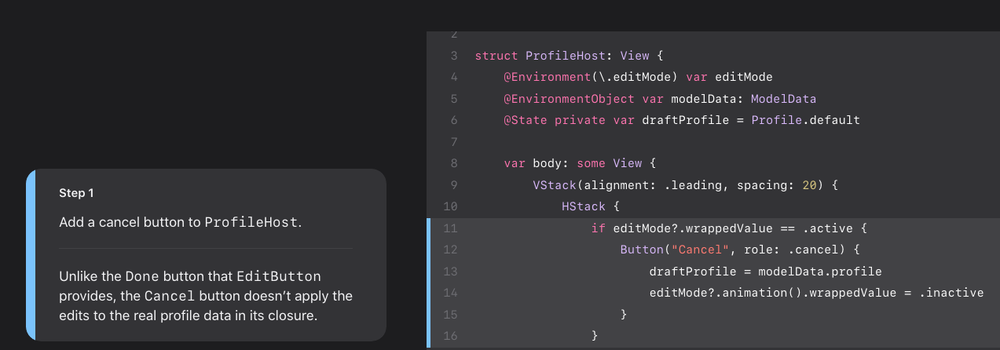

Then use the `onAppear` `onDisappear` to load the profile to edit and save the current one back (even if no changes have been made):


