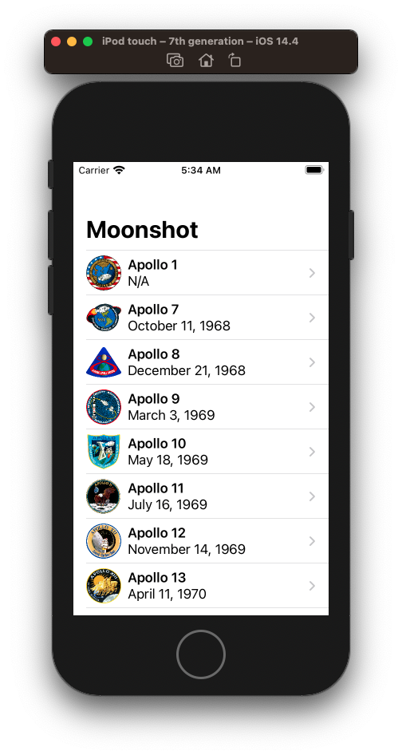
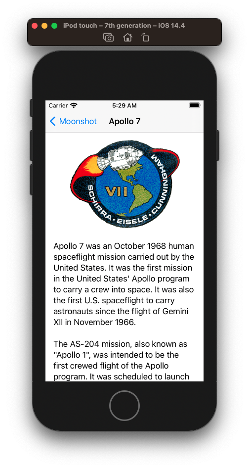
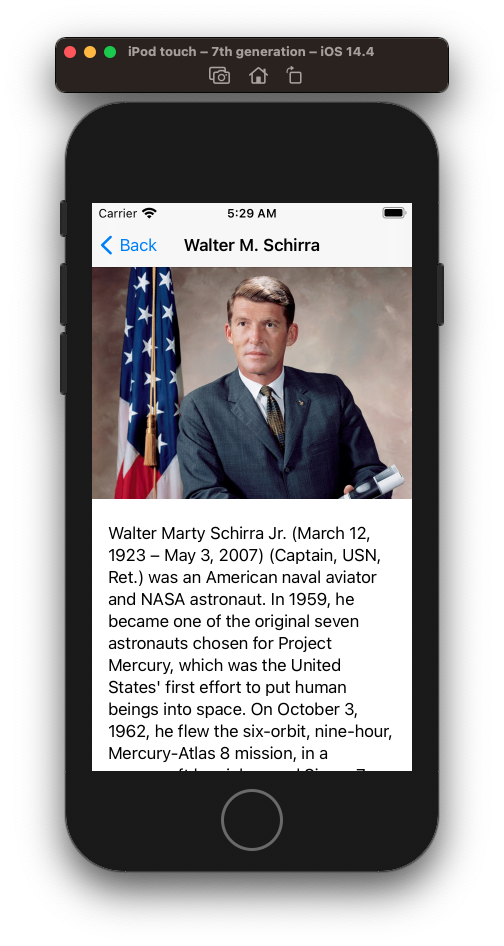

# Moonshot


## Resizing images to fir the screen using GeometryReader

Images by default will want to be shown at their native size. But we can resize them using `GeometryReader`.

Starting with a regular image.

```swift
struct ContentView: View {
    var body: some View {
        VStack {
            Image("Example")
        }
    }
}
```


We can attempt to set the frame like this.

```swift
Image("Example")
    .frame(width: 300, height: 300)
```

But that won't work as the image will still want to be full size.


We can clip it.

```swift
Image("Example")
    .frame(width: 300, height: 300)
    .clipped()
```


But that's still not exactly what we want. If we want the image *contents* to be resized too, we need to use the resizable() modidifer like this.

```swift
Image("Example")
    .resizable()
    .frame(width: 300, height: 300)
```


This is better but you can see how things are squished. To resize the image proportionally we need to use the `aspectRatio()` modifier which has too settings:

- `.fit` fit the entire image inside the container even if that means leasing some parts of the view empty
- `.fill` fill the view so it has no empty parts even if that means part of the image lies outside the container

### fit

```swift
Image("Example")
    .resizable()
    .aspectRatio(contentMode: .fit)
    .frame(width: 300, height: 300)
```


### fill

```swift
Image("Example")
    .resizable()
    .aspectRatio(contentMode: .fill)
    .frame(width: 300, height: 300)
```


This works fine if we want fixed-sized images. But more often we want images that automatically scale up fill the width of the entire screen.

That is what `GeometryReader` is for. It can do a lot but for now we are just going to have it make our image fill the screen.

### GeometryReader

Is a view just like the others we've seen, except when we create it we'll be handed a `GeometryProxy` which lets us query our environment and ask things like how big is the container, what position is our view, are there any insets, are we in a safeArea etc.

```swift
VStack {
    GeometryReader { geo in
        Image("Example")
            .resizable()
            .aspectRatio(contentMode: .fit)
            .frame(width: geo.size.width, height: 300)
    }
}
```


No our image will fill the width of the screen regardless of the device because of this line here.

```swift
.frame(width: geo.size.width, ...
```

For our final trick what what happens if we remove the height.

```swift
VStack {
    GeometryReader { geo in
        Image("Example")
            .resizable()
            .aspectRatio(contentMode: .fit)
            .frame(width: geo.size.width)
    }
}
```

We've given SwiftUI enough information that it can automatically figure out the height based on the original width, our target width, and our content mode. It will make the height proportional to the width.

## How ScrollView lets us work with scrolling data

Scroll views can scroll horizontally, vertically, or in both directions, and you can also control whether the system should show scroll indicators next to them – those are the little scroll bars that appear to give users a sense of how big the content is. When we place views inside scroll views, they automatically figure out the size of that content so users can scroll from one edge to the other.

As an example, we could create a scrolling list of 100 text views like this:

```
ScrollView(.vertical) {
    VStack(spacing: 10) {
        ForEach(0..<100) {
            Text("Item \($0)")
                .font(.title)
        }
    }
}
```


To make it wide we go like this:

```swift
ScrollView(.vertical) {
    VStack(spacing: 10) {
        ForEach(0..<100) {
            Text("Item \($0)")
                .font(.title)
        }
    }
    .frame(maxWidth: .infinity)
}
```


One important difference with scroll views is that the views you add get created immediately. Unlike `UITableViewController` which has an very efficient dequeing mechanism, scroll view create all views once created.

## Full source

**ContentView.swift**

```swift
//
//  ContentView.swift
//  Moonshot
//
//  Created by jrasmusson on 2021-05-05.
//

import SwiftUI

struct ContentView: View {
    
    let astronauts: [Astronaut] = Bundle.main.decode("astronauts.json")
    let missions: [Mission] = Bundle.main.decode("missions.json")
    
    var body: some View {

        NavigationView {
            List(missions) { mission in
                NavigationLink(destination: MissionView(mission: mission, astronauts: self.astronauts)) {
                    Image(mission.image)
                        .resizable()
                        .scaledToFit()
                        .frame(width: 44, height: 44)

                    VStack(alignment: .leading) {
                        Text(mission.displayName)
                            .font(.headline)
                        Text(mission.formattedLaunchDate)
                    }
                }
            }
            .navigationBarTitle("Moonshot")
        }
    }
}

struct ContentView_Previews: PreviewProvider {
    static var previews: some View {
        ContentView()
    }
}
```



**Astronaut.swift**

```swift
struct Astronaut: Codable, Identifiable {
    let id: String
    let name: String
    let description: String
}
```

**Mission.swift**

```swift
//
//  Mission.swift
//  Moonshot
//
//  Created by jrasmusson on 2021-05-06.
//

import Foundation

struct Mission: Codable, Identifiable {
    struct CrewRole: Codable {
        let name: String
        let role: String
    }

    let id: Int
    let launchDate: Date?
    let crew: [CrewRole]
    let description: String
    
    var displayName: String {
        "Apollo \(id)"
    }

    var image: String {
        "apollo\(id)"
    }
    
    var formattedLaunchDate: String {
        if let launchDate = launchDate {
            let formatter = DateFormatter()
            formatter.dateStyle = .long
            return formatter.string(from: launchDate)
        } else {
            return "N/A"
        }
    }
}
```


**MissionView.swift**

```swift
//
//  MissionView.swift
//  Moonshot
//
//  Created by jrasmusson on 2021-05-07.
//

import Foundation
import SwiftUI

struct MissionView: View {
    
    struct CrewMember {
        let role: String
        let astronaut: Astronaut
    }
    
    let mission: Mission
    let astronauts: [CrewMember]

    var body: some View {
        GeometryReader { geometry in
            ScrollView(.vertical) {
                VStack {
                    Image(self.mission.image)
                        .resizable()
                        .scaledToFit()
                        .frame(maxWidth: geometry.size.width * 0.7)
                        .padding(.top)

                    Text(self.mission.description)
                        .padding()

                    ForEach(self.astronauts, id: \.role) { crewMember in
                        NavigationLink(destination: AstronautView(astronaut: crewMember.astronaut)) {
                            
                            HStack {
                                Image(crewMember.astronaut.id)
                                    .resizable()
                                    .frame(width: 83, height: 60)
                                    .clipShape(Capsule())
                                    .overlay(Capsule().stroke(Color.primary, lineWidth: 1))
                                
                                VStack(alignment: .leading) {
                                    Text(crewMember.astronaut.name)
                                        .font(.headline)
                                    Text(crewMember.role)
                                        .foregroundColor(.secondary)
                                }
                                
                                Spacer()
                            }
                            .padding(.horizontal)
                        }
                        .buttonStyle(PlainButtonStyle())
                    }
                    
                    Spacer(minLength: 25)
                }
            }
        }
        .navigationBarTitle(Text(mission.displayName), displayMode: .inline)
    }
    
    init(mission: Mission, astronauts: [Astronaut]) {
        self.mission = mission

        var matches = [CrewMember]()

        for member in mission.crew {
            if let match = astronauts.first(where: { $0.id == member.name }) {
                matches.append(CrewMember(role: member.role, astronaut: match))
            } else {
                fatalError("Missing \(member)")
            }
        }

        self.astronauts = matches
    }
}

struct MissionView_Previews: PreviewProvider {
    static let missions: [Mission] = Bundle.main.decode("missions.json")
    static let astronauts: [Astronaut] = Bundle.main.decode("astronauts.json")

    static var previews: some View {
        MissionView(mission: missions[0], astronauts: astronauts)
    }
}
```



**Astronaut.swift**

```swift
//
//  AstronautView.swift
//  Moonshot
//
//  Created by jrasmusson on 2021-05-07.
//

import SwiftUI

struct AstronautView: View {
    let astronaut: Astronaut

    var body: some View {
        GeometryReader { geometry in
            ScrollView(.vertical) {
                VStack {
                    Image(self.astronaut.id)
                        .resizable()
                        .scaledToFit()
                        .frame(width: geometry.size.width)

                    Text(self.astronaut.description)
                        .padding()
                }
            }
        }
        .navigationBarTitle(Text(astronaut.name), displayMode: .inline)
    }
}

struct AstronautView_Previews: PreviewProvider {
    static let astronauts: [Astronaut] = Bundle.main.decode("astronauts.json")

    static var previews: some View {
        AstronautView(astronaut: astronauts[0])
    }
}
```




### Links that help

- [Moonshot Intro](https://www.hackingwithswift.com/books/ios-swiftui/moonshot-introduction)
- [Resizing images with GeometryReader](https://www.hackingwithswift.com/books/ios-swiftui/resizing-images-to-fit-the-screen-using-geometryreader)
- [How scroll views let us work with scrolling data](https://www.hackingwithswift.com/books/ios-swiftui/how-scrollview-lets-us-work-with-scrolling-data)
- [Putting new views onto the stack using NavigationLink](https://www.hackingwithswift.com/books/ios-swiftui/pushing-new-views-onto-the-stack-using-navigationlink)
