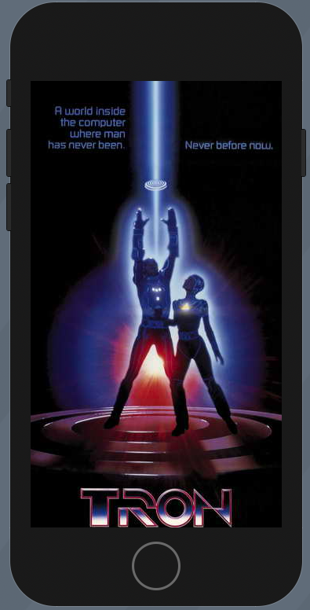

# Moonshot

## Resizing images to fir the screen using GeometryReader

Images by default will want to be shown at their native size. But we can resize them using `GeometryReader`.

Starting with a regular image.

```swift
struct ContentView: View {
    var body: some View {
        VStack {
            Image("Example")
        }
    }
}
```



We can attempt to set the frame like this.

```swift
Image("Example")
    .frame(width: 300, height: 300)
```

But that won't work as the image will still want to be full size.


We can clip it.

```swift
Image("Example")
    .frame(width: 300, height: 300)
    .clipped()
```


But that's still not exactly what we want. If we want the image *contents* to be resized too, we need to use the resizable() modidifer like this.

```swift
Image("Example")
    .resizable()
    .frame(width: 300, height: 300)
```


This is better but you can see how things are squished. To resize the image proportionally we need to use the `aspectRatio()` modifier which has too settings:

- `.fit` fit the entire image inside the container even if that means leasing some parts of the view empty
- `.fill` fill the view so it has no empty parts even if that means part of the image lies outside the container

### fit

```swift
Image("Example")
    .resizable()
    .aspectRatio(contentMode: .fit)
    .frame(width: 300, height: 300)
```


### fill

```swift
Image("Example")
    .resizable()
    .aspectRatio(contentMode: .fill)
    .frame(width: 300, height: 300)
```


This works fine if we want fixed-sized images. But more often we want images that automatically scale up fill the width of the entire screen.

That is what `GeometryReader` is for. It can do a lot but for now we are just going to have it make our image fill the screen.

### GeometryReader

Is a view just like the others we've seen, except when we create it we'll be handed a `GeometryProxy` which lets us query our environment and ask things like how big is the container, what position is our view, are there any insets, are we in a safeArea etc.

```swift
VStack {
    GeometryReader { geo in
        Image("Example")
            .resizable()
            .aspectRatio(contentMode: .fit)
            .frame(width: geo.size.width, height: 300)
    }
}
```


No our image will fill the width of the screen regardless of the device because of this line here.

```swift
.frame(width: geo.size.width, ...
```

For our final trick what what happens if we remove the height.

```swift
VStack {
    GeometryReader { geo in
        Image("Example")
            .resizable()
            .aspectRatio(contentMode: .fit)
            .frame(width: geo.size.width)
    }
}
```

We've given SwiftUI enough information that it can automatically figure out the height based on the original width, our target width, and our content mode. It will make the height proportional to the width.

### Links that help

- [Moonshot Intro](https://www.hackingwithswift.com/books/ios-swiftui/moonshot-introduction)
