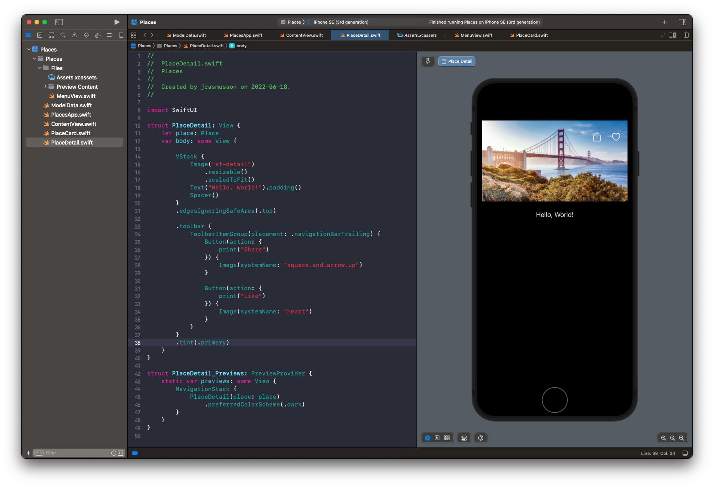
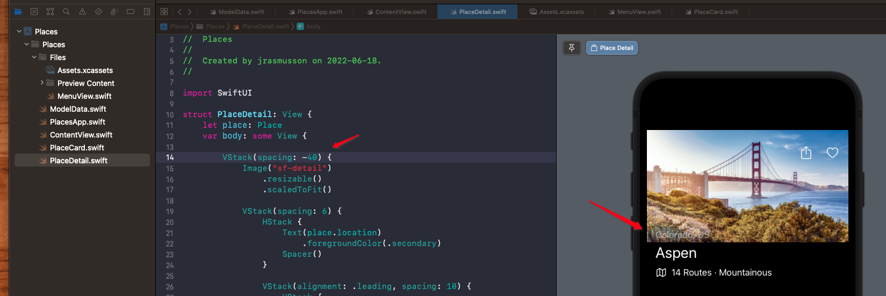
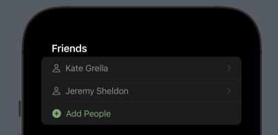

# Places

- [Video](https://developer.apple.com/videos/play/wwdc2022/10001/)

## Home

**ContentView**


```swift
import SwiftUI

enum Tab {
    case places
    case itineraries
    case profile
}

struct ContentView: View {
    @EnvironmentObject var modelData: ModelData
    @State var selection: Tab = .places

    var body: some View {
        TabView(selection: $selection) {
            NavigationStack {
                ScrollView {
                    ForEach(modelData.places) { place in
                        NavigationLink(value: place) {
                            PlaceCard(place: place)
                        }
                    }
                }
                .navigationTitle("Places")
                .navigationDestination(for: Place.self) { item in
                    PlaceDetail(place: place)
                }
            }
            .tabItem {
                Label("Places", systemImage: "rectangle.fill.on.rectangle.angled.fill")
            }
            .tag(Tab.places)

            Text("Itineraries")
                .tabItem {
                    Label("Itineraries", systemImage: "list.bullet")
                }
                .tag(Tab.itineraries)

            Text("Profile")
                .tabItem {
                    Label("Profile", systemImage: "person.fill")
                }
                .tag(Tab.profile)
        }
        .accentColor(appColor)
    }
}

struct ContentView_Previews: PreviewProvider {
    static var previews: some View {
        ContentView()
            .preferredColorScheme(.dark)
            .environmentObject(ModelData())
    }
}
```

**PlaceCard**


```swift
import SwiftUI

struct PlaceCard: View {
    let place: Place

    var body: some View {
        VStack(spacing: 6) {
            HStack {
                Text(place.location)
                    .foregroundColor(.secondary)
                Spacer()
                Menu {
                    Button("Share", action: share)
                    Button("Save as PDF", action: saveAsPDF)
                } label: {
                    Image(systemName: "ellipsis.circle")
                        .tint(.primary)
                }
            }

            VStack(alignment: .leading, spacing: 10) {
                HStack {
                    Text(place.title)
                        .font(.title)
                    Spacer()
                }

                HStack {
                    Image(systemName: "map")
                    Text(place.subTitle)
                    Spacer()
                }

                Image(place.imageName)
                    .resizable()
                    .scaledToFit()
                    .cornerRadius(10)
            }
            .foregroundColor(.primary)
        }
        .padding()
        .background(.thinMaterial)
        .cornerRadius(10)
    }

    func share() {  }
    func saveAsPDF() {  }
}

struct PlaceCard_Previews: PreviewProvider {
    static var previews: some View {
        PlaceCard(place: place)
            .preferredColorScheme(.dark)
    }
}
```

**PlaceDetail**


```swift
import SwiftUI

struct PlaceDetail: View {
    let place: Place

    var body: some View {
        VStack {
            header
            title
            noteworthy
            Spacer()
        }
        .edgesIgnoringSafeArea(.top)
        .toolbar {
            toolBarItems
        }
        .tint(.primary)
    }

    var header: some View {
        Image("sf-detail")
            .resizable()
            .scaledToFit()
    }

    var title: some View {
        VStack(spacing: 6) {
            HStack {
                Text(place.location)
                    .foregroundColor(.secondary)
                Spacer()
            }

            VStack(alignment: .leading, spacing: 10) {
                HStack {
                    Text(place.title)
                        .font(.title)
                    Spacer()
                }

                HStack {
                    Image(systemName: "map")
                    Text(place.subTitle)
                    Spacer()
                }
            }
            .foregroundColor(.primary)
        }
        .padding()
    }

    var noteworthy: some View {
        List(place.noteworthy) { worthy in
            NavigationLink(value: worthy) {
                NoteworthyRow(noteworthy: worthy)
            }
            .navigationDestination(for: Noteworthy.self) { detail in
                NoteworthyDetail(noteworthy: detail)
            }
        }
        .scrollDisabled(true)
    }

    var toolBarItems: ToolbarItemGroup<TupleView<(Button<Image>, Button<Image>)>> {
        ToolbarItemGroup(placement: .navigationBarTrailing) {
            Button(action: {
                print("Share")
            }) {
                Image(systemName: "square.and.arrow.up")
            }

            Button(action: {
                print("Like")
            }) {
                Image(systemName: "heart")
            }
        }
    }
}

struct PlaceDetail_Previews: PreviewProvider {
    static var previews: some View {
        NavigationStack {
            PlaceDetail(place: place)
                .preferredColorScheme(.dark)
        }
    }
}
```

**NoteworthyRow**


```swift
import SwiftUI

struct NoteworthyRow: View {
    let noteworthy: Noteworthy
    let size: CGFloat = 48

    var body: some View {
        HStack {
            Image(systemName: noteworthy.iconName)
                .foregroundColor(appColor)
                .frame(width: size, height: size)
                .background(.ultraThinMaterial)
                .cornerRadius(10)

            VStack(alignment: .leading) {
                Text(noteworthy.title)
                    .font(.headline)
                Text(noteworthy.description)
                    .font(.subheadline)
                    .foregroundColor(.secondary)
            }
        }
        .cornerRadius(10)
    }
}

struct NoteworthyRow_Previews: PreviewProvider {
    static var previews: some View {
        NoteworthyRow(noteworthy: noteworthy1)
            .preferredColorScheme(.dark)
    }
}
```

## Itinerary

**ItinerariesView**


```swift
import SwiftUI

struct ItinerariesView: View {
    @EnvironmentObject var modelData: ModelData
    @State var showingAddItinerary = false

    var body: some View {
        NavigationStack {
            ScrollView {
                ForEach(modelData.itineraries) { itinerary in
                    NavigationLink(value: itinerary) {
                        ItineraryCard(itinerary: itinerary)
                            .padding()
                    }
                }
            }
            .toolbar {
                Button(action: {
                    self.showingAddItinerary.toggle()
                }) {
                    Image(systemName: "plus")
                }
                .foregroundColor(appColor)
            }
            .navigationTitle("Itineraries")
            .navigationDestination(for: Itinerary.self) { item in
                ItineraryDetail()
            }
            .fullScreenCover(isPresented: $showingAddItinerary) {
                AddItineraryView()
            }
        }
    }
}
```

**ItineraryCard**


```swift
struct ItineraryCard: View {
    let itinerary: Itinerary

    var body: some View {
        VStack(alignment: .leading) {
            Image(itinerary.imageName)
                .resizable()
                .scaledToFit()
            VStack(alignment: .leading) {
                Text(itinerary.subtitle)
                    .font(.subheadline)
                    .foregroundColor(.secondary)
                Text(itinerary.title)
                    .font(.title)
                    .foregroundColor(.primary)
                Text(itinerary.friends)
                    .font(.subheadline)
                    .foregroundColor(.secondary)
            }
            .padding()
        }
        .background(.thinMaterial)
        .cornerRadius(10)
    }
}
```
**AddItineraryView**


Because containers always want to fill the space provided to them, we can use `frame()` here to limit the height of each view.

```swift
struct AddItineraryView: View {
    var body: some View {
        NavigationStack {
            VStack(alignment: .leading) {
                TripDetailsView()
                    .frame(width: .infinity, height: 200)
                FriendDetails()
                    .frame(width: .infinity, height: 200)
                Spacer()
            }
                .toolbar {
                    ToolbarItem(placement: .navigationBarTrailing) {
                        Button("Add") {
                            print("Trailing")
                        }.foregroundColor(appColor)
                    }
                    ToolbarItem(placement: .navigationBarLeading) {
                        Button("Cancel") {
                            print("Pressed")
                        }.foregroundColor(appColor)
                    }
                }
                .navigationTitle("New Itinerary")
                .navigationBarTitleDisplayMode(.inline)
        }
    }
}
```

**TripDetailsView**


```swift
struct TripDetailsView: View {
    var body: some View {
        List {
            Section(header: Text("Trip Details")) {
                CityRow()
                DateRow(titleKey: "Start Date")
                DateRow(titleKey: "End Date")
            }
            .headerProminence(.increased)
        }
    }
}
```

**CityRow**



```swift
struct CityRow: View {
    var body: some View {
        HStack {
            Text("City")
            Spacer()
            Text("San Francisco")
                .foregroundColor(.secondary)
        }
    }
}
```

**DateRow**



```swift
struct DateRow: View {
    @State private var date = Date()
    let titleKey: String

    var body: some View {
        DatePicker(
            titleKey,
            selection: $date,
            displayedComponents: [.date]
        )
    }
}
```

**FriendDetails**



Here the chevoron gets added because we embed the `FriendRow` inside a `NavigationLink`. So no need to add manually.

```swift
struct FriendDetails: View {
    @State var showingAddFriend = false

    var body: some View {
        List {
            Section(header: Text("Friends")) {
                NavigationLink {
                    Text("Kate Grella")
                } label: {
                    FriendRow(fullname: "Kate Grella")
                }
                NavigationLink {
                    Text("Jeremy Sheldon")
                } label: {
                    FriendRow(fullname: "Jeremy Sheldon")
                }
                Button(action: {
                    self.showingAddFriend.toggle()
                }) {
                    AddFriendRow()
                }
                .foregroundColor(appColor)
            }
            .headerProminence(.increased)
        }
        .sheet(isPresented: $showingAddFriend) {
            Text("Add friend")
        }
    }
}
```

**FriendRow**


```swift
struct FriendRow: View {
    let fullname: String
    var body: some View {
        HStack {
            Image(systemName: "person")
            Text(fullname)
            Spacer()
        }
    }
}
```

**AddFriendRow**


No chevron added here.

```swift
struct AddFriendRow: View {
    var body: some View {
        HStack {
            Image(systemName: "plus.circle.fill")
            Text("Add People")
            Spacer()
        }
        .foregroundColor(appColor)
    }
}
```
