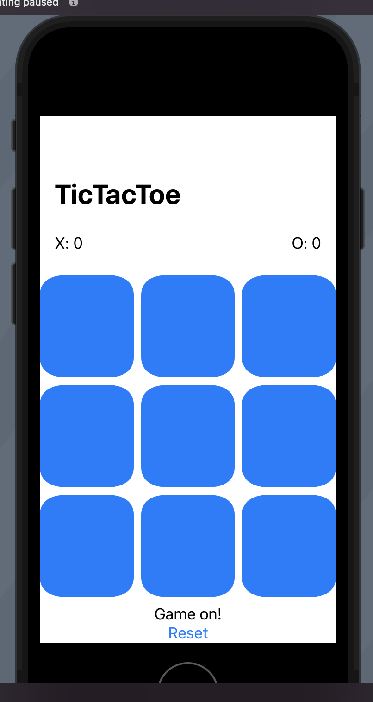
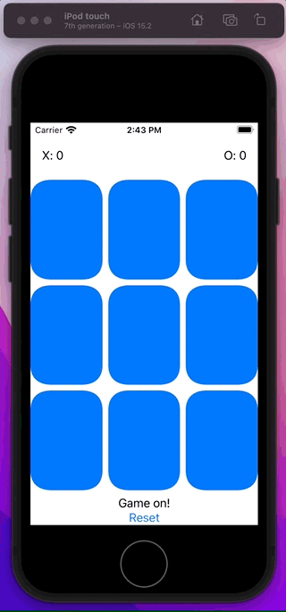
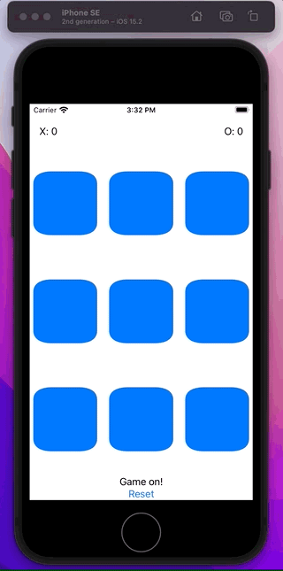

# TicTacToe

In this tutorial, together, we are going to build tic-tac-toe. Along the way you are going to learn about:

- SwiftUI
- Views
- State management
- General mechanics, along with 
- How to think about building SwiftUI applications
- thought processes that need to change when building SwiftUI 


If you want to just get the app up and running, scroll down to the bottom and look for a section called `Full Source`.

If you want to build the app from scratch with me, follow along. Let's start with the UI.

## Drawing a tile

Everything is a view in SwiftUI. So here will will define some `Positions` for our game, implement the tile as something that looks like a button, and put it in in a series of stacks.



**ContentView**

```swift
import SwiftUI

enum Position {
    case upperLeft
    case upperMiddle
    case upperRight
    case middleLeft
    case middleMiddle
    case middleRight
    case lowerLeft
    case lowerMiddle
    case lowerRight
}

struct ContentView: View {

    var body: some View {
        VStack {
            header
            HStack {
                button(for: .upperLeft)
                button(for: .upperMiddle)
                button(for: .upperRight)
            }
            HStack {
                button(for: .middleLeft)
                button(for: .middleMiddle)
                button(for: .middleRight)
            }
            HStack {
                button(for: .lowerLeft)
                button(for: .lowerMiddle)
                button(for: .lowerRight)
            }
            footer
        }
        .navigationTitle("TicTacToe")
    }

    var header: some View {
        HStack {
            Text("X: 0")
            Spacer()
            Text("O: 0")
        }.padding()
    }

    func button(for position: Position) -> some View {
        GridButtonView()
    }

    var footer: some View {
        VStack {
            Text("Game on!")
            resetButton
        }
    }

    var resetButton: some View {
        Button("Reset", action: {  })
    }
}

struct GridButtonView: View {

    var body: some View {
        Image(systemName: "x.square.fill")
            .resizable()
            .foregroundColor(.blue)
    }
}

struct ContentView_Previews: PreviewProvider {
    static var previews: some View {
        ContentView()
    }
}
```

## Selecting an X or an O

Everything in SwiftUI is state driven:

- You want to change your layout? Change your state.
- You want update your view? Change your state.
- You want an animation to occur? Change your state.

There are many ways to track and manage state in Swift UI (see this [write-up](https://github.com/jrasmusson/swiftui/tree/main/Dataflow/HowItWorks) on data flow).

He are going to pull all our state in to a `ViewModel` and back it with a `Model` object.


When an `event` occurs in the UI, we are going to capture that and pass that message as an `intent` to our viewModel. The viewModel will take that `intent` and `delegate` it to the model which in turn updates the game state. Because the state has changed, and because we pass the viewModel into the view, the view can observe this change of state and update its UI approprirately.

Here is what that looks like for selecting an X or an O.



**ContentView**

```swift
//
//  ContentView.swift
//  TicTacToeTutorial
//
//  Created by jrasmusson on 2022-05-07.
//

import SwiftUI

enum Value: CustomStringConvertible {
    case b, x, o

    var description: String {
        switch self {
        case .b: return "-"
        case .x: return "X"
        case .o: return "O"
        }
    }
}

enum Position {
    case upperLeft
    case upperMiddle
    case upperRight
    case middleLeft
    case middleMiddle
    case middleRight
    case lowerLeft
    case lowerMiddle
    case lowerRight
}

struct TileState {
    var value: Value
    var isLocked: Bool = false
    var isX: Bool { value == .x }

    static func blank() -> TileState {
        TileState(value: .b)
    }
}

struct Model {
    private var state: [[TileState]] = [
        [TileState.blank(), TileState.blank(), TileState.blank()],
        [TileState.blank(), TileState.blank(), TileState.blank()],
        [TileState.blank(), TileState.blank(), TileState.blank()]
    ]

    mutating func set(_ position: Position, _ tileState: TileState) {
        switch position {
        case .upperLeft:
            state[0][0] = tileState
        case .upperMiddle:
            state[0][1] = tileState
        case .upperRight:
            state[0][2] = tileState
        case .middleLeft:
            state[1][0] = tileState
        case .middleMiddle:
            state[1][1] = tileState
        case .middleRight:
            state[1][2] = tileState
        case .lowerLeft:
            state[2][0] = tileState
        case .lowerMiddle:
            state[2][1] = tileState
        case .lowerRight:
            state[2][2] = tileState
        }
    }

    func get(_ position: Position) -> TileState {
        switch position {
        case .upperLeft:
            return state[0][0]
        case .upperMiddle:
            return state[0][1]
        case .upperRight:
            return state[0][2]
        case .middleLeft:
            return state[1][0]
        case .middleMiddle:
            return state[1][1]
        case .middleRight:
            return state[1][2]
        case .lowerLeft:
            return state[2][0]
        case .lowerMiddle:
            return state[2][1]
        case .lowerRight:
            return state[2][2]
        }
    }

    private var _isXTurn = false

    var isXTurn: Bool {
        _isXTurn
    }

    mutating func toggleTurn() {
        self._isXTurn.toggle()
    }
}

class ViewModel: ObservableObject {
    @Published private var model = Model()

    func choose(_ position: Position) {
        var tileState: TileState
        if isXTurn {
            tileState = TileState(value: .x, isLocked: true)
        } else {
            tileState = TileState(value: .o, isLocked: true)
        }
        model.set(position, tileState)
    }

    func set(_ position: Position, _ state: TileState) {
        model.set(position, state)
    }

    func get(_ position: Position) -> TileState {
        model.get(position)
    }

    var isXTurn: Bool {
        model.isXTurn
    }

    func toggleTurn() {
        model.toggleTurn()
    }
}

struct ContentView: View {
    @ObservedObject var viewModel: ViewModel

    var body: some View {
        VStack {
            header
            HStack {
                button(for: .upperLeft)
                button(for: .upperMiddle)
                button(for: .upperRight)
            }
            HStack {
                button(for: .middleLeft)
                button(for: .middleMiddle)
                button(for: .middleRight)
            }
            HStack {
                button(for: .lowerLeft)
                button(for: .lowerMiddle)
                button(for: .lowerRight)
            }
            footer
        }
        .navigationTitle("TicTacToe")
    }

    var header: some View {
        HStack {
            Text("X: 0")
            Spacer()
            Text("O: 0")
        }.padding()
    }

    func button(for position: Position) -> some View {
        let tileState = viewModel.get(position)

        return GridButtonView(tileState: tileState)
            .onTapGesture {
                viewModel.choose(position)
                viewModel.toggleTurn()
            }
    }

    var footer: some View {
        VStack {
            Text("Game on!")
            resetButton
        }
    }

    var resetButton: some View {
        Button("Reset", action: {  })
    }
}

struct GridButtonView: View {
    let tileState: TileState

    var body: some View {
        if tileState.isLocked {
            Image(systemName: tileState.isX ? "x.square.fill" : "o.square.fill")
                .resizable()
                .foregroundColor(.blue)
        } else {
            Image(systemName: "placeholdertext.fill")
                .resizable()
                .foregroundColor(.blue)
        }
    }
}

struct ContentView_Previews: PreviewProvider {
    static var previews: some View {
        NavigationView {
            ContentView(viewModel: ViewModel())
                .previewDevice(PreviewDevice(rawValue: "iPhone 12"))
                .previewDisplayName("iPhone 12")
        }
    }
}
```

### ViewModel is a an Observable Publisher class

```swift
class ViewModel: ObservableObject {
    @Published private var model = Model()
```

This is about the only time you will see a `class` in SwiftUI - in a ViewModel. ViewModels have to be class based because Swift needs to keep these objects around and have references to them. They have to maintain their state.

`@Published` is how the viewModel tells the world what it is going to update.

So when we pass a viewModel to a SwiftUI, we bind it to the viewModels state like this:

**ContentView**

```swift
struct ContentView: View {
    @ObservedObject var viewModel: ViewModel // redraw if this changes
    ...    
}

struct ContentView_Previews: PreviewProvider {
    static var previews: some View {
        NavigationView {
            ContentView(viewModel: ViewModel())
        }
    }
}
```


### ViewModels capture intents

Intents are actions that occur in the UI that we want to react to - usually by updating our model. I got this term from Paul Hagerty and his excellent [SwiftUI Stanford course](https://cs193p.sites.stanford.edu/).

Here you can see two intents for when the user taps a tile - choose a position as well as toggle the turn.

**ContentView**

```swift
struct ContentView: View {
    @ObservedObject var viewModel: ViewModel // redraw if this changes
    
    func button(for position: Position) -> some View {
        let tileState = viewModel.get(position)

        return GridButtonView(tileState: tileState)
            .onTapGesture {
                viewModel.choose(position) // intent
                viewModel.toggleTurn() // intent
            }
    }    
}
```

When we call these the viewModel takes these actions and delegate them to the model.

**ViewModel**

```swift
class ViewModel: ObservableObject {
    @Published private var model = Model()

    func choose(_ position: Position) {
        var tileState: TileState
        if isXTurn {
            tileState = TileState(value: .x, isLocked: true)
        } else {
            tileState = TileState(value: .o, isLocked: true)
        }
        model.set(position, tileState)
    }

    func toggleTurn() {
        model.toggleTurn()
    }
}
```

The viewModel can then takes these and update he underlying model backing the game - a `struct` called Model.

### ViewModels can optionally delegate to Models

We didn't have to store the state in a separate model. I choose to just to show you what this would look like.

**Model**

```swift
struct Model {
    private var state: [[TileState]] = [
        [TileState.blank(), TileState.blank(), TileState.blank()],
        [TileState.blank(), TileState.blank(), TileState.blank()],
        [TileState.blank(), TileState.blank(), TileState.blank()]
    ]

    mutating func set(_ position: Position, _ tileState: TileState) {
        switch position {
        case .upperLeft:
            state[0][0] = tileState
        case .upperMiddle:
            state[0][1] = tileState
        case .upperRight:
            state[0][2] = tileState
        case .middleLeft:
            state[1][0] = tileState
        case .middleMiddle:
            state[1][1] = tileState
        case .middleRight:
            state[1][2] = tileState
        case .lowerLeft:
            state[2][0] = tileState
        case .lowerMiddle:
            state[2][1] = tileState
        case .lowerRight:
            state[2][2] = tileState
        }
    }

    func get(_ position: Position) -> TileState {
        switch position {
        case .upperLeft:
            return state[0][0]
        case .upperMiddle:
            return state[0][1]
        case .upperRight:
            return state[0][2]
        case .middleLeft:
            return state[1][0]
        case .middleMiddle:
            return state[1][1]
        case .middleRight:
            return state[1][2]
        case .lowerLeft:
            return state[2][0]
        case .lowerMiddle:
            return state[2][1]
        case .lowerRight:
            return state[2][2]
        }
    }

    private var _isXTurn = false

    var isXTurn: Bool {
        _isXTurn
    }

    mutating func toggleTurn() {
        self._isXTurn.toggle()
    }
}
```

The model is where we store the state of the game. It is the source of truth if you will. Whenever the viewModel wants to know what's going on, it just asks the model. And whever it wants to know the state of something, it just asks.
 
### Use mutating to change a structs state

I have chosen to make the model a `struct` because that is typically what we like to use in Swift - structs.

We could have made this a class. And we could have made it remember it's state. But struct is nice because we prefer structs over classes when working in Swift. And because it is preferred, we need to add `mutuating` to any methods that can alter the structs state.

```swift
mutating func toggleTurn() {
    self._isXTurn.toggle()
}
```

Structs are preferred because they align with the more functional nature of Swift programming, and the are a cheaper, less expensive object that a class which gets stored on something called the heap. 

## Adding more state

Once you wrap your head around this View > ViewModel > Model paradigm working with SwiftUI gets a lot easier.

You know that if you want anything to happen in the UI, you need to make a change in the state of something.

So if we want to reset the game we need to capture the intent in the form of an event

**ContentView**

```swift
var resetButton: some View {
    Button("Reset", action: { viewModel.reset() }) // intent
}
```

Deal with it in our viewModel.

**ViewModel**

```swift
func reset() {
    model.reset()
}
```

Update the state by mutating the game state struct.

**Model**

```swift
mutating func reset() {
    state = resetState
    setGameState(.newGame)
}
```

Which will in turn update the view.

That's really all there is to SwiftUI. Changing state. And letting state drive the view.

## One more thing

One thing I found confusing while learning SwiftUI is that it looked like you can type code when returning `some View` but it turns out you can.


You can:

- define `vars` and `lets`
- use `if` and `switch` statements

But you shouldn't view this area as general code behind like we did with view controllers in UIKit.

This section is all about returning `some View`. It's not for general programming. So if write some code in here, and have it react to changes in state, just remember to add `return` in front of whatever view are are returning

## What's that thing called GeometryReader

The GeometryReader is a view container that tells you how much space your view has to display itself.

You can use it like this to get back a `proxy` object that will tell you the size SwiftUI would like to offer your view.

You can then use a multiplier of somekind to adjust your view so it renders nicely on devices or any size.

```swift
func button(for position: Position) -> some View {
    let tileState = viewModel.get(position)
    let reduceFactor = 0.9
    return GeometryReader { proxy in
        GridButtonView(tileState: tileState, width: proxy.size.width * reduceFactor)
            .onTapGesture {
                if !viewModel.isGameOver && !tileState.isLocked {
                    viewModel.choose(position)
                    viewModel.toggleTurn()
                }
            }
            .frame(width: proxy.size.width, height: proxy.size.height)
    }
}
```

## Full source



```
//
//  ContentView.swift
//  TicTacToe2
//
//  Created by jrasmusson on 2022-05-01.
//

import SwiftUI

enum Value: CustomStringConvertible {
    case b, x, o

    var description: String {
        switch self {
        case .b: return "-"
        case .x: return "X"
        case .o: return "O"
        }
    }
}

enum Position {
    case upperLeft
    case upperMiddle
    case upperRight
    case middleLeft
    case middleMiddle
    case middleRight
    case lowerLeft
    case lowerMiddle
    case lowerRight
}

enum GameState: CustomStringConvertible {
    case newGame, draw, XWon, OWon

    var description: String {
        switch self {
        case .newGame: return "Game on!"
        case .draw: return "Draw!"
        case .XWon: return "X wins!"
        case .OWon: return "O wins!"
        }
    }
}

struct TileState {
    var value: Value
    var isLocked: Bool = false
    var isX: Bool { value == .x }

    static func blank() -> TileState {
        TileState(value: .b)
    }
}

struct Model {
    private var state: [[TileState]] = [
        [TileState.blank(), TileState.blank(), TileState.blank()],
        [TileState.blank(), TileState.blank(), TileState.blank()],
        [TileState.blank(), TileState.blank(), TileState.blank()]
    ]

    private var resetState: [[TileState]] = [
        [TileState.blank(), TileState.blank(), TileState.blank()],
        [TileState.blank(), TileState.blank(), TileState.blank()],
        [TileState.blank(), TileState.blank(), TileState.blank()]
    ]

    mutating func set(_ position: Position, _ tileState: TileState) {
        switch position {
        case .upperLeft:
            state[0][0] = tileState
        case .upperMiddle:
            state[0][1] = tileState
        case .upperRight:
            state[0][2] = tileState
        case .middleLeft:
            state[1][0] = tileState
        case .middleMiddle:
            state[1][1] = tileState
        case .middleRight:
            state[1][2] = tileState
        case .lowerLeft:
            state[2][0] = tileState
        case .lowerMiddle:
            state[2][1] = tileState
        case .lowerRight:
            state[2][2] = tileState
        }

        if isGameOver {
            if isDraw {
                setGameState(.draw)
            } else if valueWins(.x) {
                setGameState(.XWon)
                incrementXScore()
            } else if valueWins(.o) {
                setGameState(.OWon)
                increment0Score()
            }
        }
    }

    func get(_ position: Position) -> TileState {
        switch position {
        case .upperLeft:
            return state[0][0]
        case .upperMiddle:
            return state[0][1]
        case .upperRight:
            return state[0][2]
        case .middleLeft:
            return state[1][0]
        case .middleMiddle:
            return state[1][1]
        case .middleRight:
            return state[1][2]
        case .lowerLeft:
            return state[2][0]
        case .lowerMiddle:
            return state[2][1]
        case .lowerRight:
            return state[2][2]
        }
    }

    private var _isXTurn = false
    private var _isGameOver = false
    private var _gameState = GameState.newGame
    private var _xScore = 0
    private var _oScore = 0

    var isXTurn: Bool {
        _isXTurn
    }

    var isGameOver: Bool {
        return hasWinCondition || isDraw
    }

    mutating func toggleTurn() {
        self._isXTurn.toggle()
    }

    var hasWinCondition: Bool {
        valueWins(.x) || valueWins(.o)
    }

    private mutating func setGameState(_ gameState: GameState) {
        _gameState = gameState
    }

    var gameState: GameState {
        _gameState
    }

    var xScore: Int {
        _xScore
    }

    var oScore: Int {
        _oScore
    }

    mutating func incrementXScore() {
        _xScore += 1
    }

    mutating func increment0Score() {
        _oScore += 1
    }

    var isDraw: Bool {
        let row0 = state[0]
        let row1 = state[1]
        let row2 = state[2]

        let row0Locked = row0.filter { $0.isLocked }.count == 3
        let row1Locked = row1.filter { $0.isLocked }.count == 3
        let row2Locked = row2.filter { $0.isLocked }.count == 3

        let allRowsLocked = row0Locked && row1Locked && row2Locked

        return !hasWinCondition && allRowsLocked
    }

    private func valueWins(_ v: Value) -> Bool {
        guard v != .b else { return false }

        // rows
        if state[0][0].value == v && state[0][1].value == v && state[0][2].value == v { return true }
        if state[1][0].value == v && state[1][1].value == v && state[1][2].value == v { return true }
        if state[2][0].value == v && state[2][1].value == v && state[2][2].value == v { return true }

        // cols
        if state[0][0].value == v && state[1][0].value == v && state[2][0].value == v { return true }
        if state[0][1].value == v && state[1][1].value == v && state[2][1].value == v { return true }
        if state[0][2].value == v && state[1][2].value == v && state[2][2].value == v { return true }

        // diagonals
        if state[0][0].value == v && state[1][1].value == v && state[2][2].value == v { return true }
        if state[0][2].value == v && state[1][1].value == v && state[2][0].value == v { return true }

        return false
    }

    mutating func reset() {
        state = resetState
        setGameState(.newGame)
    }
}

class ViewModel: ObservableObject {
    @Published private var model = Model()

    func choose(_ position: Position) {
        let currentState = model.get(position)
        guard !currentState.isLocked else { return }

        var tileState: TileState
        if isXTurn {
            tileState = TileState(value: .x, isLocked: true)
        } else {
            tileState = TileState(value: .o, isLocked: true)
        }
        model.set(position, tileState)
    }

    func set(_ position: Position, _ state: TileState) {
        model.set(position, state)
    }

    func get(_ position: Position) -> TileState {
        model.get(position)
    }

    var isXTurn: Bool {
        model.isXTurn
    }

    func toggleTurn() {
        model.toggleTurn()
    }

    var hasWinCondition: Bool {
        model.hasWinCondition
    }

    var isGameOver: Bool {
        model.isGameOver
    }

    var gameState: GameState {
        model.gameState
    }

    var xScore: Int {
        model.xScore
    }

    var oScore: Int {
        model.oScore
    }

    func reset() {
        model.reset()
    }
}

struct ContentView: View {
    @ObservedObject var viewModel: ViewModel

    var body: some View {
        VStack {
            header
            HStack {
                button(for: .upperLeft)
                button(for: .upperMiddle)
                button(for: .upperRight)
            }
            HStack {
                button(for: .middleLeft)
                button(for: .middleMiddle)
                button(for: .middleRight)
            }
            HStack {
                button(for: .lowerLeft)
                button(for: .lowerMiddle)
                button(for: .lowerRight)
            }
            footer
        }
    }

    var header: some View {
        HStack {
            Text("X: \(viewModel.xScore)")
            Spacer()
            Text("O: \(viewModel.oScore)")
        }.padding()
    }

    func button(for position: Position) -> some View {
        let tileState = viewModel.get(position)
        return GridButtonView(tileState: tileState)
            .onTapGesture {
                if !viewModel.isGameOver && !tileState.isLocked {
                    viewModel.choose(position)
                    viewModel.toggleTurn()
                }
            }
    }

    var footer: some View {
        VStack {
            Text(viewModel.gameState.description)
            resetButton
        }
    }

    var resetButton: some View {
        Button("Reset", action: { viewModel.reset() })
    }
}

struct GridButtonView: View {
    let tileState: TileState

    var body: some View {
        if tileState.isLocked {
            Image(systemName: tileState.isX ? "x.square.fill" : "o.square.fill")
                .resizable()
                .frame(width: 100, height: 100)
                .foregroundColor(.blue)
        } else {
            Image(systemName: "placeholdertext.fill")
                .resizable()
                .frame(width: 100, height: 100)
                .foregroundColor(.blue)
        }
    }
}

struct ContentView_Previews: PreviewProvider {
    static var previews: some View {
        let viewModel = ViewModel()
        ContentView(viewModel: viewModel)
    }
}
```

# Dynamically sizing views

Would be nice if our app could dynamically resize itself based on the space offered. For that we have `GeometryReader`.

> Note: Using `GeometryRead` itself changes view.

Because `GeometryReader` always wants to take all the space affored to it, wrapping your dynamically size view in one will change the layout itself. Can see this in the before and after.

```
func button(for position: Position) -> some View {
    let tileState = viewModel.get(position)
    let reduceFactor = 0.8
    return GeometryReader { proxy in
        GridButtonView(tileState: tileState, width: proxy.size.width * reduceFactor)
            .onTapGesture {
                if !viewModel.isGameOver && !tileState.isLocked {
                    viewModel.choose(position)
                    viewModel.toggleTurn()
                }
            }
            .frame(width: proxy.size.width, height: proxy.size.height)
    }
}

struct ContentView_Previews: PreviewProvider {
    static var previews: some View {
        NavigationView {
            ContentView(viewModel: ViewModel())
                .previewDevice(PreviewDevice(rawValue: "iPhone 12"))
                .previewDisplayName("iPhone 12")
        }

        NavigationView {
            ContentView(viewModel: ViewModel())
                .previewDevice(PreviewDevice(rawValue: "iPhone SE (2nd generation)"))
                .previewDisplayName("iPhone SE (2nd generation)")
        }
    }
}
```

## Tips

- Try building this yourself
- Experiment and play
- Pick something easy and have fun

## Couple more things

- Learn UIKit
- Create your own YouTube channel
- Keep up with the deliberate learning and practice
- Keep it up long enough and you'll get there!

Happy programming. Till next time 🚀.
