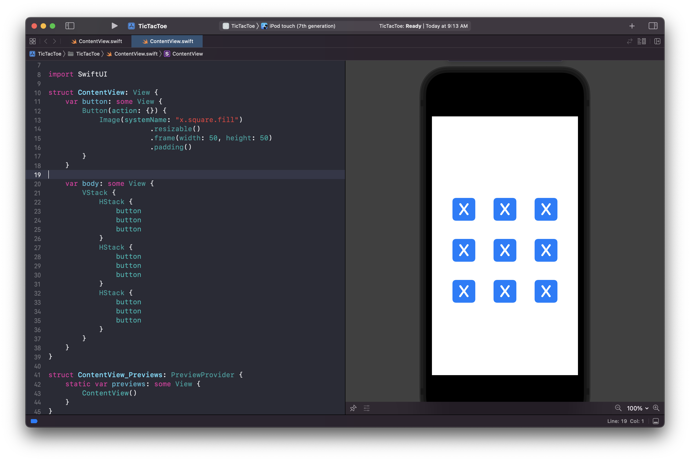
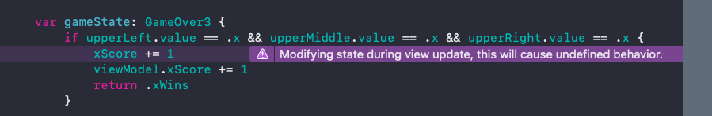

# TicTacToe

## Initial UI



```swift
struct ContentView: View {
    var button: some View {
        Button(action: {}) {
            Image(systemName: "x.square.fill")
                        .resizable()
                        .frame(width: 50, height: 50)
                        .padding()
        }
    }

    var body: some View {
        VStack {
            HStack {
                button
                button
                button
            }
            HStack {
                button
                button
                button
            }
            HStack {
                button
                button
                button
            }
        }
    }
}
```

## Experiment #1

## Experiment #2

## Game State

Perhaps the most confusing part - detecting the win conditions.

### Before

What I so wanted to do was...

```swift
// define a variable
@State var gameOver: GameOver = .draw

// Set it's state
Button(action: {
    gameOver = .xWins
}) {
    Text("Tap me!")
}

// Display the result
Text("Game over: \(gameOver.description)")
```

But that's the wrong way to think about it.
 
### After

Instead I should think:

> Don't set the state. Instead just react to it.

Each tile already knows its current value and state. All I need to do it react to it. 

So instead of tracking a win condition as a `var`, create a computed `var` and react to it.

**GridView**

```swift
// How we react
var gameState: GameOver {
    if upperLeft.value == .x && upperMiddle.value == .x && upperRight.value == .x {
        return .xWins
    }

    if upperLeft.value == .o && upperMiddle.value == .o && upperRight.value == .o {
        return .oWins
    }

    return .draw
}

// How we display
Text("Game over: \(gameState.description)")
```

Full source:

```swift

import SwiftUI

enum Position2 {
    case upperLeft
    case upperMiddle
    case upperRight
    case middleLeft
    case middleMiddle
    case middleRight
    case lowerLeft
    case lowerMiddle
    case lowerRight
}

struct TileState2 {
    var value: Value
    var isLocked: Bool = false
    var isX: Bool { value == .x }

    static func blank() -> TileState2 {
        TileState2(value: .b)
    }
}

enum GameOver: CustomStringConvertible {
    case xWins
    case oWins
    case draw

    var description: String {
        switch self {
        case .xWins:
            return "X wins!"
        case .oWins:
            return "O wins!"
        case .draw:
            return "Draw!"
        }
    }
}

struct GridView: View {
    @State var upperLeft = TileState2.blank()
    @State var upperMiddle = TileState2.blank()
    @State var upperRight = TileState2.blank()
    @State var middleLeft = TileState2.blank()
    @State var middleMiddle = TileState2.blank()
    @State var middleRight = TileState2.blank()
    @State var bottomLeft = TileState2.blank()
    @State var bottomMiddle = TileState2.blank()
    @State var bottomRight = TileState2.blank()

    @State var isXTurn = false

    var gameState: GameOver {
        if upperLeft.value == .x && upperMiddle.value == .x && upperRight.value == .x {
            return .xWins
        }

        if upperLeft.value == .o && upperMiddle.value == .o && upperRight.value == .o {
            return .oWins
        }

        return .draw
    }

    var body: some View {
        VStack {
            HStack {
                GridButtonView(tileState: $upperLeft, isXTurn: $isXTurn)
                GridButtonView(tileState: $upperMiddle, isXTurn: $isXTurn)
                GridButtonView(tileState: $upperRight, isXTurn: $isXTurn)
            }
            HStack {
                GridButtonView(tileState: $middleLeft, isXTurn: $isXTurn)
                GridButtonView(tileState: $middleMiddle, isXTurn: $isXTurn)
                GridButtonView(tileState: $middleRight, isXTurn: $isXTurn)
            }
            HStack {
                GridButtonView(tileState: $bottomLeft, isXTurn: $isXTurn)
                GridButtonView(tileState: $bottomMiddle, isXTurn: $isXTurn)
                GridButtonView(tileState: $bottomRight, isXTurn: $isXTurn)
            }
            // Don't think of setting state / think of reacting to it
            Text("Game over: \(gameState.description)")
        }
    }
}

struct GridButtonView: View {
    @Binding var tileState: TileState2
    @Binding var isXTurn: Bool

    var body: some View {
        Button(action: {
            if tileState.isLocked { return }
            tileState.isLocked = true
            tileState.value = isXTurn ? .x : .o
            isXTurn.toggle()
        }) {
            if tileState.isLocked {
                Image(systemName: tileState.isX ? "x.square.fill" : "o.square.fill")
                    .resizable()
                    .frame(width: 100, height: 100)
            } else {
                Image(systemName: "placeholdertext.fill")
                    .resizable()
                    .frame(width: 100, height: 100)
            }
        }
    }
}

struct GridView_Previews: PreviewProvider {
    static var previews: some View {
        GridView()
    }
}
```

## Keeping track of score

At this point I believe I have most of the game mechanics worked out. I can track the number of wins for each with a simple counter, along with a reset button to simulate the end of a match.

### Reset

```swift
Button(action: {
    reset()
}) {
    Text("Reset")
}

func reset() {
    upperLeft = TileState2.blank()
    upperMiddle = TileState2.blank()
    upperRight = TileState2.blank()
    middleLeft = TileState2.blank()
    middleMiddle = TileState2.blank()
    middleRight = TileState2.blank()
    bottomLeft = TileState2.blank()
    bottomMiddle = TileState2.blank()
    bottomRight = TileState2.blank()
}
```

### Incrementing the score

Let's start by adding some text, and verifying we can increment it with a button action.

```swift
@State var xScore = 0

Button(action: {
    xScore += 1
}) {
    Text("+1 X")
}
```

With that working, let's know increment the score when x wins:

```swift
var gameState: GameOver {
if upperLeft.value == .x && upperMiddle.value == .x && upperRight.value == .x {
    xScore += 1 //
    return .xWins
}
```

OK that doesn't work. There is some difference between incrementing `@State var` in an action and a computed `var`.

What I realized here is that views are OK for tracking local state with local actions, but they're terrible at tracking overall game state of things that are bigger that the view (like the score).

What I really need here is some `Observable` state object that can track my app state, and then draw the view everything that app state changes.

So let's try introducing a `ViewModel` and increment the score that way.

## Introducing the view model

```swift
class ViewModel3: ObservableObject {
    @Published var xScore = 0
}

struct GridView3: View {
    @ObservedObject var viewModel: ViewModel3

struct GridModelView_Previews: PreviewProvider {
    static var previews: some View {
        let viewModel = ViewModel3()
        GridView3(viewModel: viewModel)
    }
}
```

And then let's increment it everytime X wins:

```swift
var gameState: GameOver3 {
    if upperLeft.value == .x && upperMiddle.value == .x && upperRight.value == .x {
        xScore += 1
        viewModel.xScore += 1
        return .xWins
    }
```

If you try to incrment the score like this you will create an infinite loop resulting in undefined behavior. Xcode will even warn you with a warning message like this:



What's going on here is we are attempting to change the views state, which in turn causes it to re-render itself, and again change it's state. So chaning an `Observable` var in something that is part of a views update is not something we want to do.

So again... back to the question... where can we detect an `xWin` and react to it?

### Put all your data and processing in the view model

What you are struggling with here is the fact that SwiftUi `Views` aren't places for processing. They are dumb structs.

To track state, react to changes in state, and update state values you really need to collect and do all of that in your view model.

That means:

- putting everything into the view model
- doing all your checks and processing in there, and then
- simply allow the view to update itself base on that change

Let's setup a simple example to see how all this could work.

### Complete rewrite

Notice how this is a complete rewrite from what you had before. You are now pulling all the logic out of the views, and moving it to the `viewModel`. This feels much better and more natural with how SwiftUI works. Views are dumb. Processing is in the model.

```swift
class ViewModel3: ObservableObject {
    @Published var tileState = TileState3(value: .b)
    @Published var isXTurn = false

    func choose(_ position: Position3) {
        if isXTurn {
            tileState = TileState3(value: .x, isLocked: true)
        } else {
            tileState = TileState3(value: .o, isLocked: true)
        }
    }
}

struct GridView3: View {
    @ObservedObject var viewModel: ViewModel3

    var body: some View {
        VStack {
            HStack {
                GridButtonView3(tileState: viewModel.tileState)
                    .onTapGesture {
                        viewModel.choose(.upperLeft)
                    }
            }
        }
    }
}

struct GridButtonView3: View {
    let tileState: TileState3

    var body: some View {
        if tileState.isLocked {
            Image(systemName: tileState.isX ? "x.square.fill" : "o.square.fill")
                .resizable()
                .frame(width: 100, height: 100)
        } else {
            Image(systemName: "placeholdertext.fill")
                .resizable()
                .frame(width: 100, height: 100)
        }
    }
}

struct GridModelView_Previews: PreviewProvider {
    static var previews: some View {
        let viewModel = ViewModel3()
        GridView3(viewModel: viewModel)
    }
}
```

This is it. It feel much more natural. All our processing can happen in view model. Let's expand and go with this.


