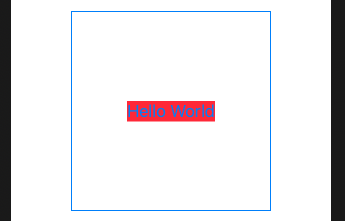
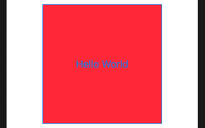
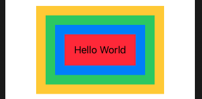

# Views and Modifiers


## Views

- Are immutable structs.
- They continuously get re-rendered based on state
- Contain only they which they need (inherit nothing).

### Only take the space they need

When you set the background behind a Text field many expect it to fill the entire screen. Except it doesn't.

```swift
struct ContentView: View {
    var body: some View {
        Text("Hello World")
            .background(Color.red)
    }
}
```


To fill the entire view you need to do this.

```swift
Text("Hello World")
    .frame(maxWidth: .infinity, maxHeight: .infinity)
    .background(Color.red)
```

There is nothing behind the SwiftUI views you put on screen. maxWidth means the view can take the max space. But if something else needs space, SwiftUI will accomodate it too.

[What is behind the manin SwiftUI view?](https://www.hackingwithswift.com/books/ios-swiftui/what-is-behind-the-main-swiftui-view)

## Why modifier order matters

When you apply a modifier to a SwiftUI view, you create a new view with that change applied. But the order in which we apply these matters.

```swift
Button("Hello World") {
    // do nothing
}    
.background(Color.red)
.frame(width: 200, height: 200)
```



```swift
Button("Hello World") {
    print(type(of: self.body))
}
.frame(width: 200, height: 200)
.background(Color.red)
```



Best way to think about this is that SwiftUI renders your view after every single modifier.

```swift
Text("Hello World")
        .padding()
        .background(Color.red)
        .padding()
        .background(Color.blue)
        .padding()
        .background(Color.green)
        .padding()
        .background(Color.yellow)
```



[Why modifier order matters](https://www.hackingwithswift.com/books/ios-swiftui/why-modifier-order-matters)

## Why does SwiftUI use “some View” for its view type?

Swift relies on *opaque return types* which means `some View` is one specifiic type that conforms to the `View` protocol, but we don't want to say what.

This is how SwiftUI let's us return any view we want in our body, without being specific, so long as it is the same view everytime.

Think of SwiftUI `View` like `Array`. It has a big whole in it that we need to fill with a type.

Which is why it would never make sense to do this:

`var body: View {`

but it's perfectly fine to do this:

`var body: some View {`

or this:

`var body: Text {`

The `View` protocol has an associated type attached to it, which is Swift's way of saying that `View` by iself doesn't mean anything - we need to say exactly what kind of view it is. It effectively has a hole in it, in just the same way Swift doesn't lus us say 'this variable is an array` and instad requires that we say what's *in* the array.

What `some View` lets us do is say 'this will return one specific type of view, such as Button or Text, but I don't want to say exactly that that type is.' So, the hole that View has will be filled by a real view, but we aren't required to write out the exact long type.

### TupleView

The way `VStack` handles its view internally is through a `TupleView`. If you create a VStack with two views, it creates a tuple holding exactly two views.

`TupleView` goes up to 10. WHich is why SwiftUI doesn't allow more thatn 10 views inside a parent. They wrote versions of `TupleView that handle 2 though 10, but no more.

- [Why some view?](https://www.hackingwithswift.com/books/ios-swiftui/why-does-swiftui-use-some-view-for-its-view-type)

## Environment modifiers

Environment modifiers are modifiers applied to an entire container.

```swift
VStack {
    Text("Gryffindor")
        .font(.largeTitle)
    Text("Hufflepuff")
    Text("Ravenclaw")
    Text("Slytherin")
}
.font(.caption)
```


But if a child view overrides the same modifer, the child preference takes priority.

Here `font` is an environment modifier. But not all modifiers are environment modifiers. `blur` for instance is a regular modifier, and it applies it's modifer to the entire stack, regardless of what the child says.

```swift
VStack {
    Text("Gryffindor")
        .blur(radius: 0)
    Text("Hufflepuff")
    Text("Ravenclaw")
    Text("Slytherin")
}
.blur(radius: 5)
```


- [Environment modifiers](https://www.hackingwithswift.com/books/ios-swiftui/environment-modifiers)

### Links that help

- [Start - Views and Modifiers](https://www.hackingwithswift.com/books/ios-swiftui/views-and-modifiers-introduction)
