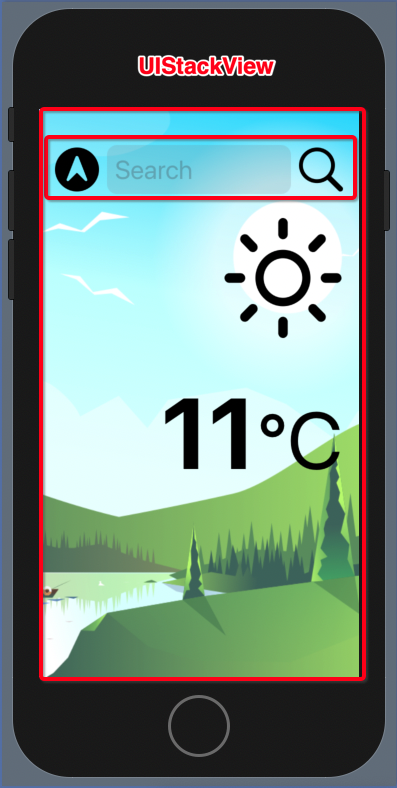
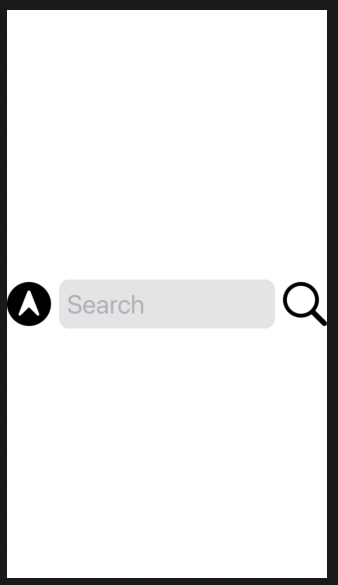
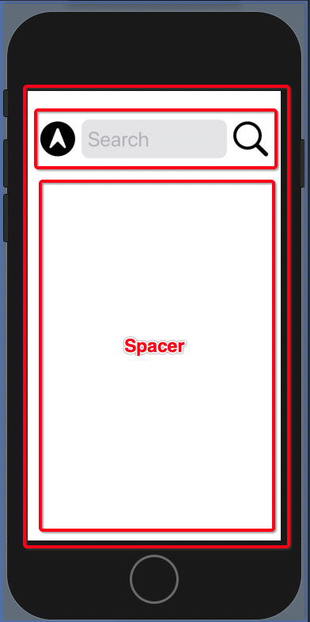

# UIKit > SwiftUI

This is Weathery. The UIKit application we are going to convert into Swift UI. Conversion will be done in three parts:

1. UI.
2. Data flow.
3. Networking.


## UI

UIKit application was originally built as a series of `UIStackViews`.



The SwiftUI version of the `UIStackView` is the `HStack` and `VStack`. Which we will layout like this.


### SwiftUI has many defaults

While there is no Auto Layout, SwiftUI provides you with many defaults.

For example adding a single image to a SwiftUI view automatically centers and puts it in the middle.

```swift
struct ContentView: View { 
    var body: some View {
        Image(systemName: "location.circle.fill")
            .resizable()
            .aspectRatio(contentMode: .fit)
            .frame(width: 44, height: 44)
    }
}
```


### Layout is done with HStacks and VStacks

To build our search view and align everything horizontally we use the `HStack`.

```swift
struct ContentView: View {
    @State private var cityName = "" 
    
    var body: some View {
        HStack {
            Image(systemName: "location.circle.fill")
                .resizable()
                .aspectRatio(contentMode: .fit)
                .frame(width: 44, height: 44)
            TextField("Search", text: $cityName)
                .font(.title)
                .padding(8)
                .background(Color(.systemFill))
                    .cornerRadius(10)
                .keyboardType(.asciiCapable)
            Image(systemName: "magnifyingglass")
                .resizable()
                .aspectRatio(contentMode: .fit)
                .frame(width: 44, height: 44)
        }

    }
}
```



To get our search view up near the top we stick it in a `VStack` with a `Spacer` at the bottom. The spacer expands to fill all available space.

```swift
struct ContentView: View {
    @State private var cityName = ""
    
    var body: some View {
        VStack(alignment: .trailing) {
            HStack {
                Image(systemName: "location.circle.fill")
                    .resizable()
                    .aspectRatio(contentMode: .fit)
                    .frame(width: 44, height: 44)
                TextField("Search", text: $cityName)
                    .font(.title)
                    .padding(8)
                    .background(Color(.systemFill))
                    .cornerRadius(10)
                    .keyboardType(.asciiCapable)
                Image(systemName: "magnifyingglass")
                    .resizable()
                    .aspectRatio(contentMode: .fit)
                    .frame(width: 44, height: 44)
            }
            Spacer()
        }.padding()
    }
}
```



And we can get the elements in our `VStack` to align on the left using a trailing alignment.

```swift
VStack(alignment: .trailing)
```

#### SwiftUI binds data using property wrappers

SwiftUI bindings data to controls using these things called property wrappers.

```swift
struct ContentView: View {
    @State private var cityName = "" 
    
    var body: some View {
        HStack {
			  ...
            TextField("Search", text: $cityName)
            ...
        }

    }
}
```

#### SwiftUI has its own set of colors

If you want to use `UIKit` colors in SwiftUI you can.

```swift
TextField("Search", text: $cityName)
    .background(Color(.systemFill))
```

#### Its OK to use frames

Frame used to be a dirty word with me when building everything in UIKit with Auto Layout. Not any more.

Setting the frame is like adding height and width constraints in Auto Layout. It's perfectly OK and it's how we set the size of things like images in SwiftUI.

```swift
.frame(width: 44, height: 44)
```

#### Expect lots of little sub views

Because there are no view controllers, SwiftUI embeds its presentation logic directly in the `View`. To keep our views from getting too big, its good practice to continuously extract smaller subviews.

```swift
struct SearchView: View {
    @Binding var cityName: String
    
    var body: some View {
        HStack {
            Image(systemName: "location.circle.fill")
                .iconable(.medium)
            TextField("Search", text: $cityName)
                .font(.title)
                .padding(8)
                .background(Color(.systemFill))
                    .cornerRadius(10)
                .keyboardType(.asciiCapable)
            Image(systemName: "magnifyingglass")
                .iconable(.medium)
        }
    }
}
```

#### Refactoring is still really important

To cut down on the noise in your views, you will want to find ways of capturing often repeated code. Here is one refactoring I created for `Image`.

```swift
extension Image {
    enum Size: CGFloat {
        case small = 22
        case medium = 44
        case large = 120
    }
    
    func iconable(_ size: Size) -> some View {
        self.resizable()
            .aspectRatio(contentMode: .fit)
            .frame(width: CGFloat(size.rawValue), height: size.rawValue)
    }
}
```

Which reduces the number of lines in images by automatically setting the size along with other attributes like this:

```swift
Image(systemName: "location.circle.fill")
    .iconable(.medium)
Image(systemName: "magnifyingglass")
    .iconable(.medium)
Image(systemName: "sun.max")
    .iconable(.large)
```

### Summary

In SwiftUI:

- layout is done with `HStack`, `VStack` and `Spacer`.
- SwiftUI uses lots of defaults
- Expect lots of little subviews
- Data is bound via property wrappers

### Source

```swift
//
//  ContentView.swift
//  WeatherySwiftUI
//
//  Created by jrasmusson on 2021-06-04.
//

import SwiftUI

struct ContentView: View {
    @State private var cityName = ""
    @State private var temperature = "11"
    
    var body: some View {
        VStack(alignment: .trailing) {
            SearchView(cityName: $cityName)
            WeatherView()
            TemperatureView(temperature: $temperature)
            Text(cityName).font(.largeTitle)
            Spacer()
        }.padding()
        .background(Image("background")
                        .resizable()
                        .ignoresSafeArea()
                        .scaledToFill()
        )
        
    }
}

struct WeatherView: View {
    var body: some View {
        Image(systemName: "sun.max")
            .iconable(.large)
            .padding(.top)
    }
}

struct TemperatureView: View {
    @Binding var temperature: String
    
    var body: some View {
        Text(temperature)
            .font(.system(size: 100, weight: .bold))
            +
            Text("°C")
            .font(.system(size: 80))
    }
}

struct SearchView: View {
    @Binding var cityName: String
    
    var body: some View {
        HStack {
            Image(systemName: "location.circle.fill")
                .iconable(.medium)
            TextField("Search", text: $cityName)
                .font(.title)
                .padding(8)
                .background(Color(.systemFill))
                    .cornerRadius(10)
                .keyboardType(.asciiCapable)
            Image(systemName: "magnifyingglass")
                .iconable(.medium)
        }
    }
}

struct ContentView_Previews: PreviewProvider {
    static var previews: some View {
        ContentView()
    }
}

extension Image {
    enum Size: CGFloat {
        case small = 22
        case medium = 44
        case large = 120
    }
    
    func iconable(_ size: Size) -> some View {
        self.resizable()
            .aspectRatio(contentMode: .fit)
            .frame(width: CGFloat(size.rawValue), height: size.rawValue)
    }
}
```

## Data Flow

### Links that help

- [Better Rest Intro](https://www.hackingwithswift.com/books/ios-swiftui/betterrest-introduction)