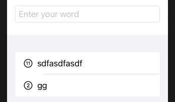

# Word Scramble

## Loading resources from your app bundle

```swift
if let fileURL = Bundle.main.url(forResource: "some-file", withExtension: "txt") {
    // we found the file in our bundle!
}
```

```swift
if let fileContents = try? String(contentsOf: fileURL) {
    // we loaded the file into a string!
}
```

- [Resource bundle](https://www.hackingwithswift.com/books/ios-swiftui/loading-resources-from-your-app-bundle)

## Checking for spelling

```swift
let word = "swift"
let checker = UITextChecker()
let range = NSRange(location: 0, length: word.utf16.count)
let misspelledRange = checker.rangeOfMisspelledWord(in: word, range: range, startingAt: 0, wrap: false, language: "en")
let allGood = misspelledRange.location == NSNotFound
```


- [Working with Strings](https://www.hackingwithswift.com/books/ios-swiftui/working-with-strings)

## Adding to a list of words

```swift
struct ContentView: View {
    @State private var usedWords = [String]()
    @State private var rootWord = ""
    @State private var newWord = ""

    var body: some View {
        NavigationView {
            VStack {
                TextField("Enter your word", text: $newWord, onCommit: addNewWord)
                    .textFieldStyle(RoundedBorderTextFieldStyle())
                    .autocapitalization(.none)
                    .padding()

                List(usedWords, id: \.self) {
                    Image(systemName: "\($0.count).circle")
                    Text($0)
                }
            }
            .navigationBarTitle(rootWord)
        }
    }
    
    func addNewWord() {
        // lowercase and trim the word, to make sure we don't add duplicate words with case differences
        let answer = newWord.lowercased().trimmingCharacters(in: .whitespacesAndNewlines)

        // exit if the remaining string is empty
        guard answer.count > 0 else {
            return
        }

        // extra validation to come

        usedWords.insert(answer, at: 0)
        newWord = ""
    }
}
```



### Links that help

- [Word Scramble Intro](https://www.hackingwithswift.com/books/ios-swiftui/word-scramble-introduction)
