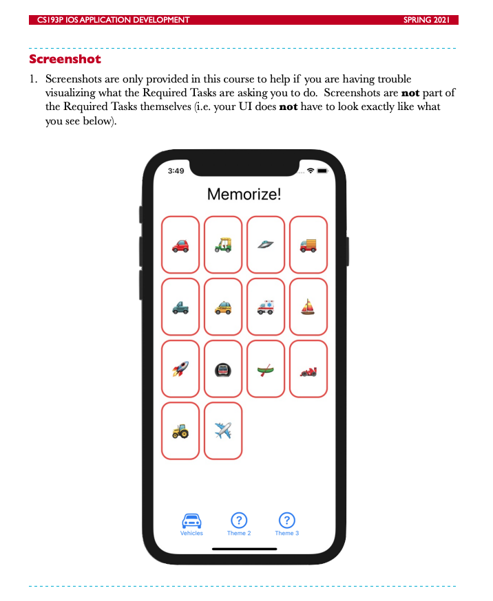

# Assignment I: Memorize



### Links that help

- [Assignment I pdf](https://cs193p.sites.stanford.edu/sites/g/files/sbiybj16636/files/media/file/assignment_1.pdf)


## Declarative vs Imperative

Notices the change in language. In SwiftUI we update the view by changing the state (declarative) vs telling it what to do (imperative).

**Imperative**

```swift
Button {
    // show vehicles
}
```

**Declarative**

```swift
Button {
    // Change state to vehicles
}
```

## Two different ways to extact views

Here are two different ways to extract views:

1. As new views.
2. As vars.


### As new views

Here you extract the view as a `struct` and pass it whatever data it needs as part of the constructor.

```swift
struct ContentView: View {
    var body: some View {
        VStack {
            CardsView(emojis: emojis)
        }
}

struct CardsView: View {
    let emojis: [String]

    var body: some View { ... }
}
```

### As vars

With vars you create a local `var` within the current view and get access to all the state within the struct. No need to pass anything.

```swift
struct ContentView: View {
    var body: some View {
        VStack {
            buttons
        }
    }

    var buttons: some View {
        HStack {
            vehiclesButton
            Spacer()
            foodButton
            Spacer()
            flagButton
        }
    }
}
```


