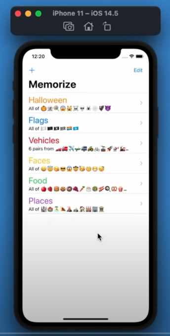
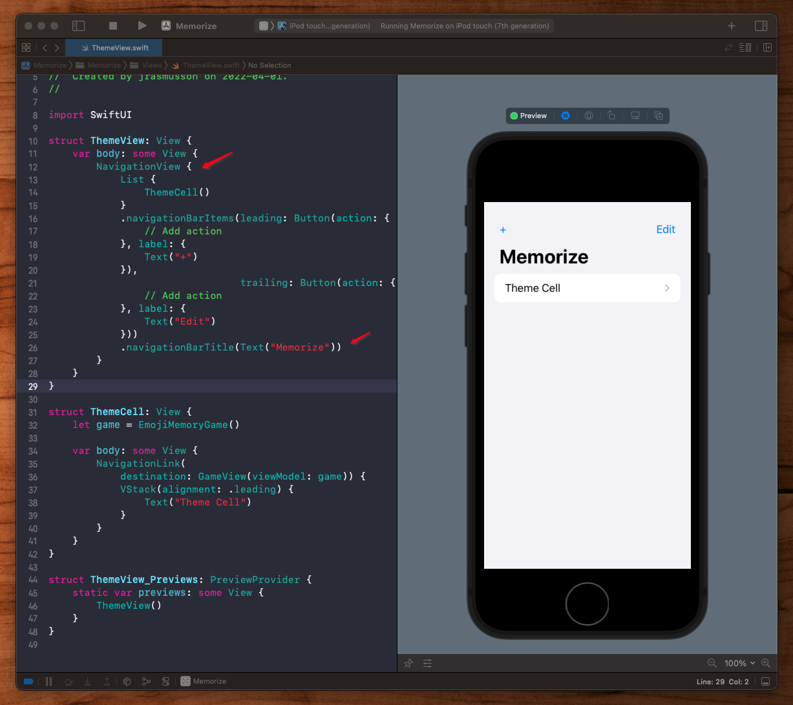
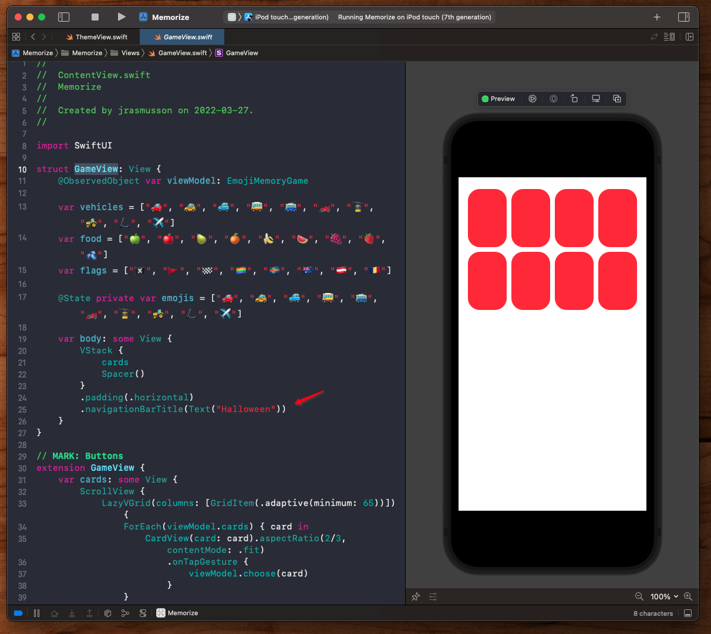
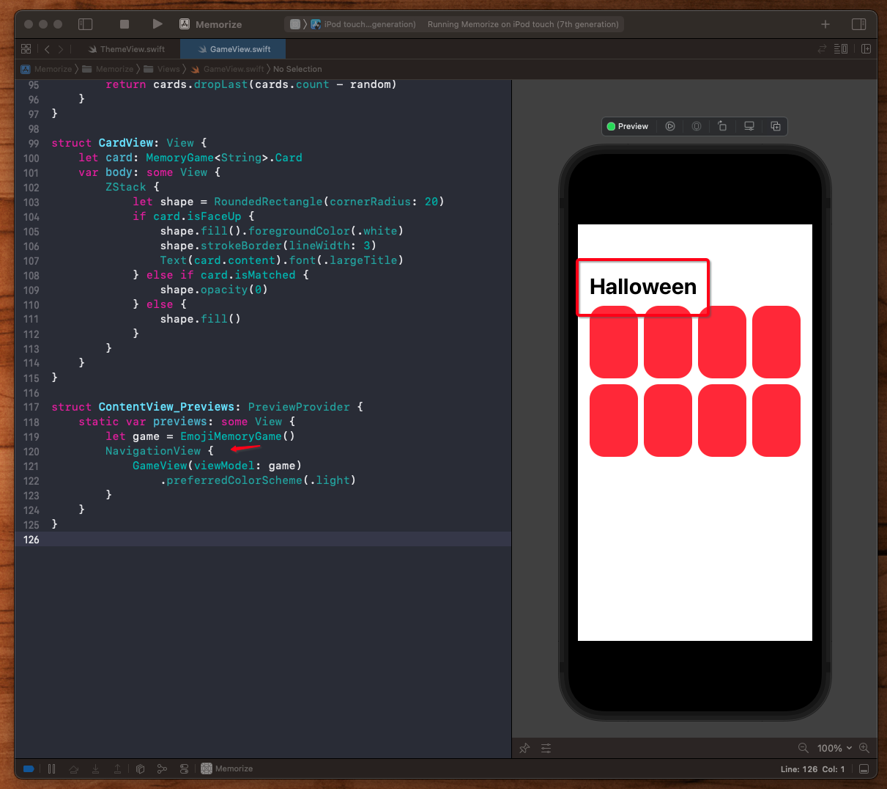
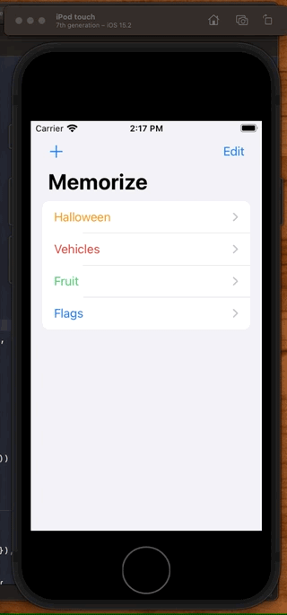
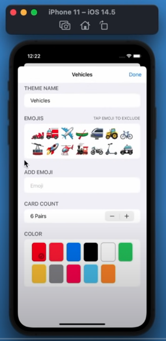
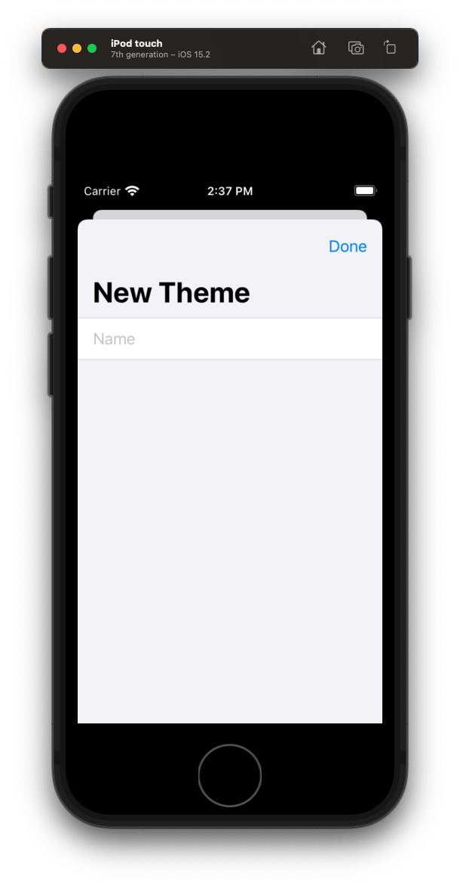
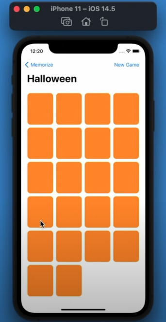

# Assignment II: More Memorize

## Step 1: View themes



### Navigation Titles

Start by embedding the whole application within a `NavigationView`.



Then to set the nav bar title for when you drill down, you need to go to the subview, add the title there, and even though you won't immediately see it on the subview, you can simulate it by adding it to your preview.






## Step 2: How to display a new view

### Presenting a view

Here we are going to display a new view when the user hits the `+` button.





To do that we need to change our existing view's state. So instead of going:

```swift
present(view)
```

when the add button is pressed. We are instead going to go change a flag in the views state, and let it update itself:

```swift
struct ThemeView: View {
    @State private var showingAddScreen = false // 1

    let themes: [Theme]
    var body: some View {
        NavigationView {
            List {
                ForEach(themes) { theme in
                    ThemeCell(theme: theme)
                }
            }
            .navigationBarItems(leading: addButton, trailing: editButton)
            .navigationBarTitle(Text("Memorize"))
        }
        .sheet(isPresented: $showingAddScreen) { // 2
            AddThemeView() // 3
        }
    }

    var addButton: some View {
        Button(action: {
            self.showingAddScreen.toggle() // 4
        }, label: {
            Image(systemName: "plus")
        })
    }
}
```

## Dismissing a view

To dismiss the view programmatically, we need to:

- embed the view in a `NavigationView`
- hook our done button into the `presentationMode` for dismiss



```swift
import SwiftUI

struct AddThemeView: View {
    @Environment(\.presentationMode) var presentationMode // 1
    @State private var name = ""

    var body: some View {
        NavigationView {
            Form {
                TextField("Name", text: $name)
            }
            .navigationBarItems(trailing: doneButton)
            .navigationBarTitle(Text("New Theme"))
        }
    }

    var doneButton: some View {
        Button(action: {
            presentationMode.wrappedValue.dismiss() // 2
        }, label: {
            Text("Done")
        })
    }
}
```


## Step 3: Start a new game




## Step 4: Edit a theme


### Links that help

- [Standford Lectures](https://cs193p.sites.stanford.edu/)
- [Assignment II pdf](https://cs193p.sites.stanford.edu/sites/g/files/sbiybj16636/files/media/file/Assignment%202.pdf)
- [Swift API Design Guidelines](https://www.swift.org/documentation/api-design-guidelines/)


