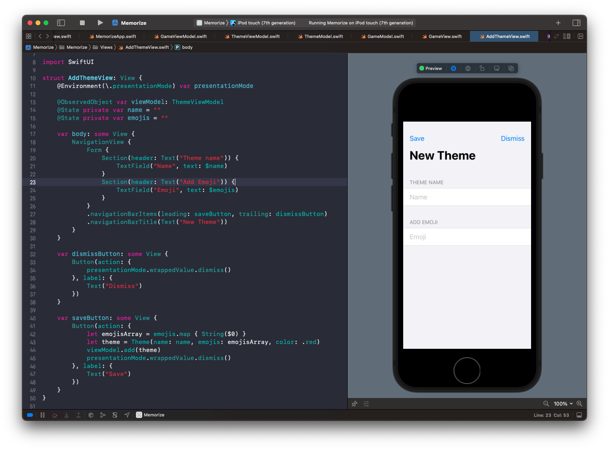

# Assignment II: More Memorize

## Step 1: Navigation Titles

Start by embedding the whole application within a `NavigationView`.


Then to set the nav bar title for when you drill down, you need to go to the subview, add the title there, and even though you won't immediately see it on the subview, you can simulate it by adding it to your preview.


## Step 2: Presenting a view


To present a view we need to change the view's state. So instead of tapping a button and going:

```swift
present(view)
```

we instead update the views state:

```swift
struct ThemeView: View {
    @State private var showingAddScreen = false // 1

    let themes: [Theme]
    var body: some View {
        NavigationView {
            List {
                ForEach(themes) { theme in
                    ThemeCell(theme: theme)
                }
            }
            .navigationBarItems(leading: addButton, trailing: editButton)
            .navigationBarTitle(Text("Memorize"))
        }
        .sheet(isPresented: $showingAddScreen) { // 2
            AddThemeView() // 3
        }
    }

    var addButton: some View {
        Button(action: {
            self.showingAddScreen.toggle() // 4
        }, label: {
            Image(systemName: "plus")
        })
    }
}
```

## Dismissing a view

To dismiss the view programmatically, we need to:

- embed the view in a `NavigationView`
- hook our done button into the `presentationMode` for dismiss


```swift
import SwiftUI

struct AddThemeView: View {
    @Environment(\.presentationMode) var presentationMode // 1
    @State private var name = ""

    var body: some View {
        NavigationView {
            Form {
                TextField("Name", text: $name)
            }
            .navigationBarItems(trailing: doneButton)
            .navigationBarTitle(Text("New Theme"))
        }
    }

    var doneButton: some View {
        Button(action: {
            presentationMode.wrappedValue.dismiss() // 2
        }, label: {
            Text("Done")
        })
    }
}
```


## Step 3: Adding a new theme

To add a new theme we need to:

- create a new view model to store themes
- pass in the view model to the view we want to update
- bind elements on that page to be used in the theme we create

[Apple docs: Managing User Inteface State](https://developer.apple.com/documentation/swiftui/managing-user-interface-state)

**ThemeViewModel**

```swift
class ThemeViewModel: ObservableObject {
    @Published private var model: ThemeModel

    var themes: [Theme] {
        return model.themes
    }

    init(themes: [Theme]) {
        model = ThemeModel(themes: themes)
    }
}
```

**AddThemeView**

```swift
import SwiftUI

struct AddThemeView: View {
    @Environment(\.presentationMode) var presentationMode

    @ObservedObject var viewModel: ThemeViewModel
    @State private var name = ""
    @State private var emojis = ""

    var body: some View {
        NavigationView {
            Form {
                Section(header: Text("Theme name")) {
                    TextField("Name", text: $name)
                }
                Section(header: Text("Add Emoji")) {
                    TextField("Emoji", text: $emojis)
                }
            }
            .navigationBarItems(leading: saveButton, trailing: dismissButton)
            .navigationBarTitle(Text("New Theme"))
        }
    }

    var dismissButton: some View {
        Button(action: {
            presentationMode.wrappedValue.dismiss()
        }, label: {
            Text("Dismiss")
        })
    }

    var saveButton: some View {
        Button(action: {
            let emojisArray = emojis.map { String($0) }
            let theme = Theme(name: name, emojis: emojisArray, color: .red)
            viewModel.add(theme)
            presentationMode.wrappedValue.dismiss()
        }, label: {
            Text("Save")
        })
    }
}
```




## Step 4: Edit a theme


## Desired output


### Links that help

- [Standford Lectures](https://cs193p.sites.stanford.edu/)
- [Assignment II pdf](https://cs193p.sites.stanford.edu/sites/g/files/sbiybj16636/files/media/file/Assignment%202.pdf)
- [Swift API Design Guidelines](https://www.swift.org/documentation/api-design-guidelines/)
- [Managing User Interface State](https://developer.apple.com/documentation/swiftui/managing-user-interface-state)


