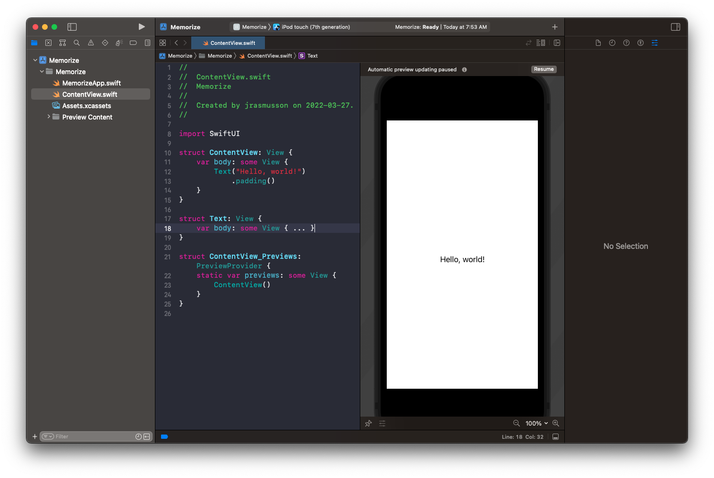
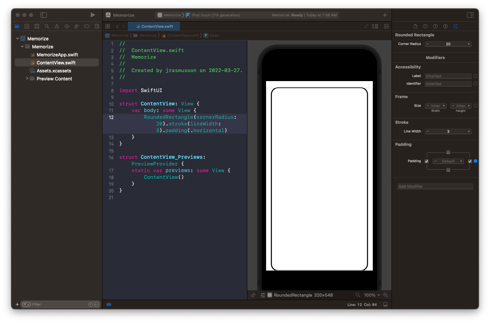
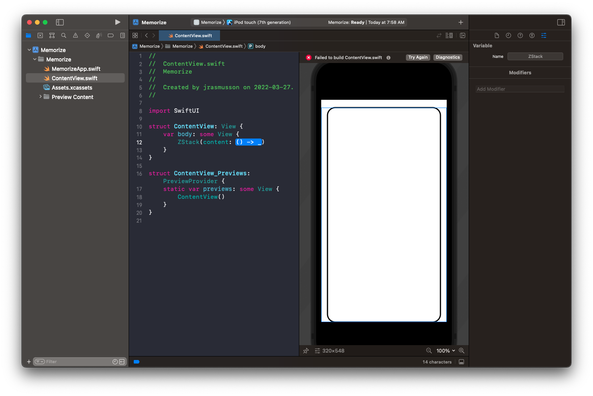
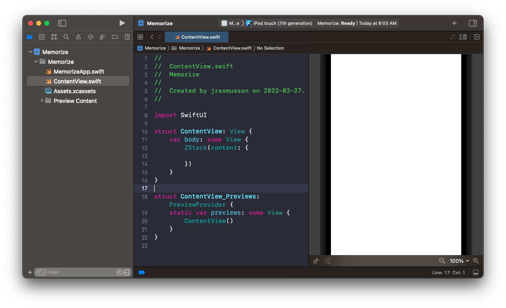
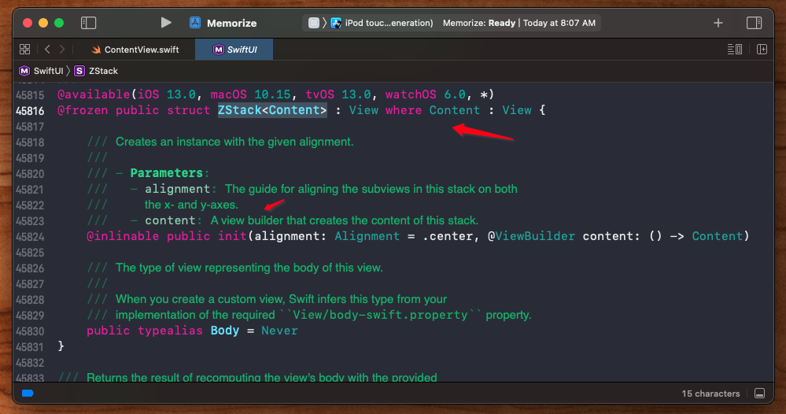
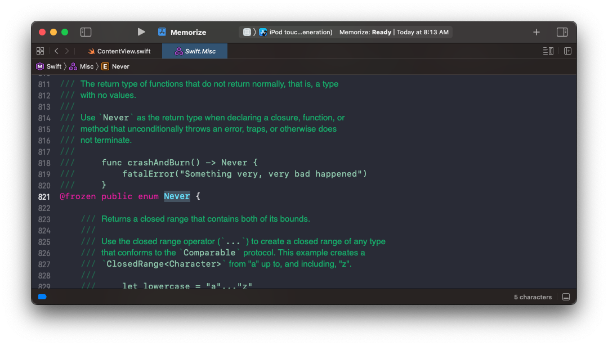

# Lecture 1: Getting started with Swift UI

Everything in SwiftUI is a `View`. Event text.

To views we can add `modifiers`.

Modifiers are cool because they can be added to any view. Gone are the days when every control needed to have its own property (i.e. `alpha`).

Now you can add any modifier to any View and get the change you want. To see a list of which modifieres you can add use that search bar down in the bottom right.

Views are really lego combiners. They can combine subviews and return them as one combined big view. For example look at `ZStack`.

`ZStack` takes `content` in the form of a function. The function here is of type `() -> _` meaning it takes no input but it does return something. It returns a bag of lego.

This bag of lego must be a `View` and it must support the `@ViewBuilder` attributes which means it will treat whatever it is passed as a list of views.

`Never` is an `enum` that represents something bad has happened. or should *Never* happen.

Because Swift knows you are going to want to make these bags of lego a lot it makes it really easy by enhancing the concept of a function to represent a bag of lego.

This function that you pass to a lego combiner view, is known as a [ViewBuilder](https://developer.apple.com/documentation/swiftui/viewbuilder).

This `ViewBuilder` is a custom parameter that constructs a list of views from closures. It essentially list you list other views inside and then bags them together.

It's kind of strange like syntax because there is no `return` value in there. We simply list our views. This view list mechanism knows how to take this list of views and 

### Links that help

- [Lecture 1](https://www.youtube.com/watch?v=bqu6BquVi2M&ab_channel=Stanford)

