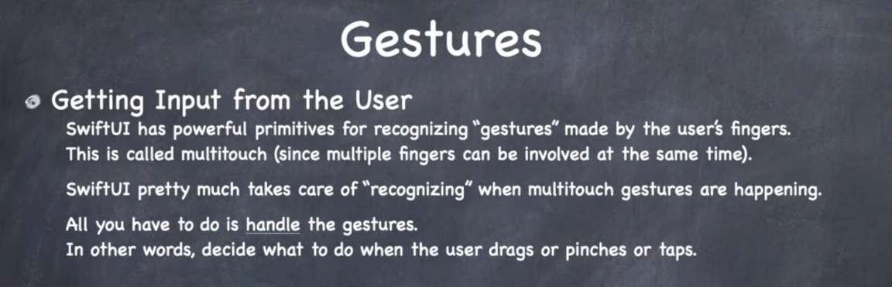
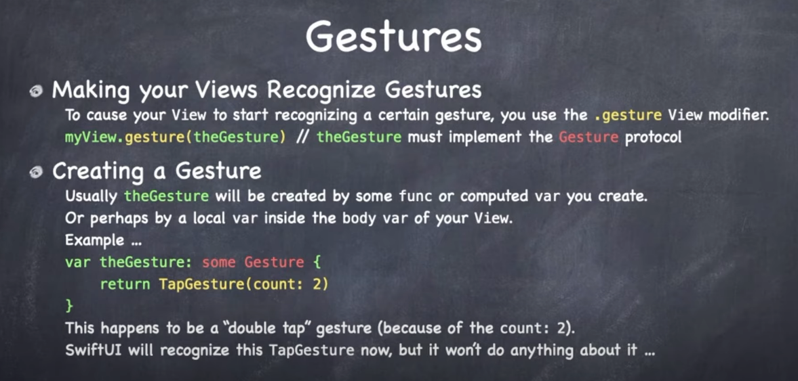
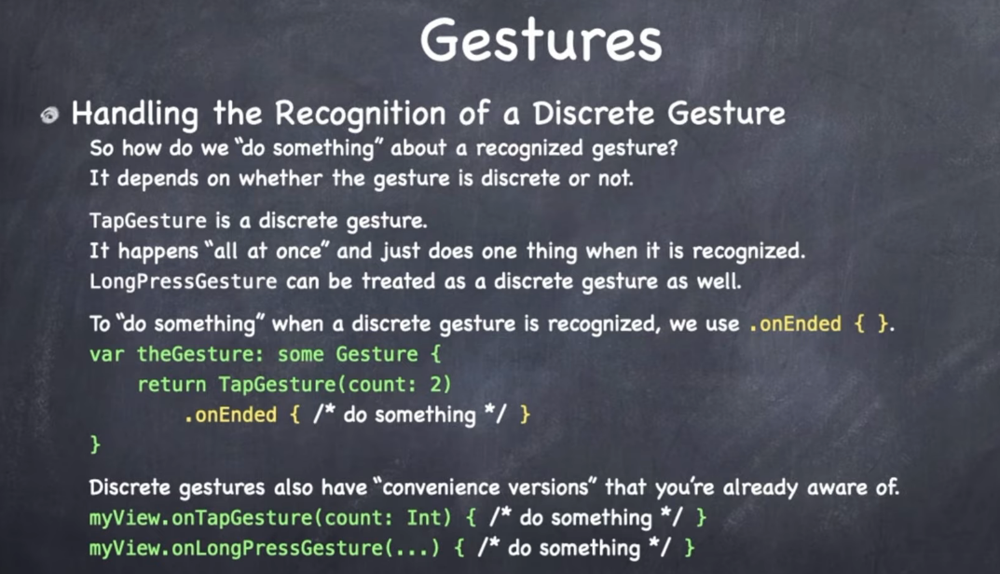
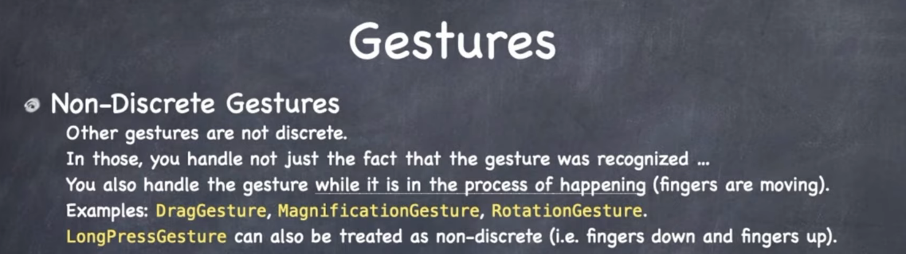
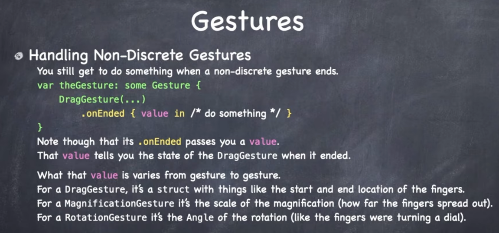
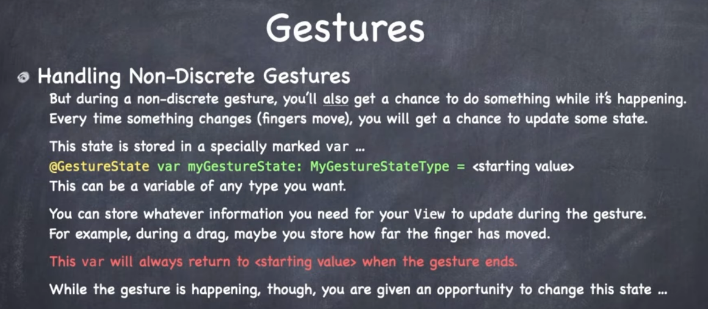
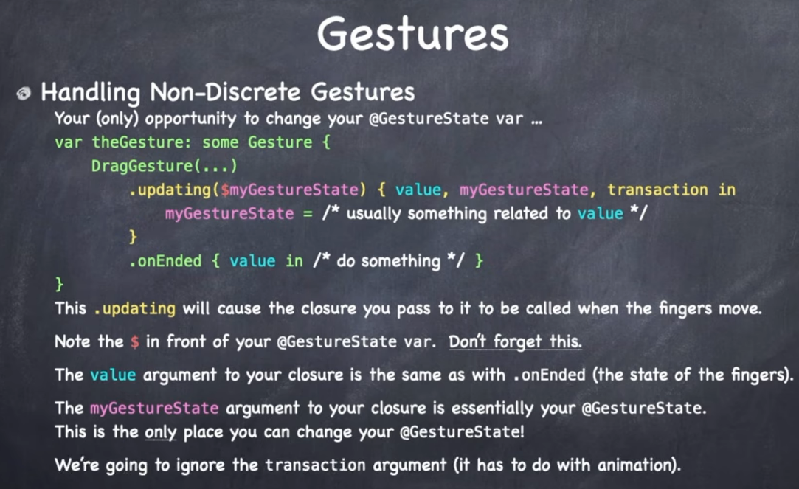
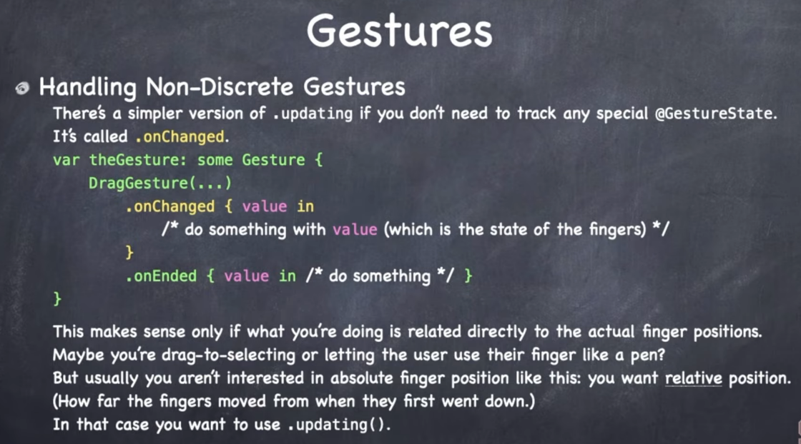

# Lecture 10: Gestures

## Discrete gestures

Easy to handle.

### Non-discrete gestures

Take a little more work.

You often get back a value.

You also get a chance to do something while the gesture is in flight.

You define some state in a special marked var `@GestureState`.

It can be any type you want. And you get to update it as the gesture is going on (i.e. how far the finger has moved, or where the finger is now).

This var will return to the starting value when the gesture is not happening.

So read only except for a very small window when you get to update.

The `$myGestureState` is actually an `inout` variable. It's value gets copied in and out via a pointer reference.

There is a simpler version of this that only gives you the value.

### Links that help

- [Lectures](https://cs193p.sites.stanford.edu/)
- [Lecture 10](https://www.youtube.com/watch?v=iszjyoo3SYI)

