# Lecture 12: Binding Sheet Navigation

The details about numerous property wrappers, including @State, @ObservedObject, @Binding, @Environment, @EnvironmentObject and @StateObject. 

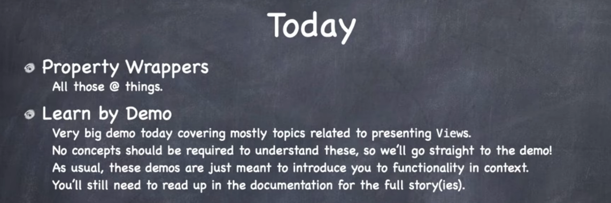

## Property Wrappers

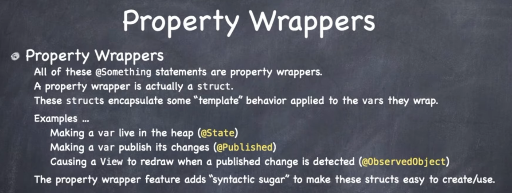

A property wrapper is just a struct. Captures template behaviors to vars they are wrapping. Mostly syntactic sugar.

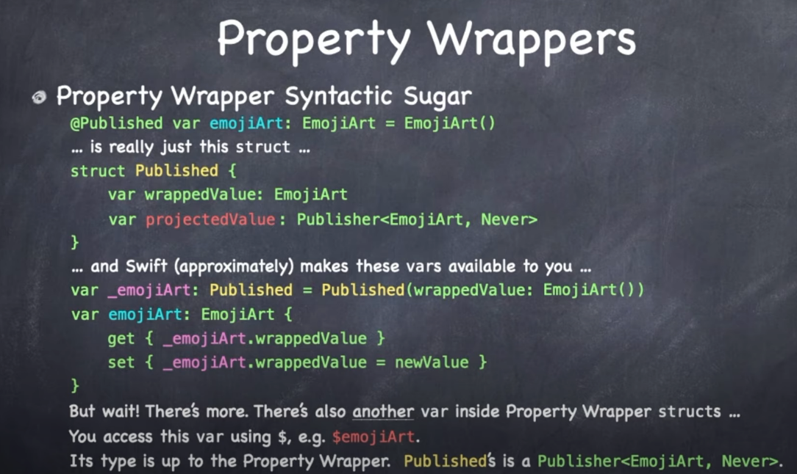

`@Published` is just a struct with some values:

- `wrappedValue` is the underlying value of the thing we wrap.
- `_emojiArt` is a type of `Published` initialized to your wrapped value.
 - it is the thing doing all the work
- there is also a computed var getting and setting the `wrapped` value from the struct.

But wait. There is more. This is another var in there called the `projectedValue`. Which you don't see but can access. You get to it via `$emojiArt`. It's the `@Binding` this behind the scenes that let's you listen to changes in this @Published value.

To understand these we need to look closer at:

- what is their `wrappedValue`
- what is their `projectedValue`

And what is it these things do.

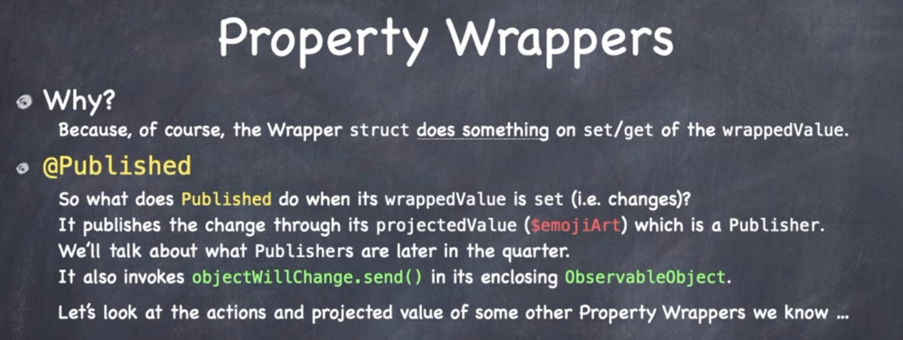

When `Published` changes it publishes the change through it projected value. Let's look at the different kinds now.

## @State

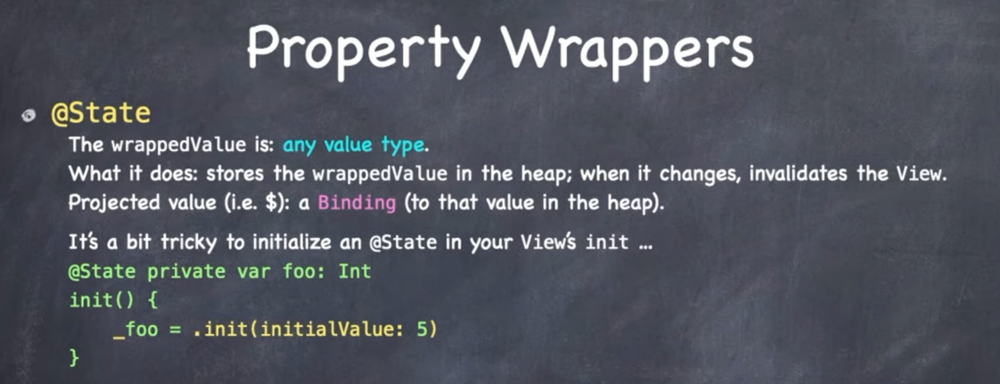

- stores `wrappedValue` in the heap; when it changes, invalidates the view
- `projectedValue` is a `@Binding` to that value in the heap
- One tricky thing to note is if you don't assign `@State` a defalt value, you need to assign the value in the `init` to the underbar value `_foo`.

## @StateObject

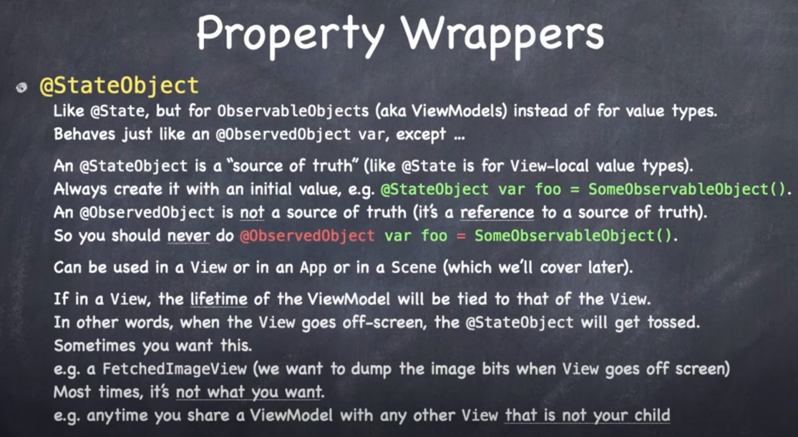

Life time is connected to the view.

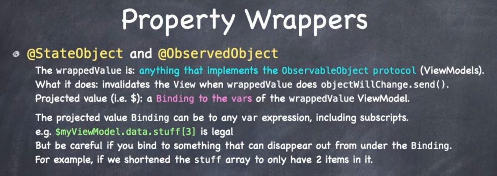
 
## @Binding

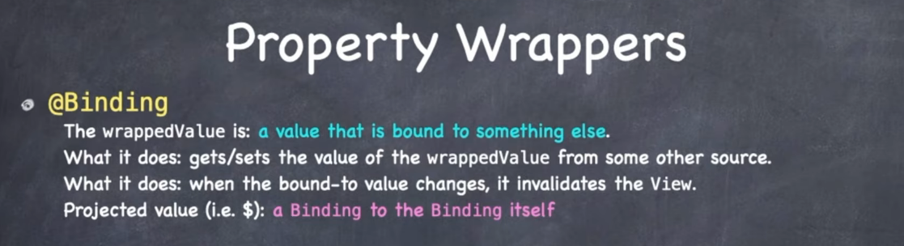

You are binding to @State @StateObject. When the parent changes, the bound value changes and invalidates the view - re-drawing it.

`$` projected value is a binding to the binding. So you can pass these bindings around.

So where do we use bindings. Everywhere!

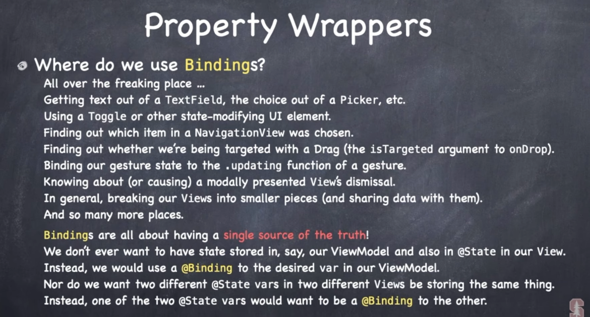

Bindings exist so we can have a single source of truth. We define the source of truth @State in a view, and then we bind it to subviews via @Binding.

For example here is how it works:


Here we pass a `$` binding to the subview of `$myString`. And it works both ways.

Also notice how `TextField` shares a binding to its binding. A TextField takes a binding to the text you are editting.

```swift
TextField("Shared", text: $sharedText)
```

So this binding to a binding is how we synchronize things down the chain of views. This is what we mean when we say bindings to bindings in different view.

Can also bind to contstant values.

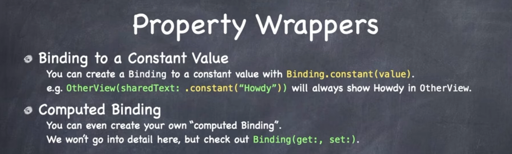

This means if you want to bind just to a string or a bool you can do that too. Doesn't always have to be a bound souce of truth object.

Useful for preview code.

This is also something called a computed binding. Here you can create your own binding to arbitrary sources of data.

## @EnvironmentObject

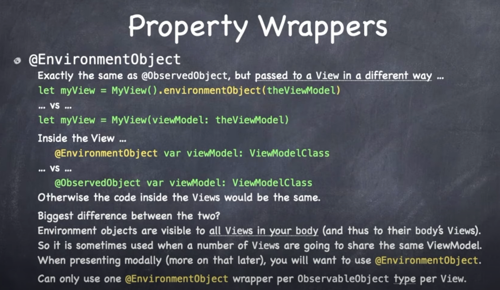

- Exact same thing as an @ObservedObject - a reference to an observeable object.
- Pass with a view modifier called  `.environmentObject`.
- Injects into all the views.
- Can only have on injected per type of observable object.
 - Can't inject x2 of the same thing - there can only be one.

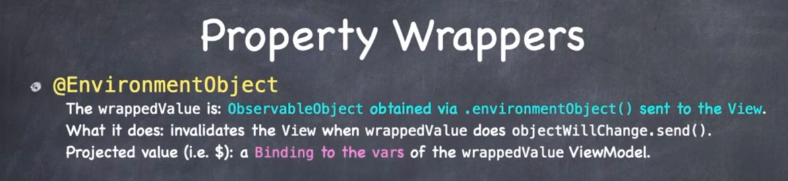

## @Environment

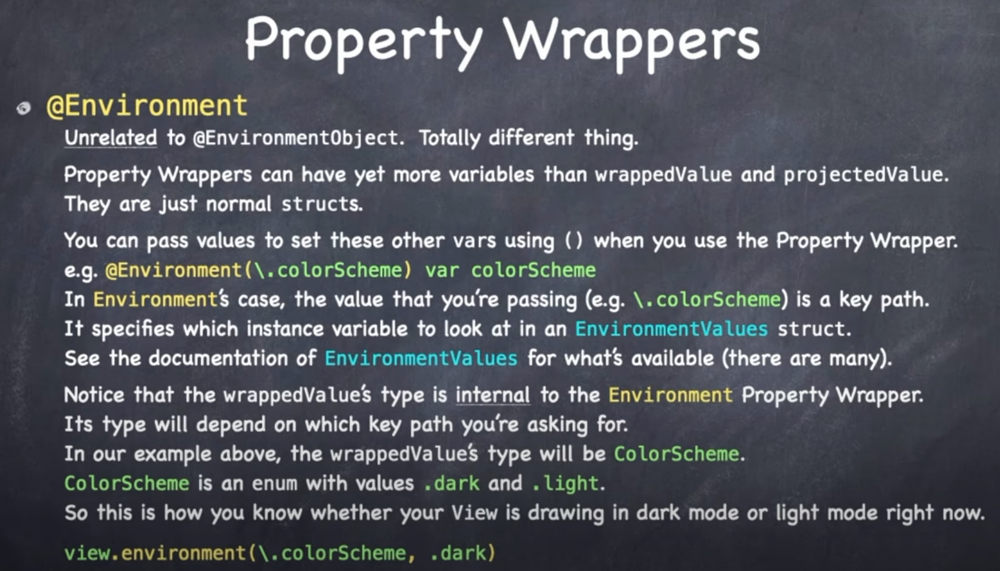

- Totaly unrelated to `@EnvironmentObject`.
- Property wrappers (these things with @) can have more variables than wrapped and projectedValue.
- They are just normal structs.
- You can pass values to set these other vars using () and keypaths.
- (i.e.) `@Environment(\.colorScheme) var colorScheme`.
- This is good for setting environment things while your view is drawing.
- View can also programmatically inject values into our environment:
 - `view.environment(\.colorScheme, .dark)`

 

- It's wrapped value is some var. 
- It let's you get that var. 
- Has no projected value. Means there is nothing to bind to.
- In fact if you have one you need to bind to than the type has to be a binding. There are a few.
- But to acces you have to say .wrappedValue.


### Links that help

- [Lectures](https://cs193p.sites.stanford.edu/)
- [Lecture 12](https://www.youtube.com/watch?v=s3tMkz1clOA&ab_channel=Stanford)


