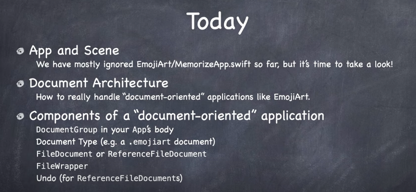
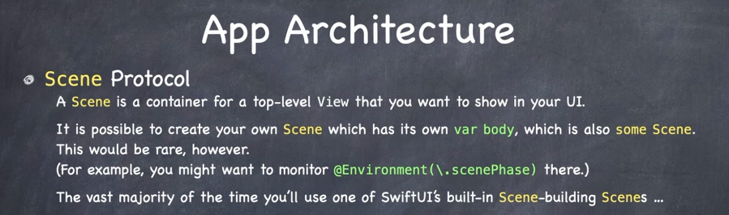
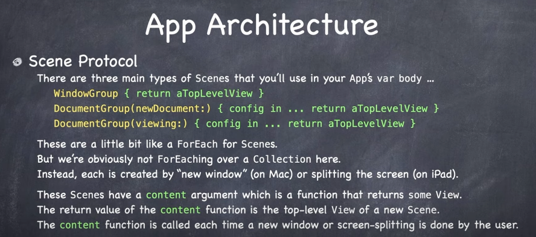
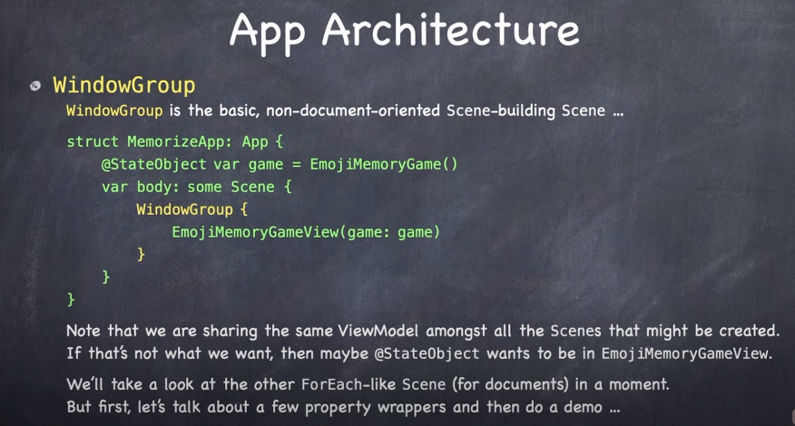
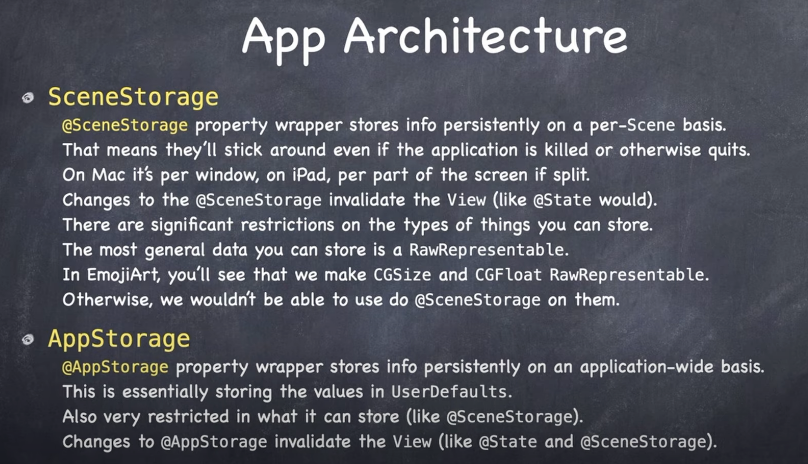
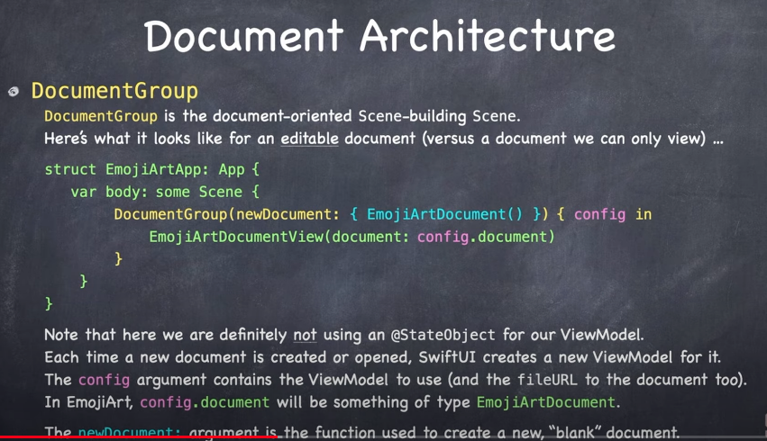
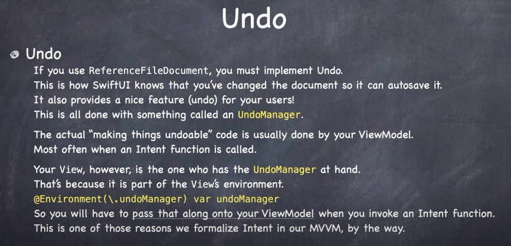

# Lecture 14: Document Architecture

## App Protocol

- Only one per app.
- var body is some Scene.

## Scene Protocol

- Container for top level view you want to show in your UI.

## WindowGroup

## SceneStorage / AppStorage

## Document Architecture

## Undo

### Links that help

- [Lecture 14](https://www.youtube.com/watch?v=Ou25reI71zU)
- [Stanford 2021](https://cs193p.sites.stanford.edu/)

