# Lecture 15: UIKit Integration

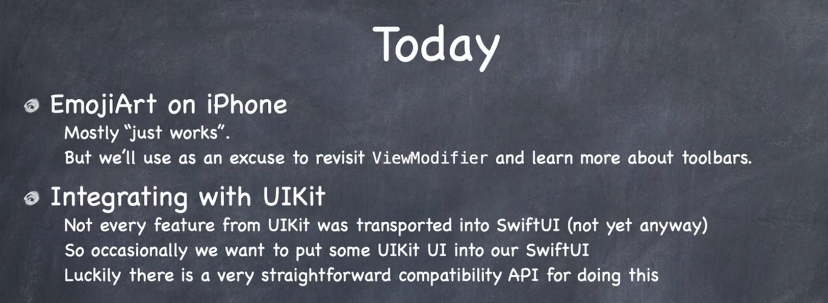

## UIKit Integration

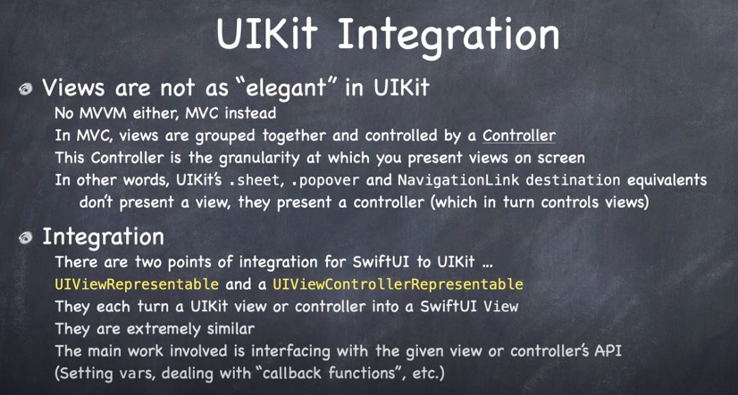

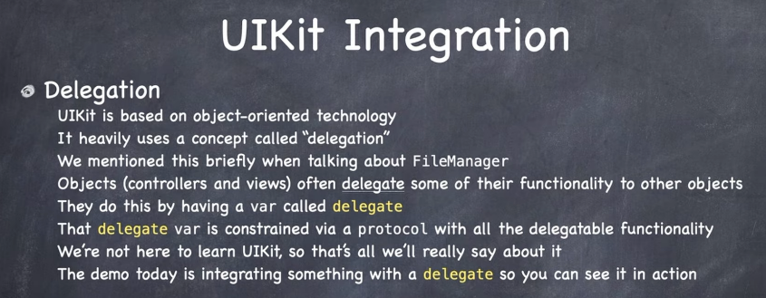

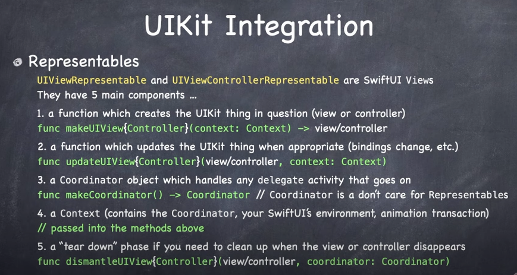

### Demo

Say we want to integrate a `UIKit` view controller (i.e. `UIImagePickerController` and integrate it on screen in our SwiftUI app.

Instead of making a `View`:

```swift
struct Camera: View { ... }
```

We instead implement `UIViewControllerRepresentable`:

```swift
struct Camera: UIViewControllerRepresentable { ... }
```

First thing it is going to ask us is what type of view controller do you want to represent?

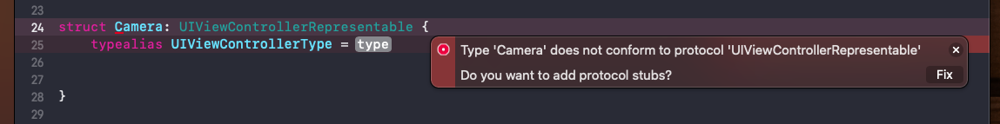

For us it is `UIImagePickerController`:

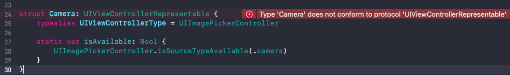

To become respresentable we need to implement `make` and `update` view controller:

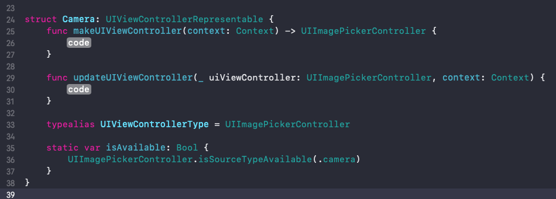

Updating is happening all the time when SwiftUI is invalidating and redrawing itself.

Now in the case of `update`, we are simply popping it up, taking a picture, and dismissing. So there is nothing to do for `update` for us when our `var` body is rebuilding.

In `make` we make and setup our view controller.

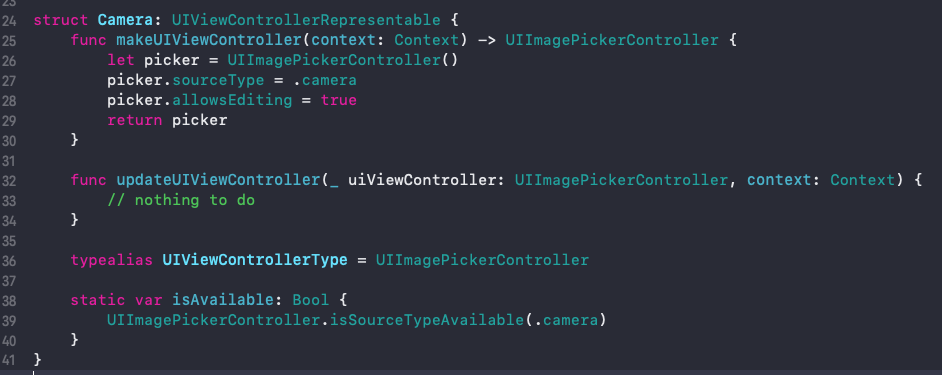

## Handling protocol-delegate

In SwiftUI we don't use protocol-delegate. We instead use closures:

```swift
var handlePickedImage: (UIImage?) -> Void
```

But we need a way of handling protocol-delegate communication in SwiftUI:

```swift
struct Camera: UIViewControllerRepresentable {
    func makeUIViewController(context: Context) -> UIImagePickerController {
        let picker = UIImagePickerController()
        picker.sourceType = .camera
        picker.allowsEditing = true
        picker.delegate = // ?
        return picker
    }
```

We handle that by creating a delegate for our image picker controller that can receive the messages it sends when image picker takes pictures.

We do that as follows. First we create a class, and then we call it a `coordinator`. It is the thing that is going to implement the image picker protocol delegate protocol. 

Couple of minor complications:

- need to inherit from `NSObject`
- UIImagePicker also implements `UINavigationControlerDelegate` so we need to also implement it here (but we wouldn't otherwise).

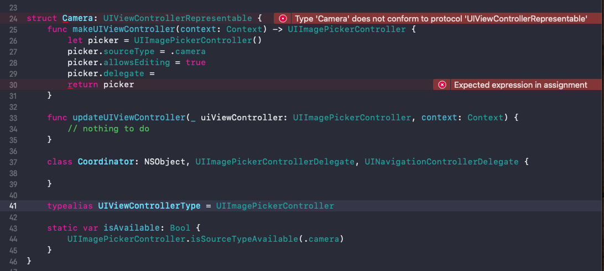

Now as soon as you add this conventionally named `Coodinator` Xcode is going to prompt you to implement another function called `makeCoordinator`:


This is where we make our coordinator. 

The coordinator is really the bridge between the `UIKit` and `SwiftUI` world. Because our SwiftUI world is going to be handling camera interactions with a `handlePicker` closure, we need to pass it into the coordinator as a `var` so it can execute that functionality when ever a picture is taken.

So we'll add a `var handlePickedImage` into our `class` and set it via an `init`.

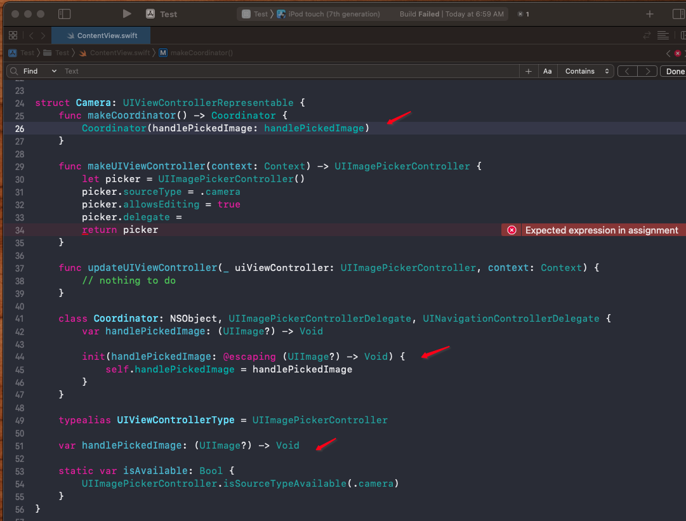

### Setting the delegate

The delegate is going to be passed back to us via the `context.coordinator`.

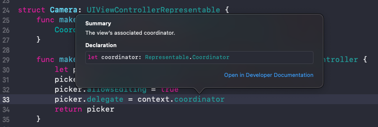

This `contextCoordinator` is made in `makeCoordinator()` which in turn makes our `class Coordinator` object which then gets set via:

```swift
picker.delegate = context.coordiantor
```

That is how it all gets hooked up.

### Implementing the delgate

So with that all hooked up now we can implement our camera methods in our coordinator:


And that's it! That is how we hook up protocol-delegate to SwiftUI.


### Links that help

- [Lecture 15](https://www.youtube.com/watch?v=ba7sJ74vDtA)
- [Stanford 2021](https://cs193p.sites.stanford.edu/)


