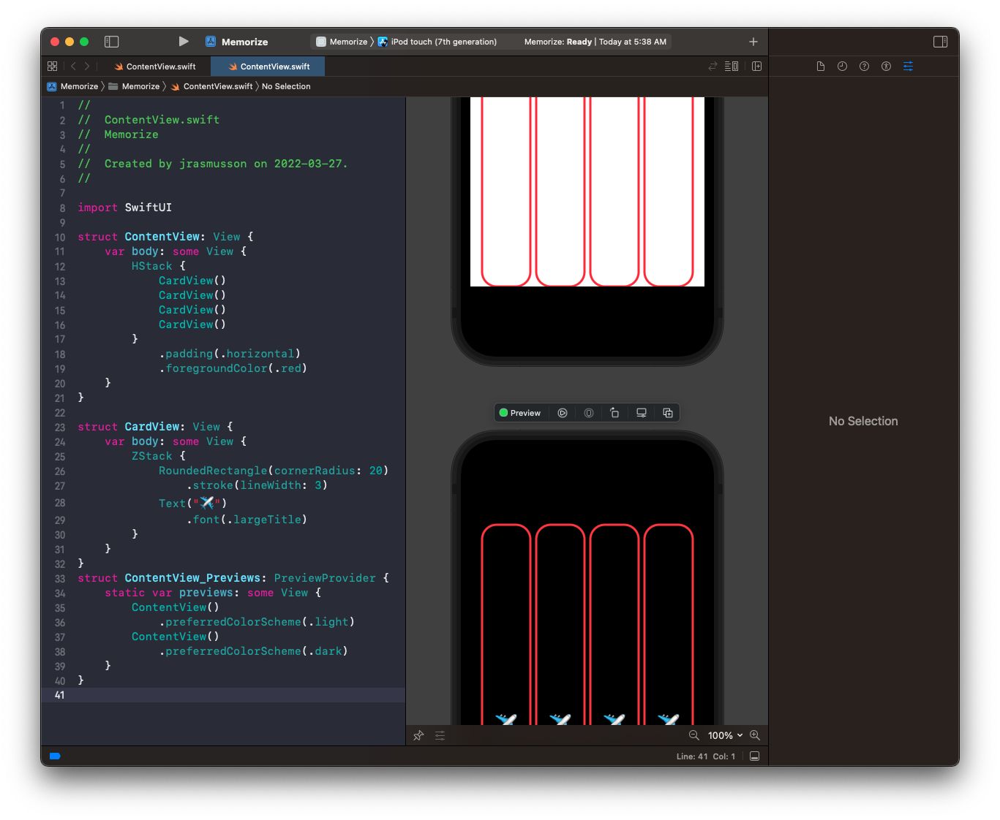
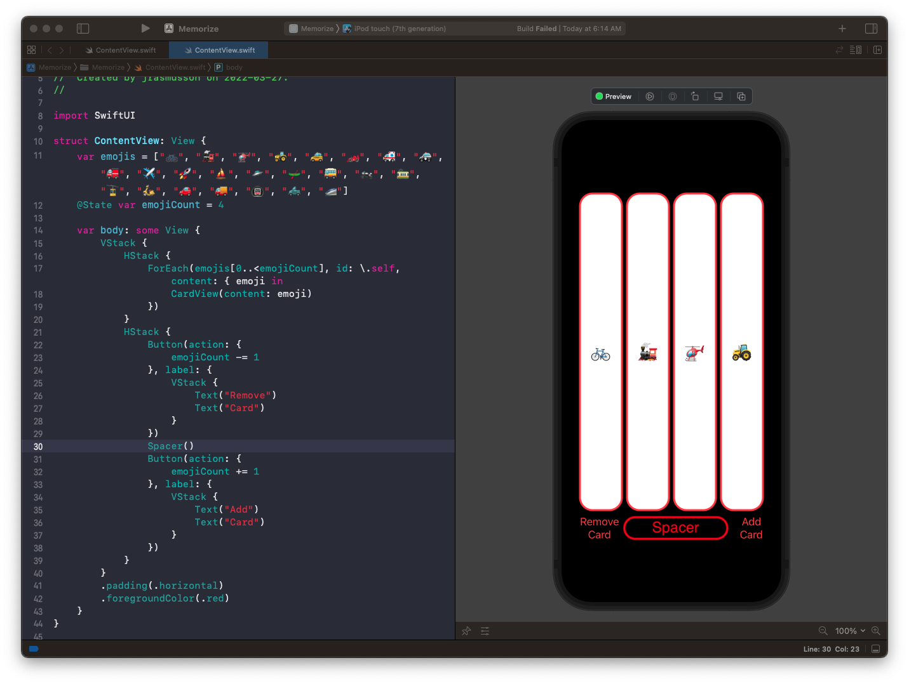
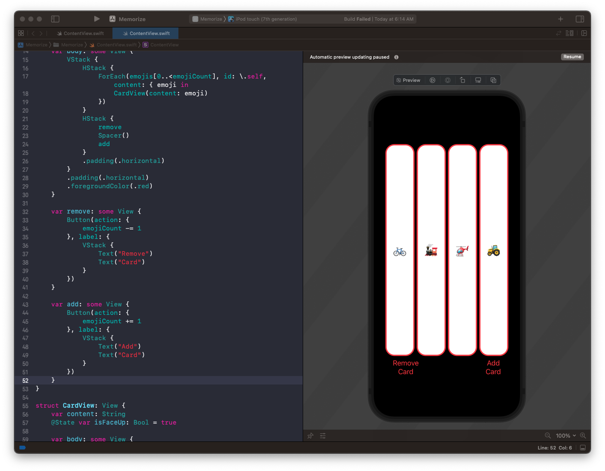
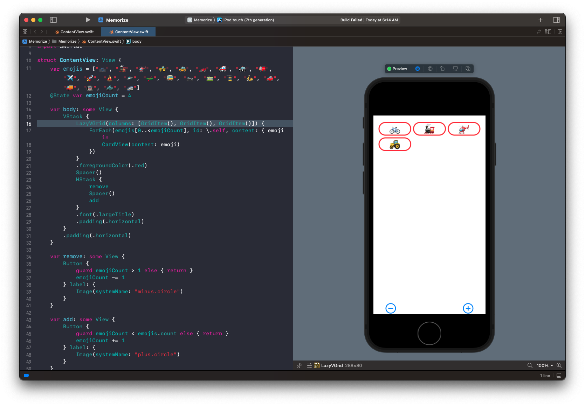
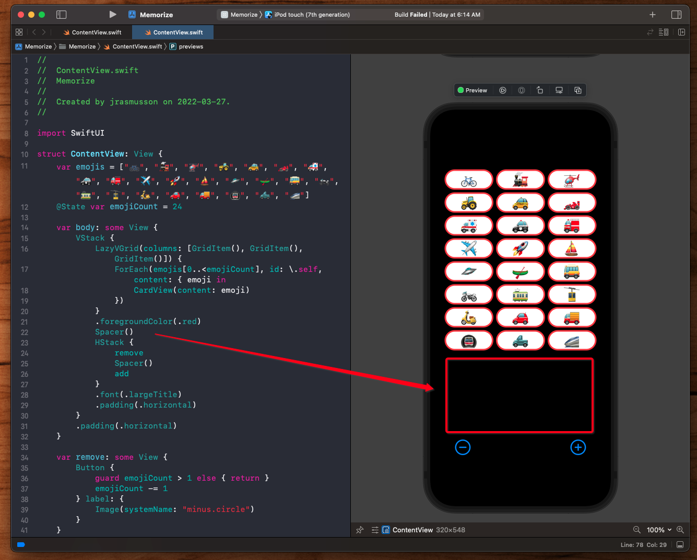
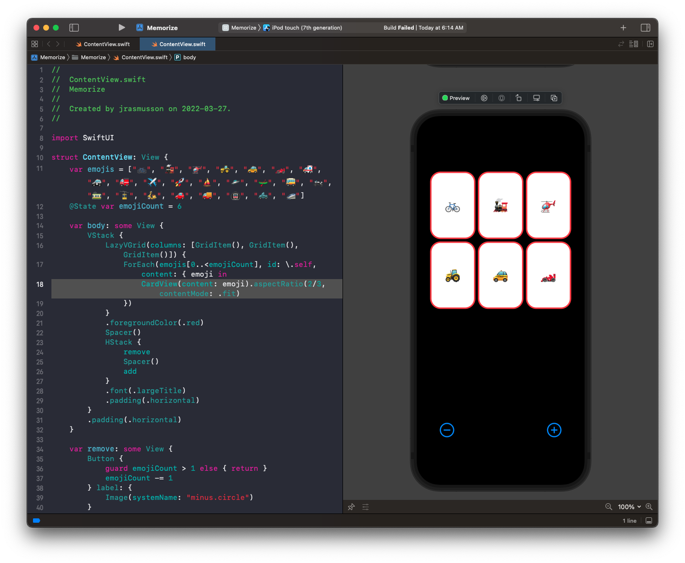
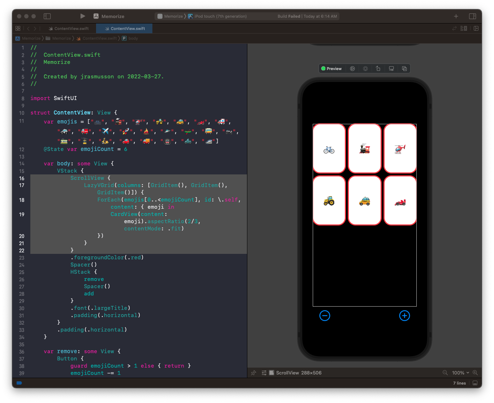
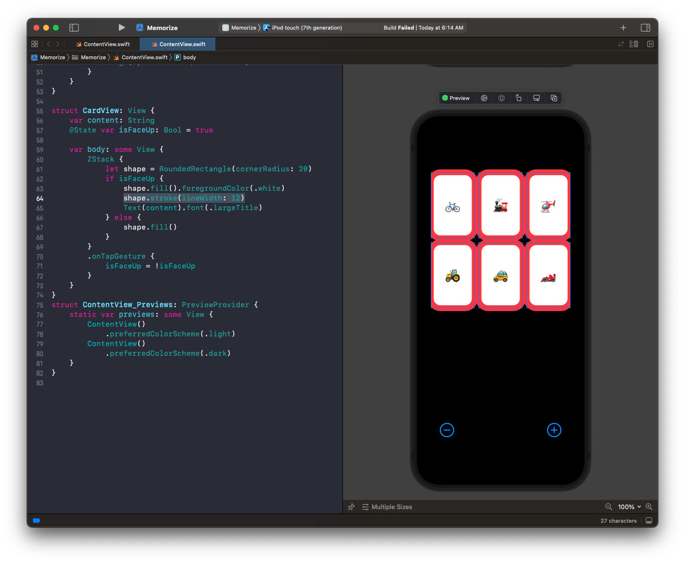
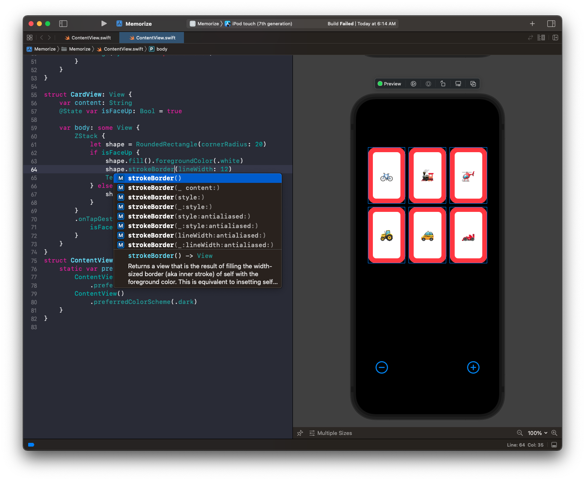
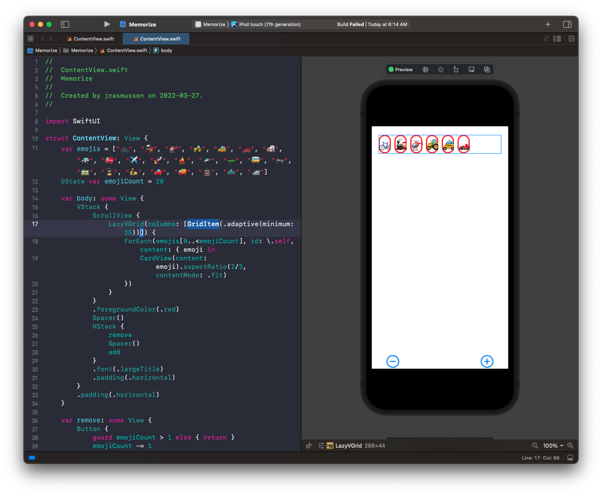

# Lecture 2: Learning More about SwiftUI

## How to adjust preview

If you click on `ContentView` you can change the parameters around how it looks.

For example here is color scheme dark:



To see both at the same time just copy `ContentView` again:

## @State

Because `structs` are immutable, we can't change the values of any `vars`. To get around this we use `@State`.


@State is a property wrapper. It creates a little bit of memory outside the View that SwiftUI that tracks the state of this var, and then creates a new View every time it changes.

```swift
struct CardView: View {
    @State var isFaceUp: Bool = true
```

When people first see this they think that means this `var` is now writtable. But that's not true. This View is still immutable.

It just turns that variable that used to be a `Bool` into a pointer to some `Bool` somewhere else. This is just to track state for our view currently displayed.

## String conforms to Identifiable

Because Views need to be uniquely identifiable, we can't just use a String to build a view - we need to associated it with an id.

We can solve that problem with Strings like this:

```swift
ForEach(emojis, id: \.self, content: { emoji in
    CardView(content: emoji)
})
```    

What this does is use the String as the identifier for for the emoji itself. This is fine so long as every String is unique.

As soon as we have dupliacates:

```swift
var emojis = ["✈️", "✈️", "🚀", "🚁", "🚜"]
```

This fails because the same ID is used for each duplicated String. it can't tell them apart.

For now we'll just get rid of the duplicate. When we do this for real it won't be a problem because we will be passing in an identifiable `CardView`.

## Button

When we add a button, we pass it two closes: one for `action` and one for `label`:

```swif
Button(action: {}, label: { Text("Add Card") })
```

Label is a function because it is a `ViewBuilder`. So its a bag of lego we might use to make a more complicated view.

For example we could do something like this:

```swift
Button(action: {}, label: {
    VStack {
        Text("Add")
        Text("Card")
    }
})
```

Here the `ViewBuilder` function returns a list of views. That's what `ViewBuilders` do. They return arbitrarily complex views.

## Spacer

Useful for adding space between two views. Spacer will always grab as much space as it can.



## vars as Views

Sometimes instead of creating dedicated views for everything, it is simpler to make a `var`.

```swift
var remove: some View {
    Button(action: {
        emojiCount -= 1
    }, label: {
        VStack {
            Text("Remove")
            Text("Card")
        }
    })
}
```



## using Symbols

```swift
var remove: some View {
    Button(action: {
        emojiCount -= 1
    }, label: {
        Image(systemName: "minus.circle")
    })
}
```

## no arguments required

Even if you have two trailing closures:

```swift
var remove: some View {
    Button(action: {
        guard emojiCount > 1 else { return }
        emojiCount -= 1
    }, label: {
        Image(systemName: "minus.circle")
    })
}
```

You can get rid of the label and the brackets for the first, but we need the label for the second:

```swit
var remove: some View {
    Button {
        guard emojiCount > 1 else { return }
        emojiCount -= 1
    } label: {
        Image(systemName: "minus.circle")
    }
}
```

## Review

- SwiftUI is functional
- Its data structures behave like views - function
- The UI portion is all functional programming (no inherent state)
- Later on we will combine functional with OO when we use classes
- SwiftUI is about building small views
- We must implement one data strucutre `var body: some View`
- We build all views from this.
- The body of a view is some other view.
- Some views return a list of views - we call these `ViewBuilders`.
- They allow us to list our views.
- We can embed `if/then` and `vars` inside our views.
- Anothe way of doing bag of lego is `ForEach`.
- It must contain things that are identifable.
- Normally the things in the arrays must be unique.
- Or we can implement the `identifiable` protocol or interface.
- Strings are not identifiable. We cheezed it by going `\.self` and keeping our array elements unique. Will handle for real later.
- View combiners can consist of more view combiners and so on.
- This is how we build more complex user interfaces.
- So we refactor out smaller views (i.e. `CardView`).
- Can also do this with `vars` (i.e. `remove` and `add` button).

## LazyVGrid

How can we make our cards it a grid? Use `LazyVGrid`. Has an argument called columns where we pass in an array of `GridItems`.

```swift
LazyVGrid(columns: [GridItem(), GridItem(), GridItem()]) { .. }
```



So why do our cards look the way they do?

The HStack uses all the space it can in both directions. That's why they stretched.

`LazyVGrid` is different. It uses all the width horizontally for its columns. But vertically it makes them as small as possible.

The `Spacer` also affects the layout. The spacer is now taking up all the space in between.

 

When you drop in a `Spacer` it also causes the other views to pin to the edges.

## Making the card

Our cards are 2 wide and 3 high. We can set this with an `aspectRatio` on the `CardView` when we create.

```swift
CardView(content: emoji).aspectRatio(2/3, contentMode: .fit)
```



## ScrollView

To handle many cards drop cards into a `ScrollView`.

```swift
ScrollView {
    LazyVGrid(columns: [GridItem(), GridItem(), GridItem()]) {
        ForEach(emojis[0..<emojiCount], id: \.self, content: { emoji in
            CardView(content: emoji).aspectRatio(2/3, contentMode: .fit)
        })
    }
}
```



## The word lazy in LazyVGrid

Lazy is about being lazy. It only gets the `var body` of the element it is rendering (i.e. `CardView`) when it is accessed.

This makes them very performant. Because it only accesses the elemnts it needs, when it needs them (or they appear on screen).

So this can scale to having 1000s of cards.

## Scroll view cuts off edges

If we increase the width of our stroke, you can see that our`ScrollView` is cutting off the edges of our view.



Its has to do with how stroke works. Remember `CoreAnimation` how lines got drawing in the middle? Can fix with a modifier called `strokeBorder`. Will put everything inside.



## Landscape mode

We can tell `LazyVGrid` to fit as many elements into a row as it can as follows.

First make `LazyVGrid` take only one `GridItem`.

```swift
LazyVGrid(columns: [GridItem()]) { ... }
```

And then we tell it to fit as many elements as it can into that one `GridItem` row, and then the next row, by making it `adaptive`:

```swift
LazyVGrid(columns: [GridItem(.adaptive(minimum: 25))]) {
```



Will hard code for now, and then make dynamic based on screen width later.

### Links that help

- [Lecture 2](https://www.youtube.com/watch?v=3lahkdHEhW8&ab_channel=Stanford)
- [Standford 2021](https://cs193p.sites.stanford.edu/)


