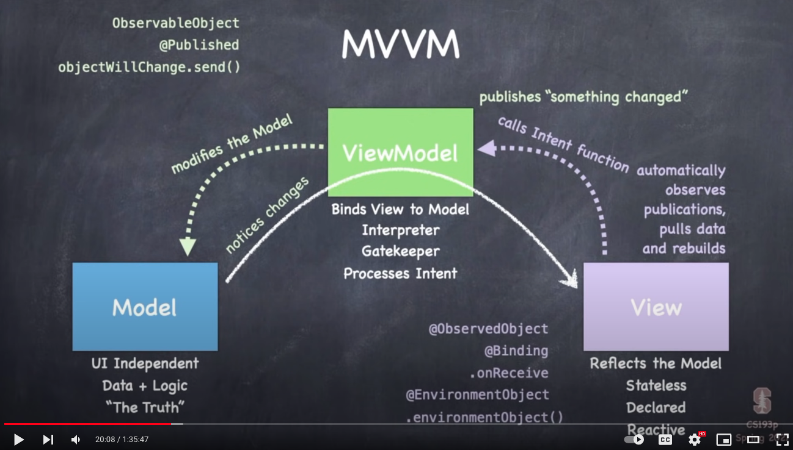

# Lecture 3: MVVM

## Creating the model

### Links that help

- [Lecture 3](https://www.youtube.com/watch?v=--qKOhdgJAs&ab_channel=Stanford)
- [Standford 2021](https://cs193p.sites.stanford.edu/)

