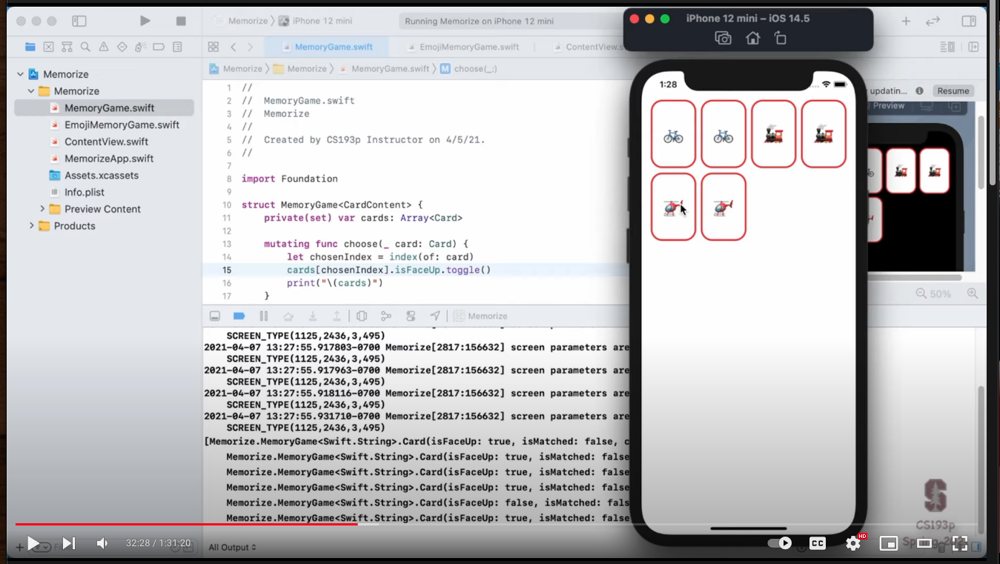
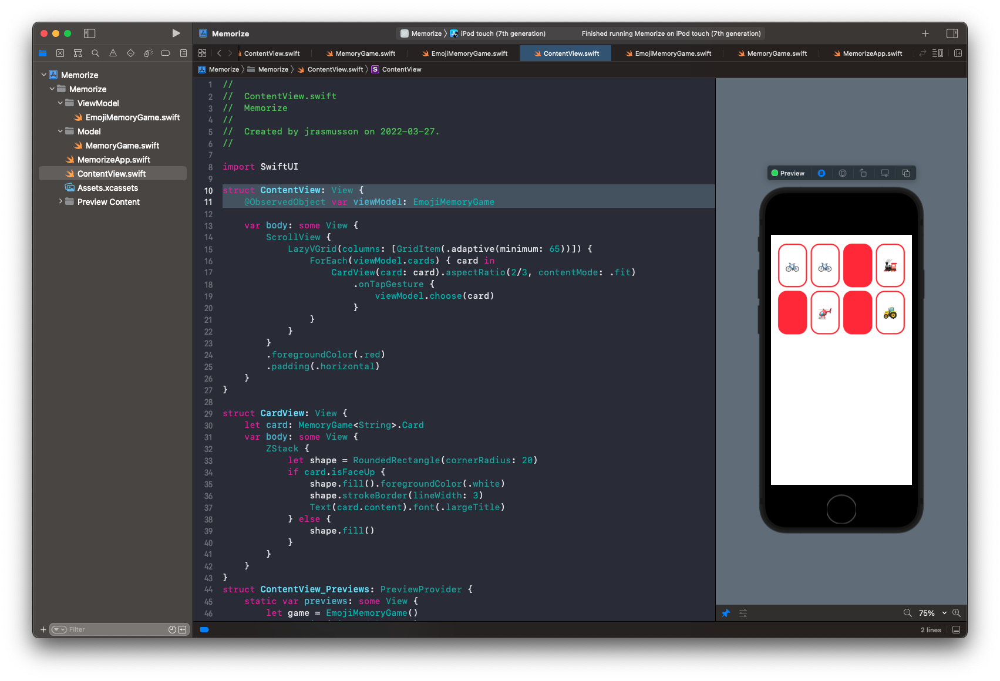

# Lecture 4: More MVVM enum Optionals

## Flipping the card

How should we communicate, or hook up the flipping of the card?

Initially this was done as a `tapGesture` on the view. But now we have a model, and we need to send a message to:

```swift
struct MemoryGame<CardContent> {
    func choose(_ card: Card) {
		// flip card here
    }
}
```

How should we do that? If we remember or MVVM picture, all communication from view to model goes through the view model.


In other words we need to send an intent our our view model, and then our view model can update the model itself.

So our view currently knows about our view model by this:

```swift
@main
struct MemorizeApp: App {
    let game = EmojiMemoryGame()

    var body: some Scene {
        WindowGroup {
            ContentView(viewModel: game)
        }
    }
}
```

And because our view model is a class:

```swift
class EmojiMemoryGame {
    static var emojis = [...]

    private var model: MemoryGame<String> = createMemoryGame()

    var cards: [MemoryGame<String>.Card] {
        return model.cards
    }
}
```

It can maintain state long term wrt to what's going on in the app. The problem is we need to `observe` this state changes in our view. We need to bind to them somehow. This is where combine and SwiftUI data flow come in.

By making our view model an observed object, our view is now bound to changes in the view model. So a change in the view model will be sent out as a change to the view.

So by:

- make the cards observable
- adding the tap gesture back
- calling ViewModel.flipCard
- pass that onto the underlying model
- our view should update itself

Let's see how Paul does it.

First he adds the tapGesture and adds an intent to the view model:

**ContentView**

```swift
struct ContentView: View {
    var viewModel: EmojiMemoryGame

    var body: some View {
        ScrollView {
            LazyVGrid(...) {
                ForEach(viewModel.cards) { card in
                    CardView(card: card)
                        .onTapGesture {
                            viewModel.choose(card) // here
                        }
```

Then he adds the intent to the view model, which simply passes that request onto the model.

**EmojiMemoryGame**

```swift
class EmojiMemoryGame {
    // MARK: - Intent(s)
    func choose(_ card: MemoryGame<String>.Card) {
        model.choose(card)
    }
}
```

And then the model updates itself.

**MemoryGame**

```swift
struct MemoryGame<CardContent> {
    private(set) var cards: [Card]

    mutating func choose(_ card: Card) {
        let chosenIndex = index(of: card)
        cards[chosenIndex].isFaceUp.toggle()
    }
```

Note the `mutating` attribute on the func.

Now this will update the card in the model correctly, but we still need to see a changed signal to the UI.



## MVVM in action

SwiftUI is state driven. Meaning to change the UI, we need to change the state. To make our UI update we need to:

1. Make our view model `@ObservableObject`.
2. Mark key attributes `@Published`.
3. Bind `@ObservedObject` into our view

Here is where MVVM really pays off. We are going to add three simple, yet power keywords to make our UI reactive to changes in our state.

### 1. Make our view model an `@ObservableObject`.

```swift
class EmojiMemoryGame: ObservableObject { ... }
```

When we make an object observable, we get a `var` behind the scenes called:

```swift
var objectWillChange: ObserableObjectPublisher
```

This is the combine framework making view model a publisher, and enabling it to send out signals when certain attributes change.

To fire this event we could go:

```swift
func choose(_ card: MemoryGame<String>.Card) {
    objectWillChange.send() // here
    model.choose(card)
}
```

We like `objectWillChange` here because multiple properties may have changed, and SwiftUI is really good at batching them up and send out all changes at once.

### 2. Mark key attributes `@Published`
 
Next thing we can do is choose specifically, which attributes to publish.

```swift
@Published private var model: MemoryGame<String> = createMemoryGame()
```

What we are saying here is that anytime anyone changes the model, we will broadcast out a change event. It will automatically send it out. So we don't even need `objectWillChange.send()`.

```swift
func choose(_ card: MemoryGame<String>.Card) {
    model.choose(card)
}
```

Next we need to make our view redraw when something changes.

### Bind `@ObservedObject` into our view

```swift
struct ContentView: View {
    @ObservedObject var viewModel: EmojiMemoryGame
```

Now everything is hooked up. Our view model is observable and published. It is going to broadcast changes. And our view is observing those changes through `ObservedObject`.

Now our view will update itself when the model changes. Which is the whole basis of MVVM and the foundation of how SwiftUI works.



**EmojiMemoryGame**

```swift
class EmojiMemoryGame: ObservableObject { // 1
    static var emojis = ["🚲", "🚂", "🚁", "🚜", "🚕", "🏎", "🚑", "🚓", "🚒", "✈️", "🚀", "⛵️", "🛸", "🛶", "🚌", "🏍", "🚃", "🚡", "🛵", "🚗", "🚚", "🚇", "🛻", "🚄"]

    static func createMemoryGame() -> MemoryGame<String> {
        MemoryGame<String>(numberOfPairsOfCards: 4) { pairIndex in
            EmojiMemoryGame.emojis[pairIndex]
        }
    }

    @Published private var model: MemoryGame<String> = createMemoryGame() // 2

    var cards: [MemoryGame<String>.Card] {
        return model.cards
    }

    // MARK: - Intent(s)
    func choose(_ card: MemoryGame<String>.Card) {
        model.choose(card)
    }
}
```

**ContentView**

```swift
import SwiftUI

struct ContentView: View {
    @ObservedObject var viewModel: EmojiMemoryGame // 3

    var body: some View {
        ScrollView {
            LazyVGrid(columns: [GridItem(.adaptive(minimum: 65))]) {
                ForEach(viewModel.cards) { card in
                    CardView(card: card).aspectRatio(2/3, contentMode: .fit)
                        .onTapGesture {
                            viewModel.choose(card)
                        }
                }
            }
        }
        .foregroundColor(.red)
        .padding(.horizontal)
    }
}
```

### Links that help

- [Lecture 4](https://www.youtube.com/watch?v=oWZOFSYS5GE&ab_channel=Stanford)
- [Standford 2021](https://cs193p.sites.stanford.edu/)


