# Lecture 5: Properties Layout @ViewBuilder


## @State


## How to manipulate model struct indices

**MemoryGame**

```swift
struct MemoryGame<CardContent> where CardContent: Equatable {
    private(set) var cards: [Card]

    private var indexOfTheOneAndOnlyFaceUpCard: Int? {
        get { cards.indices.filter { cards[$0].isFaceUp }.oneAndOnly }
        set { cards.indices.forEach { cards[$0].isFaceUp = ($0 == newValue) }}
    }

extension Array {
    var oneAndOnly: Element? {
        if self.count == 1 {
            return self.first
        } else {
            return nil
        }
    }
}
```

## Property Observers

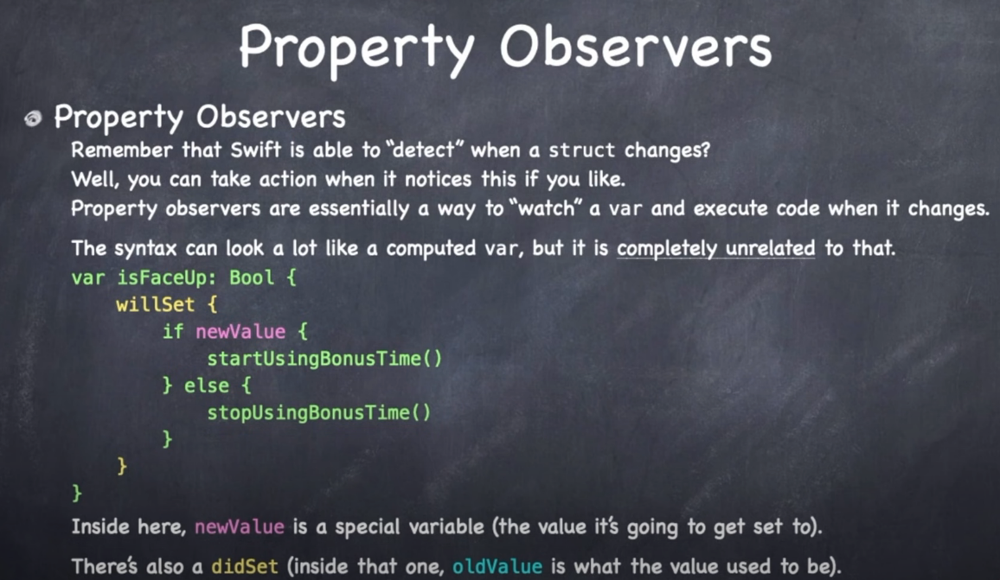

## Layout

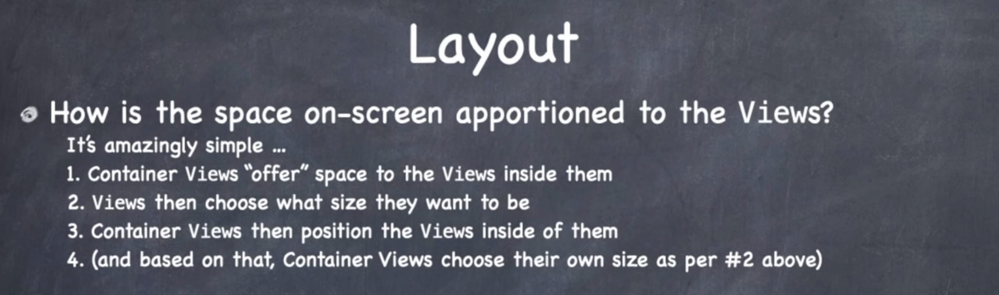

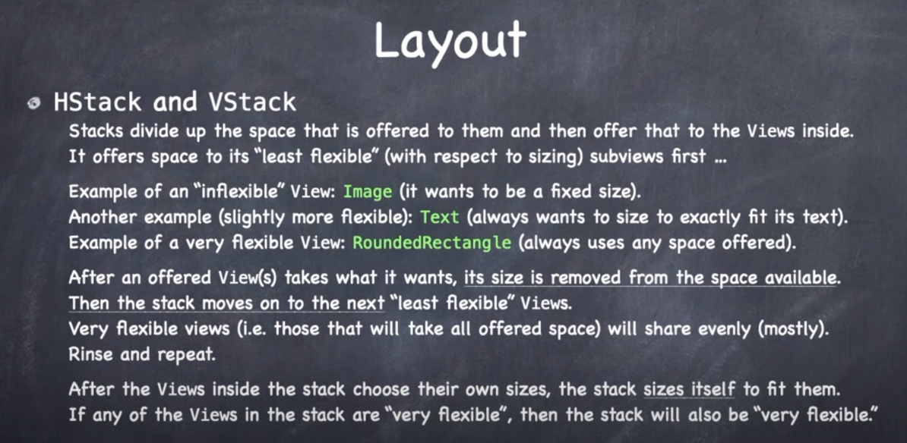

So `HStack` `VStack` basically let their subviews size themselves, and then they size themselves based on what their subviews decide.

If a subview is "very flexible", the stack will be "very flexible" too.

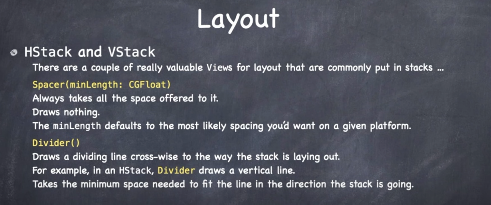

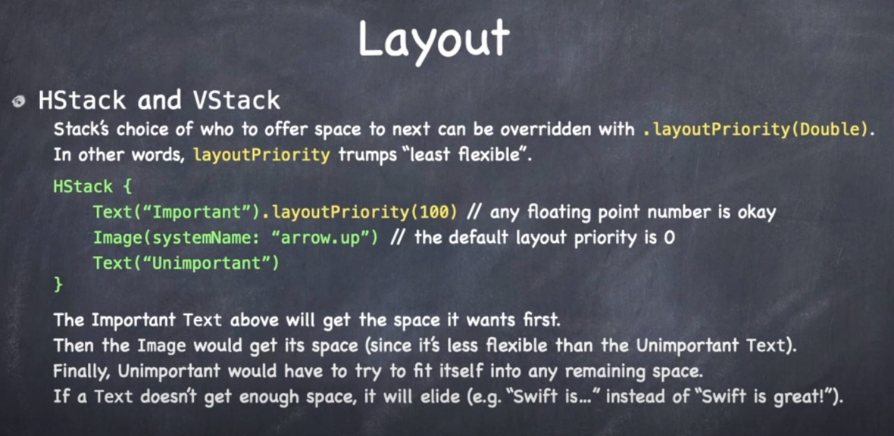

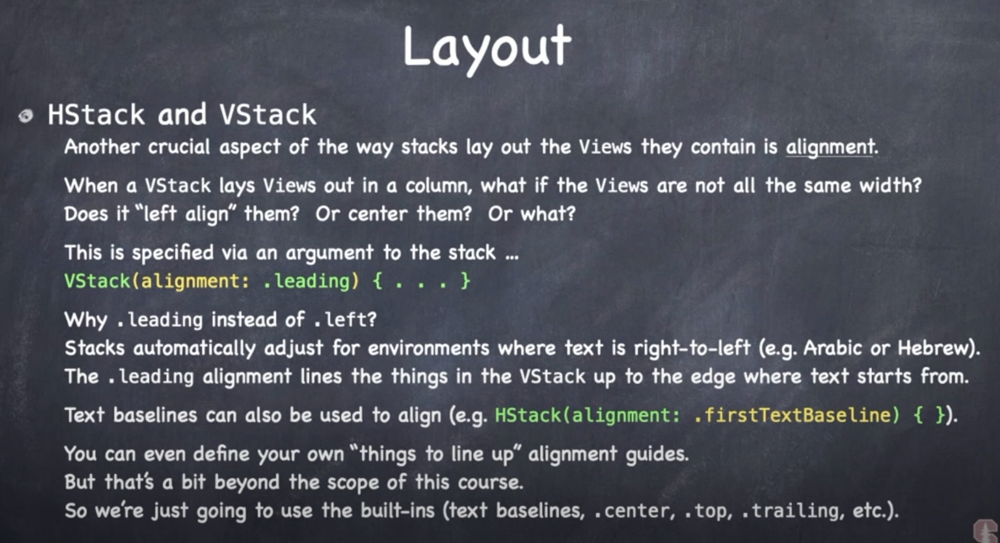

`VStack` centers by default.

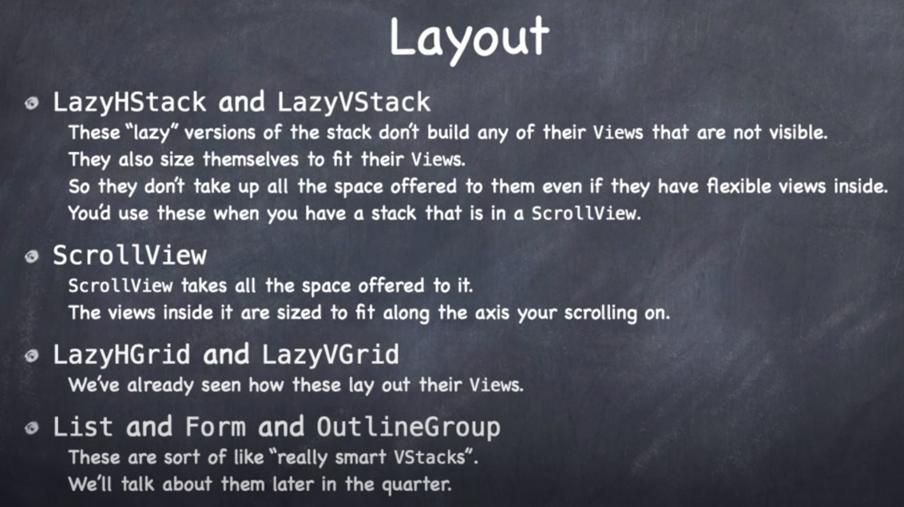

Lazy versions don't build the bodies of what is not on screen. They only draw what's on screen. *They are never flexible*. They make them as small as possible. Use these within `ScrollView`.

`ScrollView` always accepts the space offered to it, but scrolls around its content inside.

`List Form OutlineGroup` are awesome. More later.

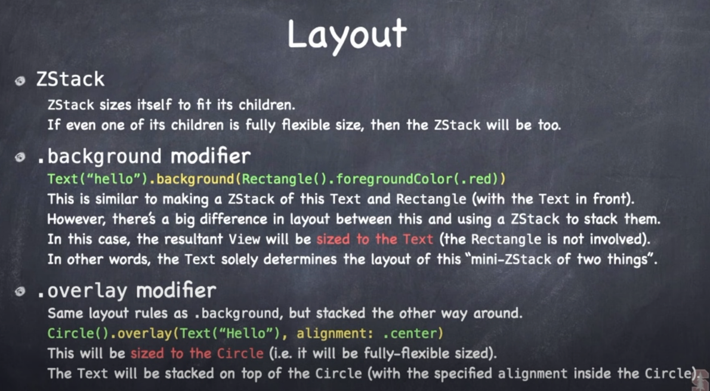

`ZStack` sizes itself to children. If child fexible it will be flexible.

Alternative to `ZStack` is `.background` modifier. Difference is background only affect the thing it is backgrounding.

`overlay` is same thing but in other direction. It overlays the view.


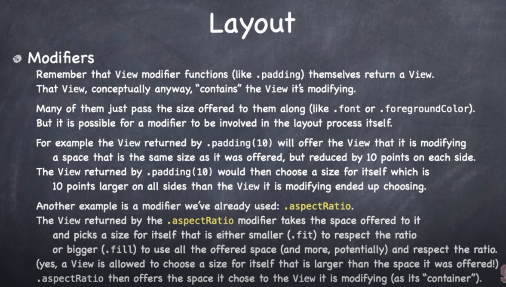

With `backgroud` and `overlay` modifiers what you are seeing are view modifiers that are kind of acting like container views.

Most modifiers just pass size onto the view they are modifying. But some are involved in the layout process. i.e. `padding`.

`.aspectRatio` does this too. It affects the layout process.


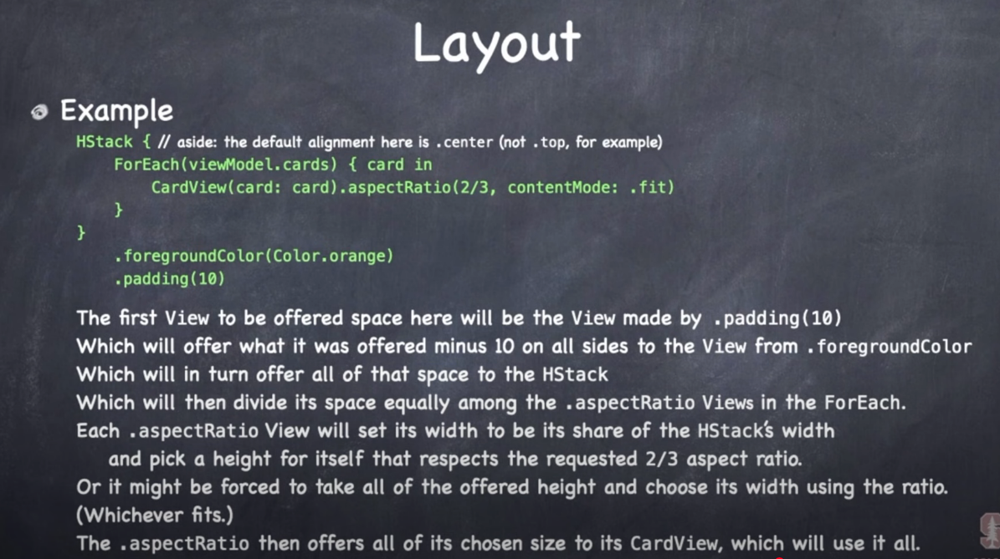

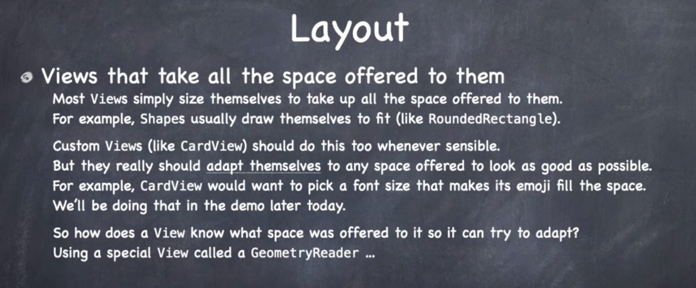

## GeometryReader

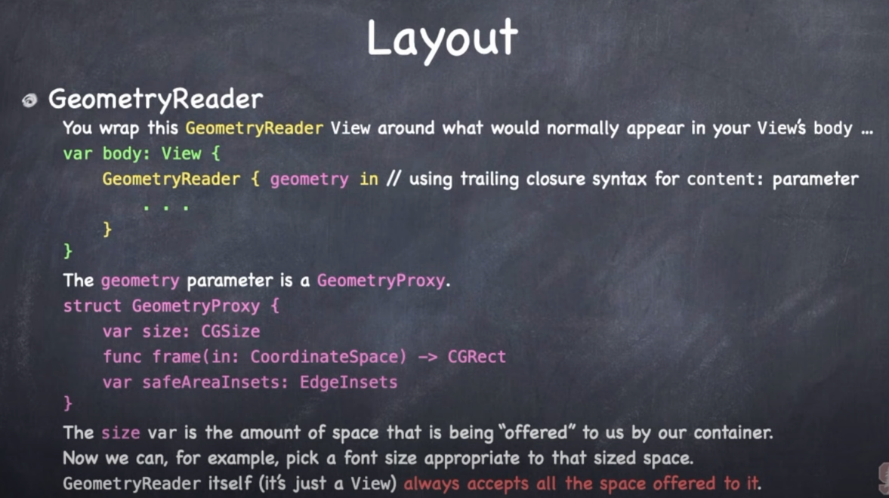

This thing let's you figure out how much spacing is being offered to a view. Handy for when you need to make your view dynamic, and resizable based on the space being offered.

The way it works is you simply wrap the `Geometry` reader around the view you want to size, it's only input is a `ViewBuilder` so it can take anything.

And it passes back `GeometryProxy` which contains are `size`.

So now that view inside can draw normally, but it also know how much space it has.

> Note: Geometry sizes itself to fit the space offered to it. It is maximum flexible. That means the view you put inside a GeometryReader wants to be big and flexible. Always contains "fully flexible" views.


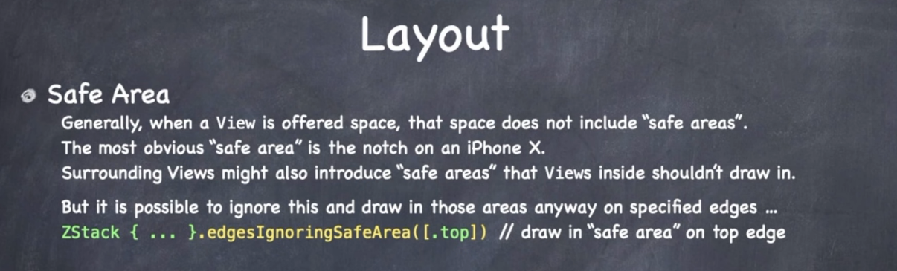

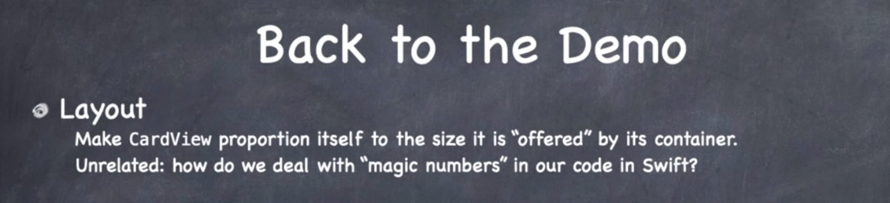

## How to make the card resize itself

Let's use `GeometryReader` to make the font better fit the size of our card.

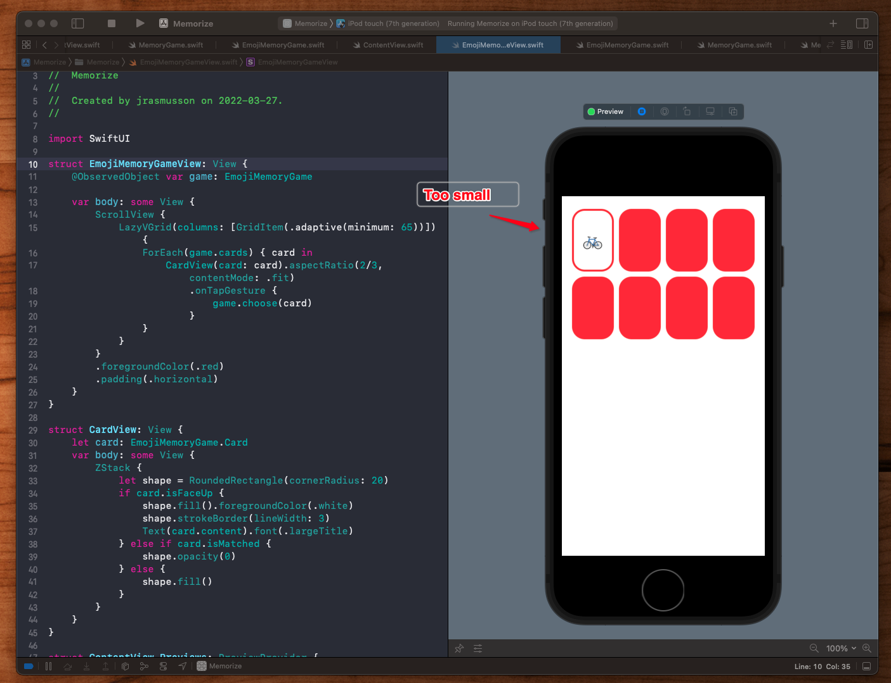

### Links that help

- [Lecture 5](https://www.youtube.com/watch?v=ayQl_F_uMS4&ab_channel=Stanford)
- [Standford 2021](https://cs193p.sites.stanford.edu/)


