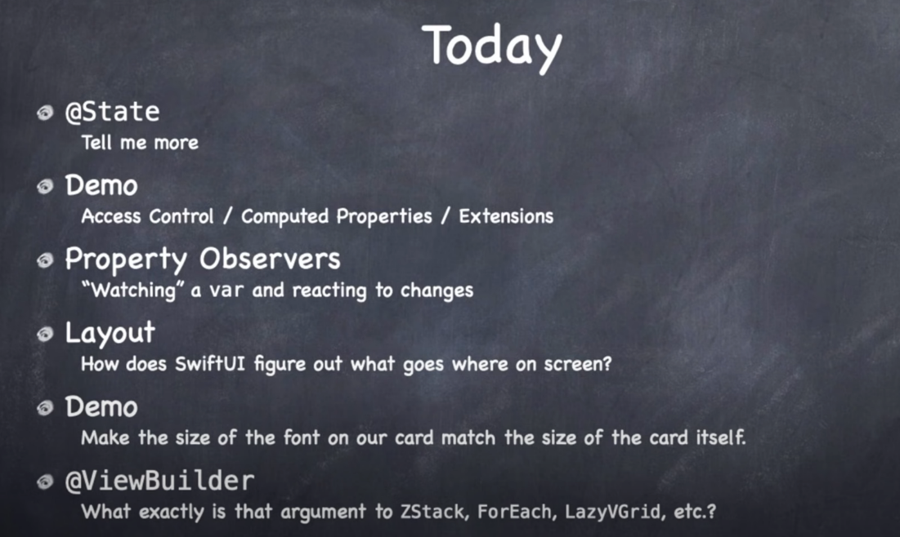
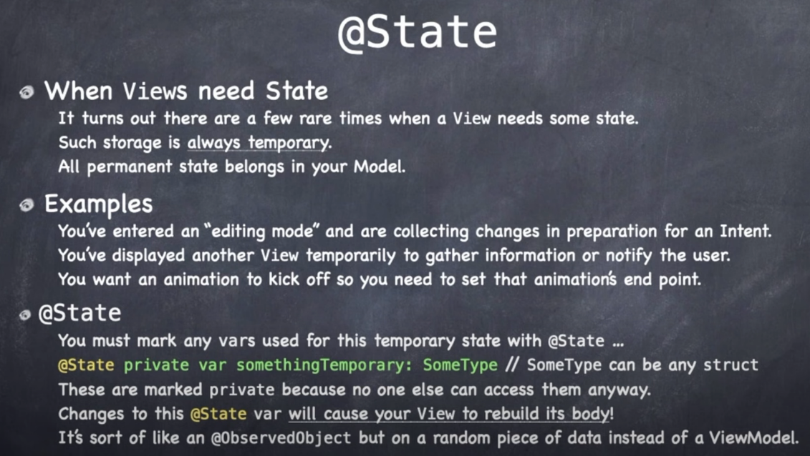
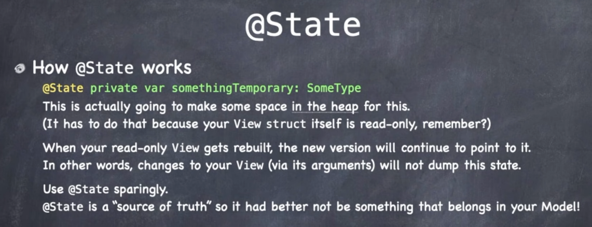

# Lecture 5: Properties Layout @ViewBuilder

## @State

### Links that help

- [Lecture 5](https://www.youtube.com/watch?v=ayQl_F_uMS4&ab_channel=Stanford)
- [Standford 2021](https://cs193p.sites.stanford.edu/)

