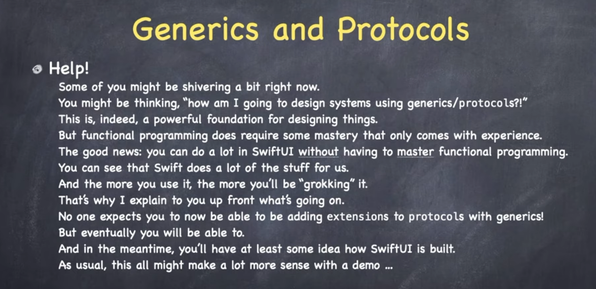
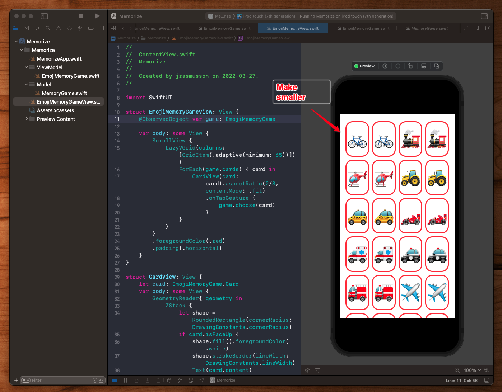
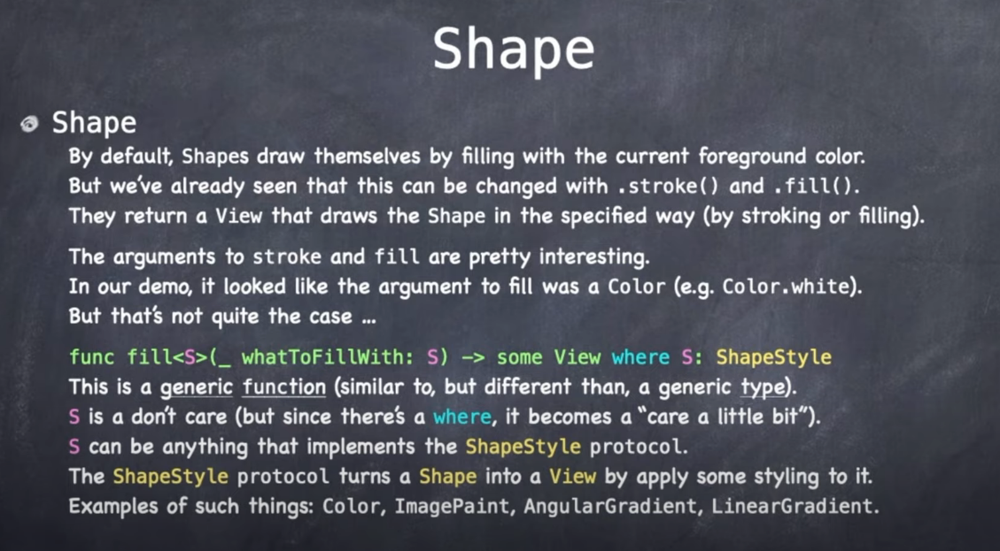
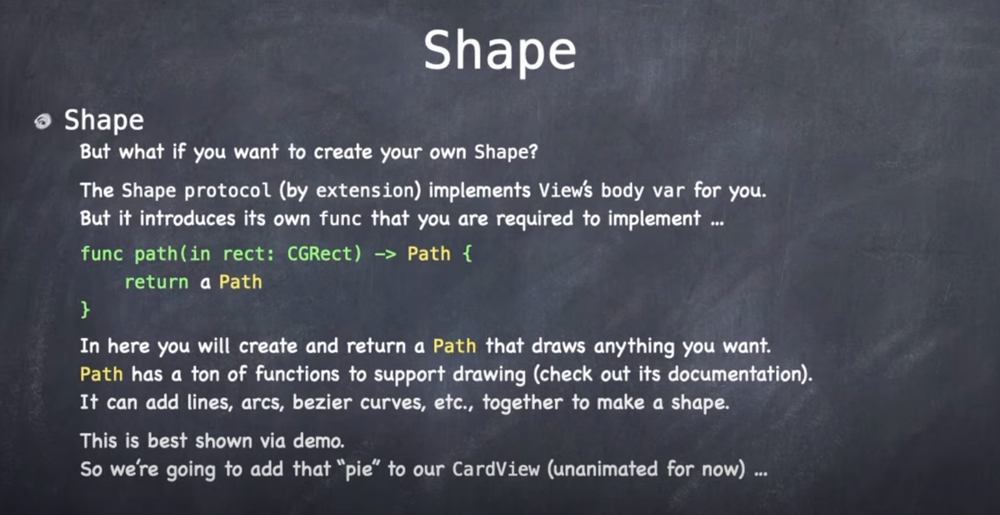
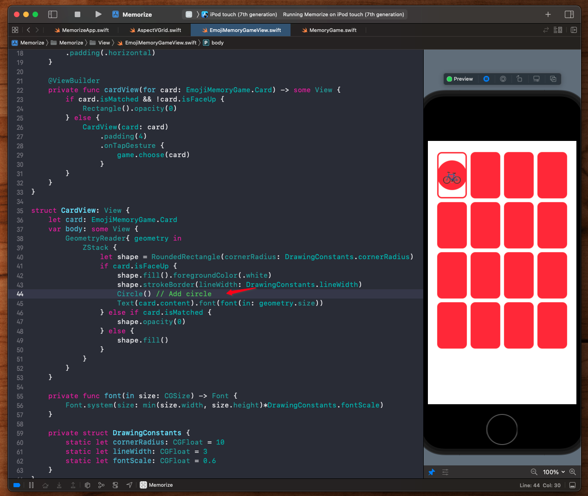
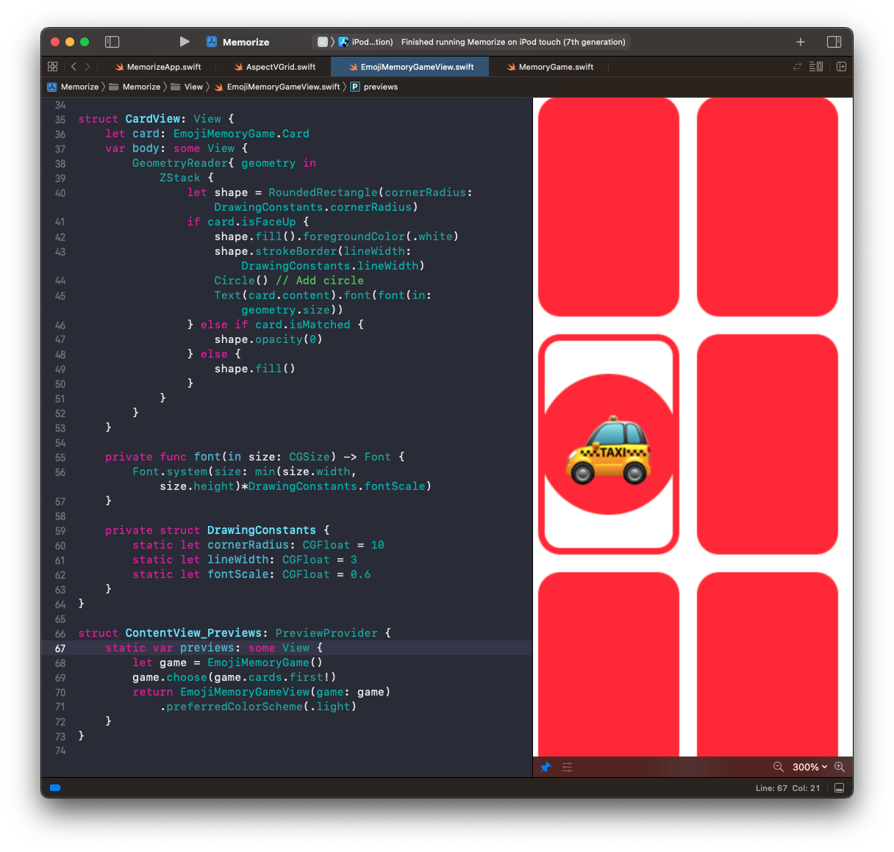
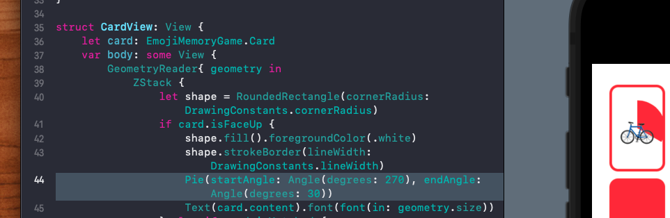
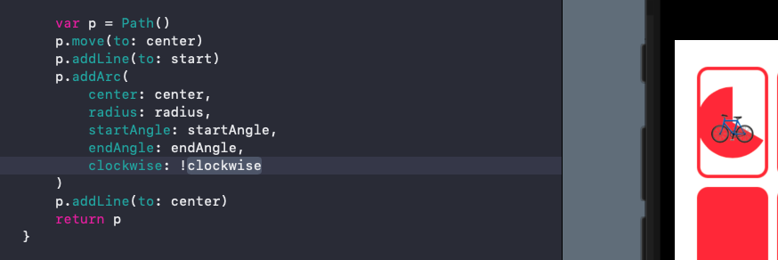

# Lecture 6: Protocols Shapes

## Protocols


This next one is an interesting slide.


Here Paul is saying that we would almost never see a protocol used as a type in an array. Which of course is poppy cock.

We use protocols in arrays all the time. Nothing special there.

What IS special is that some protocols can't be passed around and used in array. And those procotols are ones that use `associatedtype`.

### Associated types

[Associated types](https://docs.swift.org/swift-book/LanguageGuide/Generics.html) are placeholders for types in protocols.

For example if we don't know the type of something that is going to be used in a protocol, we would define it as an `associatedtype`.

```swift
protocol Container {
    associatedtype Item
    mutating func append(_ item: Item)
    var count: Int { get }
    subscript(i: Int) -> Item { get }
}
```

Then to implement, the struct or class would need to specify the type to be used like this:


```swift
struct IntStack: Container {
    // conformance to the Container protocol
    typealias Item = Int
    mutating func append(_ item: Int) {
        self.push(item)
    }
    var count: Int {
        return items.count
    }
    subscript(i: Int) -> Int {
        return items[i]
    }
}
```

What's interesting about protocols that use `associatedtype` is you can't define them as variables:

```swift
var someViews: [View]
```

Because if you do you will get an error message like this:

```swift
Protocol 'View' can only be used as a generic constraint because it has Self or associated type requirements
```

What this is saying is that you haven't defined the `associatedtype` for me. So I can't store it. I can only store types that have been fully defined. And because the `assoicatedtype` here is currently undefined, I can't allocate.

This is one special case where protocols can't be stored right off the bat. And it's because they have associated types.

You will also see this error if you ever accidentally type:

```swift
struct ContentView: View {
    var body: View {
        Text("SwiftUI")
    }
}
```

vs

```swift
struct ContentView: View {
    var body: some View {
        Text("SwiftUI")
    }
}
```

Here `some` makes the `View` opaque. Which means it's not really clear exactly what this type will be. It hides it. The compiler has access to the type infomration, but clients don't.

But it gets around the associatedtype error. So drop in `some` if you see this in your views.


The way protocols are used is to specify the behavior of a struct, class, or enum.

- A `struct` behaves like a `View`.
- A `class` behaves like an `ObservableObject`.

This last one is interested because while there is no `func` the class needed to implement, behind the scenes there was a:

- `var objectWillChange`

Get implemented for us for free behind the scenes.

There are also lighter weight protocols like:

- `Identifiable`
- `Hasable`
- `Equatable`


Can also be used to limit or qualify generics.


Restrict extensions.


And of course be used in setting up agreement between two entities (i.e. protocol-delegate).


Protocols are also how we do inheritance in Swift. Instead of extending something, we can define a protocol and then via an extension add a default implementation in there.


> Implementation can be added to a procol by creating an extension.

This is how views get `.foregroundColor` and `.font` - all view extension modifiers.

Let's take a look now and see how `filter` can be added as an extension.


So `filter` is a function that works on just about any collection. It has a generic called `Element` and it returns an `Array<Element>`.

So this function was written be Apple only once, but somehow it gets used on a variety of data types. How did they do that?

`filter` was added to the Foundation library as an `extension` to the `Sequence` protocol.

Since Array, Range, String, and Dictionary all conform to Sequece, they all get or inherit Sequence functionality via the protocol.

One way of thinking about what protocols give us is `constrains and gains`.


Protocols `constrain` what the implementer can do - this force you to implement certains interfaces.

But you also `gain` because then can give you default implementations to certain functionality.

This is the protocol-oriented way of doing traditional OO inheritance.

Only here instead of single class inheritance, with protocol-oriented programming you can mix-in, or offer way more functionality, without the clunkiness of single class inheritance. 

So for example by us implementing `View` in SwiftUI, we gain a tonne of functionality.


So what's going on behind the scenes in the SwiftUI library? Here is some pseudo code:


Basically protocol and it's extensions.

Why protocols? It's a way for types to say what they are capable of.


Let's take a look at `Identifable` and see what it can teach us about protocols.


Protocols don't declare generics the same way classes and structs do. When it comes to protocols, the generic is `associatedtype`.

So when you see a generic in a protocol, it is an associated type.

```swift
protocol Identifable {
   associatedType ID
   var id: ID { get }
}
```

Now as we learned earlier, this `ID` also has to be hashable.


How do we make that `ID` don't care `Hashable`? We make the `associatedType ID` with a `where` clause.


We turn the `generic/associatedtype` from a "don't care" into a "we care a little bit".

So what is `Hashable`? `Hashable` is a simple don't care protocol.


Now in rare cases two different objects might Hash into the same thing. A collision 💥.


For that reason things that are `Hashable` must also be `Equatable`. So when you implement hash, you are also implementing equals.

And that begs the question... what is `Equatable`?


Yes - `==` is a legal function name in Swift. Also notice the `Self` capital `S`. That means your static struct type. You can't use this as a normal type. You can't go:

```swift
var x: [Equatable]
```

Because `==` isn't defined for `Equatable`. That's why you can't use self referencing types as `var`s or in arrays.

Now if you implement `Equatable`, and all of your `vars` are equatable, Swift will implement the static `==` for you.




## Demo

### Making the cards smaller so they don't scroll

How could we make it so that when too many cards appear on the screen, our `ScrollView` doesn't scroll. Let's do this by making the cards smaller.



Since there is no container with a `ViewBuilder` to do that for us, we will make one ourselves.

**EmojiMemoryGame**

```swift
struct EmojiMemoryGameView: View {
    @ObservedObject var game: EmojiMemoryGame

    var body: some View {
        AspectVGrid(items: game.cards, aspectRatio: 2/3) { card in
            cardView(for: card)
        }
        .foregroundColor(.red)
        .padding(.horizontal)
    }
}
```

**AspectGrid**

```swift
import SwiftUI

struct AspectVGrid<Item, ItemView>: View where Item: Identifiable, ItemView: View  {
    var items: [Item]
    var aspectRatio: CGFloat
    var content: (Item) -> ItemView

    init(items: [Item], aspectRatio: CGFloat, @ViewBuilder content: @escaping (Item) -> ItemView) {
        self.items = items
        self.aspectRatio = aspectRatio
        self.content = content
    }

    var body: some View {
        GeometryReader { geometry in
            VStack {
                let width: CGFloat = widthThatFits(itemCount: items.count, in: geometry.size, itemAspectRatio: 2/3)
                LazyVGrid(columns: [adaptiveGridItem(width: width)], spacing: 0) {
                    ForEach(items) { item in
                        content(item).aspectRatio(aspectRatio, contentMode: .fit)
                    }
                }
                Spacer(minLength: 0)
            }
        }
    }

    private func adaptiveGridItem(width: CGFloat) -> GridItem {
        var gridItem = GridItem(.adaptive(minimum: width))
        gridItem.spacing = 0
        return gridItem
    }

    private func widthThatFits(itemCount: Int, in size: CGSize, itemAspectRatio: CGFloat) -> CGFloat {
        var columnCount = 1
        var rowCount = itemCount

        repeat {
            let itemWidth = size.width / CGFloat(columnCount)
            let itemHeight = itemWidth / itemAspectRatio
            if CGFloat(rowCount) * itemHeight < size.height {
                break
            }
            columnCount += 1
            rowCount = (itemCount + (columnCount - 1)) / columnCount
        } while columnCount < itemCount

        if columnCount > itemCount {
            columnCount = itemCount
        }
    return floor(size.width / CGFloat(columnCount))
    }
}
```

## Shape

`Shape` is a protocol that inherits from `View`. All `Shapes` are also Views.



By default Shapes draw themselves by filling with the current foreground color. They can be changed with `.stroke()` and `.fill()`. But the arguments to stroke and fill are pretty interesting.

You might think there are different versions of the fill funciton that takes a color, and another that takes a gradient. But that's not quite the case.

The fill function actually takes a don't care.

```swift
func fill<S>(_ whatToFilWith: S) -> some Viwe where S: ShapeStyle
```

Functions can be generic as well. `ShapeStyle` knows how to turn a `Shape` into a `View`.

What if we want to create our own `Shape`?




For that you implement the `Shape` protocol which forces you to return a `Path`. The `Path` struct has a ton of functions to support drawing.

### Demo

Let's start by adding a circle behind our face up card.




Note how `Circle` is placed between the x3 views here:

```swift
shape.fill().foregroundColor(.white)
shape.strokeBorder(lineWidth: DrawingConstants.lineWidth)
Circle() // Add circle
Text(card.content).font(font(in: geometry.size))
```

Get used to thinking of each line of code that modifies view as a new view. Not that we are doing something to the original. These are new views returned everytime.

When we run this in preview mode we run into a bit of a problem. Every time we add a new line of code our preview refreshes itself making working with our current view hard.

So to fix this remember you can use your `Preview` to always keep it up.

```swift
struct ContentView_Previews: PreviewProvider {
    static var previews: some View {
        let game = EmojiMemoryGame()
        game.choose(game.cards.first!)
        return EmojiMemoryGameView(game: game)
            .preferredColorScheme(.light)
    }
}
```

Couple of things aren't great about this circle. 

- Touches the sides too closely.
- Wrong share of red



So we can:

- add padding
- change the opacity

```swift
Circle().padding(5).opacity(0.5) // Add circle
```

#### Make a new Shape

To make our pie let's create a new Shape.

Note how this is a `struct` - not a `View`. `Path` is simply a struct containing a set of instructions on how to draw a Shape.

**Pie**

```swift
import SwiftUI

struct Pie: Shape {
    func path(in rect: CGRect) -> Path {
        var p = Path()

        return p
    }
}
```

Simplest way to draw our pie is to:

- move to the center 
- draw a line up to the top (called `startPoint`)
- then go around in an arc
- then draw a line back to the center

To do that we will need the center of the shape as well as the radius of the circle.


Radius and start point really depend on how much space we are offered. Whenever you hear that think `GeometryReader`. Remember `GeometryReader` and its proxy give you the size offered for any given view.

Radius will be half the width or height of space but the smaller of the two.

One thing that is interesting is why are our variables defined for this `struct` not `lets`?


The reason why these aren't `lets`

```swift
struct Pie: Shape {
    var startAngle: Angle
    var endAngle: Angle
    var clockwise = false
```

is because these are going to change. 

```swift
    var startAngle: Angle
    var endAngle: Angle
```

Are going to be animated. So these need to be `var`.

`clockwise` is interesting because it we made it a `let`, then it would be instantly initialized before the initialization pass because it just got a value. They wouldn't be able to change. I don't quite understand Pauls point here. Will have to think about this one.

#### Coordinate system

We can define our angles as:

```
	270
180		0
	90
```

So you'd think we could draw it like this:



But that's not quite right because this it is not our normal cartesian coordinate system.

In iOS our origin is upper left increase down and to the right as x and y.

```
0,0 ----> x
|
|
y
```

So we have to flip everything 180. Because it is upside down.

Fix is to invert the `clockwise` setting.



Finished product for shape.

**Pie**

```swift
import SwiftUI

struct Pie: Shape {
    var startAngle: Angle
    var endAngle: Angle
    var clockwise = false

    func path(in rect: CGRect) -> Path {
        let center = CGPoint(x: rect.midX, y: rect.midY)
        let radius = min(rect.width, rect.height) / 2

        // need the angle to draw up and animate
        // need to add start / end angle
        // then do trigonometry to figure out where to start our arc

        // the start point at the top will be:
        let start = CGPoint(
            x: center.x + radius * cos(startAngle.radians),
            y: center.y + radius * sin(startAngle.radians)
        )

        var p = Path()
        p.move(to: center)
        p.addLine(to: start)
        p.addArc(
            center: center,
            radius: radius,
            startAngle: startAngle,
            endAngle: endAngle,
            clockwise: !clockwise
        )
        p.addLine(to: center)
        return p
    }
}
```


### Links that help

- [Lecture 6 Video](https://www.youtube.com/watch?v=Og9gXZpbKWo&ab_channel=Stanford)
- [Swift associatedtype](https://docs.swift.org/swift-book/LanguageGuide/Generics.html)


