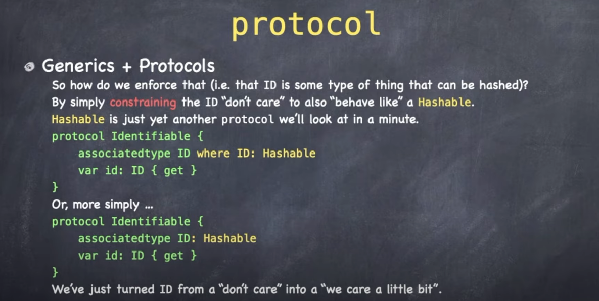
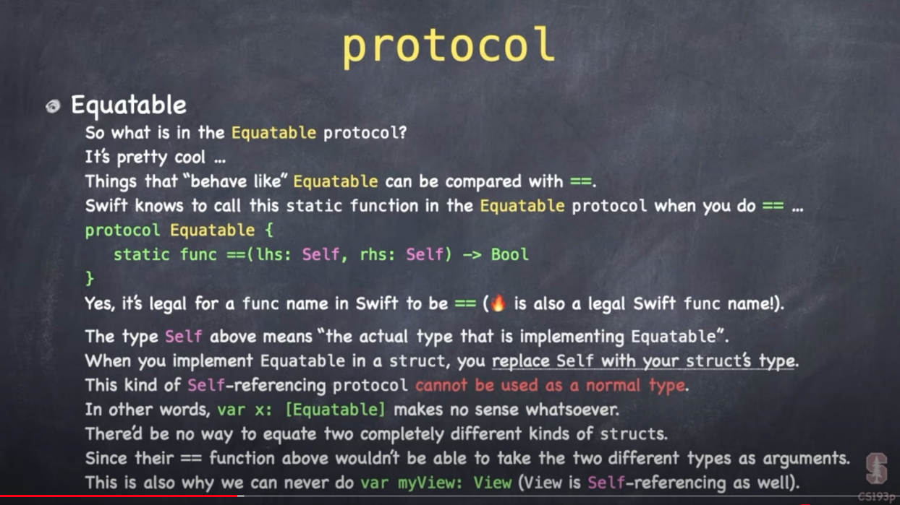
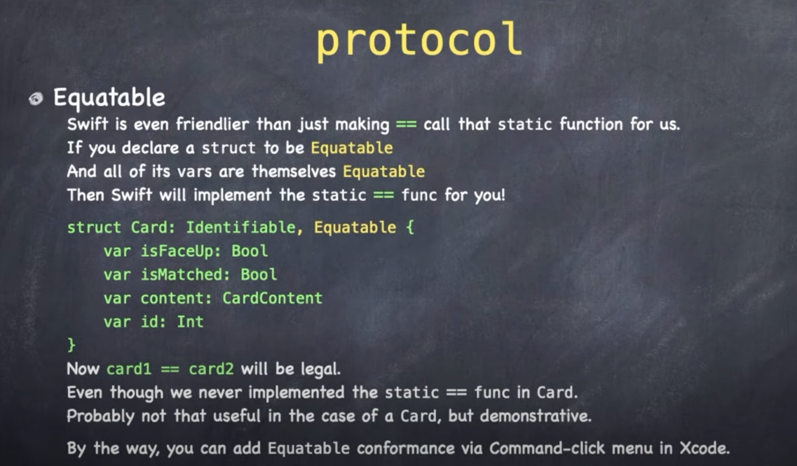

# Lecture 6: Protocols Shapes

## Protocols


This next one is an interesting slide.


Here Paul is saying that we would almost never see a protocol used as a type in an array. Which of course is poppy cock.

We use protocols in arrays all the time. Nothing special there.

What IS special is that some protocols can't be passed around and used in array. And those procotols are ones that use `associatedtype`.

### Associated types

[Associated types](https://docs.swift.org/swift-book/LanguageGuide/Generics.html) are placeholders for types in protocols.

For example if we don't know the type of something that is going to be used in a protocol, we would define it as an `associatedtype`.

```swift
protocol Container {
    associatedtype Item
    mutating func append(_ item: Item)
    var count: Int { get }
    subscript(i: Int) -> Item { get }
}
```

Then to implement, the struct or class would need to specify the type to be used like this:


```swift
struct IntStack: Container {
    // conformance to the Container protocol
    typealias Item = Int
    mutating func append(_ item: Int) {
        self.push(item)
    }
    var count: Int {
        return items.count
    }
    subscript(i: Int) -> Int {
        return items[i]
    }
}
```

What's interesting about protocols that use `associatedtype` is you can't define them as variables:

```swift
var someViews: [View]
```

Because if you do you will get an error message like this:

```swift
Protocol 'View' can only be used as a generic constraint because it has Self or associated type requirements
```

What this is saying is that you haven't defined the `associatedtype` for me. So I can't store it. I can only store types that have been fully defined. And because the `assoicatedtype` here is currently undefined, I can't allocate.

This is one special case where protocols can't be stored right off the bat. And it's because they have associated types.

You will also see this error if you ever accidentally type:

```swift
struct ContentView: View {
    var body: View {
        Text("SwiftUI")
    }
}
```

vs

```swift
struct ContentView: View {
    var body: some View {
        Text("SwiftUI")
    }
}
```

Here `some` makes the `View` opaque. Which means it's not really clear exactly what this type will be. It hides it. The compiler has access to the type infomration, but clients don't.

But it gets around the associatedtype error. So drop in `some` if you see this in your views.


The way protocols are used is to specify the behavior of a struct, class, or enum.

- A `struct` behaves like a `View`.
- A `class` behaves like an `ObservableObject`.

This last one is interested because while there is no `func` the class needed to implement, behind the scenes there was a:

- `var objectWillChange`

Get implemented for us for free behind the scenes.

There are also lighter weight protocols like:

- `Identifiable`
- `Hasable`
- `Equatable`


Can also be used to limit or qualify generics.


Restrict extensions.


And of course be used in setting up agreement between two entities (i.e. protocol-delegate).


Protocols are also how we do inheritance in Swift. Instead of extending something, we can define a protocol and then via an extension add a default implementation in there.


> Implementation can be added to a procol by creating an extension.

This is how views get `.foregroundColor` and `.font` - all view extension modifiers.

Let's take a look now and see how `filter` can be added as an extension.


So `filter` is a function that works on just about any collection. It has a generic called `Element` and it returns an `Array<Element>`.

So this function was written be Apple only once, but somehow it gets used on a variety of data types. How did they do that?

`filter` was added to the Foundation library as an `extension` to the `Sequence` protocol.

Since Array, Range, String, and Dictionary all conform to Sequece, they all get or inherit Sequence functionality via the protocol.

One way of thinking about what protocols give us is `constrains and gains`.


Protocols `constrain` what the implementer can do - this force you to implement certains interfaces.

But you also `gain` because then can give you default implementations to certain functionality.

This is the protocol-oriented way of doing traditional OO inheritance.

Only here instead of single class inheritance, with protocol-oriented programming you can mix-in, or offer way more functionality, without the clunkiness of single class inheritance. 

So for example by us implementing `View` in SwiftUI, we gain a tonne of functionality.


So what's going on behind the scenes in the SwiftUI library? Here is some pseudo code:


Basically protocol and it's extensions.

Why protocols? It's a way for types to say what they are capable of.


Let's take a look at `Identifable` and see what it can teach us about protocols.


Protocols don't declare generics the same way classes and structs do. When it comes to protocols, the generic is `associatedtype`.

So when you see a generic in a protocol, it is an associated type.

```swift
protocol Identifable {
   associatedType ID
   var id: ID { get }
}
```

Now as we learned earlier, this `ID` also has to be hashable.


How do we make that `ID` don't care `Hashable`? We make the `associatedType ID` with a `where` clause.



We turn the `generic/associatedtype` from a "don't care" into a "we care a little bit".

So what is `Hashable`? `Hashable` is a simple don't care protocol.


Now in rare cases two different objects might Hash into the same thing. A collision 💥.


For that reason things that are `Hashable` must also be `Equatable`. So when you implement hash, you are also implementing equals.

And that begs the question... what is `Equatable`?



Yes - `==` is a legal function name in Swift. Also notice the `Self` capital `S`. That means your static struct type. You can't use this as a normal type. You can't go:

```swift
var x: [Equatable]
```

Because `==` isn't defined for `Equatable`. That's why you can't use self referencing types as `var`s or in arrays.

Now if you implement `Equatable`, and all of your `vars` are equatable, Swift will implement the static `==` for you.




### Links that help

- [Lecture 6 Video](https://www.youtube.com/watch?v=Og9gXZpbKWo&ab_channel=Stanford)
- [Swift associatedtype](https://docs.swift.org/swift-book/LanguageGuide/Generics.html)


