# Lecture 7: ViewModifier Animation

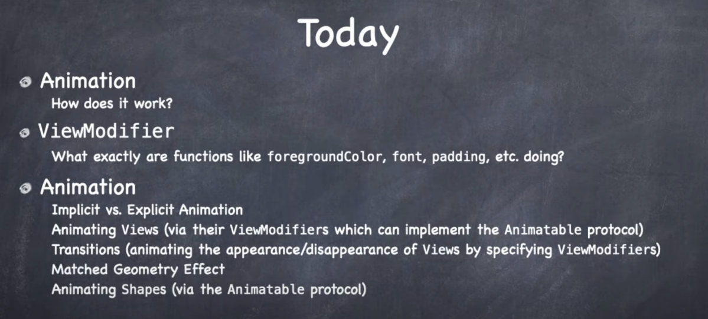

Animation is important and SwiftUI tries to make it easy.

One way to do animation is to animate the view itself (i.e. `Shape`). Which we'll do later.

But a much more common way to animate views is via their `ViewModifier`s.

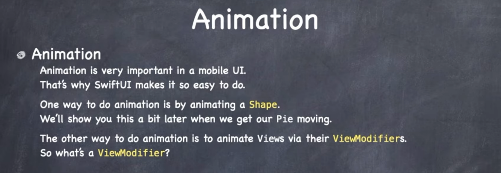

So what's a `ViewModifier`?

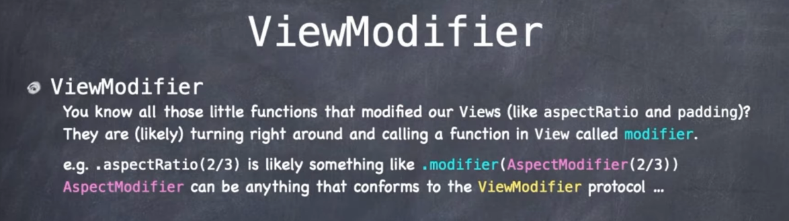

`ViewModifiers` are extensions on protocols that give us functionality via protocol-inheritance.

`aspectRatio`, `padding` are all `ViewModifiers`. They implement the `ViewModifier` protocol.

This protocol only has one function in it. To create a `View`.

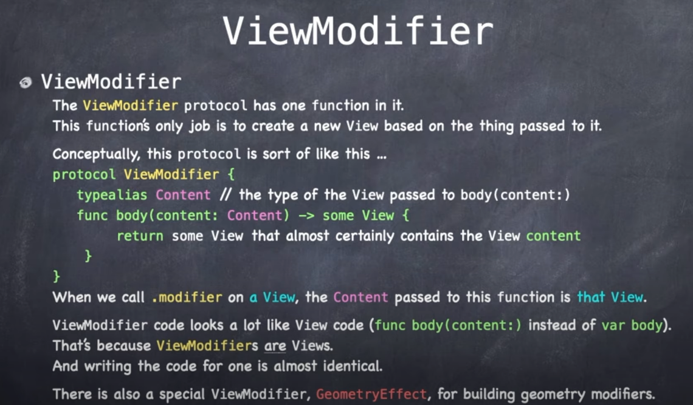

It's very similar to how to build view in a `View`. Only here we have a function called:

```swift
protocol ViewModifier {
	typealias Content // the type of the view passed in
	func body(content: Content) -> some View {
	   return some new view based on the content view passed in
	}
}
```

`ViewModifiers` are themselves views.

Let's look at an example. Let's `cardify` a view.

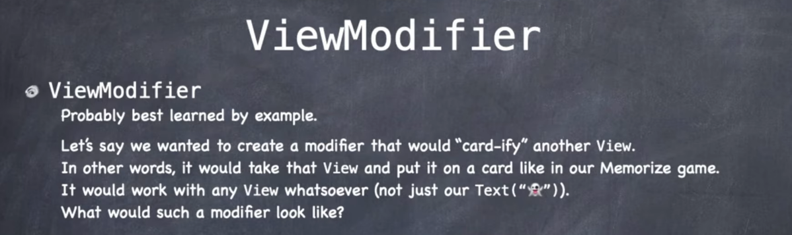

It's pretty easy. Simply:

- create a new `struct`
- implement `ViewModifier`
- and do your work in `func body()` 

Notice however a couple of important things. First, notice how the `content` we pass in, is the view we modify.

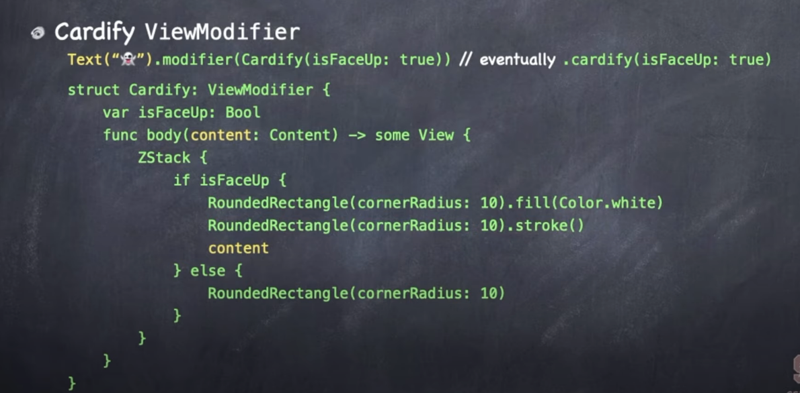

The text denoted in yellow is our `content`. And that is how the view modifier gets it's hands on it.

Secondly notice how our modifier can have arguments. `Cardify` is a struct that can take arguments. So we can pass arguments to view modifiers simply by defining their `var`s in our struct.

When these `vars` change, the view changes. We'll use this later to kick off animations.

Then just remember that the view modifier itself returns a new `View`.

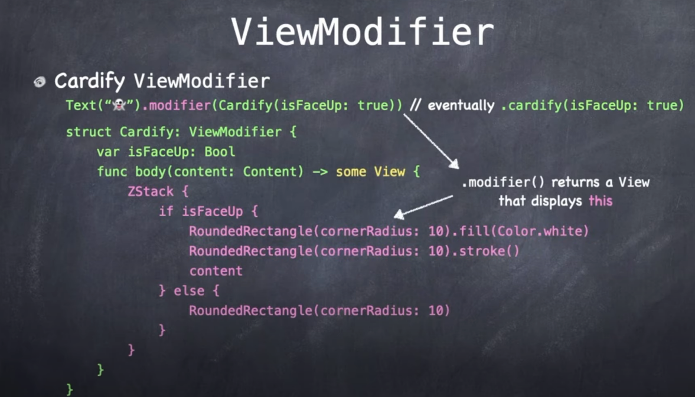

Next, how do we get from `Cardify` to `.cardify`? Easy. Add an extension.

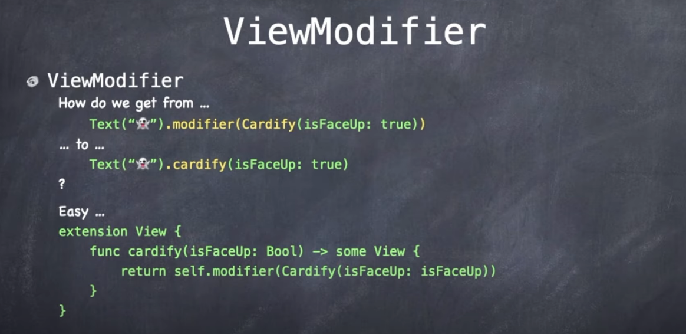

## How to create your own ViewModifier

Let's create a modifier that takes any view we want and turns it into a card.

ViewModifiers are themselves views, but we don't create them as SwiftUI views. We only use SwiftUI view when we have a body. For ViewModifier we will use a `struct`.

**Cardify**

```swift
import SwiftUI

struct Cardify: ViewModifier {

    func body(content: Content) -> some View {

    }
}
```

This is almost a SwiftUI view. Instead of `var body` however we have `func body`.

`Content` is the passed in view we are going to modify.

We can cardify a view by taking the code that makes a card and drop it in here.

**Cardify**

```swift
import SwiftUI

struct Cardify: ViewModifier {
    var isFaceUp: Bool

    func body(content: Content) -> some View {
        ZStack {
            let shape = RoundedRectangle(cornerRadius: DrawingConstants.cornerRadius)
            if isFaceUp {
                shape.fill().foregroundColor(.white)
                shape.strokeBorder(lineWidth: DrawingConstants.lineWidth)
                content
            } else {
                shape.fill()
            }
        }
    }

    private struct DrawingConstants {
        static let cornerRadius: CGFloat = 10
        static let lineWidth: CGFloat = 3
    }
}
```

Had to tweak it a bit, but you can see what is going on. This takes the passed in view, and based on whether it is face up or down, creates more views in a `ZStack`:

```swift
ZStack {
    let shape = RoundedRectangle(cornerRadius: DrawingConstants.cornerRadius)
    shape.fill().foregroundColor(.white)
    shape.strokeBorder(lineWidth: DrawingConstants.lineWidth)
    content // view passed in
}
```

Else simply returns the `shape` entirely filled in.

```swift
ZStack {
    let shape = RoundedRectangle(cornerRadius: DrawingConstants.cornerRadius)
    shape.fill()
}
```

That's it! You can do things like `@State` in ViewModifiers. For all intents and purposes they are views. Only thing special about then is the passed in `content` which you include somewhere in what you are building.

### Using it

To use our new modifier we can either call the modifier directly:

**EmojiMemoryGame**

```swift
var body: some View {
    GeometryReader{ geometry in
        ZStack {
            Pie(startAngle: Angle(degrees: 270), endAngle: Angle(degrees: 30))
            Text(card.content).font(font(in: geometry.size))
        }
        .modifier(Cardify(isFaceUp: card.isFaceUp))
    }
}
```

Or more conveniently we can create an extension:

```swift
extension View {
    func cardify(isFaceUp: Bool) -> some View {
        return self.modifier(Cardify(isFaceUp: isFaceUp))
    }
}
```

And call like this:

```swift
var body: some View {
    GeometryReader{ geometry in
        ZStack {
            Pie(startAngle: Angle(degrees: 270), endAngle: Angle(degrees: 30)).padding(4).opacity(0.6)
            Text(card.content).font(font(in: geometry.size))
        }
        .cardify(isFaceUp: card.isFaceUp)
    }
}
```

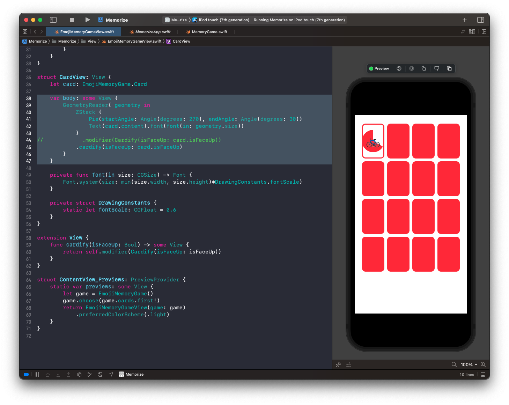

Now we can cardify anything. For example a circle.

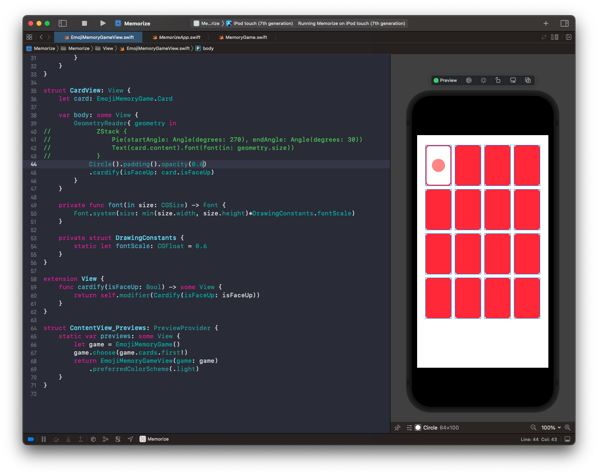

## Animation

Animation only really happens two ways:

- Shapes
- ViewModifiers

Turning something into a ViewModifier is handy for custom animation.

Before jump into the mechanics, let's first go over the golden rules of animation.

- Only changes can be animated.

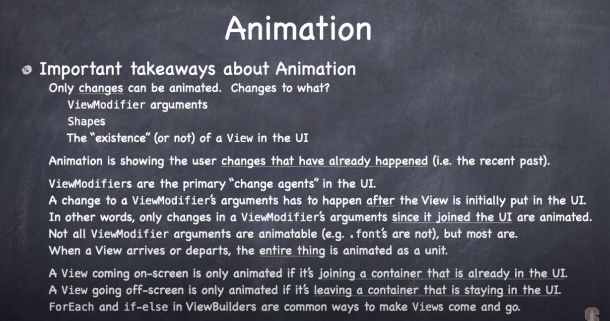

If nothing has changed, there is nothing to animate. Only three things can be animated in SwiftUI:

1. ViewModifier arguments
2. Shapes
3. The "existence" (or not) of a View in the UI.

The other thing to understand is that animation is showing the user changes that have already happened (i.e. the recent past).

When you code makes some change to of of the x3 things above, the animation system shows that over time. But the change has already been made.

But once you understand this it makes, you see how you make changes to the system, and SwiftUI animation shows those changes to the user over time.

`ViewModifiers` are the primary "change agents" in the UI. But you have to be careful because a change to a view modifiers arguments has to happen after the view get put into the UI. In other words, the changes to the view modifiers arguments since it joined the UI.

Also not all modifiers are animatable (i.e. font).

But most view modifiers (like color are).

When it comes to coming and going, these only get animated if its joining a container already in the UI.

This is all implemented with `ForEach` and `if-else` in the code.

So we know its changes we are trying to animate, how do we make this changes happen?

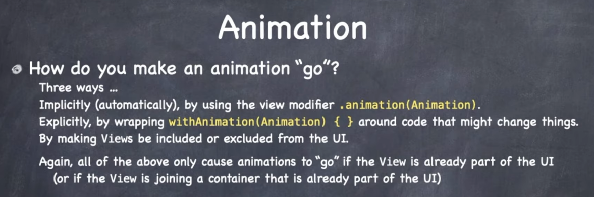

Three ways:

- Implicitly (automatically) by useing the view modifier `.animation(Animation)
- Explicitly, by wrapping `withAnimation(Animation) { }` around the code that midght change things.
- By excluding or including views from the UI

Again - this only happens if the `View` is already part of the UI. Or the `View` is joining a container that is already part of the UI.

Worth repeating. Students will often complain animations aren't happening. And its because the views aren't on screen yet or it happens as the view comes on screen. It has to already be on screen.

Let's talk about implicit or automatic animation.

### Implicit animation

Warning: `.animation` modifier does not work well with containers. We typically wouldn't use it on a container because containers progate into the animation to all views which can lead to unexpected results. 

Apple actually deprecated this `animation(:)` API and replaced it with one that has a value `animation(:value:)` that only animates if the value changes (see deprecated section below).

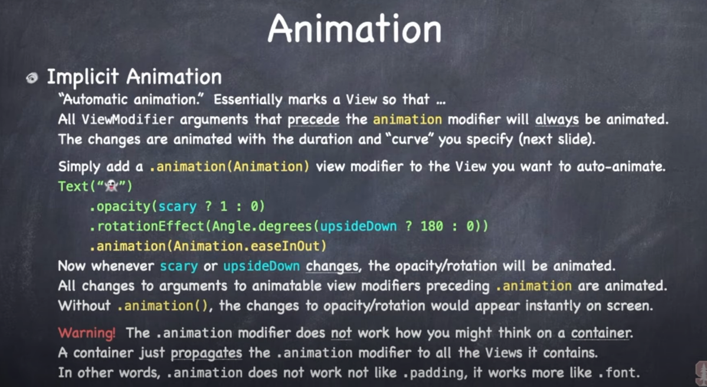

All the view modifier arguments that proceed the animation will get animated.

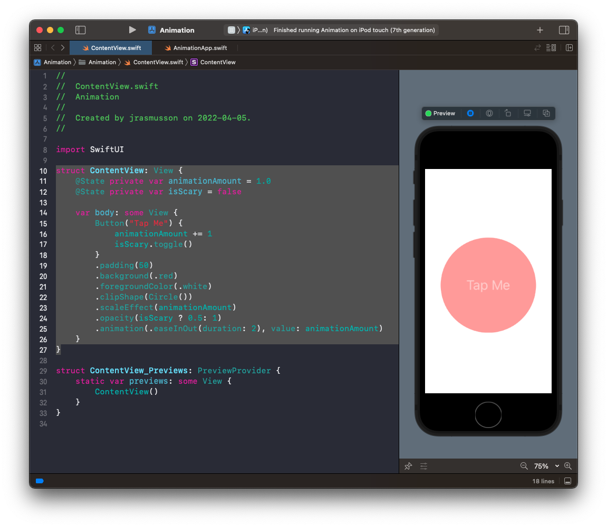

The way this one works is so long as your view is already on the screen, any state changes you make that it depends on, will trigger the animation.

Here in this example `animationAmount` and `isScary` are `@State` variables that change everytime the button is tapped.

```swift
struct ContentView: View {
    @State private var animationAmount = 1.0
    @State private var isScary = false

    var body: some View {
        Button("Tap Me") {
            animationAmount += 1
            isScary.toggle()
        }
        .padding(50)
        .background(.red)
        .foregroundColor(.white)
        .clipShape(Circle())
        .scaleEffect(animationAmount)
        .opacity(isScary ? 0.5: 1)
        .animation(.easeInOut(duration: 2), value: animationAmount)
    }
}
```

### Deprecation of animation(_:)

This line of code is interesting:

```swift
.animation(_:)) // deprecated
.animation(_:value:) // new
```

The former is implicit, the latter explicity. The implicit nature of `animation(_:)` meant that anytime ANYTHING changed, it would react. As a results animations in SwiftUI were erractic and unexpectected.

`animation(_:value:)` is an explicit animation. it will only trigger when the value you give it changes. This means you can't just stick it on a view and expect the view to animate when it comes in. You need to change the `value` in `.onAppear()` or use some value that naturally changes when a view appears to trigger the animation.

The animation you pass in is a struct.

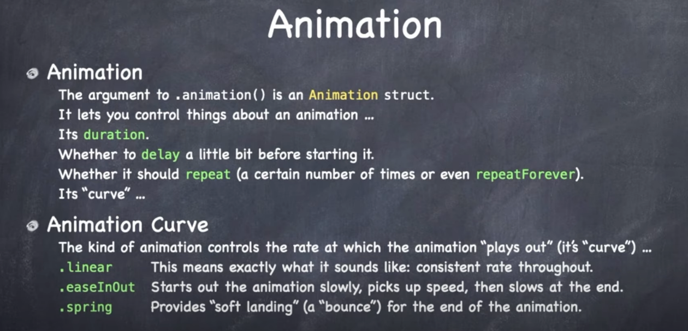

It lets you control things like:

- duration
- delay
- repeat

All these things happen on the animation's curve.

The animation curve is the kind of curve applied to the animation:

- .linear
- .easeInOut
- .spring

Now these `implicit` animations are used mostly in small independent subviews.


These typically aren't the main drivers of animations in your app. Instead most animations results for a change or state in your model. Or something `explicit`.

For these we want a whole bunch of views to animate together.

For that we use explicit animation.

### Explicit animation

These animations create an animation transaction during which all eligible changes to `ViewModifiers` and `Shapes` are animated together.

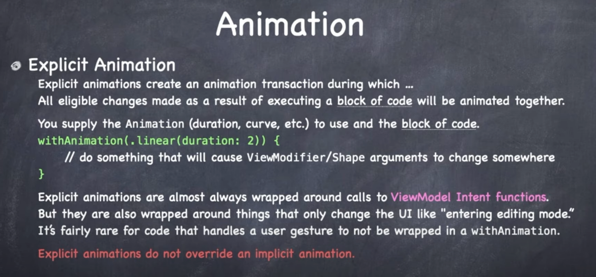

Just use `withAnimation` and then do something in a block. When you do something in that block it is going to animate all the `ViewModifiers` that changed because of what you did in there.

Almost already wrapped around view model intent changes.

Gestures and taps are usually wrapped with `withAnimation`.

These do not override implicit animations. Those implicit ones are assumed to be independent.

## Transitions

The comings and goings of views. These animations only take effect on views that are CTAAOS - Containers That Are Already On-Screen).


Under the covers transitions are really ViewModifer arguments changing. One for before and after and animating between the two.

It is possible to have asymmetric transitions where a view fades in and then flies off when it leaves.

Mostly we'll stick to the pre-canned ones (opacitiy, scaling). And these are mostly provided by static `vars` and `funcs` on the `AnyTransition` struct.

### Transitions are type erased

U R HERE


### Links that help

- [Lecture 7 Video](https://www.youtube.com/watch?v=PoeaUMGAx6c&ab_channel=Stanford)
- [Paul Hudson Customizing animations in SwiftUI](https://www.hackingwithswift.com/books/ios-swiftui/customizing-animations-in-swiftui)
- [Explaination of Value in animate](https://stackoverflow.com/questions/70446342/swiftui-animation-not-working-using-animation-value)


