# Lecture 7: ViewModifier Animation


Animation is important and SwiftUI tries to make it easy.

One way to do animation is to animate the view itself (i.e. `Shape`). Which we'll do later.

But a much more common way to animate views is via their `ViewModifier`s.


So what's a `ViewModifier`?


`ViewModifiers` are extensions on protocols that give us functionality via protocol-inheritance.

`aspectRatio`, `padding` are all `ViewModifiers`. They implement the `ViewModifier` protocol.

This protocol only has one function in it. To create a `View`.


It's very similar to how to build view in a `View`. Only here we have a function called:

```swift
protocol ViewModifier {
	typealias Content // the type of the view passed in
	func body(content: Content) -> some View {
	   return some new view based on the content view passed in
	}
}
```

`ViewModifiers` are themselves views.

Let's look at an example. Let's `cardify` a view.


It's pretty easy. Simply:

- create a new `struct`
- implement `ViewModifier`
- and do your work in `func body()` 

Notice however a couple of important things. First, notice how the `content` we pass in, is the view we modify.


The text denoted in yellow is our `content`. And that is how the view modifier gets it's hands on it.

Secondly notice how our modifier can have arguments. `Cardify` is a struct that can take arguments. So we can pass arguments to view modifiers simply by defining their `var`s in our struct.

When these `vars` change, the view changes. We'll use this later to kick off animations.

Then just remember that the view modifier itself returns a new `View`.


Next, how do we get from `Cardify` to `.cardify`? Easy. Add an extension.


## How to create your own ViewModifier

Let's create a modifier that takes any view we want and turns it into a card.

ViewModifiers are themselves views, but we don't create them as SwiftUI views. We only use SwiftUI view when we have a body. For ViewModifier we will use a `struct`.

**Cardify**

```swift
import SwiftUI

struct Cardify: ViewModifier {

    func body(content: Content) -> some View {

    }
}
```

This is almost a SwiftUI view. Instead of `var body` however we have `func body`.

`Content` is the passed in view we are going to modify.

We can cardify a view by taking the code that makes a card and drop it in here.

**Cardify**

```swift
import SwiftUI

struct Cardify: ViewModifier {
    var isFaceUp: Bool

    func body(content: Content) -> some View {
        ZStack {
            let shape = RoundedRectangle(cornerRadius: DrawingConstants.cornerRadius)
            if isFaceUp {
                shape.fill().foregroundColor(.white)
                shape.strokeBorder(lineWidth: DrawingConstants.lineWidth)
                content
            } else {
                shape.fill()
            }
        }
    }

    private struct DrawingConstants {
        static let cornerRadius: CGFloat = 10
        static let lineWidth: CGFloat = 3
    }
}
```

Had to tweak it a bit, but you can see what is going on. This takes the passed in view, and based on whether it is face up or down, creates more views in a `ZStack`:

```swift
ZStack {
    let shape = RoundedRectangle(cornerRadius: DrawingConstants.cornerRadius)
    shape.fill().foregroundColor(.white)
    shape.strokeBorder(lineWidth: DrawingConstants.lineWidth)
    content // view passed in
}
```

Else simply returns the `shape` entirely filled in.

```swift
ZStack {
    let shape = RoundedRectangle(cornerRadius: DrawingConstants.cornerRadius)
    shape.fill()
}
```

That's it! You can do things like `@State` in ViewModifiers. For all intents and purposes they are views. Only thing special about then is the passed in `content` which you include somewhere in what you are building.

### Using it

To use our new modifier we can either call the modifier directly:

**EmojiMemoryGame**

```swift
var body: some View {
    GeometryReader{ geometry in
        ZStack {
            Pie(startAngle: Angle(degrees: 270), endAngle: Angle(degrees: 30))
            Text(card.content).font(font(in: geometry.size))
        }
        .modifier(Cardify(isFaceUp: card.isFaceUp))
    }
}
```

Or more conveniently we can create an extension:

```swift
extension View {
    func cardify(isFaceUp: Bool) -> some View {
        return self.modifier(Cardify(isFaceUp: isFaceUp))
    }
}
```

And call like this:

```swift
var body: some View {
    GeometryReader{ geometry in
        ZStack {
            Pie(startAngle: Angle(degrees: 270), endAngle: Angle(degrees: 30)).padding(4).opacity(0.6)
            Text(card.content).font(font(in: geometry.size))
        }
        .cardify(isFaceUp: card.isFaceUp)
    }
}
```


Now we can cardify anything. For example a circle.


## Animation

Animation only really happens two ways:

- Shapes
- ViewModifiers

Turning something into a ViewModifier is handy for custom animation.

Before jump into the mechanics, let's first go over the golden rules of animation.

- Only changes can be animated.


If nothing has changed, there is nothing to animate. Only three things can be animated in SwiftUI:

1. ViewModifier arguments
2. Shapes
3. The "existence" (or not) of a View in the UI.

The other thing to understand is that animation is showing the user changes that have already happened (i.e. the recent past).

When you code makes some change to of of the x3 things above, the animation system shows that over time. But the change has already been made.

But once you understand this it makes, you see how you make changes to the system, and SwiftUI animation shows those changes to the user over time.

`ViewModifiers` are the primary "change agents" in the UI. But you have to be careful because a change to a view modifiers arguments has to happen after the view get put into the UI. In other words, the changes to the view modifiers arguments since it joined the UI.

Also not all modifiers are animatable (i.e. font).

But most view modifiers (like color are).

When it comes to coming and going, these only get animated if its joining a container already in the UI.

This is all implemented with `ForEach` and `if-else` in the code.

So we know its changes we are trying to animate, how do we make this changes happen?


Three ways:

- Implicitly (automatically) by useing the view modifier `.animation(Animation)
- Explicitly, by wrapping `withAnimation(Animation) { }` around the code that midght change things.
- By excluding or including views from the UI

Again - this only happens if the `View` is already part of the UI. Or the `View` is joining a container that is already part of the UI.

Worth repeating. Students will often complain animations aren't happening. And its because the views aren't on screen yet or it happens as the view comes on screen. It has to already be on screen.

Let's talk about implicit or automatic animation.

## Implicit animation

Warning: `.animation` modifier does not work well with containers. We typically wouldn't use it on a container because containers progate into the animation to all views which can lead to unexpected results. 

Apple actually deprecated this `animation(:)` API and replaced it with one that has a value `animation(:value:)` that only animates if the value changes (see deprecated section below).


All the view modifier arguments that proceed the animation will get animated.


The way this one works is so long as your view is already on the screen, any state changes you make that it depends on, will trigger the animation.

Here in this example `animationAmount` and `isScary` are `@State` variables that change everytime the button is tapped.

```swift
struct ContentView: View {
    @State private var animationAmount = 1.0
    @State private var isScary = false

    var body: some View {
        Button("Tap Me") {
            animationAmount += 1
            isScary.toggle()
        }
        .padding(50)
        .background(.red)
        .foregroundColor(.white)
        .clipShape(Circle())
        .scaleEffect(animationAmount)
        .opacity(isScary ? 0.5: 1)
        .animation(.easeInOut(duration: 2), value: animationAmount)
    }
}
```

### Deprecation of animation(_:)

This line of code is interesting:

```swift
.animation(_:)) // deprecated
.animation(_:value:) // new
```

The former is implicit, the latter explicity. The implicit nature of `animation(_:)` meant that anytime ANYTHING changed, it would react. As a results animations in SwiftUI were erractic and unexpectected.

`animation(_:value:)` is an explicit animation. it will only trigger when the value you give it changes. This means you can't just stick it on a view and expect the view to animate when it comes in. You need to change the `value` in `.onAppear()` or use some value that naturally changes when a view appears to trigger the animation.

The animation you pass in is a struct.


It lets you control things like:

- duration
- delay
- repeat

All these things happen on the animation's curve.

The animation curve is the kind of curve applied to the animation:

- .linear
- .easeInOut
- .spring

Now these `implicit` animations are used mostly in small independent subviews.


These typically aren't the main drivers of animations in your app. Instead most animations results for a change or state in your model. Or something `explicit`.

For these we want a whole bunch of views to animate together.

For that we use explicit animation.

## Explicit animation

These animations create an animation transaction during which all eligible changes to `ViewModifiers` and `Shapes` are animated together.


Just use `withAnimation` and then do something in a block. When you do something in that block it is going to animate all the `ViewModifiers` that changed because of what you did in there.

Almost already wrapped around view model intent changes.

Gestures and taps are usually wrapped with `withAnimation`.

These do not override implicit animations. Those implicit ones are assumed to be independent.

## Transitions

The comings and goings of views. These animations only take effect on views that are CTAAOS - Containers That Are Already On-Screen).


Under the covers transitions are really ViewModifer arguments changing. One for before and after and animating between the two.

It is possible to have asymmetric transitions where a view fades in and then flies off when it leaves.

Mostly we'll stick to the pre-canned ones (opacitiy, scaling). And these are mostly provided by static `vars` and `funcs` on the `AnyTransition` struct.

### Transitions are type erased

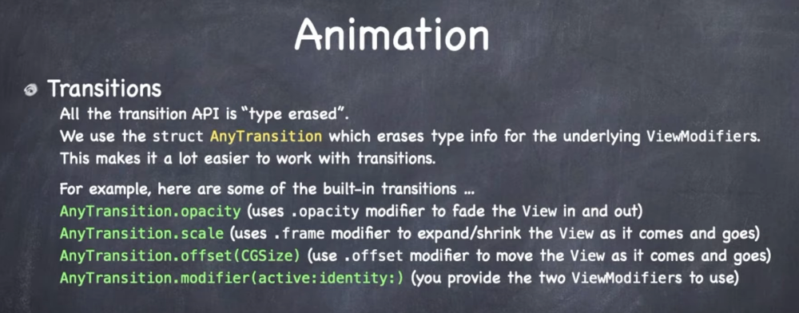

Type erasure means "erasing" a specific type to a more abstract type in order to do somehting with the abstract type (like throwing it in an array). And this happens all the time in Swift. Pretty much any time you see the word `Any`.

For example you can have an array of strings and ints if your erase to `AnyHashable`:

```swift
var hashables = [AnyHashable]()
hashables.append("ABC")
hashables.append(123)
```

Or you could get even more abstract and erase to `Any`:

```swift
var things = [Any]()
things.append("ABC")
things.append(123)
```

You could evene iterate over the collection and access the original type:

```swift
for thing in things {
    if let string = thing as? String {
        print(string)
    }
    if let integer = thing as? Int {
        print(integer)
    }
}
```

SwiftUI uses the trick when doing `ViewModifier` animations. There are so many low-level types that need to be handled that SwiftUI esentially erases all the types and bundles them up neatly into one abstract type called `AnyTransition`.

So with transitions you can:

```swift
AnyTransition.opacity
AnyTransition.scale
AnyTransition.offset(CGSize)
AnyTransition.modifier(active:identity)
```

All different ways you can transition and animate views.

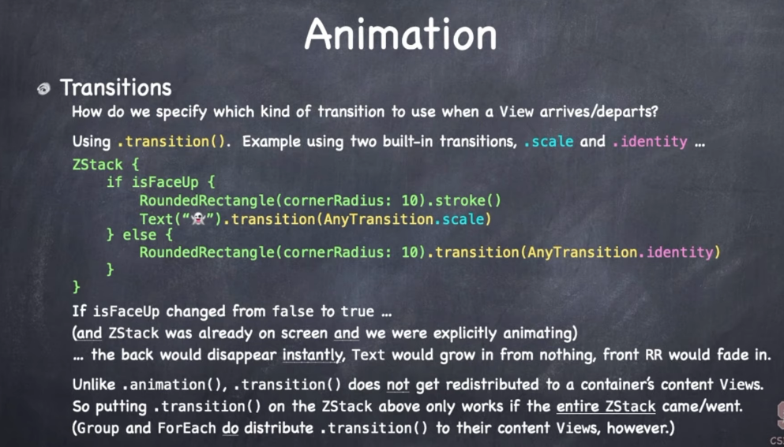

In this example above the back would instantly disappear (because of `.identity` and the front would fade in with opactity, and text would scale in from something infinitely small to full size.

Here's an example of transitioning some text in action.

```swift
import SwiftUI

struct ContentView: View {
    @State private var showDetails = false

    var body: some View {
        VStack {
            Button("Press to show details") {
                withAnimation {
                    showDetails.toggle()
                }
            }

            if showDetails {
                // Moves in from the bottom
                Text("Details go here.")
                    .transition(.move(edge: .bottom))

                // Moves in from leading out, out to trailing edge.
                Text("Details go here.")
                    .transition(.slide)

                // Starts small and grows to full size.
                Text("Details go here.")
                    .transition(.scale)
            }
        }
    }
}
```

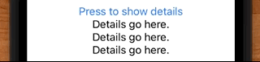

This `.transition` thing, think of it as a noun.

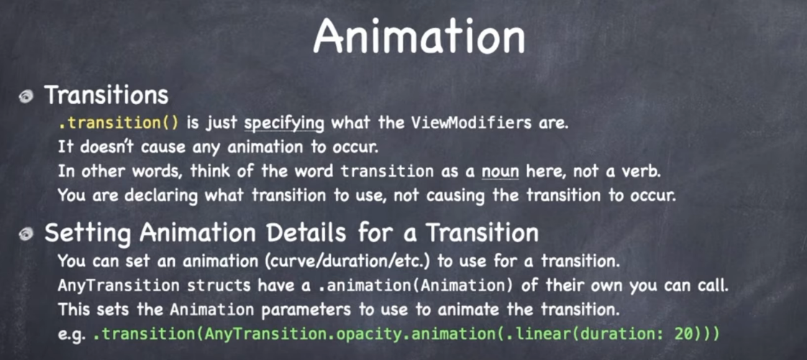

Adding a `.transition` doesn't actually cause the animation to occur. It just specifies what transition happens what some state changes. So it's not triggering the animation. It is simply defining what happens.

## Matched Geometry Effect

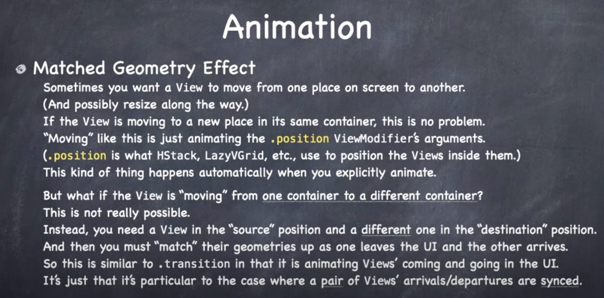

The comings and going of views can also be specified when views are moving around.

Normally when a view is moving around it is in the same container.

But what if the view is not in that container - it is somewhere else. This is not really allowed. So how do you make it work? From one container to another.

You have to put a view in each container, then you can match their geometry, and make sure one only shows at a time. It will animate from old to new, but using a pair of views as a trick.

For example what if we had a deck of cards and we wanted the card to fly from the deck view to another.

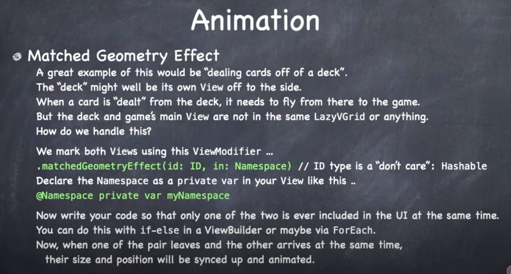

Animations on work on views in containers only screen, it would be nice to find out when the container comes on screen. `.onAppear{ }` does this for us.

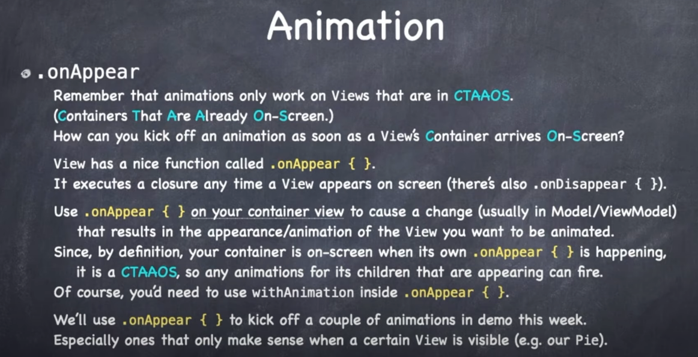

This is where you can changes the state of something (viewModel etc) and cause your animation to appear.

We talked about how to kick-off animations, but how to animations actually happen?

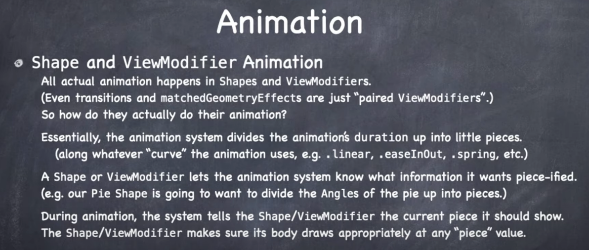

The animation system divides the animation up into little pieces and constantly redraws based on the changed values.

How to `Shapes` and `ViewModidifers` communicate with the animation system? Through this one `var`.

`var animatableData: Type`.

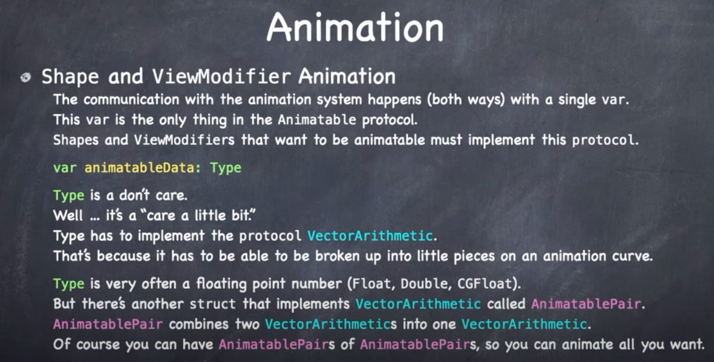

`ViewModifiers` that are animatable implement this protocol with this var. Shapes always implement this.

This var has a certain type. The type has to implement vectorArithmetic. This type is a floating point number.

This `var` animatableData communicates in both directions between Animations system and Shape and ViewModifier.

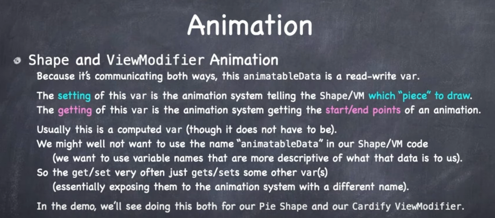

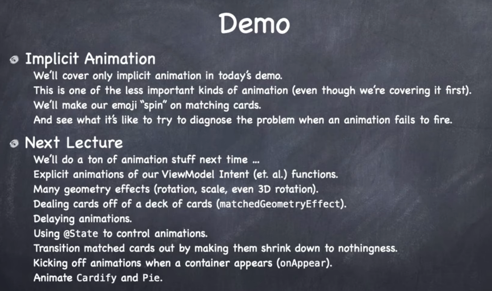

## Demo

## Implicit Animation

Where everysingle time some arguments to view modifiers change, we want to make sure that gets animated.

This is different from explicit animation where some action is happening and you want the entire action has a response in the UI.

Implicit much more rare. Need to make sure implicit doesn't interview with explicit with is the primary way we animate.

Going to animate in preview but simulator can't do all.

### Rotating emoji

```swift
import SwiftUI

struct ContentView: View {
    @State private var showDetail = false

    var body: some View {
        VStack {
            Button("Animate") {
                withAnimation {
                    showDetail.toggle()
                }
            }

            Text("👻")
                .rotationEffect(Angle.degrees(showDetail ? 360: 0))
        }
    }
}
```

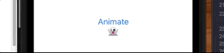

The only time `ViewModifiers` can be animated is when they change.

Couple of intersting points about this animation:

1. It won't work without the `withAnimation` block.
2. It won't work if you set the `Font` on the emoji.

The reason for this is that it did in fact animate - it just happened instantly.

And the reason for that is animations are showing you things that have already happened. Not the animation itself.

So when we do this on its own:

```swift
Text("👻")
.rotationEffect(Angle.degrees(isAnimating ? 360: 0))
```

This text has already gone around 360. We could make this animation explicit by adding `withAnimation` on the button action:

```swift
Button("Animate") {
    withAnimation {
        isAnimating.toggle()
    }
}
```

Or we could just animate it implicitly by providing an animation.

```swift
import SwiftUI

struct ContentView: View {
    @State private var showDetail = false

    var body: some View {
        VStack {
            Button("Animate") {
                // explicit
//                withAnimatio n {
                    showDetail.toggle()
//                }
            }

            Text("👻")
                .rotationEffect(Angle.degrees(showDetail ? 360: 0))
                .animation(Animation.easeInOut(duration: 2), value: showDetail) // implicit
        }
    }
}
```

Now the animation rotates implicitly.

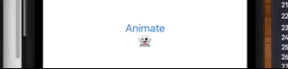

But it still won't rotate when `font(:size` is set. Even with explicit animation added:

```swift
Text("👻")
    .rotationEffect(Angle.degrees(showDetail ? 360: 0))
    .animation(Animation.easeInOut(duration: 2), value: showDetail) // implicit
    .font(.system(size: 100)) // 🤔
```

For some reason this all works in Paul example (event with the font).

**CardView**

```swift
struct CardView: View {
    let card: EmojiMemoryGame.Card

    var body: some View {
        GeometryReader{ geometry in
            ZStack {
                Pie(startAngle: Angle(degrees: 270), endAngle: Angle(degrees: 30)).padding(4).opacity(0.6)
                Text(card.content)
                    .rotationEffect(Angle.degrees(card.isMatched ? 360 : 0))
                    .animation(Animation.easeInOut(duration: 2), value: card.isMatched)
                    .font(font(in: geometry.size))
            }
            .cardify(isFaceUp: card.isFaceUp)
        }
    }
}
```

But Paul runs into some other problems. For one the animation only goes once, and it automatically adds an autoreverse. To this that he goes `autoreverse = false`:

```swift
Text(card.content)
    .rotationEffect(Angle.degrees(card.isMatched ? 360 : 0))
    .animation(Animation.easeInOut(duration: 2).repeatForever(autoreverses: false), value: card.isMatched)
```

To get rid of `easeInEaseOut` he would switch to something `linear`:

```swift
Animation.linear(duration: 1)
```

Another problem Paul address is the strange interaction that happens when you rotate from landscape to portrait.

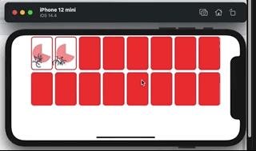

This happens because we are putting an animation onto something that really isn't animatable. The `font` modifier is varying the size of the font.

Changing the font from one size to another:

```swift
.font(font(in: geometry.size))
```

Isn't animatable. Font is one of those rare cases you can't animate. When we rotate as above, we have multiple animations going on at once. 

That's why Apple change the `Animation` [API](https://developer.apple.com/documentation/swiftui/text/animation(_:value:)) to take a `value`.

```swift
Animation.linear(duration: 1).repeatForever(autoreverses: false), value: card.isMatched)
```

Adding `value` only applies the animation if the value has changed. That's why tying it to something like a `Bool` is good. It will only happen if the value changed (often the same one causing the change in ViewModifier to occur in the first place).

So that's why you don't get this probem in your example, but Paul does. Paul's API is deprecated.

Paul gets around this by picking a fixed sized `font` and applying a `scaleEffect`. See 1 hour mark of video if you want to see the hack for how he does this.

### Animations only affect the views you apply them to

Note how this animation we add only applies to the rotation effect - not the `.font`:

```swift
Text(card.content)
    .rotationEffect(Angle.degrees(card.isMatched ? 360 : 0))
    .animation(Animation.linear(duration: 1).repeatForever(autoreverses: false), value: card.isMatched)
    .font(font(in: geometry.size))
```

This is because the order here matters. Because `animation` comes directly after `.rotation`, we only get the animation effect on the rotation (not the font which isn't animatable anyways). But it we had another view modifier there it wouldn't be animated either.

We also learned that applying that animation on a `ZStack` is kind of like `.foregroundColor`. It is going to apply that animation to the every view in the `ZStack`.

```swift
ZStack {
    Pie(startAngle: Angle(degrees: 270), endAngle: Angle(degrees: 30)).padding(4).opacity(0.6)
    Text(card.content)
        .rotationEffect(Angle.degrees(card.isMatched ? 360 : 0))
        .animation(Animation.linear(duration: 1).repeatForever(autoreverses: false), value: card.isMatched)
        .font(font(in: geometry.size))
}
.cardify(isFaceUp: card.isFaceUp)
```

Which is why we rarely put implicit modifiers on combiner views. Which can give undesireable results. Which is why they are OK for lego bricks but not entire views.

### Animation only occuring on one card

Next challenge Paul solves is why the animation is only occuring on one card:

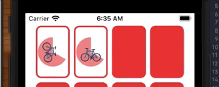

When you have an animation like this any you expect it to be working, go back to the golden rule:

- Animation only animates changes.

```swift
.rotationEffect(Angle.degrees(card.isMatched ? 360 : 0))
.animation(...)
```

So because `card.isMatched` is what causes the animation to occur it animates only that change.

So if the other card flipped up why isn't it part of the animation?

Another golden rule of animation is:

- we can only animate view modifiers that are already on screen

Because the new view coming in as a result of the card flip isn't already on screen we need to animate it differently. Those are `transition` animations.

The way to trouble shoot this is to trace down to what makes the view you want to animate appear on screen.

The animation action we want to trigger starts here with the animation on `Text` in the `ZStack`.

```swift
struct CardView: View {
    let card: EmojiMemoryGame.Card

    var body: some View {
        GeometryReader{ geometry in
            ZStack {
                Pie(startAngle: Angle(degrees: 270), endAngle: Angle(degrees: 30)).padding(4).opacity(0.6)
                Text(card.content)
                    .rotationEffect(Angle.degrees(card.isMatched ? 360 : 0))
                    .animation(Animation.linear(duration: 1).repeatForever(autoreverses: false), value: card.isMatched)
                    .font(font(in: geometry.size))
            }
            .cardify(isFaceUp: card.isFaceUp)
        }
    }
```

When does the `ZStack` come on screen? From `cardify`. What in `Cardify` makes the `content` come on screen? `isFaceUp`:

```swift
struct Cardify: ViewModifier {
    var isFaceUp: Bool

    func body(content: Content) -> some View {
        ZStack {
            let shape = RoundedRectangle(cornerRadius: DrawingConstants.cornerRadius)
            if isFaceUp { // 🕹
                shape.fill().foregroundColor(.white)
                shape.strokeBorder(lineWidth: DrawingConstants.lineWidth)
                content // 😀
            } else {
                shape.fill()
            }
        }
    }
```

So `isFaceUp` is the change that causes the `ZStack` to appear.

When `isFaceUp` is `true`, `isMatched` is also `true`. It's coming on screen with `isMatched` already true. It's already rotated. There is no change to animate. It was `true` from the start.

This can be a subtle thing to track down.

We can fix by making sure text is only screen what match happens. `isFaceUp` and `isMatched` are happening simultaneously. How to fix?

Take `content` out of `Cardify` body and make it on screen all the time:

```swift
    ZStack {
        let shape = RoundedRectangle(cornerRadius: DrawingConstants.cornerRadius)
        if isFaceUp {
            shape.fill().foregroundColor(.white)
            shape.strokeBorder(lineWidth: DrawingConstants.lineWidth)
        } else {
            shape.fill()
        }
        content // 1
    }
```

This will fix the problem, but now our content is on screen all the time:

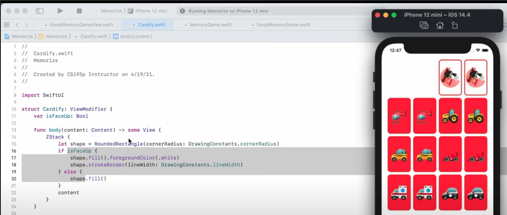

The way we get around this is to show/hide a card by setting its `opacity`.

```swift
ZStack {
    let shape = RoundedRectangle(cornerRadius: DrawingConstants.cornerRadius)
    if isFaceUp {
        shape.fill().foregroundColor(.white)
        shape.strokeBorder(lineWidth: DrawingConstants.lineWidth)
    } else {
        shape.fill()
    }
    content.opacity(isFaceUp ? 1: 0)
}
```

Great trick for if you want an animation on a view and you can't have it coming and going as variables change.

Now they both appear and animate at the same time correctly.

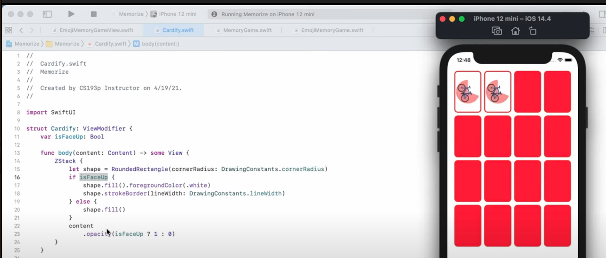

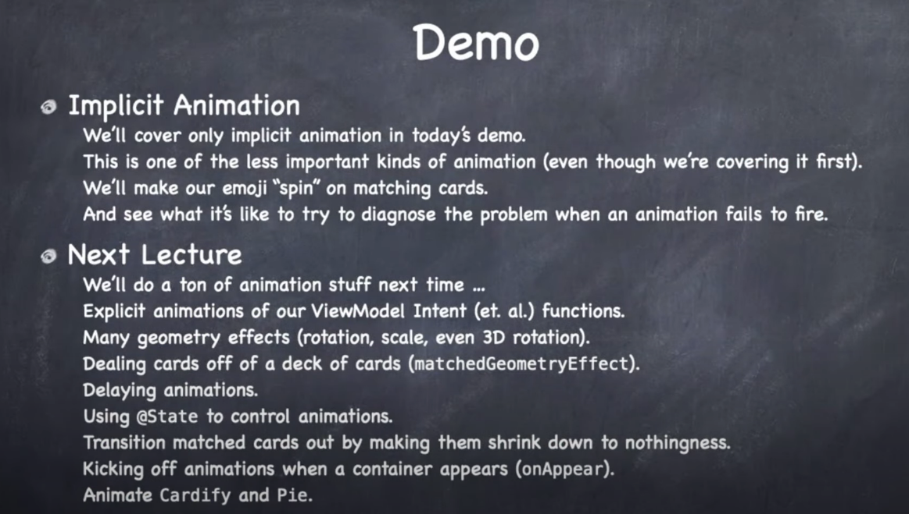

### Links that help

- [Lecture 7 Video](https://www.youtube.com/watch?v=PoeaUMGAx6c&ab_channel=Stanford)
- [Paul Hudson Customizing animations in SwiftUI](https://www.hackingwithswift.com/books/ios-swiftui/customizing-animations-in-swiftui)
- [Explaination of Value in animate](https://stackoverflow.com/questions/70446342/swiftui-animation-not-working-using-animation-value)
- [Type erasure](https://triplebyte.com/blog/the-perils-of-type-erasure-in-swift-and-how-to-avoid-it-completely)
- [Paul Hudson how to add and remove views with a transition](https://www.hackingwithswift.com/quick-start/swiftui/how-to-add-and-remove-views-with-a-transition)


