# Lecture 8: Animation Demonstration

## Explicit Animation

Let's add a feature called a shuffle button.

### Shuffle

Let's start by adding an intent in our game called `shuffle`:

**EmojiMemoryGame**

```swift
class EmojiMemoryGame: ObservableObject {
    func shuffle() {
        model.shuffle()
    }
}
```

**MemoryGame**

```swift
struct MemoryGame<CardContent> where CardContent: Equatable {
    mutating func shuffle() {
        cards.shuffle()
    }
}
```

One cool thing we can do is you can replace:

```swift
Rectangle().opacity(0)
```

with:

```swift
Color.clear
```

The rectangle was originally there to fill a space we needed filling for when our card view was face down. But `Color.clear` is a SwiftUI `View` to. It will create a rectangle filled with its view. So if you ever need a filler you can try that out.

`Path` can behave like a `View` as well:

```swift
Path { p in
   p.move(to: ...)
   p.addLine(to: ...)
}.stroke().fill()
```

This will also draw a rectangle as a `View` and lay things out.

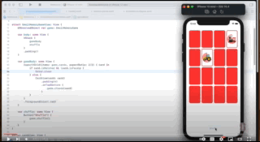

Now this is great. It shuffles. But would be a lot cooler if those shuffles were animated.

This is really easy. Here we can just add an `explicit` call to `withAnimation` on our suffle `Button`:

**EmojiGameView**

```swift
Button("Shuffle") {
    withAnimation {
        game.shuffle()
    }
}
```

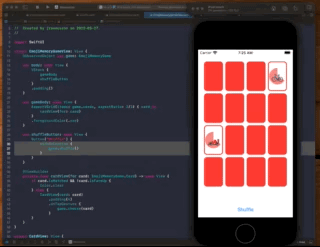

So what's actually happening here when we add `withAnimation`?

We know animation only animates `Shapes` and `ViewModifiers`. So there are not any shapes that are being animated here. It's just the positions of all these views are being moved around.

It's actually the `LazyVGrid` that is changing the cards position, size and frame. 

```swift
LazyVGrid(columns: [adaptiveGridItem(width: width)], spacing: 0) {
    ForEach(items) { item in
        content(item).aspectRatio(aspectRatio, contentMode: .fit)
    }
}
```

When `LazyVGrid` changes those via its `ViewModifiers`, those get animated.

So when we say `withAnimation` all `ViewModifiers` that can be animated are being animated.

Another really cool feature is that if you hammer on the shuffle button the animation is interuptable.

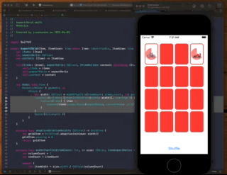

Now sometimes it can be hard to figure out how to handle the interuption. Like if we slow things down and watch what happens:

```swift
Button("Shuffle") {
    withAnimation(.easeInOut(duration: 5)) {
        game.shuffle()
    }
}
```

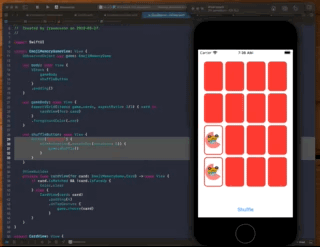

And you can see what we wanted the cards to be an `implicit` animation. We want those to happen independently of what is going on at the higher-level.

### Use explicit animations on intent functions

So when should we use explicit animations? You almost always want to use these on intent functions.

When you use an intent you are almost always expressing that intent as a change in the model.

If you are modifying the model because of the reactive nature of the UI, its likely something is going to change.

And when it changes its likely we want to animate. Which is why you will often seen `withAnimation` used with a change of intenet.

```swift
var shuffleButton: some View {
    Button("Shuffle") {
        withAnimation()) {
            game.shuffle()
        }
    }
}
```

### Animating choose

The other intent we have is `choose(:card` so we should animate that as well.

**EmojiMemoryGameView** 

```swift
@ViewBuilder
private func cardView(for card: EmojiMemoryGame.Card) -> some View {
    if card.isMatched && !card.isFaceUp {
        Color.clear
    } else {
        CardView(card: card)
            .padding(4)
            .onTapGesture {
                withAnimation {
                    game.choose(card)
                }
            }
    }
}
```

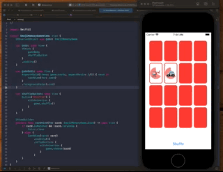

Fades in and fades out. Not the same as flipping over. Not just for the cards we choose. But all changes to the model were animated.

`withAnimation` can use the same arguments as an implicit animation.

Not task is to make it so the cards flip.

### Flipping the cards

Let's slow things down a bit:

```swift
CardView(card: card)
    .padding(4)
    .onTapGesture {
        withAnimation(.easeInOut(duration: 3)) {
            game.choose(card)
        }
    }
```

By default, changing the state and animation the appears of view view over another is a fade.

To do a real flip, it is like a 3D rotation thing. Tiles on end, and the flips back down. Need to flip in 3D towards us.

Turns out there is a really easy way to do that in SwiftUI.

```swift
struct ContentView: View {
    @State private var showDetail = false

    var body: some View {
        VStack {
            Button("Animate") {
                // explicit
                withAnimation {
                    showDetail.toggle()
                }
            }
            Text(showDetail ? "👻" : "🎃")
                .rotation3DEffect(Angle(degrees: showDetail ? 0 : 180), axis: (x: 0, y: 1, z: 0))
        }
    }
}
```

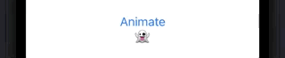

**Cardify**

```swift
struct Cardify: ViewModifier {
    var isFaceUp: Bool

    func body(content: Content) -> some View {
        ZStack {
            let shape = RoundedRectangle(cornerRadius: DrawingConstants.cornerRadius)
            if isFaceUp {
                shape.fill().foregroundColor(.white)
                shape.strokeBorder(lineWidth: DrawingConstants.lineWidth)
            } else {
                shape.fill()
            }
            content.opacity(isFaceUp ? 1: 0)
        }
        .rotation3DEffect(Angle(degrees: isFaceUp ? 0 : 180), axis: (x: 0, y: 1, z: 0))
    }
}
```


Not bad. It is flipping the card over. But it's animating the icon in a little bit early. You should not see the image until it really flips.

What's going on here is choose is changing the model. And that eventually causes faceup to change. When we do that these two views come on screen:

```swift
if isFaceUp {
    shape.fill().foregroundColor(.white)
    shape.strokeBorder(lineWidth: DrawingConstants.lineWidth)
}
```

And because they are in a ZStack already on screen, the appearance of these get animated. Then when we flip to the other side, the dissappearance of these gets animated.

So this fading in and out are happening because of `transition` animations. Views coming or going because of views appearing in a container.

The other thing being animated here is the `opacity` of the emoji or content itself:

```swift
content.opacity(isFaceUp ? 1: 0)
```

That's why these things are fading. The default transition is to fade when then come in/out, opactity, plus the rotation of the entire ZStack.

So how to fix?

We don't want these two animations to occur until the card is at 90 degrees:

```swift
if isFaceUp {
    shape.fill().foregroundColor(.white)
    shape.strokeBorder(lineWidth: DrawingConstants.lineWidth)
}
```

Also we don't want any fading in or out. When the card hits 90 degress we want the face card and all its parts displayed in full.

So that is quite a different thing going on. And there is no way to make these views do that with any standard modifiers.

But we have our own view modifier. So we can do that work in there.

### Tracking the 90° rotation

To do this, we are going to have to track the 90° rotation. So we'll do that with a var.

**Cardify**

```swift
struct Cardify: ViewModifier {
    var isFaceUp: Bool
    var rotation: Double // in degrees
```

And this is the thing that is going to drive what our user interface looks like. Not isFaceUp.

For example isFaceUp isn't when we want to show the front. It is when the `rotation < 90`.

```swift
struct Cardify: ViewModifier {
    var isFaceUp: Bool
    var rotation: Double // in degrees

    func body(content: Content) -> some View {
        ZStack {
            let shape = RoundedRectangle(cornerRadius: DrawingConstants.cornerRadius)
            if rotation < 90 {
                shape.fill().foregroundColor(.white)
                shape.strokeBorder(lineWidth: DrawingConstants.lineWidth)
            } else {
                shape.fill()
            }
            content.opacity(rotation < 90 ? 1: 0)
        }
        .rotation3DEffect(Angle(degrees: rotation), axis: (x: 0, y: 1, z: 0))
    }
}
```

So the state of rotation is what's going to drive this thing.

isFaceUp is no longer a var. It's something we just set in the `init()`.

```swift
struct Cardify: ViewModifier {
    var rotation: Double // in degrees

    init(isFaceUp: Bool) {
        rotation = isFaceUp ? 0 : 180
    }
```

So this is a good start but it's not enough. Because we have not yet animated the rotation through 90. It is only 0 or 180.

We need to start out at 0 and animate to 90. 

### Animatable

We can do that by making our view modifier `Animatable`.

```swift
struct Cardify: ViewModifier, Animatable {
```

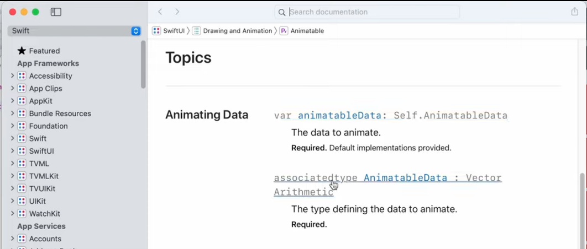

`Animatable` has one `var animateableData:` which is simply the data to animate.

`Self` means things that are animatable are self referencing which means you can't use them as types. You can't have an array of `animatableData` you have to use them as where clauses.

This associated type is `VectorArithmetic` is what can multiple and add vectors. Which is what we are doing with animations. Matrix multiplication.

Things that implement `VectorArithmetic` are Doubles. If you go look at the documentation for `Double` you will see that it confoms to `VectoreArithmetic`.

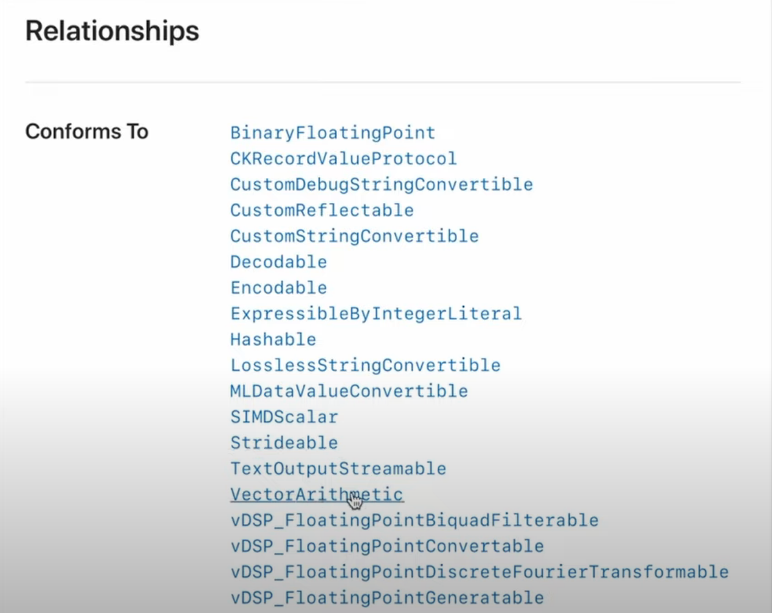

Same with `CGFloat`. And lots of others. `AnimatablePair` takes a first thing and a second thing.

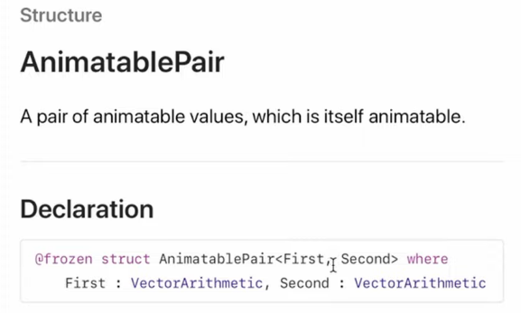

These are all abstractions SwiftUI has made to help us out with our animations. 

So for our `ViewModifier` to be `Animatable` we need to implement that `var`. And while we could use that in our code as the animation amoung, it is better to use it purely as a wrapper for the variable we are animating. Almost like a rename:

```swift
struct Cardify: ViewModifier, Animatable {
    var rotation: Double // in degrees

    var animatableData: Double {
        get { rotation }
        set { rotation = newValue }
    }
```

Now we just have to tell SwiftUi what data we want to animate. Because it is the `rotation` var that is driving the animation, we are going to be calling this view over and over and over creating a new view every time our animation runs.

Then when it passes 90 we'll switch our background.

**Cardify**

```swift
import SwiftUI

struct Cardify: ViewModifier, Animatable {
    var rotation: Double // in degrees

    var animatableData: Double {
        get { rotation }
        set { rotation = newValue }
    }

    init(isFaceUp: Bool) {
        rotation = isFaceUp ? 0 : 180
    }

    func body(content: Content) -> some View {
        ZStack {
            let shape = RoundedRectangle(cornerRadius: DrawingConstants.cornerRadius)
            if rotation < 90 {
                shape.fill().foregroundColor(.white)
                shape.strokeBorder(lineWidth: DrawingConstants.lineWidth)
            } else {
                shape.fill()
            }
            content.opacity(rotation < 90 ? 1: 0)
        }
        .rotation3DEffect(Angle(degrees: rotation), axis: (x: 0, y: 1, z: 0))
    }

    private struct DrawingConstants {
        static let cornerRadius: CGFloat = 10
        static let lineWidth: CGFloat = 3
    }
}
```

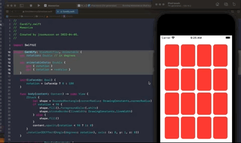

### What's going on here 🤔

The key to understanding what's going on are these lines of code here:

```swift
struct Cardify: ViewModifier, Animatable {
    var rotation: Double // in degrees

    var animatableData: Double {
        get { rotation }
        set { rotation = newValue }
    }

    init(isFaceUp: Bool) {
        rotation = isFaceUp ? 0 : 180
    }

    func body(content: Content) -> some View {
        ZStack {
            let shape = RoundedRectangle(cornerRadius: DrawingConstants.cornerRadius)
            if rotation < 90 {
```

First, understand that the variable that drives our animation is `rotation`. Whatever the value `rotation` is, that is what we are going to apply in our `3D` rotation.

```swift
struct Cardify: ViewModifier, Animatable {
    var rotation: Double // in degrees
```

Secondly, because our view modifier is `Animatable` we have an animation hook called:

```swift
var animatableData: Double {
    get { rotation }
    set { rotation = newValue }
}
```

that is going to fetch and set our value as we animate. That is how it nows where it is at an the animation.

Now here is the crux of it. The animation doesn't occur until the card flips:

```swift
rotation = isFaceUp ? 0 : 180
```

Only when the card becomes `isFaceUp` does the `rotation` value switch from `0` to `180`. When this happens, now the animation occurs. And SwiftUI will contantly call our view from `0, 1, 2, 3, 4, .... 180` degrees and we will draw it each time animating from one degrees to the next.

Then internally, we use the value of `rotation` to decide things like `opactity`:

```swift
content.opacity(rotation < 90 ? 1: 0)
```

As well as where the rotation is in the `3DEffect`:

```swift
.rotation3DEffect(Angle(degrees: rotation), axis: (x: 0, y: 1, z: 0))
```

So the key takeway is `rotation` is `Animatable` data. And 


## Transitions

Transitions are the comings and goings of views. Just view modifiers for the coming and another set of view modifiers for going.

Usually there are x4 precanned transitions we can use. 

**AnyTransition**

```swift
extension AnyTransition {
    public static var scale: AnyTransition { get }
    public static let opacity: AnyTransition
    public static var slide: AnyTransition { get }
    public static let identity: AnyTransition
}
```

Let's see where we have a view disappearing on us.

When we have a match and we click on another card...the previously x2 matched cards fade away.

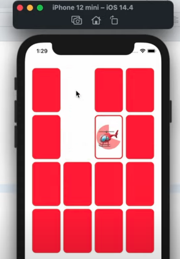

That was a transtion animation. These views transitioned to not being in the UI anymore and when through a little transition animation.

Let's go change that animation to something else so we can see how to control it.

**EmojiMemoryGameView**

```swift
@ViewBuilder
private func cardView(for card: EmojiMemoryGame.Card) -> some View {
    if card.isMatched && !card.isFaceUp {
        Color.clear
    } else {
        CardView(card: card)
            .padding(4)
            .transition(AnyTransition.scale) // add
            .onTapGesture {
                withAnimation {
                    game.choose(card)
                }
            }
    }
}
```

This `AnyTransition` is a static struct we call a `typeerased` transition. Means it type is erased when used.

`scale` is a transition that makes the view shrink down into nothing, or up into its full sized view.

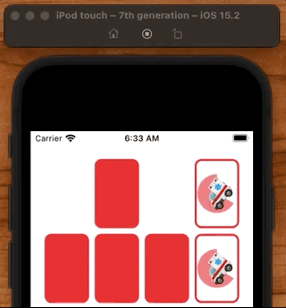

You can make the animation longer also like this:

```swift
.transition(AnyTransition.scale.animation(Animation.easeInOut(duration: 2)))
```

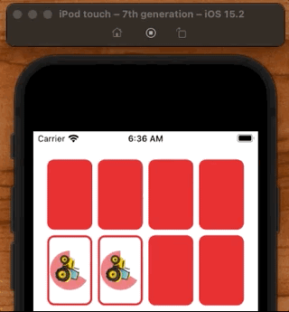

The places you most often see view coming and going is `if/then`.

### Asymetric transitions

Asymentric transitions are tranistions where you define the coming and going animations differently (there are not symetric).

For example here we could define the coming animation one way, and the going animation another:

```swift
.transition(AnyTransition.asymmetric(insertion: .scale, removal: .opacity)
```

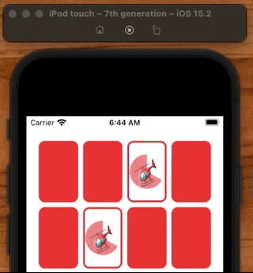

Hmmm. This cards appeared on screen... but they didn't `scale` in 🤔. But the opactity worked - it faded out. Why no scale in?

This is our old problem again where these views:

```swift
@ViewBuilder
private func cardView(for card: EmojiMemoryGame.Card) -> some View {
    if card.isMatched && !card.isFaceUp {
        Color.clear
    } else {
        CardView(card: card)
            .padding(4)
            .transition(AnyTransition.asymmetric(insertion: .scale, removal: .opacity))
            .onTapGesture {
                withAnimation {
                    game.choose(card)
                }
            }
    }
}
```

Did not appear/disappear on screen from a container that was already on screen.

```swift
var gameBody: some View {
    AspectVGrid(items: game.cards, aspectRatio: 2/3) { card in
        cardView(for: card)
    }
    .foregroundColor(.red)
}
```

This `AspectVGrid` came on screen with these cards already there. So they're not appearing on screen inside a container already there. They appeared `with` their container. 

So it's the transition of the `AspectVGrid` which is going to control that appearance or disappearce because it is the thing that's appearing.

This shows a big difference between transitions and view modifiers. Transitions apply to the containers themselves. View modifiers on containers apply the animations to each individual view inside.

So for us to animatie this `CardView` we really need to animate the `AspectVGrid`.

So how can we scale in these cards on app startup? To do that the AsepctVGrid needs to come on first and then after the cards will appear.

### Dealing the cards

This is something we often want to do. We often want our containers to appear on screen first, and then have our subviews appear after. And there is a really good view modifer that can do that for us on any container called `onAppear`:

```swift
var gameBody: some View {
    AspectVGrid(items: game.cards, aspectRatio: 2/3) { card in
        cardView(for: card)
    }
    .onAppear {
        // deal cards
    }
    .foregroundColor(.red)
}
```

What we are going to do here is deal our cards out into our UI. Going to have to keep track of whether a card has been dealt. Could put into model. But here is it more a pure UI thing.

So that's where `@State` comes in. It's a temporary state for this local UI control. This is only for use in our view (so make private). 

We will track this by creating a `Set<Int>` of the identifiers for each card.

**EmojiMemoryGameView**

```swift
struct EmojiMemoryGameView: View {
    @ObservedObject var game: EmojiMemoryGame
    @State private var dealt = Set<Int>()
    
    var gameBody: some View {
    AspectVGrid(items: game.cards, aspectRatio: 2/3) { card in
        cardView(for: card)
    }
    .onAppear {
        // deal cards
    }
}
```

Adding some helpers...

```swift
struct EmojiMemoryGameView: View {
    @ObservedObject var game: EmojiMemoryGame
    @State private var dealt = Set<Int>() // 

    private func deal(_ card: EmojiMemoryGame.Card) { // 
        dealt.insert(card.id)
    }

    private func isUndealt(_ card: EmojiMemoryGame.Card) -> Bool { //
        !dealt.contains(card.id)
    }

    var gameBody: some View {
        AspectVGrid(items: game.cards, aspectRatio: 2/3) { card in
            cardView(for: card)
        }
        .onAppear {
            withAnimation { //
                for card in game.cards {
                    deal(card)
                }
            }
        }
        .foregroundColor(.red)
    }

    @ViewBuilder
    private func cardView(for card: EmojiMemoryGame.Card) -> some View {
        if isUndealt(card) ||  (card.isMatched && !card.isFaceUp) {
            Color.clear
        } else {
            CardView(card: card)
                .padding(4)
                .transition(AnyTransition.asymmetric(insertion: .scale, removal: .opacity)) //
                .onTapGesture {
                    withAnimation {
                        game.choose(card)
                    }
                }
        }
    }
```

So what we have really done here is:

- Added `@State` to track change in our UI
- Added the `CardViews` explicitly to our container separately in `onAppear`
- Added an `explicit` animation to our container viw `withAnimation`
- Added a `transition` animation to our `CardView`

If we slow things down a bit:

```swift
CardView(card: card)
    .padding(4)
    .transition(AnyTransition.asymmetric(insertion: .scale, removal: .opacity).animation(.easeInOut(duration: 3)))
```

We should now see our `CardView` scale in.

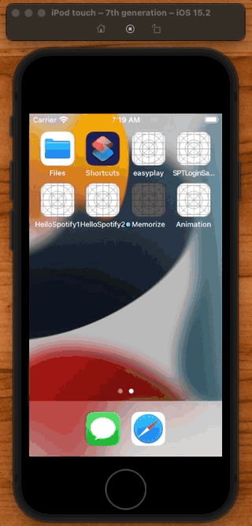

And our fade out.

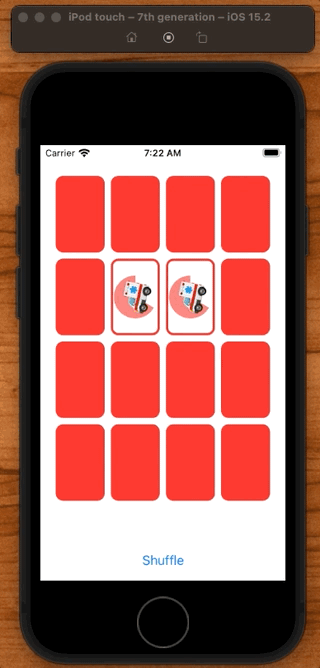

So we really learned x3 things here:

- Transitions
- OnAppear for containers
- @State for controlling how UI operates

## Dealing off of a deck

Now as good as this looks, it would be really cool if we could deal these off of a deck.

To do this we are going to create another view, a deck of cards, and then deal out our cards from there onto the screen.

We already have the `onAppear` where we can deal.

```swift
var gameBody: some View {
    AspectVGrid(items: game.cards, aspectRatio: 2/3) { card in
        cardView(for: card)
    }
    .onAppear {
        withAnimation {
            for card in game.cards {
                deal(card)
            }
        }
    }
}
```

But insted of doing it here, we are going to move this functionality to a new view. A deck of cards.

Let's create a `var` called `deckBody`:

```swift
var deckBody: some View {
    ZStack {
        ForEach(game.cards.filter(isUndealt)) { card in
            CardView(card: card)
        }
    }
    .frame(width: CardConstants.underltWidth, height: CardConstants.undealtHeight)
}
```

Adding a frame like this will cause the `ZStack` to stretch and fill as much of the space offered to it as it can.

**EmojiMemoryGame**

```swift
struct EmojiMemoryGameView: View {
    @ObservedObject var game: EmojiMemoryGame
    @State private var dealt = Set<Int>()

    private func deal(_ card: EmojiMemoryGame.Card) {
        dealt.insert(card.id)
    }

    private func isUndealt(_ card: EmojiMemoryGame.Card) -> Bool {
        !dealt.contains(card.id)
    }

    var body: some View {
        VStack {
            gameBody
            deckBody
            shuffleButton
        }
        .padding()
    }

    var gameBody: some View {
        AspectVGrid(items: game.cards, aspectRatio: 2/3) { card in
            cardView(for: card)
        }
        .onAppear {
            withAnimation(.easeInOut(duration: 5)) {
                for card in game.cards {
                    deal(card)
                }
            }
        }
        .foregroundColor(CardConstants.color)
    }

    var deckBody: some View {
        ZStack {
            ForEach(game.cards.filter(isUndealt)) { card in
                CardView(card: card)
                    .transition(AnyTransition.asymmetric(insertion: .opacity, removal: .scale))
            }
        }
        .frame(width: CardConstants.underltWidth, height: CardConstants.undealtHeight)
        .foregroundColor(CardConstants.color)
    }

    var shuffleButton: some View {
        Button("Shuffle") {
            withAnimation {
                game.shuffle()
            }
        }
    }

    @ViewBuilder
    private func cardView(for card: EmojiMemoryGame.Card) -> some View {
        if isUndealt(card) ||  (card.isMatched && !card.isFaceUp) {
            Color.clear
        } else {
            CardView(card: card)
                .padding(4)
                .transition(AnyTransition.asymmetric(insertion: .scale, removal: .opacity))
                .onTapGesture {
                    withAnimation {
                        game.choose(card)
                    }
                }
        }
    }

    private struct CardConstants {
        static let color = Color.red
        static let aspectRatio: CGFloat = 2/3
        static let dealDuration: Double = 0.5
        static let totalDealDuration: Double = 2
        static let undealtHeight: CGFloat = 90
        static let underltWidth = undealtHeight * aspectRatio
    }
}

struct CardView: View {
    let card: EmojiMemoryGame.Card

    var body: some View {
        GeometryReader{ geometry in
            ZStack {
                Pie(startAngle: Angle(degrees: 270), endAngle: Angle(degrees: 30)).padding(4).opacity(0.6)
                Text(card.content)
                    .rotationEffect(Angle.degrees(card.isMatched ? 360 : 0))
                    .animation(Animation.linear(duration: 1).repeatForever(autoreverses: false), value: card.isMatched)
                    .font(font(in: geometry.size))
            }
            .cardify(isFaceUp: card.isFaceUp)
        }
    }

    private func font(in size: CGSize) -> Font {
        Font.system(size: min(size.width, size.height)*DrawingConstants.fontScale)
    }

    private struct DrawingConstants {
        static let fontScale: CGFloat = 0.6
    }
}

extension View {
    func cardify(isFaceUp: Bool) -> some View {
        return self.modifier(Cardify(isFaceUp: isFaceUp))
    }
}

struct ContentView_Previews: PreviewProvider {
    static var previews: some View {
        let game = EmojiMemoryGame()
        game.choose(game.cards.first!)
        return EmojiMemoryGameView(game: game)
            .preferredColorScheme(.light)
    }
}
```

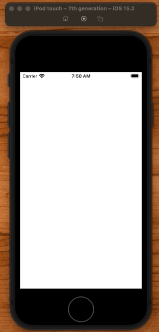

Good first step. But we don't want it to deal as soon as the app launches. We want it to deal when we tap on the deck.

So let's move the `onAppear` down to the `deckBody` and make it a `tapGesture` instead.

```swift
var deckBody: some View {
    ZStack {
        ForEach(game.cards.filter(isUndealt)) { card in
            CardView(card: card)
                .transition(AnyTransition.asymmetric(insertion: .opacity, removal: .scale))
        }
    }
    .frame(width: CardConstants.underltWidth, height: CardConstants.undealtHeight)
    .foregroundColor(CardConstants.color)
    .onTapGesture {
        // "deal" cards
        withAnimation(.easeInOut(duration: 5)) {
            for card in game.cards {
                deal(card)
            }
        }
    }
}
```

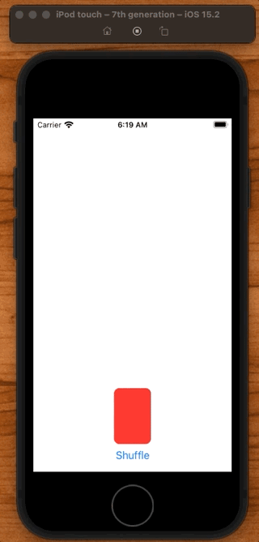

### Making them fly

OK not bad. But we really want the cards to fly off the deck and onto the screen. How can we do that?

This is where that `matchGeometry` effect comes in. What we need to do is match the geometry of the cards in the deck with the cards out here.

**EmojiMemoryGame**

```swift
struct EmojiMemoryGameView: View {
    @Namespace private var dealingNameSpace

	var gameBody: some View {
   		CardView(card: card)
        .matchedGeometryEffect(id: card.id, in: dealingNamespace)

	var deckBody: some View {
   		CardView(card: card)
        .matchedGeometryEffect(id: card.id, in: dealingNamespace)

```

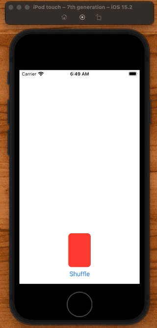

```swift
/// Defines a group of views with synchronized geometry using an
/// identifier and namespace that you provide.
///
```

This is really cool. It matches the geometry of two views as then animate in together so it looks like animate from one position to the other.

One thing you'll notice that we left these transitions in here. We could match the transitions, but we don't want scale to occur when this occurs. 

The animation system is doing the best it can but it won't ignore any other animations you already have going on.

So we can either remove the transition. Or we can use `identity`.

```swift
@ViewBuilder
private func cardView(for card: EmojiMemoryGame.Card) -> some View {
    CardView(card: card)
        .matchedGeometryEffect(id: card.id, in: dealingNamespace)
        .transition(AnyTransition.asymmetric(insertion: .identity, removal: .opacity))
}
```

Identity means don't scale or do anything. Put my back to my original shape.

So when the cards are removed and added we'll put them back to their original shape and position like this:

```swift
.transition(AnyTransition.asymmetric(insertion: .identity, removal: .opacity))
.transition(AnyTransition.asymmetric(insertion: .opacity, removal: .identity))
```

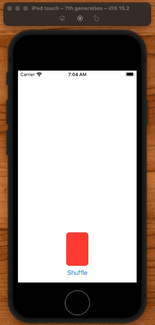

Really good. One more thing we could do to to make it even more realistic is deal the cards one at a time.

Way to do that is delay the animations as we go.

```swift
private func dealAnimation(for card: EmojiMemoryGame.Card) -> Animation {
    var delay = 0.0
    if let index = game.cards.firstIndex(where: { $0.id == card.id }) {
        delay = Double(index) * CardConstants.totalDealDuration / Double(game.cards.count)
    }
    return Animation.easeInOut(duration: CardConstants.dealDuration).delay(delay)
}

.onTapGesture {
    // "deal" cards
    for card in game.cards {
        withAnimation(dealAnimation(for: card)) {
            deal(card)
        }
    }
}
```

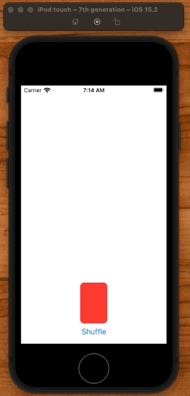

### Dealing from the bottom

One small deal Paul notices is that when the cards are faceup, it looks like the cards are dealt from the bottom of the deck.

Two fix this he tweaks the `ZStack` order using `zIndex`:

```swift
CardView(card: card)
    .matchedGeometryEffect(id: card.id, in: dealingNamespace)
    .padding(4)
    .transition(AnyTransition.asymmetric(insertion: .identity, removal: .opacity))
    .zIndex(zIndex(of: card))
```

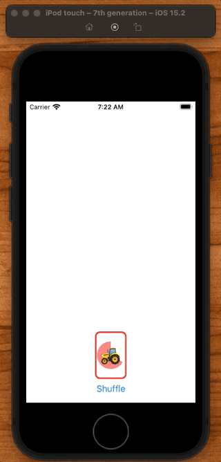

Two more things that would be cool to do is:

1. Restart the game.
2. Start the count down timer.

## Restart the game

**EmojiMemoryGameView**

```swift
var restartButton: some View {
    Button("Restart") {
        withAnimation {
            dealt = []
            game.restart()
        }
    }
}
```

Note: Because `dealt` is an `@State` this is going to cause the view to redraw itself and animation will occur. This should undeal everything.

**EmojiMemotyGame**

```swift
func restart() {
    model = EmojiMemoryGame.createMemoryGame()
}
```

Resetting the model like this will also trigger a change in UI.

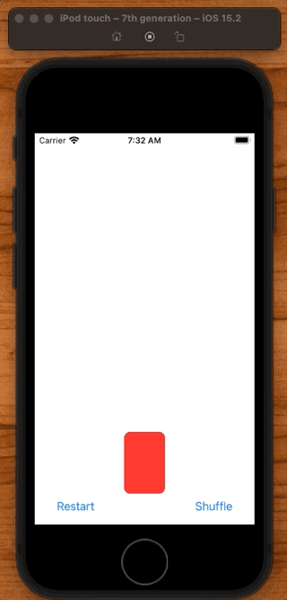

## Adjusting the extra space

One problem in landscape is how much space is taken.

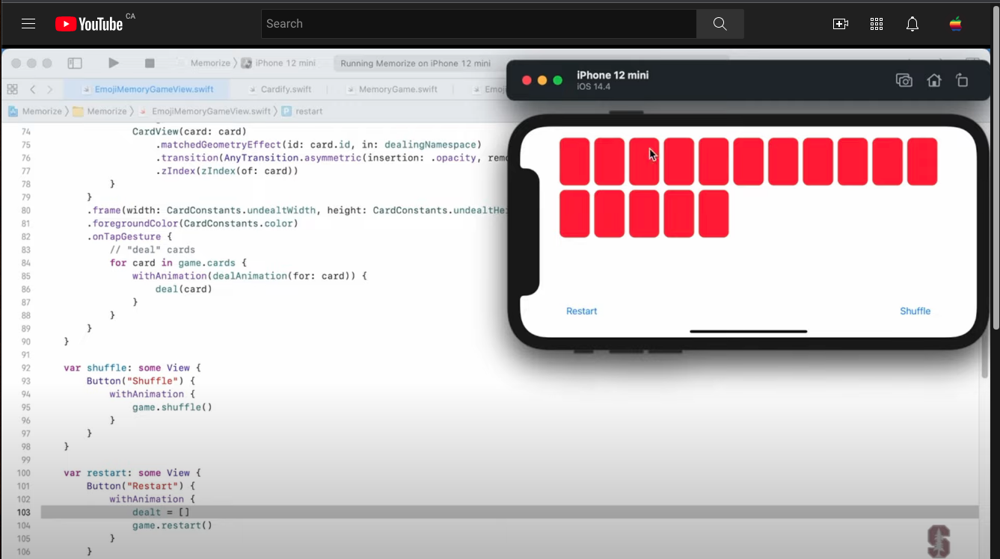

Anytime we have mutually exclusive views like this is a good time to embed them both in a `ZStack`.

Move `deckbody` from here:

```swift
var body: some View {
    VStack {
        gameBody
        deckBody
        HStack {
```

to here:

```swift
var body: some View {
    ZStack {
        VStack {
            gameBody
            HStack {
                restartButton
                Spacer()
                shuffleButton
            }
            .padding(.horizontal)
        }
        deckBody
    }
    .padding()
}
```

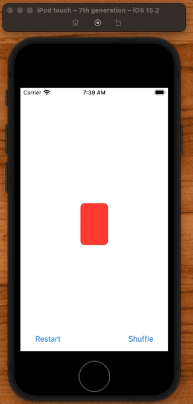

### Moving the deck starting position down

Not bad. But it would be nice of the deck starting position was down just a bit further.

```swift
var body: some View {
    ZStack(alignment: .bottom) {
        VStack {
         ...
        }
        deckBody
    }
    .padding()
}
```

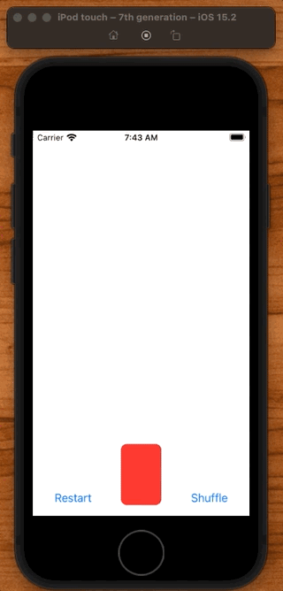

## Animating the pie

After adding some bonus logic code, Paul adds some property observers to trigger the starting/stopping of bonus time when a matched card is found:

**Card**

```swift
struct Card: Identifiable {
    var isFaceUp = false {
        didSet {
            if isFaceUp {
                startUsingBonsusTime()
            } else {
                stopUsingBonusTime()
            }
        }
    }

    var isMatched = false {
        didSet {
            stopUsingBonusTime()
        }
    }
}
```

### Making the pie animatable

`Shapes` just like `ViewModifiers` can be made animatable. Just like with `Cardify` view modifier, all we need to do is implement the `AnimatableModifier` and the animatable data that we want.

Shapes are always assumed to be animatable.

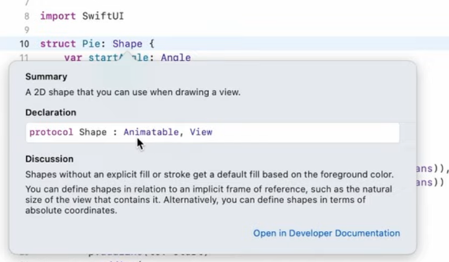

So we can just add the `var`. And we want to animate the start and end angle of our pie. Which we can do as a pair. Could do in degrees but for fun will do in radians.

**Pie**

```swift
struct Pie: Shape {
    var startAngle: Angle
    var endAngle: Angle
    var clockwise = false

    var animatableData: AnimatablePair<Double, Double> {
        get {
            AnimatablePair(startAngle.radians, endAngle.radians)
        }
        set {
            startAngle = Angle.radians(newValue.first)
            endAngle = Angle.radians(newValue.second)
        }
    }
}
```

And believe it or not, that's it. `path` will be repeatedly called with new angles which will redraw our paths.

So now we can animate our pie.

**CardView**

```swift
struct CardView: View {
    let card: EmojiMemoryGame.Card

    var body: some View {
        GeometryReader{ geometry in
            ZStack {
                Pie(startAngle: Angle(degrees: 270), endAngle: Angle(degrees: 30)).padding(4).opacity(0.6)
```

Let's start by changing the angle of our pie.

```swift
Pie(startAngle: Angle(degrees: 270), endAngle: Angle(degrees: (1-card.bonusTimeRemaining)*360-90))
```

This works, it counts down, but we have a problem. Our pie isn't animating. Nothing is changing in our model causing it to animate.

We can trigger this by adding some `@State` and only triggering is bonus time is being consumed.

```swift
struct CardView: View {
    let card: EmojiMemoryGame.Card

    @State private var animatedBonusRemaining: Double = 0

    var body: some View {
        GeometryReader{ geometry in
            ZStack {
                if card.isConsumingBonusTime {
                    Pie(startAngle: Angle(degrees: 270), endAngle: Angle(degrees: (1-animatedBonusRemaining)*360-90))
                        .padding(4)
                        .opacity(0.6)
                } else {
                    Pie(startAngle: Angle(degrees: 270), endAngle: Angle(degrees: (1-card.bonusTimeRemaining)*360-90))
                        .padding(4)
                        .opacity(0.6)
                }
```

Now instead of repeating the `padding` and `opacity` we can apply these to both instances of `Pie` by making these part of a `Group`.

```swift
Group {
    if card.isConsumingBonusTime {
        Pie(startAngle: Angle(degrees: 270), endAngle: Angle(degrees: (1-animatedBonusRemaining)*360-90))
    } else {
        Pie(startAngle: Angle(degrees: 270), endAngle: Angle(degrees: (1-card.bonusTimeRemaining)*360-90))
    }
}
.padding(4)
.opacity(0.6)
```

Convenient way to group things up and apply the same view modifiers to everything inside.

Now we just need to update the `animatedBonusRemaining`. To kick off this animation we do that everytime `Pie` appears on screen.

```swift
Pie(startAngle: Angle(degrees: 270), endAngle: Angle(degrees: (1-animatedBonusRemaining)*360-90))
    .onAppear {
        animatedBonusRemaining = card.bonusRemaining
        withAnimation(.linear(duration: card.bonusTimeRemaining)) {
            animatedBonusRemaining = 0
        }
    }
```

### Links that help

- [Lecture 8](https://www.youtube.com/watch?v=-N1UR7Y105g)


