# Lecture 9: EmojiArt Drag/Drop

## Collections of Identifiable

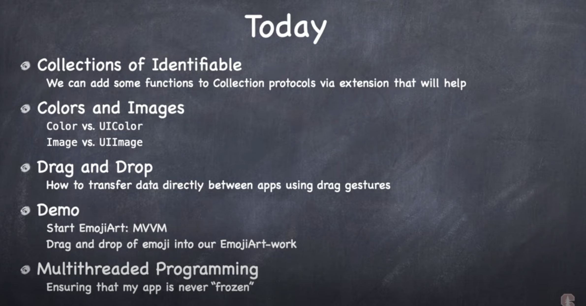

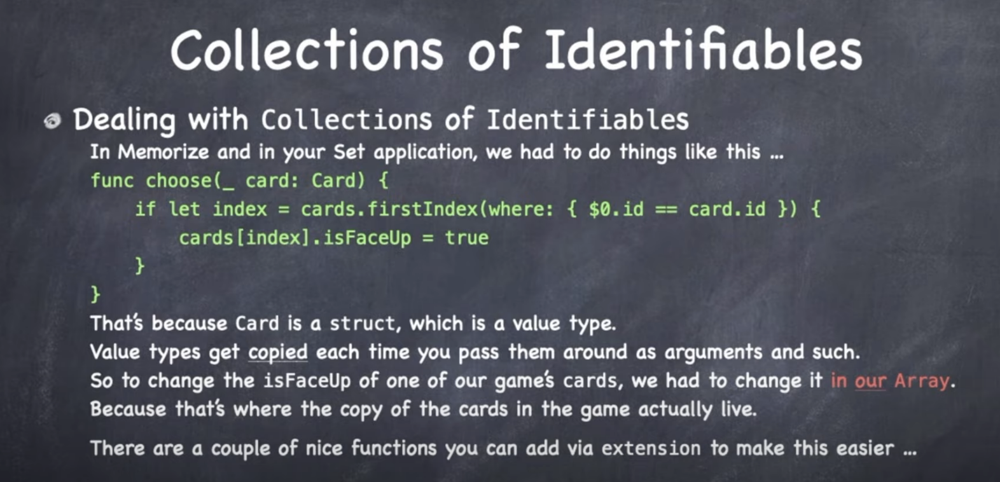

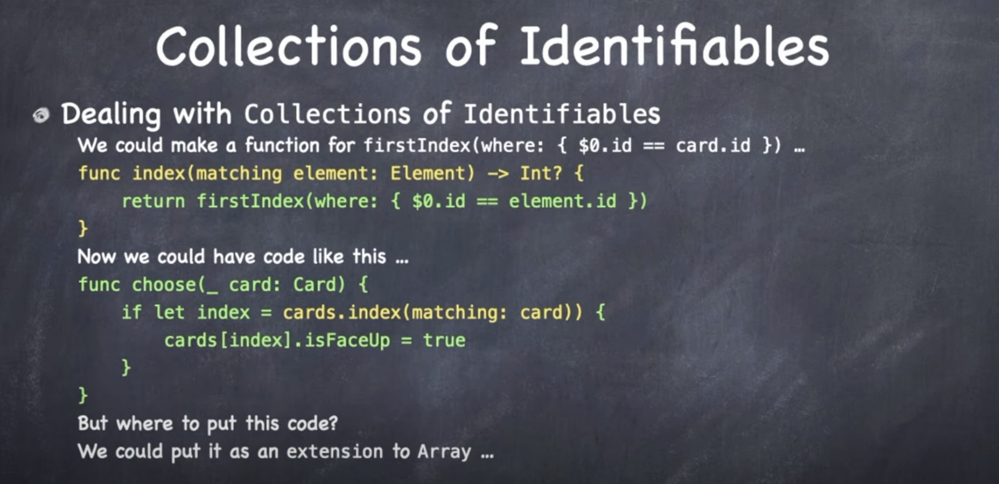

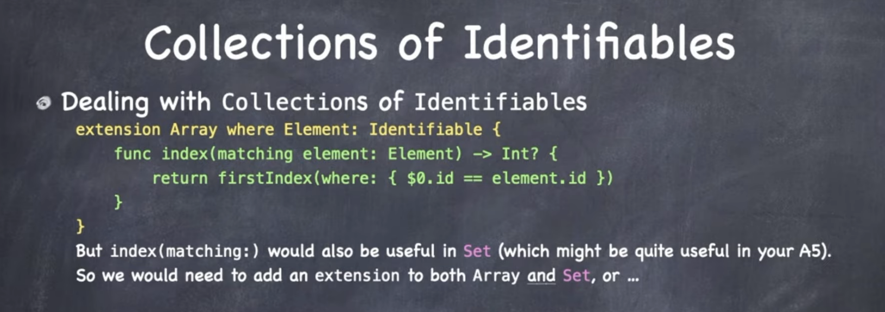

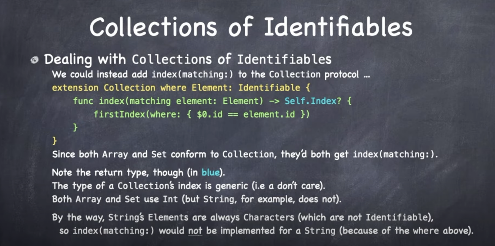

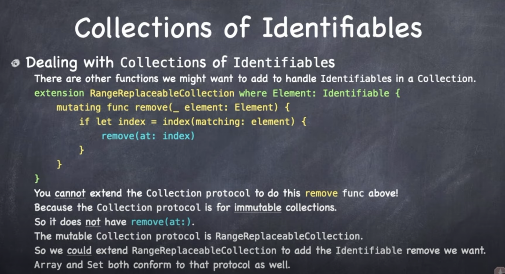

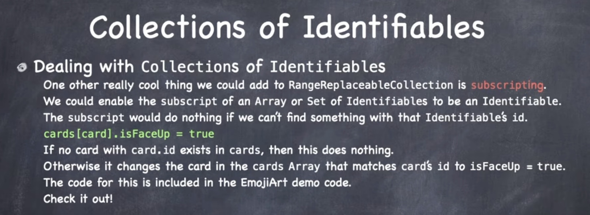

## Colors and Images

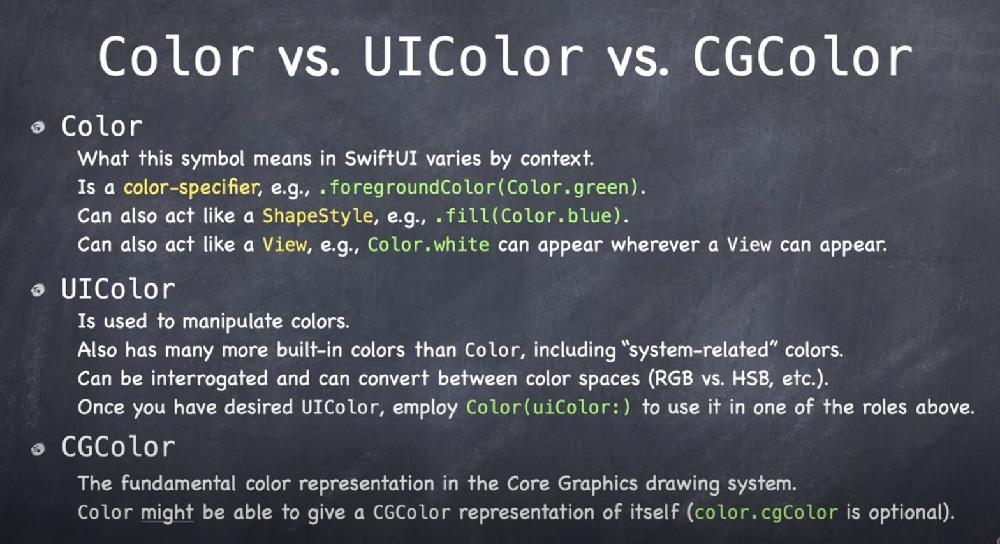

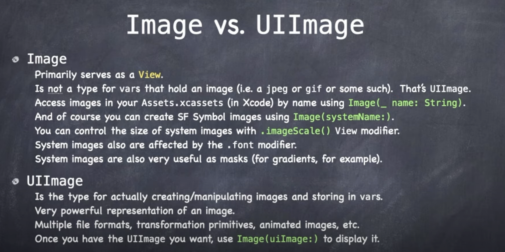

## Drag and Drop

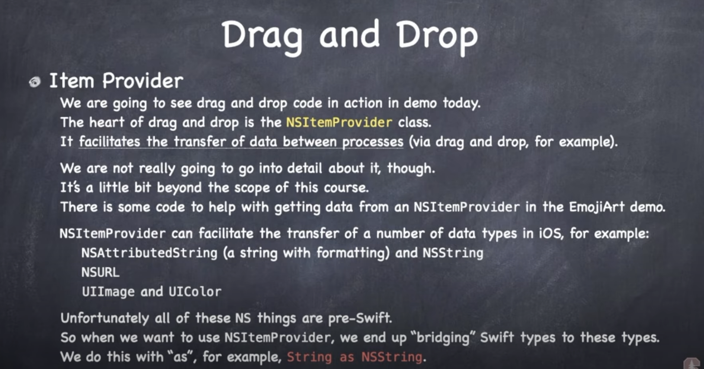

## Multithreading

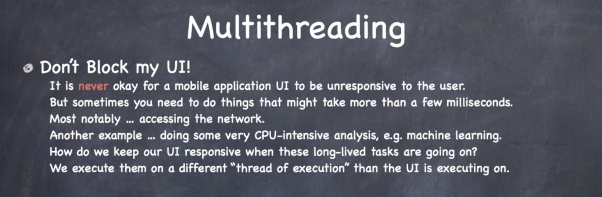

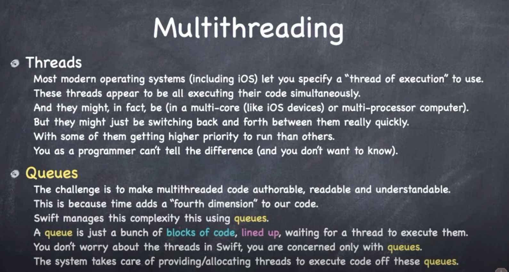

This is an interesting point. In Swift we don't think/worry about threads. We only interact with Queues. System worries about threads behind the scenes.

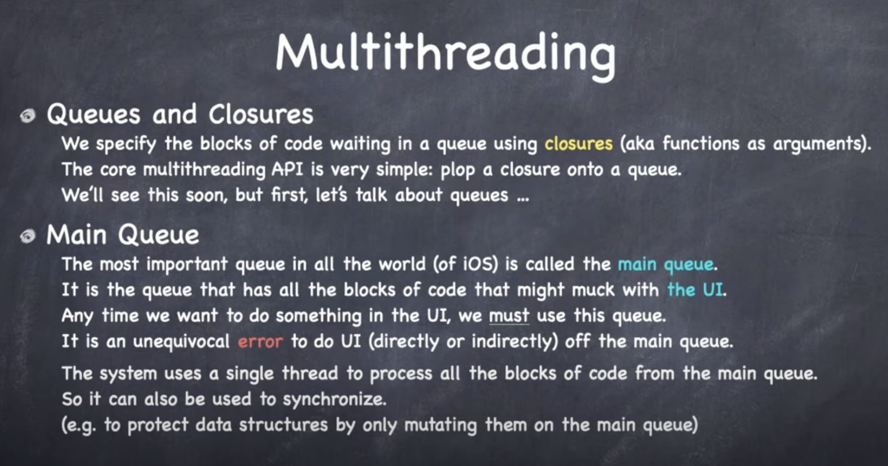

We specify blocks of code waiting to go to the movie is to plop a closure onto a queue.

Most important queue is `MainQueue`. Anytime we want to do anything with the UI must happen here.

MainQueue uses a single thread of execution to run everything off the most queue. Means you can use for synchronization. Writing on the main. Read on others in the background.

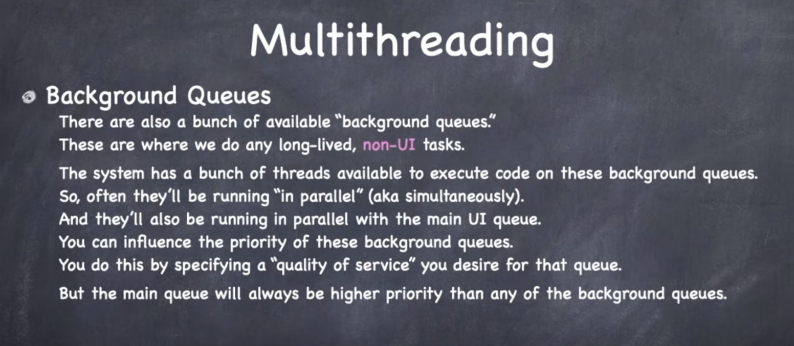

Animation happens in a different queue (not main). Main queue is sitting there idle a good chunk of the time. But main queue is always highst priority.

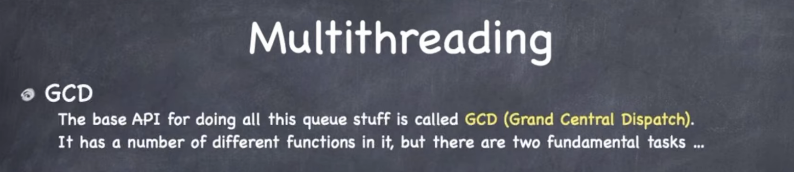

Dispatching blocks of code onto queues.

1. Get access.
2. Put block on queue.

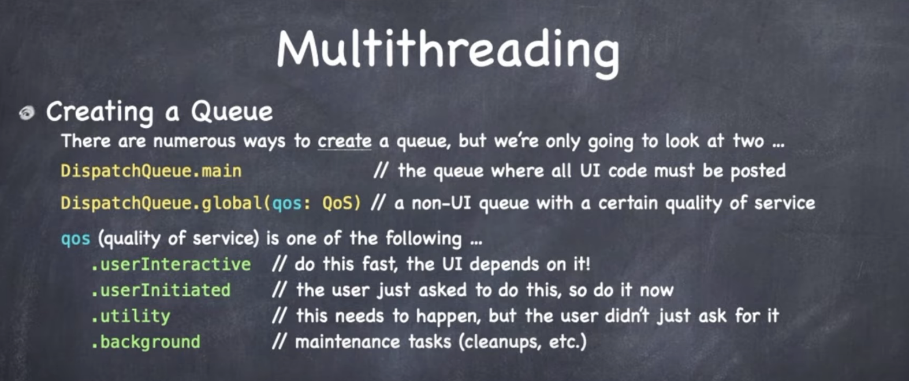

Main queue is easy to get. That is just a static `var`.

For background queues you are going to use this `global` func while specifiying a quality of service.

`userInitiated` is most commonly used one. User tapped on a button - said do something for more. Not dragging finger... more target action. Go fetch me some data over the network.

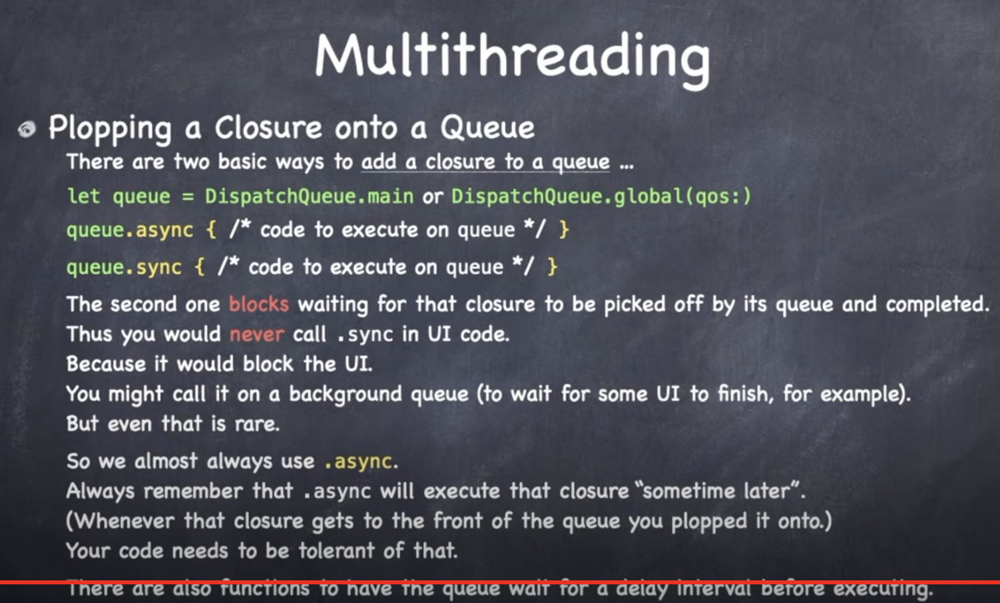

Beauty of this API is the nesting you get.

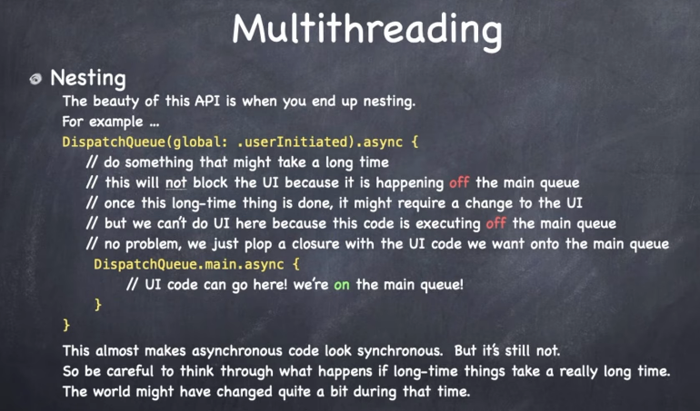

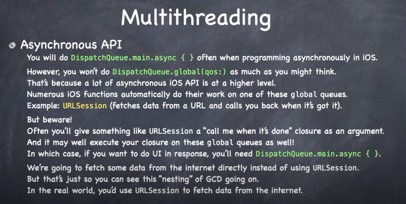

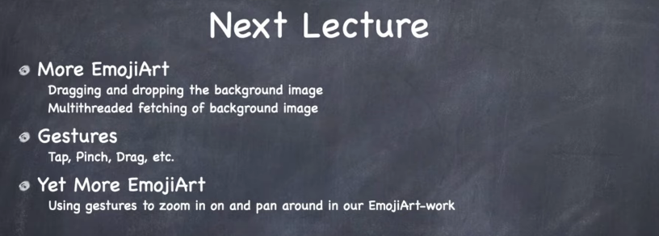

### Links that help

- [Lectures](https://cs193p.sites.stanford.edu/)
- [Lecture 9](https://www.youtube.com/watch?v=eNS5EzgK3lY&ab_channel=Stanford)

