# Representables

SwiftUI is great but it can't yet do everything. There are `UIKit` frameworks for working with the camera, MapKit, and Safari that simply aren't yet available in SwiftUI. So until they are here, we need to integrate with UIKit.

## How does it work


- SwiftUI has a protocol for integrating UIKit view controllers.
- You basically create a view, have it implement these protocol types, and they instantiate and update the `UIViewController` in a Swift `View`.
- The `coordinator` is like the bridge. Here you pass data, and setup protocol-delegate.
- A `context` containts the coordinate where you can extract SwiftUI data from.
- And this is how you bridge these two works of `UIKit` and SwiftUI.

Let's now look at an example and see how we can leverage the UIKit `UIImagePickerController` in a SwiftUI view.

## Create a view to hold the view controller

First thing we are going to do is create a new SwiftUI view implementing these Representable protocols.

**Camera**

```swift
struct Camera: UIViewControllerRepresentable {
    typealias UIViewControllerType = UIImagePickerController

    func makeUIViewController(context: Context) -> UIImagePickerController {
        let picker = UIImagePickerController()
        picker.sourceType = .camera
        picker.allowsEditing = true
        return picker
    }

    func updateUIViewController(_ uiViewController: UIImagePickerController, context: Context) {
        // nothing to do
    }

    static var isAvailable: Bool {
        UIImagePickerController.isSourceTypeAvailable(.camera)
    }
}
```

This is a valid SwiftUI view. Now we can now show and use in our `ContentView` like this:

```swift
struct ContentView: View {
    @State private var image: Image?
    @State private var showingImagePicker = false

    var body: some View {
        VStack {
            image?
                .resizable()
                .scaledToFit()

            Button("Select Image") {
               self.showingImagePicker = true
            }
        }
        .sheet(isPresented: $showingImagePicker) {
            Camera()
        }
    }
}
```

## Running on a physical device

If you try running this app in the simulator, you'll get an error saying:

> `'Source type 1 not available'` 

Meaning the cameria is not available and you need to run this app on a physical device.

To fix this we need to:

- Give your app Signing Capabilities
- Trust the app on your phone
- Give your app permission to take pictures

### Give your app Signing Capabilities

To generate the certificate necessary to run your app on your phone go to:

- Project > Signing & Capabilities

Hit the `Team` drop down.

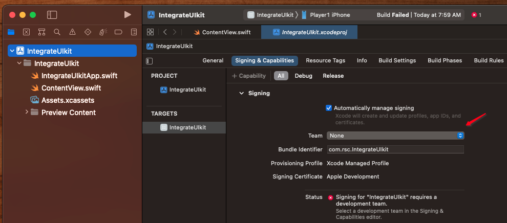

### Trust the app on your phone

If you select your phone from the simulator drop down list and try running it the app will install on your phone but it won't yet be trusted. You'll see an error that looks like this instead:

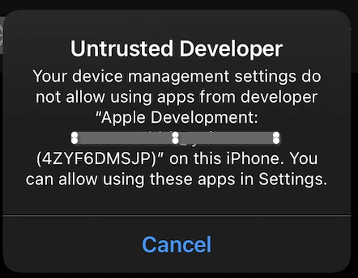

To trust your app on the phone go to:

- Settings > General > VPN & Device Management

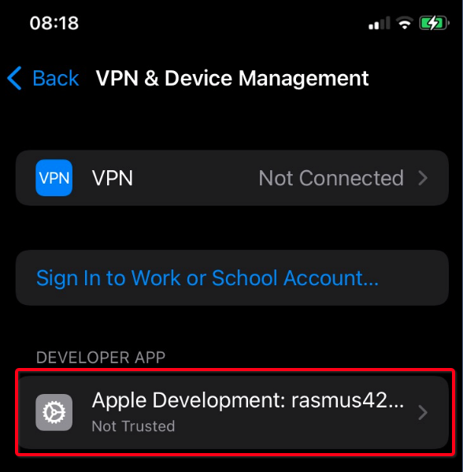

And trust your developer account there.

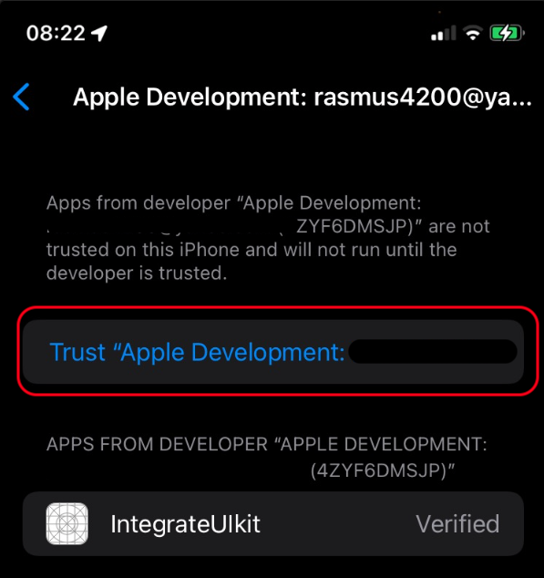

### Give your app permission to take pictures

If you try running the app now you will get the following error:

> This app has crashed because it attempted to access privacy-sensitive data without a usage description.  The app's Info.plist must contain an NSCameraUsageDescription key with a string value explaining to the user how the app uses this data.

This is Apples way of saying your users need to give you permission before you can start snapping pictures.

To fix this we need at add an entry to our apps `info.plist` list file. Which Swift no longer creates by default.

We can force Xcode to create an info.plist file for us by selecting the `Info` tab on our project.

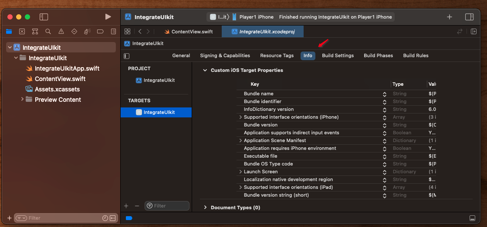

And then adding an info.plist entry by adding a Document Type (which we don't really care about).

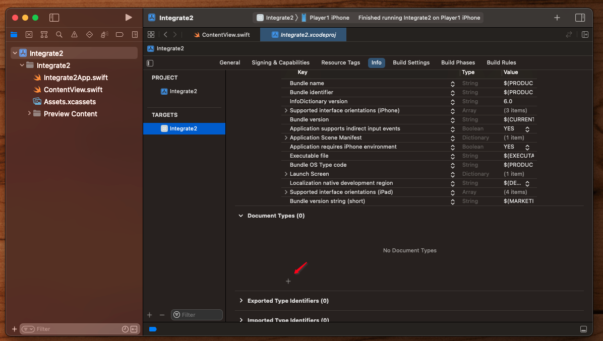

This will create the info.plist entry which we want.

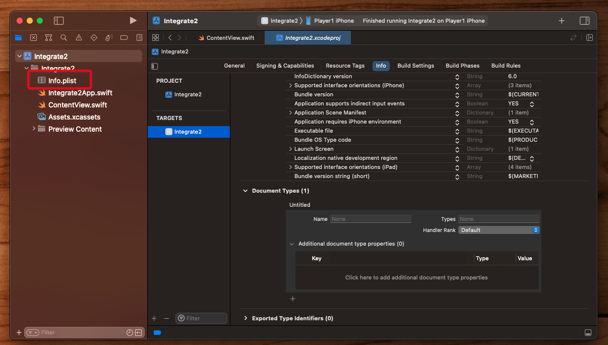

And we can now add our info.plist entry for camera permissions by selecting our newly created info.plist file and making the following entry:

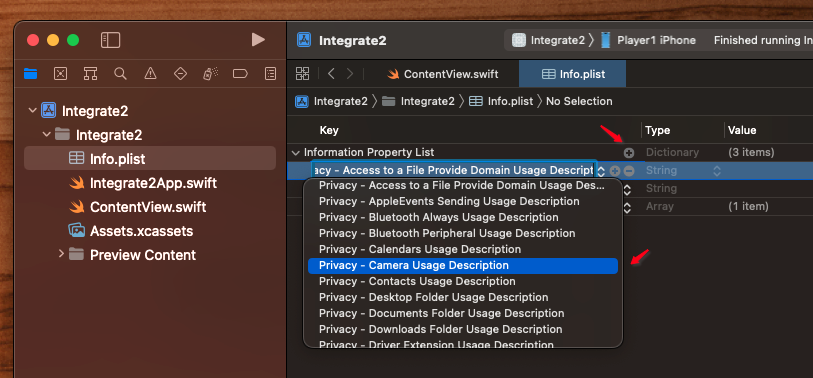

info.plists are sometimes tricky. Click the `+` sign to add a new entry. Then type or copy and paste in:

> Privacy - Camera Usage Description

As the key. Then double click the value portion and enter:

> This app needs camera permissions.

Which is the message the user will see the first time they attempt to use your app with the camera.

Your info.plist file should now look something like this:

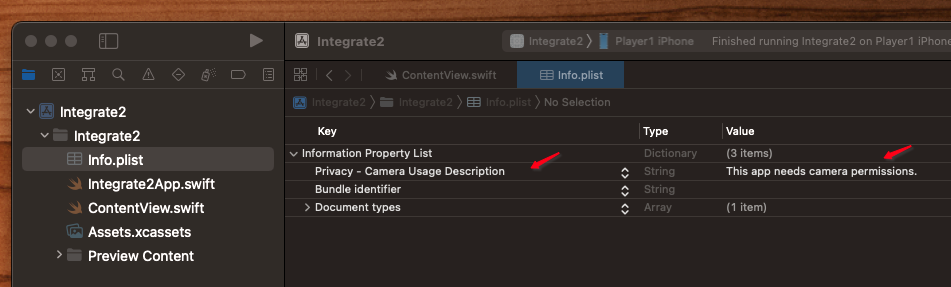

You may also need to manually copy in your Bundle Identifier:

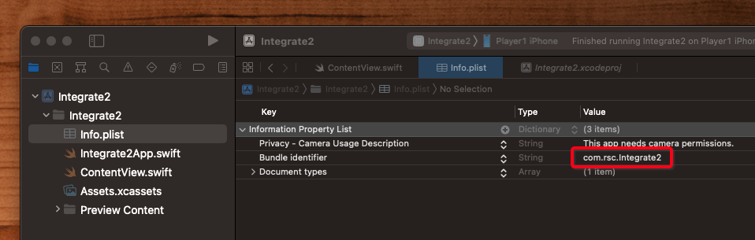

Now if we run the app we'll get asked for permission:

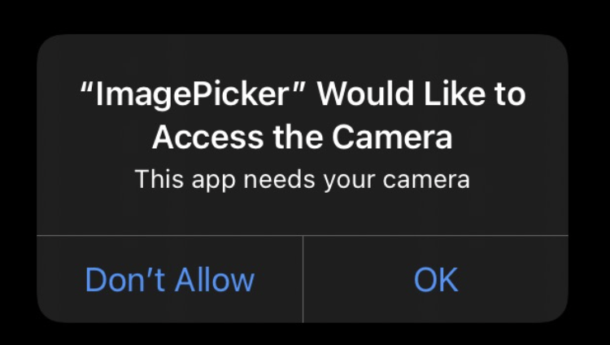

And then our camera should appear:

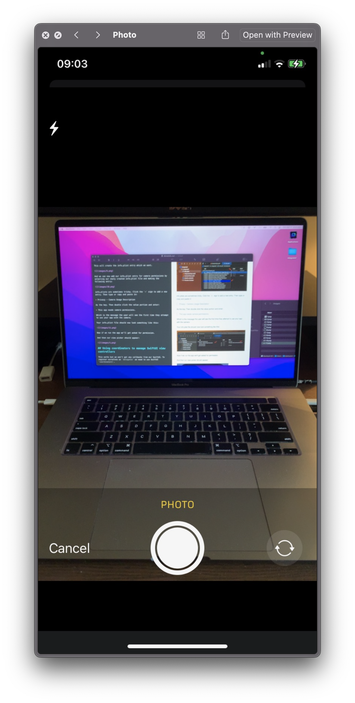

Our camera won't actually do anything yet, because while we have the camera view controller hooked up, we have no communcation yet between the `View` and the `ViewController`.

For that we need a `Coordinator`.

## Bridge with the Coordinator

The `Representable` Coordinator is what facilitates the communication between our two works.

**UIViewControllerRepresentable**

```swift
public protocol UIViewControllerRepresentable : View where Self.Body == Never {

	// The view controller
    associatedtype UIViewControllerType : UIViewController
    func makeUIViewController(context: Self.Context) -> Self.UIViewControllerType
    func updateUIViewController(_ uiViewController: Self.UIViewControllerType, context: Self.Context)

	// The Coordinator
    associatedtype Coordinator = Void
    func makeCoordinator() -> Self.Coordinator
    typealias Context = UIViewControllerRepresentableContext<Self>
}
```

- This is a `class` we instantiate internally as part of our view.
- It must implement `NSObject` along with any other delegates our view controller needs (i.e. `UIImagePickerControllerDelegate`).
- And we pass it any information we want to share via its `init` constructor.
- Then we make it in our view `func makeCoordinator() -> Coordinator { ... }`.

It all looks something like this:

**Camera**

```swift
struct Camera: UIViewControllerRepresentable {
    typealias UIViewControllerType = UIImagePickerController
    var handlePickedImage: (UIImage?) -> Void

    func makeCoordinator() -> Coordinator {
        Coordinator(handlePickedImage: handlePickedImage)
    }

    func makeUIViewController(context: Context) -> UIImagePickerController {
        let picker = UIImagePickerController()
        picker.sourceType = .camera
        picker.allowsEditing = true
        picker.delegate = context.coordinator
        return picker
    }

    func updateUIViewController(_ uiViewController: UIImagePickerController, context: Context) {
        // nothing to do
    }

    static var isAvailable: Bool {
        UIImagePickerController.isSourceTypeAvailable(.camera)
    }

    class Coordinator: NSObject, UIImagePickerControllerDelegate, UINavigationControllerDelegate {
        var handlePickedImage: (UIImage?) -> Void

        init(handlePickedImage: @escaping (UIImage?) -> Void) {
            self.handlePickedImage = handlePickedImage
        }

        func imagePickerControllerDidCancel(_ picker: UIImagePickerController) {
            handlePickedImage(nil)
        }

        func imagePickerController(_ picker: UIImagePickerController, didFinishPickingMediaWithInfo info: [UIImagePickerController.InfoKey : Any]) {
            handlePickedImage((info[.editedImage] ?? info[.originalImage]) as? UIImage)
        }
    }
}
```

Because SwiftUI uses closures instead of protocol-delegate:

```swift
struct Camera: UIViewControllerRepresentable {
    var handlePickedImage: (UIImage?) -> Void
```

We need a way of connecting the protol-delegate callbacks to the closures in our view. 

We do that by passing information we want to update or execute in throught the `init` constructor of our coorinator:

**Coordinator**

```swift
class Coordinator: NSObject, UIImagePickerControllerDelegate, UINavigationControllerDelegate {
    var handlePickedImage: (UIImage?) -> Void

    init(handlePickedImage: @escaping (UIImage?) -> Void) {
        self.handlePickedImage = handlePickedImage
    }
```

The coordinator can then save that `var`, and use it later when things fire as part of the protocol-delegate callback:

**Coordinator**

```swift
class Coordinator: NSObject, UIImagePickerControllerDelegate, UINavigationControllerDelegate {
    var handlePickedImage: (UIImage?) -> Void

    init(handlePickedImage: @escaping (UIImage?) -> Void) {
        self.handlePickedImage = handlePickedImage
    }

    func imagePickerControllerDidCancel(_ picker: UIImagePickerController) {
        handlePickedImage(nil)
    }

    func imagePickerController(_ picker: UIImagePickerController, didFinishPickingMediaWithInfo info: [UIImagePickerController.InfoKey : Any]) {
        handlePickedImage((info[.editedImage] ?? info[.originalImage]) as? UIImage)
    }
}
```

Here for example we can see that when the view controller delegate gets called, it can simply return the selected image via the `handlePickedImage` closure which in turn update the SwiftUI view.

The SwiftUI view sets all this up via `makeCoordinator`:

**Camera**

```swift
struct Camera: UIViewControllerRepresentable {
    typealias UIViewControllerType = UIImagePickerController
    var handlePickedImage: (UIImage?) -> Void

    func makeCoordinator() -> Coordinator {
        Coordinator(handlePickedImage: handlePickedImage)
    }
```

This works because everything is a reference:

- The `Coordinator` is a `class`
- The closure is an `@escaping` reference

And when callbacks occur they are passed via the closure like this:

```swift
private func handlePickedImage(_ image: UIImage?) {
    guard let image = image else { return }
    self.image = Image(uiImage: image)

    showingImagePicker = false
}
```

Note how we dismiss the camera view. We change the state of what originally presented it, and the view dismisses.

And when everything works, our image should be passed back to us and we can now present it on screen like this:


### Full Source

**ContentView**

```swift
import SwiftUI

struct ContentView: View {
    @State private var image: Image?
    @State private var showingImagePicker = false

    var body: some View {
        VStack {
            image?
                .resizable()
                .scaledToFit()

            Button("Select Image") {
               self.showingImagePicker = true
            }
        }
        .sheet(isPresented: $showingImagePicker) {
            Camera(handlePickedImage: { image in handlePickedImage(image) } )
        }
    }

    private func handlePickedImage(_ image: UIImage?) {
        guard let image = image else { return }
        self.image = Image(uiImage: image)

        showingImagePicker = false
    }
}

struct Camera: UIViewControllerRepresentable {
    typealias UIViewControllerType = UIImagePickerController
    var handlePickedImage: (UIImage?) -> Void

    func makeCoordinator() -> Coordinator {
        Coordinator(handlePickedImage: handlePickedImage)
    }

    func makeUIViewController(context: Context) -> UIImagePickerController {
        let picker = UIImagePickerController()
        picker.sourceType = .camera
        picker.allowsEditing = true
        picker.delegate = context.coordinator
        return picker
    }

    func updateUIViewController(_ uiViewController: UIImagePickerController, context: Context) {
        // nothing to do
    }

    static var isAvailable: Bool {
        UIImagePickerController.isSourceTypeAvailable(.camera)
    }

    class Coordinator: NSObject, UIImagePickerControllerDelegate, UINavigationControllerDelegate {
        var handlePickedImage: (UIImage?) -> Void

        init(handlePickedImage: @escaping (UIImage?) -> Void) {
            self.handlePickedImage = handlePickedImage
        }

        func imagePickerControllerDidCancel(_ picker: UIImagePickerController) {
            handlePickedImage(nil)
        }

        func imagePickerController(_ picker: UIImagePickerController, didFinishPickingMediaWithInfo info: [UIImagePickerController.InfoKey : Any]) {
            handlePickedImage((info[.editedImage] ?? info[.originalImage]) as? UIImage)
        }
    }
}

struct ContentView_Previews: PreviewProvider {
    static var previews: some View {
        ContentView()
    }
}
```

### Links that help

- [Wrapping a UIViewController in a SwiftUI view](https://www.hackingwithswift.com/books/ios-swiftui/wrapping-a-uiviewcontroller-in-a-swiftui-view)
- [Using coorindators to manage Swift UI view controllers](https://www.hackingwithswift.com/books/ios-swiftui/using-coordinators-to-manage-swiftui-view-controllers)
- [Apple Interfacing with UIKit](https://developer.apple.com/tutorials/swiftui/interfacing-with-uikit)
- [Stanford Lecture 15](https://github.com/jrasmusson/swiftui/blob/main/Stanford/2021/Lecture15/README.md)


