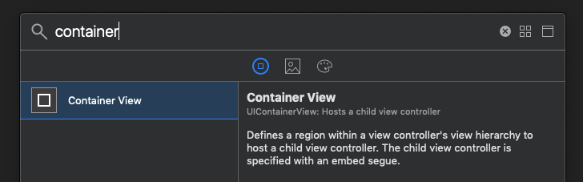
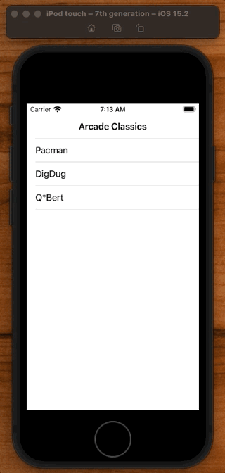
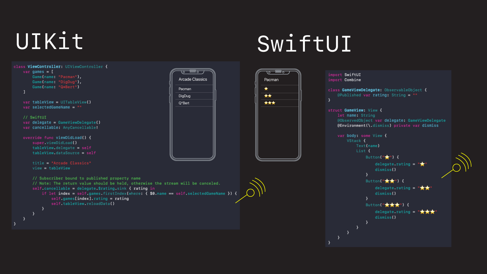

# UIHostingController

The way we host SwiftUI views in `UIKit` view controllers is via the `UIHostingController`:

```swift
let vc = UIHostingController(rootView: Text("Hello"))
navigationController?.pushViewController(vc, animated: true)
```

You simply put your SwiftUI view into a `UIHostingController`, display it, and your SwiftUI view will appear in your UIKit application.

There is also a corresponding API for hosting SwiftUI views in a `UIView`.

## An example

Say we have a `UITableView` sitting in a UIKit `UINavigationController`, and we'd like the detail view to be implemented in SwiftUI.



We can make it so that when the user taps a row, a SwiftUI view gets displayed via the `UIHostingController`.

```swift
extension ViewController: UITableViewDataSource, UITableViewDelegate {
    func tableView(_ tableView: UITableView, didSelectRowAt indexPath: IndexPath) {
        // UIKit > SwiftUI
        selectedGameName = games[indexPath.row].name
        let vc = UIHostingController(rootView: GameView(name: selectedGameName, delegate: delegate))
        navigationController?.pushViewController(vc, animated: true)
    }
}
```

The more interesting challenging bit is the communication back. How can our SwiftUI view communicate back to our `UIKit` view controller?

## Communication Challenge

In this app we want the SwiftUI view to send back the rating for the game the user selected from our `UITableView`.



The only problem is SwiftUI doesn't understand protocol-delegate. It only understands changes of state and communicates via closures.

What we can do here is leveraging Combine's `ObservableObject` property wrapper, and publish changes made to the games rating, and then listen for those in our view controller.



### Defining the delegate

First thing we can do is define an `ObservableObject` that our view controller can listen too.

**GameViewDelegate**

```swift
import Combine

class GameViewDelegate: ObservableObject {
    @Published var rating: String = ""
}
```

It's not really a delegate in the UIKit protocol-delegate sense of the term. But it is the thing that is going to broadcast `rating` changes out via its `@Published var`.

This in our SwiftUI view, we can define an instance of this broadcasting var, and whenever the user taps a `rating` we can change the `@ObservedObjects` value.

**GameView**

```swift
struct GameView: View {
    let name: String
    @ObservedObject var delegate: GameViewDelegate // define
    @Environment(\.dismiss) private var dismiss

    var body: some View {
        VStack {
            Text(name)
            List {
                Button("⭐️") {
                    delegate.rating = "⭐️" // broadcast
                    dismiss()
                }
```

Setting the rating on this delegate will fire the `objectWillChange` publisher on the `ObservableObject` there by emmiting the `rating` changed to all listeners.

We listen for these publisher events in our `UIKit` view controller.

**ViewController**

```swift
var cancellable: AnyCancellable!

override func viewDidLoad() {
 	...
    // Subscriber bound to published property name
    // Note: The return value should be held, otherwise the stream will be canceled.
    self.cancellable = delegate.$rating.sink { rating in    
        if let index = self.games.firstIndex(where: { $0.name == self.selectedGameName }) {
            self.games[index].rating = rating
            self.tableView.reloadData()
        }
    }
}
```

In `viewDidLoad()` we can set ourselves up as subscribers for these published events. When the new `rating` value comes it, we can assign it to the appropriate game by remembering which game was selected, and update the game array appropriately and then reloading the table.


And note how we hold the `AnyCancellable` value returned from the publisher in a var:

```swift
var cancellable: AnyCancellable!
```

This is very important. If we don't hold onto this, the subscriber will stop listening and the stream will be cancelled.

And the way the SwiftUI view knows our registers our `UIKit` delegate/subscriber is via its constructor:

**ViewController**

```swift
var delegate = GameViewDelegate() // define

extension ViewController: UITableViewDataSource, UITableViewDelegate {
    func tableView(_ tableView: UITableView, didSelectRowAt indexPath: IndexPath) {
        // UIKit > SwiftUI
        selectedGameName = games[indexPath.row].name
        let vc = UIHostingController(rootView: GameView(name: selectedGameName, delegate: delegate)) // passed in
        navigationController?.pushViewController(vc, animated: true)
    }
}
```

We define an instance of `GameViewDelegate` which itself is a class, so it will be stored on the heap and be kept around for a long time.

And then we pass it into the SwiftUI view `GameView` which will then have a reference to it, though which it can emit/publish events as they change and communicate back.

## Full source

**ViewController**

```swift
//
//  ViewController.swift
//  Test1
//
//  Created by jrasmusson on 2022-04-18.
//

import UIKit
import SwiftUI
import Combine

struct Game {
    let name: String
    var rating: String? = nil
}

class ViewController: UIViewController {
    var games = [
        Game(name: "Pacman"),
        Game(name: "DigDug"),
        Game(name: "Q*Bert")
    ]

    var tableView = UITableView()
    var selectedGameName = ""

    // SwiftUI
    var delegate = GameViewDelegate()
    var cancellable: AnyCancellable!

    override func viewDidLoad() {
        super.viewDidLoad()
        tableView.delegate = self
        tableView.dataSource = self

        title = "Arcade Classics"
        view = tableView

        // Subscriber bound to published property name
        // Note: The return value should be held, otherwise the stream will be canceled.
        self.cancellable = delegate.$rating.sink { rating in    
            if let index = self.games.firstIndex(where: { $0.name == self.selectedGameName }) {
                self.games[index].rating = rating
                self.tableView.reloadData()
            }
        }
    }
}

extension ViewController: UITableViewDataSource, UITableViewDelegate {
    func tableView(_ tableView: UITableView, cellForRowAt indexPath: IndexPath) -> UITableViewCell {
        let cell = UITableViewCell()
        cell.selectionStyle = .none
        cell.textLabel?.text = "\(games[indexPath.row].name)  \(games[indexPath.row].rating ?? "")"
        return cell
    }

    func tableView(_ tableView: UITableView, numberOfRowsInSection section: Int) -> Int {
        return games.count
    }

    func tableView(_ tableView: UITableView, didSelectRowAt indexPath: IndexPath) {
        // UIKit > SwiftUI
        selectedGameName = games[indexPath.row].name
        let vc = UIHostingController(rootView: GameView(name: selectedGameName, delegate: delegate))
        navigationController?.pushViewController(vc, animated: true)
    }
}
```

**GameView**

```swift
import SwiftUI
import Combine

class GameViewDelegate: ObservableObject {
    @Published var rating: String = ""
}

struct GameView: View {
    let name: String
    @ObservedObject var delegate: GameViewDelegate
    @Environment(\.dismiss) private var dismiss

    var body: some View {
        VStack {
            Text(name)
            List {
                Button("⭐️") {
                    delegate.rating = "⭐️"
                    dismiss()
                }
                Button("⭐️⭐️") {
                    delegate.rating = "⭐️⭐️"
                    dismiss()
                }
                Button("⭐️⭐️⭐️") {
                    delegate.rating = "⭐️⭐️⭐️"
                    dismiss()
                }
            }
        }
    }
}

struct GameView_Previews: PreviewProvider {
    static var previews: some View {
        let delegate = GameViewDelegate()
        GameView(name: "Pacman", delegate: delegate)
    }
}
```

### Links that help

- [How to use SwiftUI in UIKit](https://sarunw.com/posts/swiftui-in-uikit/)
- [Passing Data from SwiftUI to UIKit](https://www.youtube.com/watch?v=CNhcAz40Myw&ab_channel=azamsharp)


